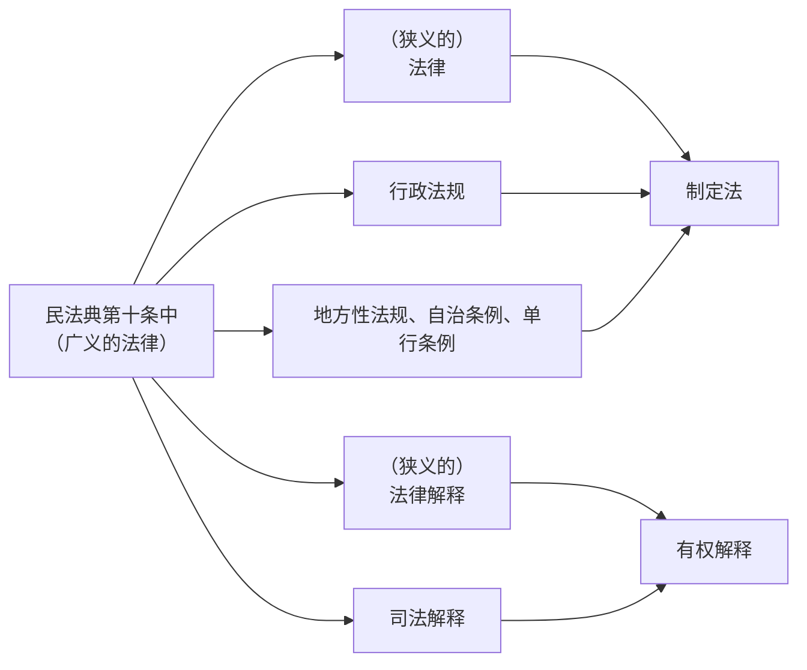

# 一、法源是什么？
	法律渊源

* **定义**：对法律适用者具有拘束力、法律适用者据**以裁判解决纠纷**的==法律规范==

---
# 二、民法的法源

##  （一）第一顺位的法源：（广义的）法律

### 1.（狭义的）法律
	识别方法：《中华人民共和国X X法（典）》

* **制定机关**：全国人大/常委会

* **民事法律的范围**：
	* 民法典 *（民事基本法律，全国人大制定）*
	* 民事单行法/民事特别法 *（非民事基本法律，全国人大常委会制定）*
		* *《著作权法》《专利法》《商标法》《公司法》《保险法》等*
	* 其他法律中的民事法律规范
		* *《产品质量法》第40-48条、《道路交通安全法》第74-76条等*

* **特别法优先于一般法**

> [!tip] 民法史
>1849 年《法国民法典》（拿破仑民法典）采用三编制
>1896/1900 年《德国民法典》（BGB）采用五编制
>1898 年《日本民法典》采用类似德国的五编制
>
>2020 年《中华人民共和国民法典》采用**七编制**

### 2.（狭义的）法律解释

* **解释主体**：全国人大常委会

> [!example] 民法领域的唯一一次法律解释
>全国人民代表大会常务委员会关于《中华人民共和国民法通则》第九十九条第一款、《中华人民共和国婚姻法》第二十二条的解释（2014）

### 3.司法解释 #
	《最高人民法院关于XX的解释/规定/规则/批复/决定》

* **解释主体与解释类型**：最高人民法院（最高检的也算）

> [!example] 最高人民法院的重要司法解释
>[[总则编解释|《总则编解释》]]《合同编通则解释》《诉讼时效规定》

> [!tip] 司法解释的形式
>**司法解释的形式分为“解释”、“规定”、“规则”、“批复”和“决定”五种。**
>
>**解释**：对在审判工作中如何具体应用某一法律或者对某一类案件、某一类问题如何应用法律制定的司法解释，采用“解释”的形式
>**规定**：根据立法精神对审判工作中需要制定的规范、意见等司法解释，采用“规定”的形式。
>**规则**：对规范人民法院审判执行活动等方面的司法解释，可以采用“规则”的形式。
>**批复**：对高级人民法院、解放军军事法院就审判工作中具体应用法律问题的请示制定的司法解释，采用“批复”的形式。
>**决定**：修改或者废止司法解释，采用“决定”的形式。
>
>*《最高人民法院关于司法解释工作的规定》（2021年修正）*

- 一般地，最高法的司法解释一般不会被直接引用

### 4.行政法规
	识别方法：《XX（暂行）条例》

* **制定主体**：国务院

> [!example] 国务院制定的重要行政法规
>《婚姻登记条例》《不动产登记暂行条例》《物业管理条例》等

### 5.地方性法规与自治条例和单行条例

* **制定主体**：
	* 地方性法规
		* 省、自治区、直辖市的人大及其常委会
	* 自治条例、单行条例
		* 民族自治地方的人大及其常委会

### 6. 非法源

- 部门规章&地方政府规章
	- 制定主体：政府

---

## （二） 第二顺位的法源：习惯

### 1. 概念

* **习惯**：社会实践中关于同一事项反复为同一行为形成的行为准则。
* **习惯法**：经法院采用（即国家认可）作为==裁判依据的民事习惯==
	* **功能**：一定程度上弥补制定法的不足
	* **范围**
	 >在一定地域、行业范围内 长期 为 一般人 从事民事活动普遍遵守的民间习俗、惯常做法等，可以认定为民法典第十条规定的习惯。（总则编解释第二条）

### 2. 习惯法作为法源的条件&适用

#### 前提条件
- [ ] 就该事项==法律没有规定== 
- [ ] 体素：在社会交往中**长期**、**稳定**地受到**普遍**遵守
- [ ] 心素：参与社会交往的主体心中形成了**法的确信**
- [ ] 不违背**公序良俗**

#### 具体适用过程
* **证明**：以主张适用的**当事人**证明为主，**法院**依职权查明为辅
* **具体适用**：法院“==可以适用==”，而非“应当适用”

---

## （三） 民法的其他法源？

### 1. 法理？
#### 外延：
立法旨意、民法基本原理、法的理念、蕴含于法秩序中的一般法律原则,etc.
#### 法理可以作为法源吗？
学说承认，**立法尚不承认**

PS: 1907 年《瑞士民法典》、台湾地区“民法”承认

### 2.学说？

#### 学说
是指学者对成文法的阐释、对习惯法的认知和对法理的探求。

#### 学说可以作为法源吗？
有些国家可以，我国不行

### 3. 司法先例、指导性案例？

#### （1）我国没有遵循司法先例的制度

#### （2）指导案例不作为法源，但可作为裁判理由
>第1条：“对全国法院审判、执行工作具有指导作用的**指导性案例**，由最高人民法院确定并统一发布。”
>第2条：“本规定所称指导性案例，是指裁判已经发生法律效力，并符合以下条件的案例：（一）社会广泛关注的；（二）法律规定比较原则的；（三）具有典型性的；（四）疑难复杂或者新类型的；（五）其他具有指导作用的案例。
>
>*《最高人民法院关于案例指导工作的[[#3.司法解释|规则]]》（2010）*
>

