>民事主体是[[民事法律关系]]的主体

# 一、概述

## （一）概念
自然人是指【依自然规律出生】而**取得民事主体资格**的人

![[辨析：自然人、生物人、公民 1.png|辨析：生物人、自然人、公民]]

>[!caution] 辨析：生物人、自然人、公民
>- **生物人与自然人**：可能重合，也可能不重合
>	- eg.在古罗马奴隶不是“人”，而是”物”
>- **公民与自然人**：公民 $\subset$ 自然人
>	- eg.外国人并非我国公民，但仍是自然人

## （二）自然人是诸多规则的模型

 1. **行为能力的规则原型**
	* eg.无、限制、完全民事行为能力人以自然人为原型设计

2. **民事权利的规则模型**
	* eg.自然人享有的民事权利最完整，[[民事法律关系#（一）主体|法人无生命权、身体权、健康权]]

 3. **意思表示瑕疵的规则模型**
	* eg.[[4. 法律行为的生效与效力障碍#4. 意思表示不自由：胁迫|胁迫]]、[[4. 法律行为的生效与效力障碍#2. 意思与表示不一致：无意不一致（重大误解/错误）|重大误解]]等以自然人为模型A --x B

 4. **婚姻家庭编与继承编的规则原型**
	* eg.只有自然人可以结婚和继承，法人不能

## （三）自然人的住所

### 1. 概念 
* **住所**，是指自然人生活和民事活动的中心场所

### 2.住所的法律意义

#### （1）民法上的意义
* eg.监护、宣告失踪与宣告死亡、债务履行地等

#### （2）其他部门法上的意义
* eg.民事诉讼法上可用于确定法院的地域管辖

#### （3）我国民法上自然人住所的确定
>自然人以户籍登记或者其他有效身份登记记载的居所为住所；经常居所与住所不一致的，经常居所视为住所。
>*民 25*

* **原则上**：以**户籍登记或者其他有效身份登记**等记载的居所为住所
	* eg.*身份证、港澳通行证、护照上记载的住址等*
* **例外**：「经常居所」与「住所」（=记载的居所）不一致的，以==「经常居所」==为住所
>公民的**经常居住地**是指公民离开住所地至起诉时已连续居住一年以上的地方，但**公民住院就医的地方除外**。
>*民诉法解释 4*

---

# 二、自然人的权利能力

## （一）权利能力：概念与特征

### 1. 概念

#### 民事权利能力
 * 是指作为民事主体（概括地）享有的权利、承担义务的**法律资格**。
	 * [[对比：民事权利能力 vs. 民事行为能力 1|对比]]：[[#民事行为能力]]

### 2. 特征

- **平等性**
	- 现代民法中所有人生而平等
- **专属性**
	- 不可转让、不可放弃、不得限制、不得剥夺
- **抽象性**
	- 具备享有权利的资格$\neq$实际享有民事权利

## （二）自然人权利能力的取得

### 1. 原则：出生

>[!cite] 民法典第 13 条
>自然人从出生时起到死亡时止，具有民事权利能力，依法享有民事权利，承担民事义务。

#### （1）判断标准
* 「出」+「生」 ^453df9
	* 出：全部露出
	* 生：活着^[如何判断胎儿出生的死活？实务中，我们有：阿普加评分（Apgar Score）]

#### （2）证明规则
**看哪种证据的证明力最强**
>自然人的出生时间和死亡时间，以出生证明、死亡证明记载的时间为准；没有出生证明、死亡证明的，以户籍登记或者其他有效身份登记记载的时间为准。**有其他证据足以推翻以上记载时间的，以该证据证明的时间为准。**
>*民 15*
* eg.出生医学证明、证人证言,etc.

### 2. 例外：胎儿的权利能力问题

>[!cite] 现行法的立场（民法典 16）
>涉及`遗产继承`、`接受赠与`等胎儿利益保护的，胎儿**视为**具有民事权利能力。但是，胎儿娩出时为死体的，其民事权利能力自始不存在。

>[!cite] 总则编解释 4
>涉及遗产继承、接受赠与等胎儿利益保护，父母在胎儿娩出前作为法定代理人主张相应权利的，人民法院依法予以支持。

#### （1）胎儿有权利能力的范围：涉及胎儿利益（保护）

* [[民法典#第一千一百五十五条|遗产继承]]
* **接受赠与**
* **在母体内遭受侵权**

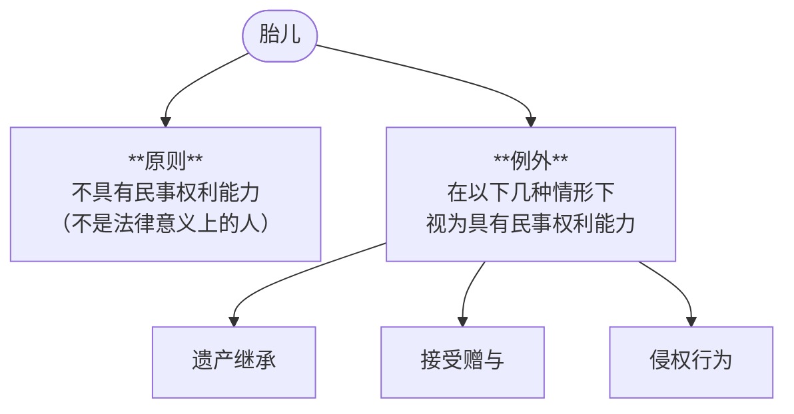

#### （2）胎儿有权利能力的前提：娩出时不是死体
>以下采我国法上的「法定解除条件」说，德国法上还有「延缓条件说」^[指的是：胎儿出生前不能主张权利；出生后再溯及既往地赋予民事权利能力，而死体时自始不存在民事权利能力。二者区别是赋予权利能力（有权主张权利）的形成时点。**最高法实际操作中更倾向于延缓条件说**，即胎儿出生后再审理案件。]

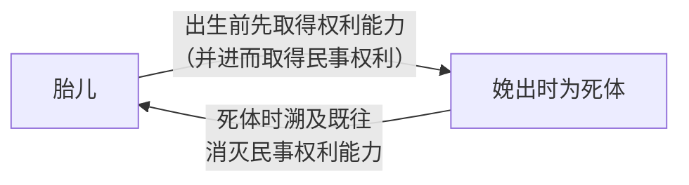

## （三）自然人权利能力的消灭

### 1. 原则：（自然）死亡
>自然人从[[#^453df9|出生]]时起到死亡时止，具有民事权利能力，……享有民事权利，承担民事义务。
>*民 13*

#### （1）自然人死亡的判定标准
* 学界：心跳停止
* 实务：脑死亡

#### （2）证明规则
**看哪种证据的证明力最强**
>自然人的出生时间和死亡时间，以出生证明、死亡证明记载的时间为准；没有出生证明、死亡证明的，以户籍登记或者其他有效身份登记记载的时间为准。**有其他证据足以推翻以上记载时间的，以该证据证明的时间为准。**
>*民 15*

### 2. 例外：死者的某些权利死后仍受保护

#### （1）死者著作权的保护
* **署名权、修改权、保护作品完整权**
	* [[著作权法#第二十二条|保护期不受限]]
* **著作财产权**
	* [[著作权法#第二十三条-第1款|死后 50 年仍受保护]]

#### （2）死者人格利益的保护

>[!note] 所保护法益
>实际上，保护死者实际上是在保护**死者近亲属**或者**公共利益**

- [[民法典#第九百九十四条|一般死者]]
- [[民法典#第一百八十五条|英雄、烈士]]

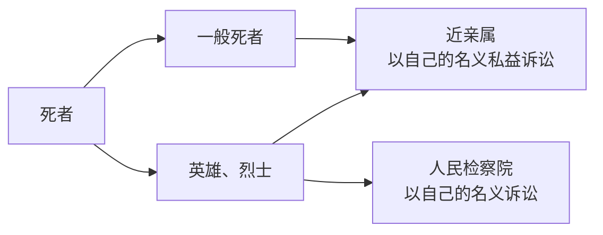

---

# 三、自然人的行为能力
>[[4. 法律行为的生效与效力障碍#（一）欠缺行为能力与法律行为的效力障碍]]

## （一）概述

### 1. 概念

#### 民事行为能力
* 是指民事主体独立实施有效法律行为，创设、变更、消灭民事法律关系的**资格。**
	* [[对比：民事权利能力 vs. 民事行为能力 1|对比]]：[[#民事权利能力]]

>[!tip] 民事行为能力与民事法律行为有关
>如果民事主体实施的行为不是民事法律行为，民事主体无须具备民事行为能力，法律效果依法发生（eg.事实行为：先占、拾得遗失物、发现埋藏物、创作）

### 2. 预设

* 有「完全民事行为能力」的人才是**自己利益的最佳判断者**

### 3. 功能

* 保护思虑不周之人的合法权益，并兼顾交易安全

### 4. 区分行为能力程度：两个标准
>依据：[[民法典#第十八条|18]]、[[民法典#第十九条|19]]、[[民法典#第二十条|20]]、[[民法典#第二十一条|21]]、[[民法典#第二十二条|22]]。一旦确认，原则上无需个案认定。

#### （1）年龄：两个节点

* 8 岁，18 岁（16 岁）

#### （2）精神健康状况

* **不能辨认**
	* 完全没有辨认能力，不知道自己行为的**后果**
* **不能完全辨认**
	* 对于**比较复杂的事物或比较重大的行为**缺乏判断能力，不能预见自己行为的**后果**。
* **能完全辨认**

>[!note] 所谓「以自己收入为主要生活来源」
>已废除的民通意见认为，能维持当地群众一般生活水平即为······具体地，即为达到上年度当地城镇或农村居民人均消费型支出水平。

![[自然人的行为能力类型概览 1.png]]

####  A.无民事行为能力人

##### a.具体类型
* [[民法典#第二十条|8 岁以下的未成年人]]
* [[民法典#第二十一条-第2款|8-10 岁「不能辨认」自己行为的未成年人]]
* [[民法典#第二十一条-第1款|「不能辨认」自己行为的成年人]]
	* [[民法典#第二十四条-第1款|无行为能力的成年人，事先需经过法院认定]]

##### b.实施法律行为的效力
* [[民法典#第一百四十四条|单独实施的法律行为一律无效]]（通说）
	* *eg.7岁的你每天坐公交车上学，你和公交公司之间的运输合同无效*
* 应当由其法定代理人代理其实施的法律行为（[[民法典#第二十条|第 20 条]]、[[民法典#第二十一条|21 条]]）
	* 监护、代理
	* *eg.父母事先给6岁的甲零花钱，甲订立的零食买卖合同依然无效*

 >[!caution] 注意
>只能由法定代理人**当场代理**，事前允许、事后追认均不行

#### B. 限制民事行为能力人

##### a. 具体类型
* [[民法典#第十九条|8-18 周岁的未成年人]]
* [[民法典#第二十二条|不能完全辨认自己行为的成年人]]

##### b.单独实施法律行为的效力（[[民法典#第二十二条|22]]，[[民法典#第一百四十五条|145]]） 
	事先允许纯获益，精神智力相适应，事后追认效力待定

1. 经法定代理人同意（**事先允许**）的法律行为：有效
	* 「事前同意」既可以**向限制民事行为能力人**发出，也可以向限制民事行为能力人的**合同相对人**发出；也可针对**一定范围内尚未特定化**的民事法律行为（eg.*报旅游团、零花钱*）
	* *eg.父母给16岁的甲2万块，让他随便用来买生日礼物*

2. **纯获法律上利益**^[思考：规范基础在于，纯获法律上的利益判断上最为便捷，而纯获经济利益则更为复杂]的法律行为（只取得权利，**不承担义务**）：有效
	* *eg.爷爷奶奶给送孙子一套房、长辈给压岁钱等*
	* *反例：花800元购得一部市价3000元的手机（经济上获利，但仍承担了义务）*

>[!tip] 纯获法律利益
>从「直接后果」来观察。
>>[!cite] 杨代雄
>>仅当不利益是民事法律行为的直接后果时，才导致其成为**并非**使限制民事行为能力人**纯获利益**的民事法律行为。如果某种不利益的发生需要系争民事法律行为之外的其他因素介入，则不符合直接性要求。
>
>类推适用：举重以明轻，中性行为（权利不减少、义务不增加，甚至义务得以减少）可以有效
>

* 与其智力、精神健康状况[[总则编解释#第五条|相适应的法律行为]]：有效
	* *eg.用零用钱买零食或文具、坐公交或地铁等*

* 其他需经法定代理人**追认**（事后允许）的法律行为：效力待定
	* 在法定代理人追认前的效力状态：待定
	* 相对人可催告法定代理人予以追认：追认$\to$有效，拒绝追认$\to$无效
	* 法定代理人收到催告之日起 30 日内为作表示的=拒绝追认：无效
	* 善意相对人（交易时不知道对方限民）在追认前有撤销权
	* 法定代理人可以在相对人催告或撤销前直接追认或拒绝追认

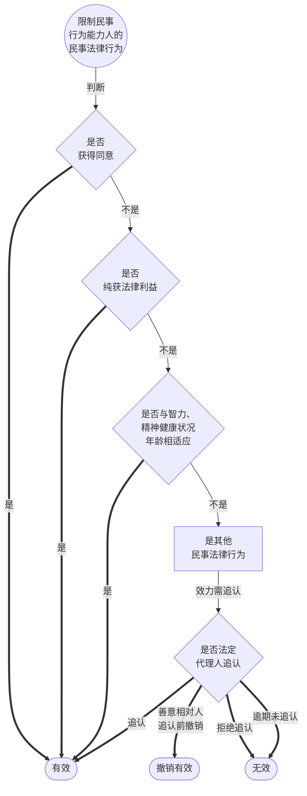

---

##  （二）对行为能力欠缺者的监护

### 1. 监护：概念与功能

#### 监护
是指为**监督**和**保护**「无民事行为能力人」和「限制民事行为能力人」（统称：*行为能力欠缺者*），由「监护人」**代理**「被监护人」实施法律行为，保护被监护人的人身权利、财产权利以及其他合法权益的制度。
>见[[民法典#第三十四条-第1款]]

>[!faq] 监护权属于民法上的职责还是权利？
>>[!cite] 侵权责任编解释（1）
>>- 第一条　非法使被监护人脱离监护，监护人请求赔偿为恢复监护状态而支出的合理费用等财产损失的，人民法院应予支持。
>>- 第二条　非法使被监护人脱离监护，导致父母子女关系或者其他近亲属关系受到严重损害的，应当认定为[民法典](https://www.pkulaw.com/chl/aa00daaeb5a4fe4ebdfb.html?way=textSlc)第[一千一百八十三条](https://www.pkulaw.com/chl/aa00daaeb5a4fe4ebdfb.html?way=textSlc#tiao_1183)第[一款](https://www.pkulaw.com/chl/aa00daaeb5a4fe4ebdfb.html?way=textSlc#tiao_1183_kuan_1)规定的严重精神损害。

#### 功能
* ==弥补==行为能力的不足，使行为能力欠缺者亦可参与民事活动
* ==保护==行为能力欠缺者的**合法权益**

### 2. 监护的类型

#### 概览：

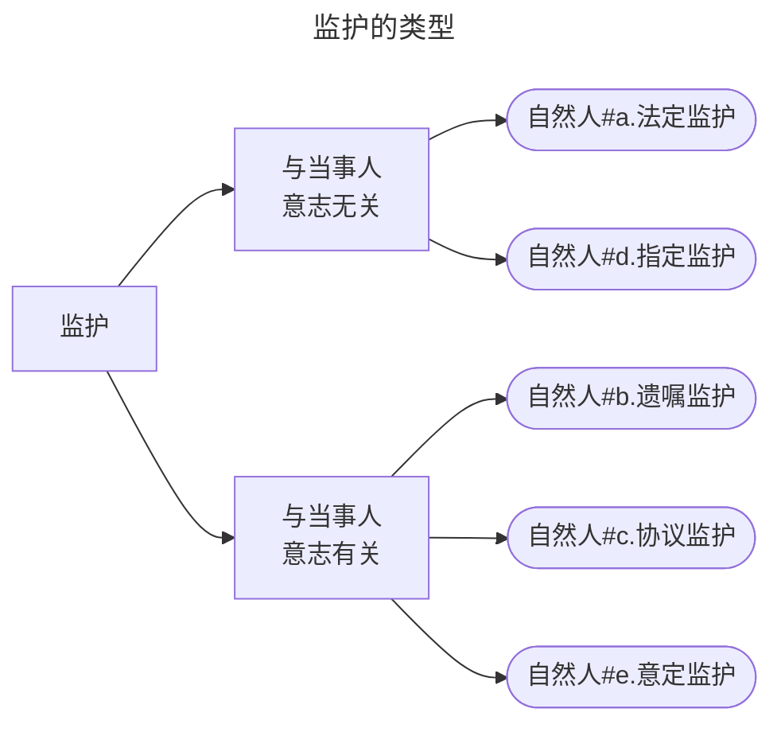

#### a. 法定监护
监护人由法律直接规定的监护
* 未成年人的法定监护（[[民法典#第二十七条|27]]，[[民法典#第三十二条|32]]）
	* 顺序在前的排除顺序在后的
	* 父母即使离婚也是**其（共同的）监护人**
* 成年人的法定监护（[[民法典#第二十八条|28]]，[[民法典#第三十二条|32]]）
	* 顺序在先的排除顺序在后的
	* 其他近亲属：[[民法典#第一千零四十五条-第2款|范围]]

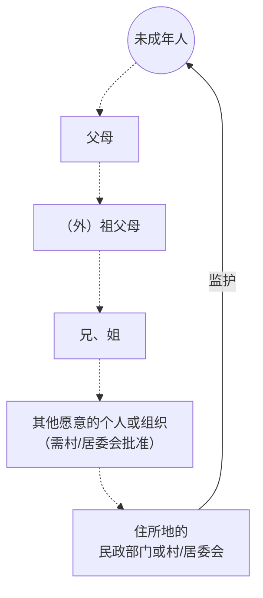

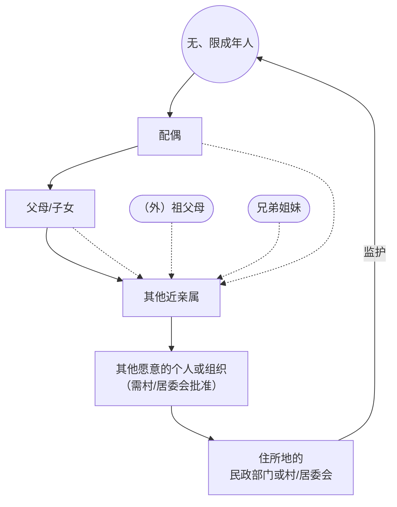

---

#### b. 遗嘱监护
>[[民法典#第二十九条]]
* **设立主体**：只能是**被监护人的父母**
* **遗嘱指定监护的范围**：不受法定监护人资格和顺序的影响（可任选一人）
* [[总则编解释#第七条|对潜在争议的处理规则]]

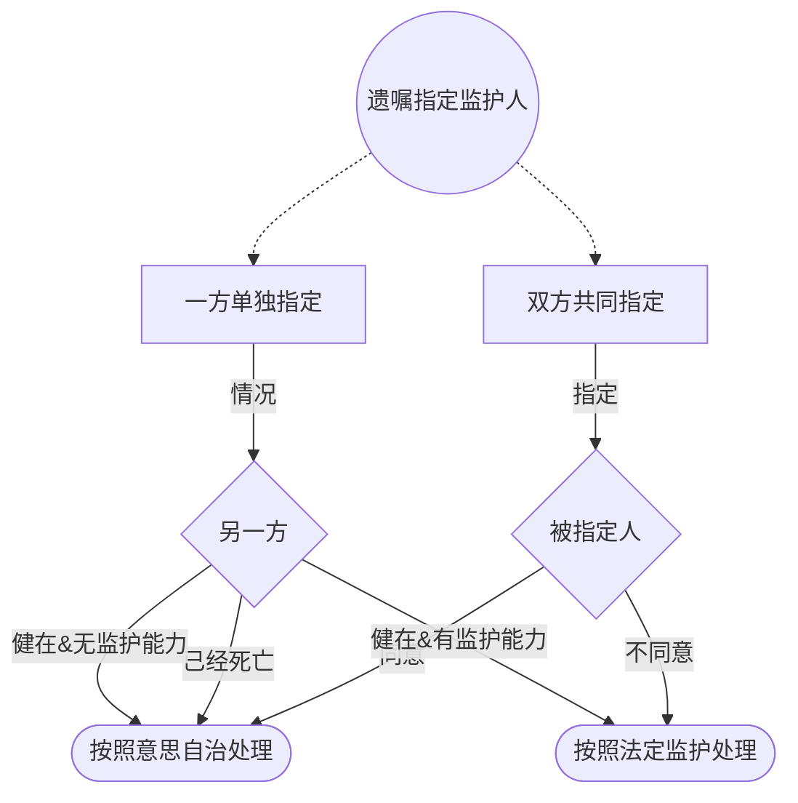

#### c. 协议监护
>[[民法典#第三十条|民法典第 30 条]]，[[总则编解释#第八条|总则编解释第8]]、[[总则编解释#第十三条|13 条]]
* **未成年人**的协议监护
	* 父母==除均丧失监护能力外==，不可免除自己的监护职责
	* 父母可委托他人监护（$\neq$协议监护），但==不改变其法定监护人身份==
* **成年人**的协议监护
	* 要求低于未成年的
* **共性**：必须在==有法定监护资格的人==中选择，但**不受法定顺序影响**

---
##### 对比：协议监护 vs. 委托监护
协议监护（独立的监护类型） vs. [[民法典#第一千一百八十九条|委托监护]]（不是独立的监护类型）
* 委托监护：
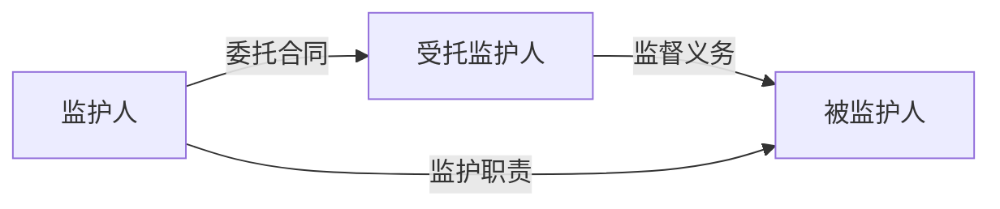

| 项目    | 协议监护                            | 委托监护                     |
| :---- | :------------------------------ | :----------------------- |
| 监护人资格 | 协议主体必须是有[[1. 自然人#a. 法定监护\|监护资格]]的人 | 受托人不受监护资格的限制，可以是没有监护资格的人 |
| 法律效果  | 导致监护职责的丧失                       | 不导致监护职责的丧失，委托人依然是监护人     |

---
#### d. 指定监护
>民法典[[民法典#第三十一条|第 31 条]]、[[民法典#第三十六条|36 条]]，总则编解释[[总则编解释#第九条|第9条]]、[[总则编解释#第十条|10 条]]
* 前提
	* 对监护人确认==有争议==  
		* 争当、推卸
	* ==撤销==  监护人资格
* 指定的主体、程序
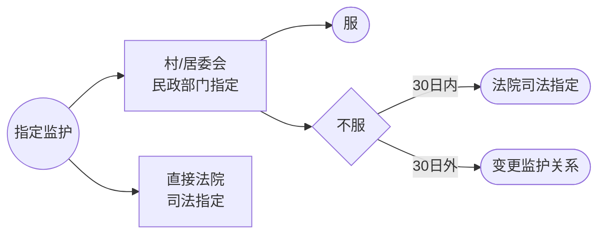
* [[民法典#第三十一条-第2款|指定的原则]]
	* ==最有利于被监护人==的原则，在==具有监护的人==之中指定
* [[民法典#第三十一条-第3款|临时监护人]]（4类组织）
	* 被监护人住所地的村/居委会
	* 有关组织或民政部门
* [[民法典#第三十一条-第4款|指定的效力]]
	* **不得擅自变更**
	* 擅自变更的，不免除被指定之人的监护职责

---

#### e. 意定监护
>[[民法典#第三十三条|第33条]]，[[总则编解释#第十一条|《总则编解释》第11条]]
* 主体
	* 只能是作为完全民事行为能力人的==成年人==
* 形式
	* 只能是**事先**以**书面形式**确定
* 效力
	* 意定监护优先于法定监护
* 范围
	* 范围不受法定监护资格的限制
		* 选定任意一人皆可
* 生效
	* 该成年人**丧失或部分丧失民事行为能力**时
* [[总则编解释#第十一条-第1款|解除]]
	* 生效前
		* 任何一方主张解除，法院均予以支持
	* 生效后
		* 监护人无正当理由请求解除协议，法院不予支持
* [[民法典#第三十五条-第3款|职责]]
	* 保障并协助
	* 不得干涉有能力独立处理的事务

---

### 3. 监护人的职责及其履行方式

#### a. 职责
>民法典第 34 条：[[民法典#第三十四条-第1款|第一款]]、[[民法典#第三十四条-第2款|第二款]]
* **代理**：被监护人实施法律行为
* **保护**：被监护人的合法权益
#### b. 不履行职责
* [[民法典#第三十四条-第3款|应当承担法律责任]]
#### c. 临时生活照料措施
>[[民法典#第三十四条-第4款|34.4]]
* **前提**：紧急情况＋暂时无法履行＋无人照料
* **措施主体**：村/居委会或民政部门

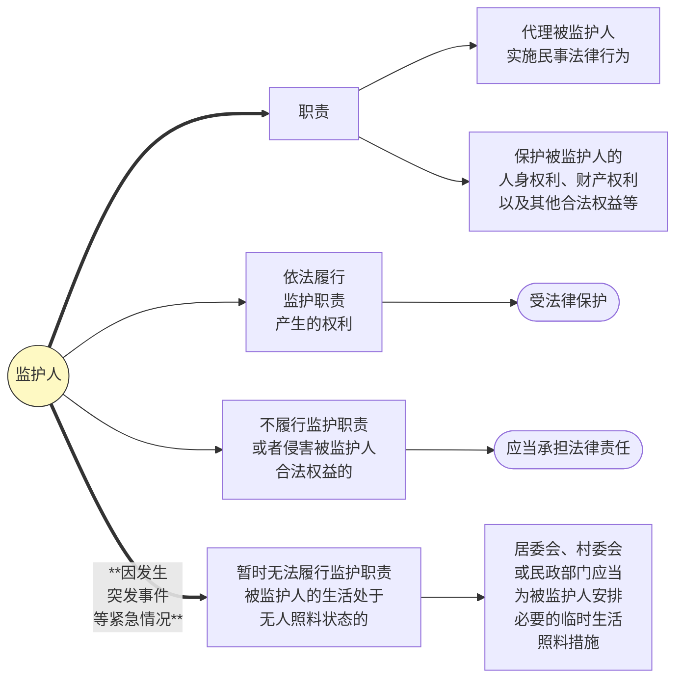

#### d. 履职的标准
* [[民法典#第三十五条-第1款|最有利于原则]]

#### e. 违反履职标准的行为
>监护人除为维护被监护人利益外，不得处分被监护人的财产。（35.1.2）

*eg1.父母将未成年人名下的房屋转移给自己*
*eg2.为了公司的利益将未成年人名下的房屋抵押*

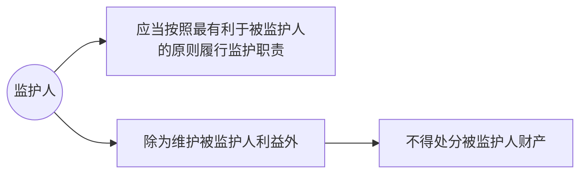
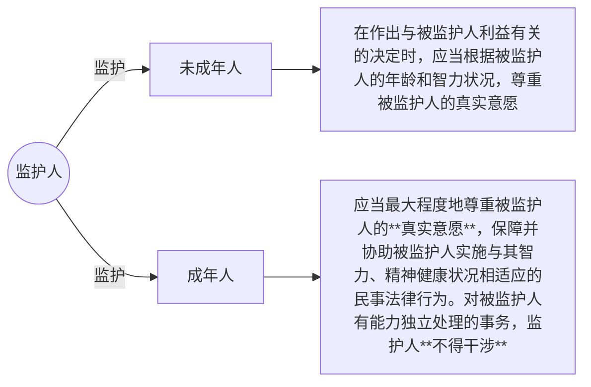
#### f. 监护资格：撤销与恢复
* [[民法典#第三十六条-第1款|撤销事由]]
	* 实施严重**损害被监护人身心健康**的行为
	* **怠于**/**无法履行且拒绝委托他人**致使危困状态
	* 实施==严重侵害被监护人合法权益==的行为
* 撤销程序
>[[民法典#第三十六条-第2款]]，[[民法典#第三十六条-第3款]]
* [[1. 自然人#d. 指定监护|指定监护]]
* 撤销后果
	* [[民法典#第三十七条|抚养、赡养、扶养义务不消灭]]
	* 恢复监护资格：[[民法典#第三十八条|申请+法院决定]]

#### g. 监护的终止
>[[民法典#第三十九条]]

* 被监护人取得或者恢复**完全民事行为能力**；
- 监护人**丧失监护能力**；
- 被监护人或者监护人**死亡**；
- 人民法院认定监护关系终止的其他情形。

---

# 四、宣告失踪与宣告死亡

## （一）宣告失踪

### 1. 概述

#### 宣告失踪的概念
>[[1. 自然人#宣告死亡的概念]]

是指自然人离开自己的[[1. 自然人#（三）自然人的住所|住所]]下落不明[[民法典#第四十条|达法定期限]]，经利害关系人申请，由人民法院宣告其为失踪人，并为其设立**财产管理人**的制度

#### 宣告失踪的目的
>[[1. 自然人#宣告死亡的目的]]

结束失踪人财产的不确定状态，**保护失踪人和其利害相关人的财产利益**

### 2. 宣告失踪的程序
>民法典：[[民法典#第四十条|第 40 条]]，[[民法典#第四十一条|第 41 条]]，[[民法典#第四十二条|第 42 条]]，[[民法典#第四十三条|第 43 条]]
>民事诉讼法：[[民事诉讼法#第一百九十条|第 190 条]]，[[民事诉讼法#第一百九十一条|第 191 条]]，[[民事诉讼法#第一百九十二条|第 192 条]]，[[民事诉讼法#第一百九十三条|第 193 条]]

#### （1）自然人下落不明达法定期限
* **法定期限**：2 年
* [[民法典#第四十一条|起算日]]
	* 一般情况
		* 从自然人<u>失去音讯之日</u>起开始计算
	* 战争期间下落不明的
		* 自<u>战争结束之日</u>，或者<u>有关机关确定的下落不明之日</u>起计算

#### （2） 经利害相关人申请
Q：《民法典》第40条中“利害关系人”的范围？
A：[[总则编解释#第十四条]]

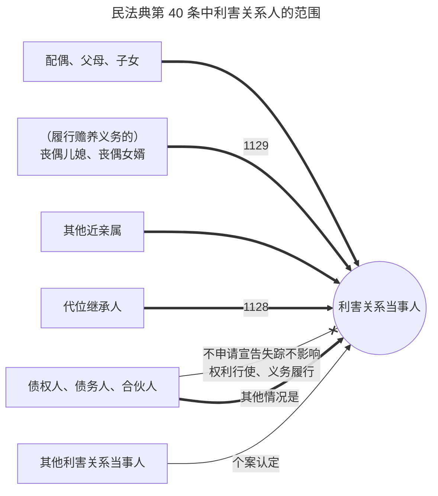
^mfd40lhgxr

#### （3）由有管辖权的法院宣告失踪
* [[民事诉讼法#第一百九十条-第1款|管辖法院]]
	* 下落不明人**<u>住所地</u>基层人民法院**
* [[民事诉讼法#第一百九十二条-第1款|公告期间]]
	* 3个月

### 3. 宣告失踪的法律效果
设置
#### 财产代管人
* [[民法典#第四十二条|财产代管人的范围]]
	* 失踪人的**配偶、成年子女、父母**或者**其他愿意担任财产代管人**的人
	* 例外：人民法院指定的人代管

>[!caution] 注意
>宣告失踪不会使得失踪人**丧失民事权利能力与行为能力**，[[民法典#第一千零七十九条-第4款|配偶可在宣告失踪后诉请离婚]]

* [[民法典#第四十三条|财产代管人的职责]]
>（1）财产代管人应当**妥善管理**失踪人的财产，维护其财产权益
>（2）失踪人所欠**税款**、**债务**和**应付的其他费用**（*包括赡养费、扶养费、抚育费和因代管财产所需的管理费等*），由财产代管人**从失踪人的财产**中支付。
>（3）因**故意或重大过失**造成失踪人财产损失的，应当承担赔偿责任
>- 不包括身份行为

* [[民法典#第四十四条|财产管理人的变更]]

### 4. 宣告失踪的撤销
>[[民法典#第四十五条]]

1. **撤销的条件**（须同时满足）
（1）失踪人**重新出现**
（2）经本人或者利害关系人**申请**
（3）人民法院**撤销**失踪宣告

2. **撤销的后果**
（1）原失踪人可管理自己的财产
（2）财产代管人向原失踪人及时移交财产和报告财产代管情况的义务

---

## （二）宣告死亡

### 1. 概述

#### 宣告死亡的概念
>[[1. 自然人#宣告失踪的概念]]

指自然人下落不明达到法定期限，经利害关系人申请，由人民法院宣告其死亡的法律制度。

#### 宣告死亡的目的
>[[1. 自然人#宣告失踪的目的]]

结束失踪人财产关系和人身关系的不确定状态，**以维护其利害关系人的利益**

### 2. 宣告死亡的程序
>[[民法典#第四十六条]]
>民事诉讼法：> [[民事诉讼法#第一百九十条|第 190 条]]，[[民事诉讼法#第一百九十一条|第 191 条]]，[[民事诉讼法#第一百九十二条|第 192 条]]，[[民事诉讼法#第一百九十三条|第 193 条]]

#### （1）自然人下落不明达法定期限
* **原则**：`4 年`
	* 包括[[总则编解释#第十七条|「战争期间下落不明」]]
* 因**意外事件**下落不明的：`2 年`
* 因**意外事件**下落不明+经**有关机关证明该自然人不可能生存的**：无时间限制
	* *eg.“意外事件”：洪水、海啸、地震、沉船、飞机失事等（不包括战争）*

>[!note] 有关机构有哪些？
>公安机关、县级以上人民政府。但不包括村居委会。^[参见《最高人民法院研究室关于四川汶川特大地震发生后人民法院受理宣告失踪、死亡案件应如何适用法律问题的答复》]

#### （2）经利害关系人申请
* 利害关系人的范围：
* [[总则编解释#第十六条]]

>[!caution] 注意
>债权人、债务人、合伙人等如果能通过**宣告失踪**来保护其合法权益，则不具有**宣告死亡申请人**的格。

- 对比：[[1. 自然人#^mfd40lhgxr|民法典第40条中“利害关系人”]]
	- 【HINT】宣告死亡中的利害关系人是从继承的角度考虑的

|         主体         |  宣告失踪  |            宣告死亡            |
| :----------------: | :----: | :------------------------: |
|      配偶、父母、子女      |   ✅    |             ✅              |
| （履行赡养义务的）丧偶儿媳、丧偶女婿 |   ✅    |             ✅              |
|       其他近亲属        |   ✅    | ✅[[总则编解释#第十六条-第2款\|（有条件）]] |
|       代位继承人        |   ✅    | ✅[[总则编解释#第十六条-第2款\|（有条件）]] |
|    债权人、债务人、合伙人     | ✅（有例外） | ❌[[总则编解释#第十六条-第3款\|（有例外）]] |

#### （3）由有管辖权的法院宣告死亡

* [[民事诉讼法#第一百九十一条-第1款|管辖法院]]：下落不明人住所地基层人民法院
* [[民事诉讼法#第一百九十二条-第1款|公告期间]]
	* 下落不明须达一定期限的（即4年或2年）：**1年**
	* 下落不明不受时间限制的：**3个月**
* [[民法典#第四十八条|宣告死亡的时间]]
	* **一般情况**：`判决作出之日`
	* **因意外事件而宣告死亡的**：`意外事件发生之日`
		* *eg.“意外事件”：洪水、海啸、地震、沉船、飞机失事等（不包括战争）*

### 3. 宣告死亡的法律效果

#### （1）与自然死亡相同的效果

>[!tip] 了结「以失踪人住所地为中心」的法律关系
> * **人身关系**
> 	* [[民法典#第五十一条|被宣告死亡之人的配偶与其婚姻关系终止]]
> 	* [[民法典#第五十二条|子女与其亲子关系终止]]
> * **财产关系**
> 	* [[继承编解释#第一条|潜在的继承人从宣告死亡之日起即可继承被宣告死亡之人的财产]]

#### （2）与自然死亡不同的效果

* 被宣告死亡之人**权利能力不消灭**
	* 【依据】[[民法典#第四十九条|第49条]]“在被宣告死亡期间实施的法律行为的效力不受影响”
* 被宣告死亡之人在死亡期间的法律行为效力状态应结合相关规则具体分析
	* 参考 ，IV 法律行为

### 4. 宣告死亡的撤销及其后果

* **人身关系**
	* [[民法典#第五十一条|婚姻关系]]
		* 原则上自动恢复，但配偶再婚或向婚姻登记机关书面声明不愿意恢复的除外
	* [[民法典#第五十二条|与被他人收养的子女的亲子关系]]
		* 不能自动恢复
* **财产关系**
	* 通过继承取得财产的人[[民法典#第五十三条-第1款|应当返还财产]]
		* 无法返还的，应==适当补偿==（≠折价补偿）
	* 恶意使他人被宣告死亡的
		* 除须返还财产外，还需[[民法典#第五十三条-第2款|赔偿损失]]

|  项目  |        宣告失踪         |         宣告死亡         |
| :--: | :-----------------: | :------------------: |
|  功能  | 保护**失踪人**及其利害关系人的利益 |      保护利害关系人利益       |
|  影响  |  既不影响人身关系，也不影响财产关系  |   既影响人身关系，也影响财产关系    |
|  情形  |       下落不明满2年       |     下落不明满4、2、0年      |
|  申请  |        利害关系人        | 利害关系人^[注意：宣告死亡的范围更窄] |
|  受理  |       基层人民法院        |        基层人民法院        |
|  公告  |         3个月         |        1年或3个月        |
|  效果  |        财产代管人        |       妻离、子散、家破       |
| 撤销事由 |        重新出现         |         重新出现         |
| 申请人  |    本人和利害关系人（无顺序）    |    本人和利害关系人（无顺序）     |

>[!tip] [[民法典#第四十七条]]
>对同一自然人，有的利害关系人申请宣告死亡，有的利害关系人申请宣告失踪，符合本法规定的宣告死亡条件的，人民法院应当宣告死亡。

>[!danger] 宣告失踪不是宣告死亡的必经之路

---

# 五、商自然人：个体工商户与农村承包经营户

## （一）个体工商户
### 概述
#### （1）概念
自然人从事工商业经营，经依法登记，为[[民法典#第五十四条|个体工商户]]
#### （2）细化规定
>[[促进个体工商户发展条例]]
#### （3）权利能力问题
以“户”为名义参与商事活动（注意：可以起字号），但并无独立的权利能力，实质为商自然人。
#### （4）责任承担
**个人**承担无限责任
>[[民法典#第五十六条-第1款]]
* 个人经营的
	* 由**个人财产**承担
* 家庭经营的/无法区分的
	* 由**家庭财产**承担

### 2. 农村承包经营户

### 概述
#### （1） 概念
农村集体经济组织的成员，依法取得农村土地承包经营权，从事家庭承包经营的，为[[民法典#第五十五条|农村承包经营户]]
#### （2）细化规定
>[[农村土地承包法]]
#### （3）权利能力问题
以“户”为名义参与商事活动，但并无独立的权利能力，实质为商自然人。
#### （4）责任承担
**成员**承担无限责任
>[[民法典#第五十六条-第2款]]
* 由从事农村承包经营的农户财产承担
* 事实上由部分成员经营的
	* 以该部分成员的财产承担

