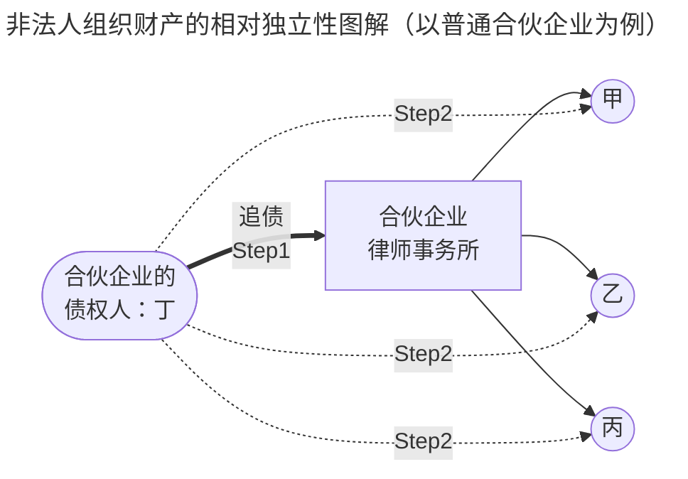
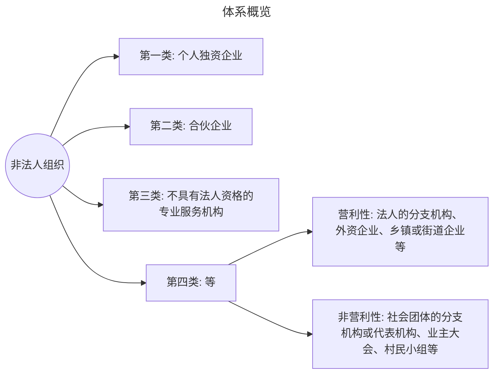

# 一、概念与特征

## （一）概念
* **不具有法人资格**，但是能够依法**以自己的名义**从事民事活动的[[民法典#第一百零二条-第1款|组织]]

## （二）特征
* 非法人组织的财产具有[[民法典#第一百零四条|相对独立性]]

>法条依据：[[合伙企业法#第二条-第2款]]

> [!example] 非法人组织财产的相对独立性举例
> 甲、乙、丙三人共同成立了一家普通合伙企业，注册资本为 100 万元，每人出资 33.33 万元。由于经营不善，该企业欠下债权人丁 200 万元的债务。
> 
> 根据普通合伙企业的责任承担规则，合伙企业对其债务，应先以其全部财产进行清偿。在这个例子中，合伙企业的 100 万元注册资本将首先用于偿还债务。但即使将这 100 万元全部用于偿债，仍有 100 万元债务无法清偿。此时，普通合伙人甲、乙、丙需对剩余的 100 万元债务承担无限连带责任。这意味着债权人丁有权要求甲、乙、丙三人中的任何一人或数人清偿全部剩余债务。
> 
> 假设甲个人财产充足，他可能需要以个人财产清偿这 100 万元债务。若甲清偿了全部债务，他有权向乙、丙追偿各自应承担的份额。在没有特殊约定的情况下，一般按照出资比例分担，即甲、乙、丙每人应承担约33.33 万元，甲可向乙、丙分别追偿 33.33 万元。

## 二、非法人组织的类型

> [!note] 法条链接：关于非法人组织类型的规定
>**《民法典》第102条第2款**  法人组织包括个人独资企业、合伙企业、不具有法人资格的专业服务机构等。
>
>**《民事诉讼法》第51条** 公民、法人和其他组织可以作为民事诉讼的当事人。
>法人由其法定代表人进行诉讼。其他组织由其主要负责人进行诉讼。
>
>**《民诉法解释》第52条** 民事诉讼法第五十一条规定的其他组织是指合法成立、有一定的组织机构和财产，但又不具备法人资格的组织，包括：
(一)依法登记领取营业执照的个人独资企业；
(二)依法登记领取营业执照的合伙企业；
(三)依法登记领取我国营业执照的中外合作经营企业、外资企业；
(四)依法成立的社会团体的分支机构、代表机构；
(五)依法设立并领取营业执照的法人的分支机构；
(六)依法设立并领取营业执照的商业银行、政策性银行和非银行金融机构的分支机构；
(七)经依法登记领取营业执照的乡镇企业、街道企业；
(八)其他符合本条规定条件的组织。

>[[民法典#第一百零二条-第2款]]，[[民事诉讼法#第五十一条]]，[[民诉法解释#第五十二条]]

## （一）个人独资企业
>本法所称个人独资企业，是指依照本法在中国境内设立，由一个自然人投资，财产为投资人个人所有，投资人以其个人财产对企业债务承担无限责任的经营实体。
>[[个人独资企业法#第二条]]

> [!example] 一人独资企业 vs. 有限责任公司的**责任形式**
>孟某欲出资10万元做本经商，孟某的选择如下：
>1. 设立一家**一人有限责任公司**，经营水果买卖。开业当天生意火爆，全部水果销售一空。第二天，所有购买者均拉肚子，花去医药费100万元。
>	1. 孟某应以一人公司账上的10万元承担无限责任，不足部分，一人公司破产，孟某无须以其个人财产承担责任（即孟某仅以其认缴的出资额10万元为限，承担有限责任）。
>2. 设立一家**个人独资企业**，经营水果买卖。开业当天生意火爆，全部水果销售一空。第二天，所有购买者均拉肚子，花去医药费100万元。
>	1. 孟某应先以个人独资企业账上的10万元承担无限责任，不足部分，再由孟某以其个人财产承担无限责任。

## （二）合伙企业
>本法所称合伙企业，是指自然人、法人和其他组织依照本法在中国境内设立的普通合伙企业和有限合伙企业。
>[[合伙企业法#第二条-第1款]]

### 1. 类型
* [[合伙企业法#第二条-第2款]|普通合伙（企业）]]
	* 普通合伙企业由普通合伙人组成，==合伙人对合伙企业债务承担无限连带责任==。本法对普通合伙人承担责任的形式有[[合伙企业法#第五十七条||特别规定的，从其规定]]
* [[合伙企业法#第二条-第3款|有限合伙（企业）]]
	* 有限合伙企业由普通合伙人和有限合伙人组成，==普通合伙人对合伙企业债务承担无限连带责任==，==有限合伙人以其认缴的出资额为限对合伙企业债务承担责任==
* 不具有法人资格的专业服务机构
	* *eg.律师事务所、会计师事务所*
	* 大多属于“合伙企业”，因此“不具有法人资格的专业服务机构”这个概念不具有独立性。

> [!tip] 法人的分支机构作为非法人组织
>第74条 法人可以依法设立分支机构。法律、行政法规规定分支机构应当登记的，依照其规定。
>  分支机构以自己的名义从事民事活动，产生的民事责任由法人承担；也可以先以该分支机构管理的财产承担，不足以承担的，由法人承担。

![[从个体到团体的民事主体.png]]
>图源：张焕然