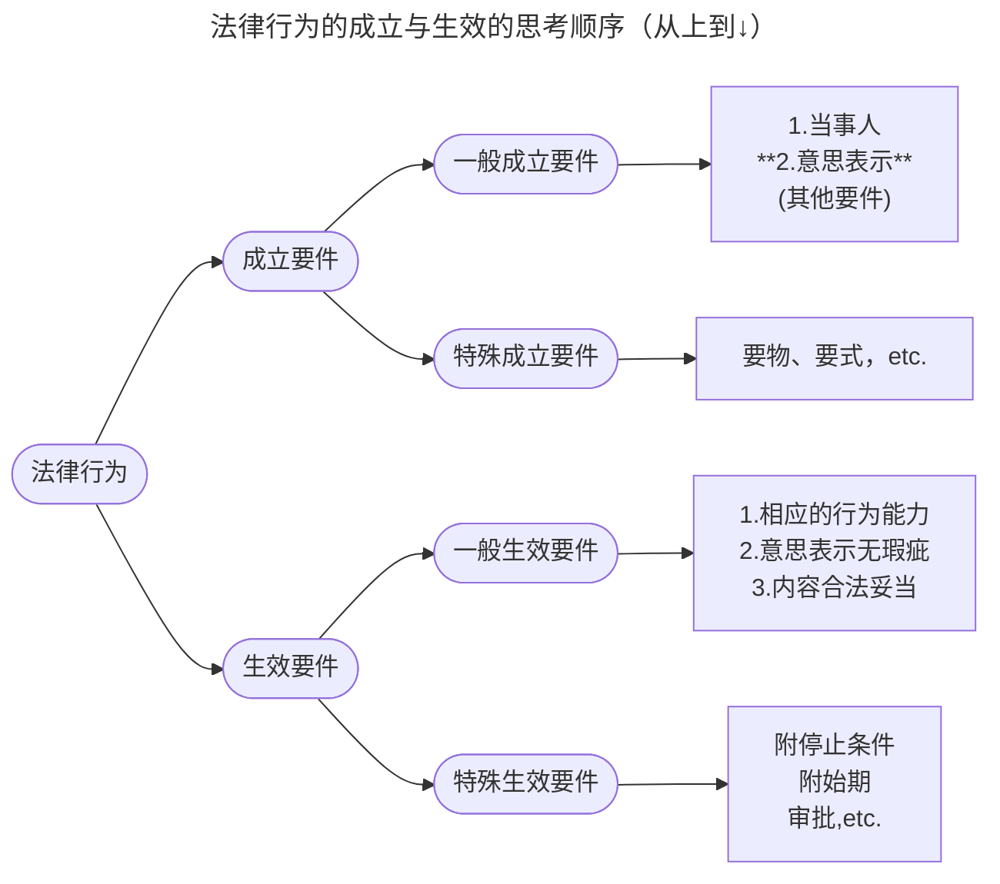
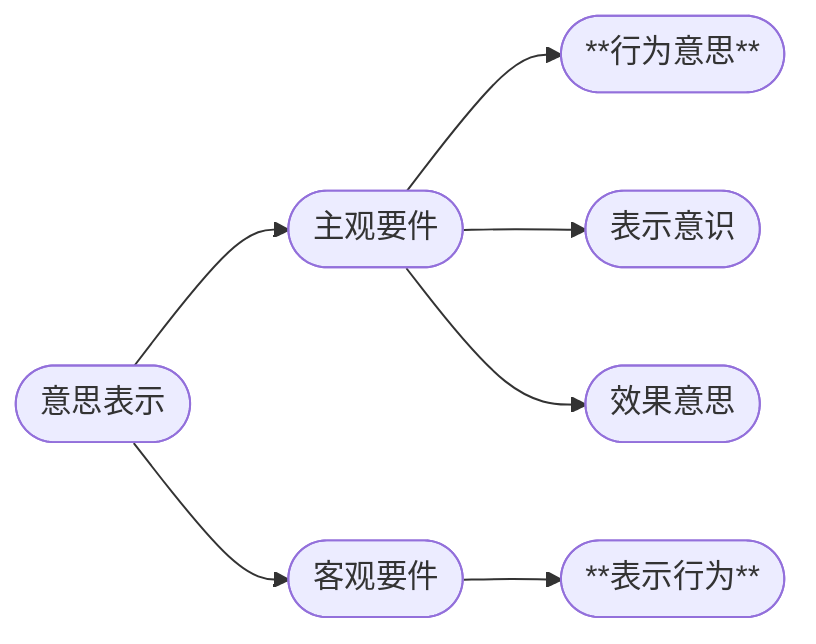
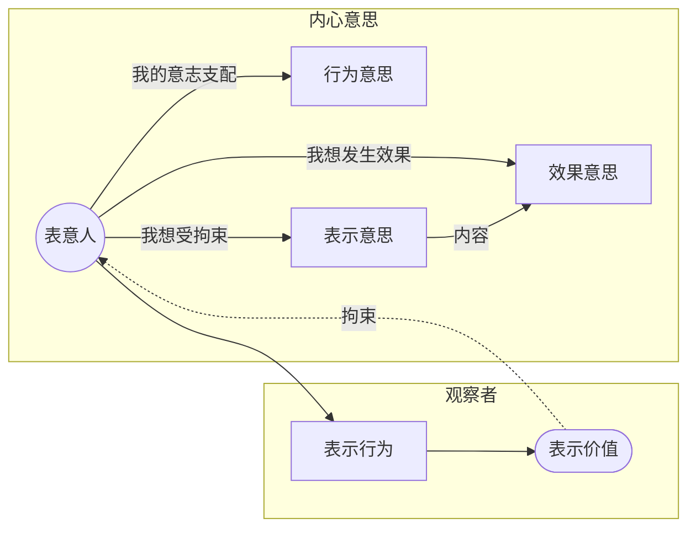

# 一、法律行为的成立与生效概述
## （一）概念

1. 法律行为的==成立==：是指行为符合成立要件而成为客观上存在的法律行为。
2. 法律行为的==生效==：是指行为符合生效/有效要件而能够按照当事人的意思发生民法上的法律效果。

## （二）关系

1. **联系**：成立是生效的前提

2. **区别**：
	1. 要件不同（详见后图）
	2. 时间不同：原则上同时，但也可能不同时（第136条第1款）
	3. 拘束力不同：形式拘束力vs实质拘束力
	4. 管制程度不同：成立要件较弱，生效要件较强

# 二、法律行为的一般成立要件

## （一）意思表示与法律行为
### 1. 意思表示的概念
- 意思表示，是指行为人将其希望发生一定私法上效果的内心**意思**以一定方式**表示**于外部的行为。
### 2. 意思表示与法律行为的关系

1. 意思表示是法律行为的组成部分或成立要件之一
2. 意思表示的生效是法律行为成立的前提

## （二）意思表示的成立要件

### 1. 意思表示的主观要件：内心意思

#### 行为意思
>欠缺**不成立**意思表示
- 概念：行为人自觉从事某项行为的意思。
- **不具有行为意思**的情形
	- *梦游时做出的行为、睡着时被人拿手摁手印、宠物触碰手机等*
- 意义：**不具有行为意思，不构成意思表示**

#### 表示意识
>欠缺仍**可能成立**意思表示，但法律行为可`准用重大误解`而**可撤销**
- **概念**：对行为具有==某种（=抽象）法律意义==所具有的意识。
- **不具有表示意识**的情形
	- 【葡萄酒拍卖案1】*葡萄酒拍卖会现场，游客甲误入其中，向朋友乙举手致意，但不知拍卖场内举手即竞拍。*
	- 【新书签名案1】*教授举办新书发布会，在门口为有意购买者设立签字簿。学生甲以为是签到表，于是签名。*
- **成立规则**
	- 原则上保护相对人，此时表示意思不是成立要件
		- **例外** ：当相对人恶意时，相对人不值保护，则表示意识列入成立要件

#### 效果意思
>欠缺仍**可能成立**意思表示，但法律行为可能`因意思表示瑕疵`或`重大误解`而**无效**或**可撤销**
- **概念**：行为人依其表示所==希望发生特定（=具体）法律效果==的意思。
	- **欠缺的表现**：内心意思与外部表示不一致
- **不具有效果意思**的情形
	- 【葡萄酒拍卖案2】*甲以为举手一次代表100元，但其实是150元。*
	- 【新书签名案2】*教授举办新书发布会，在门口为有意购买者设立签字簿。学生甲以为签了名就能送书，于是签名。*
- 意义：欠缺效果意思==原则上不影响意思表示的成立==，但可能会因**意思表示瑕疵**而影响法律行为的效力

### 2. 意思表示的客观要件：表示行为

>意思表示之外观

#### （1）表示行为概述
- 概念：将旨在发生一定民法上效果的内心意思==表示于外部==的行为。
- 意义：**欠缺表示行为不成立意思表示**

####  （2）表示行为的类型（[[民法典#第一百四十条|第140条]]）

- **明示**：口头、书面、电子等
	- eg.*口头点菜、签订出版合同、手机淘宝下单等*

- **默示**（=没说话，但通过某种**积极行为**表达了内心的意思）
	- eg.*公交车到站后走上去、把车开进停车场、打开酒店房间里的啤酒等*

- **沉默**（=什么都没做）
	- 当事人约定或符合当事人之间的交易习惯
		- *法大书店和我有约定：如果给我寄的新书一周不还，就相当于我同意买。*
		- *甲在乙餐厅长期采用的订购方式为甲给乙发送订购邮件，乙直接派送即可。*
	- 法律规定（不完全举例）
		- 例1：沉默=拒绝追认（[[民法典#第一百四十五条-第2款|第145条第2款]]）
		- 例2：沉默=同意购买（[[民法典#第六百三十八条|第638条]]）
		- 例3：沉默=同意转租（[[民法典#第七百一十八条|第718条]]）

>[!faq] 沉默与默示的核心区别在于「表示价值」
>>[!info] 表示价值
>>**表示价值**是指客观观察者可以从表示行为中推知表意人具有相应的效果意思，即行为人所意欲追求的具体法律效果
>
>默示至少能够通过积极行为，向外部表达一定表示价值

>[!tip] 表示行为是表达「法律拘束的意思」的行为
> 表示行为表达「受拘束意思」是区别于[[3. 民事法律关系的变动与法律事实#3. 法律行为与情谊行为的区分|好意施惠]]和`合同关系`、`要约邀请`和`要约`的关键，前两者欠缺此意思
 

>[!faq] 「表示意思」是否是意思表示的成立要件？
>- 关键：在于在立场上倾向于保护`表意人`还是`相对人的信赖`
>>[!example] 推理：对于有相对人的意思表示
>>- 如果要保护表意人
>>	- 主张：「表示意思」是意思表示的成立要件
>>	- 推理：欠缺表示意思则意思表示不成立，进一步，民事法律行为也不成立。
>>- 如果要保护相对人
>>	- 主张：「表示意思」不是意思表示的成立要件
>>	- 推理：欠缺表示意思，但意思表示仍然成立，进一步，民事法律行为仍然成立（只不过，其有效性存疑，可能可依照重大误解撤销。

## （三）意思表示的发出与生效

## 1. 意义

- 意思表示==发出==：表意人将内心意思向外部发出，能够让他人识别的行为。
	- 决定意思表示的有无
	- **发出是生效的前提**
	- 判断表意人是否存在重大误解/错误的时点
	- 表意人是否具备相应行为能力的判断时点

- 意思表示==生效==：意思表示发生形式拘束力，并发生表意人所追求的效果
	- 产生**形式拘束力**（不得撤销）与**实质拘束力**（如受领人取得承诺资格）
	- 是**法律行为成立的前提** 

## 2. 意思表示的分类

### （1）根据是否==有相对人==的分类

- **有相对人的意思表示**→有相对人的[[2. 法律行为的分类#（一）单方行为|单方行为]]＋广义的[[2. 法律行为的分类#（二）（广义的）多方行为|多方行为]]
	- 例1：订立合同的要约与承诺→债法课程
	- 例2：[[2. 权利的分类#（四）形成权|形成权]]的行使（例如追认、撤销等）

- **无相对人的意思表示**→无相对人的单方行为
	- 例1：立遗嘱
	- 例2：抛弃所有权

### （2）根据是否==需要受领==的分类

- **需受领的意思表示**：应当向其他人发出的需要其他人受领的意思表示
	- 举例$\approx$有相对人的意思表示

- **无需受领的意思表示**：无需向其他人发出的意思表示
	- 举例$\approx$无相对人的意思表示
	
>[!question] 思考
>抛弃不动产所有权的意思表示是无相对人但需受领的意思表示（why？）

### （3）有相对人的意思表示之发出与生效

- **对话的意思表示**（=相对人可以同步了解表意人的表示）
	- **生效**的认定标准：**了解主义**（[[民法典#第一百三十七条-第1款|第137条第1款]]：“==知道其内容时==”）
		- 原则：通常相对人可立即了解（即发出与生效基本同时）
		- 例外：某些时候==不可期待相对人立即了解==
			- 举例：跟一个中文不太好的外国人说解除合同

- **非对话的意思表示**（=相对人不可同步了解表意人的表示）
 
	- **发出**的认定标准：表意人将意思表示**送上信息传递渠道**时
	
	- **生效**的认定标准：**到达主义**（[[民法典#第一百三十七条-第2款|第137条第2款]]：“==到达…时生效==”）
	 
		- 须进入相对人的**支配领域**（==空间标准==）
			- **实体空间**：进入信箱、住宅、公司、经营场所等
			- **虚拟空间**：进入邮箱、短信列表、语音信箱、微信账户、传真机等
			- 有特殊关系的人：配偶、孩子、邻居
				- （受领传达人or表示传达人）
			
		- 须**在通常情况下**相对人有了解的可能性（==时间标准==）
			- 例1：私人邮箱（每天至少查看一次）vs. 工作邮箱（工作时间查看）
			- 例2：朋友半夜发微信给你，什么时候生效？
			- 例3：出版社暑假期间寄合同到学校，什么时候生效？
			- 例4：给中文不太好的外国租客邮寄解除租赁合同的通知，什么时候生效？

| 意思表示的形式 | 发出时点                 |
| ------- | -------------------- |
| 信件      | 投邮（投入邮筒或交给邮局工作人员）    |
| 电子邮件    | 写好内容后点击发送按钮          |
| 微信语音留言  | 按住说话框说完后松手           |
| 传达人     | 将意思表示告诉传达人并指示其传达给相对人 |

 >[!example]
 >举例：写信、发邮件、发传真、发短信、发微信文字、寄合同等
 
### （4）无相对人的意思表示的发出与生效
>[[民法典#第一百三十八条]]

1. 发出与生效的认定标准：==表示完成时==
	举例：立遗嘱、抛弃动产所有权（扔垃圾、仍旧书）等

2. 例外：“法律另有规定的，依照其规定”（第138条第2句）

### （5）公告的发出与生效
>[[民法典#第一百三十九条]]

- 适用范围（注意：均为==有相对人==的意思表示）
	- 以**不特定**人为相对人
		- 举例：匿名墙上发布信息、张贴寻人启事、江奖参赛公告等
	- 相对人下落不明
		- 举例：向下落不明之人公告解除合同

- 发出与生效的认定标准：公告==发布==

>[!summary] 意思表示的发出与生效体系回顾
>![[截屏2025-08-22 08.03.33.png]]
>©️姚明斌

## （四）意思表示的解释

### 1. 解释立场

####  主观主义
	=意思主义=自然解释
- 按照==表意人内心的真实意思==加以解释

####  客观主义
	=表示主义=规范主义
- 按照==理性人==的视角（客观理性的第三人处于受领人的视角）加以解释

-   我国《民法典》的立场：区分意思表示**有无相对人**
	1. [[1. 法律行为的成立#3.有相对人的意思表示之解释|有相对人的意思表示之解释]]→[[民法典#第一百四十二条-第1款|第142条第1款]]
	2. [[1. 法律行为的成立#2. 无相对人的意思表示之解释|无相对人的意思表示之解释]]→[[民法典#第一百四十二条-第2款|第142条第2款]]

### 2. 无相对人的意思表示之解释

-  **解释立场**：[[1. 法律行为的成立#主观主义|主观主义]]（[[民法典#第一百四十二条-第2款|第142条第2款]]：“==确定行为人的**真实**意思==”）
	- **理由**：无受领人，无需保护第三人信赖

>[!example] 例子
>甲系名酒收藏家，其酒廊藏有名酒数百瓶，甲亲切地称之为“图书馆”。甲生前多次向友人乙和其他朋友表示，死后会将酒廊名酒尽数交给乙。甲去世后，其继承人丙按照遗嘱“将图书馆全部赠与乙”将甲生前购买的几十本小说交付给乙，并拒绝将酒廊名酒给乙。
>乙提起诉讼，要求丙将酒廊名酒交给自己。
>>[!tip] 分析
>>本案中，遗嘱是无相对人的意思表示，应当探求表示人的主观真意。

### 3. 有相对人的意思表示之解释
>[[民法典#第一百四十二条-第1款|第142条第1款]]

- **原则**：[[1. 法律行为的成立#客观主义|客观主义]]（=按照理性人在通常情况下所具有的理解）[^1]
	- 理由：保护第三人信赖

>[!example]
>甲因二哈不幸走失，在微信朋友圈晒出其二哈靓照并发布悬赏广告，称：“爱犬走失，如有拾获者，请联系本人，本人愿支付毛爷爷十张作为重谢！”乙看到甲的朋友圈后，外出搜寻终于找到甲的二哈。乙联系甲，要求甲提供人民币1000元作为报酬。甲拒绝，称他所说的毛爷爷是1元纸币。
>>[!tip] 分析
>>本案中，悬赏广告是有相对人的意思表示（相对人是不特定多数人），应当保护其信赖，因此按照客观主义解释。

2. 例外： [[1. 法律行为的成立#主观主义|主观主义]]（=按照当事人内心的真实意思）
	- 理由：受领人的信赖并非一直值得保护，如果==相对人明知==表意人内心的真实意思
		- 仍然按照表意人的真实意思

>[!example]
>举例：甲为公司购买某型号笔记本电脑一百台，向经销商乙发函询价。乙向甲表示库存充足，可直接提货，并发送了相关型号的价目表（人民币18500元）和正式的合同书，但合同书上价格误写为1850元。甲同意，在合同上签字。

- ==误载无害真意==（`falsa demonstratio non nocet`）：有意或无意均可
	- 按双方的真实意思

>[!example]
>- 典型：误将公斤书写为斤，误将价款写错，比如200万写成20万、1980元写成1890元，但是双方都知道真实的数量和价款；又如，买卖双方当事人均将古筝称之为琴。
>- 甲乙双方订立鲸鱼肉买卖合同，双方都意识到自己订立的是鲸鱼肉买卖合同，但就买卖合同标的物，双方使用的术语是Haakjoringskod（挪威语：鲨鱼肉）。
>

# 三、法律行为的特别成立要件

1. **要物**：物的交付→[[2. 法律行为的分类#四、诺成行为与要物行为|法律行为的分类：要物行为/实践行为]]

$$要物行为的成立=意思表示一致+物的交付$$

2. **要式**：采用特别形式→[[2. 法律行为的分类#三、 要式行为与不要式行为|法律行为的分类：要式行为]]

$$要式行为的成立=意思表示一致 +特别形式$$

[^1]: 缪宇：理性受领人在了解个案情全部情况在处于受领人同等位置是应当了解的意思。
