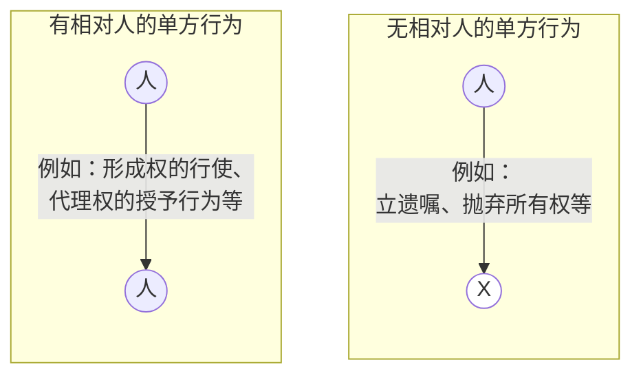
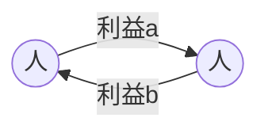
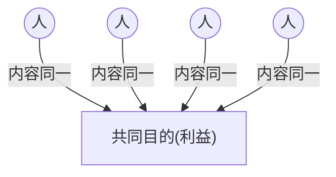
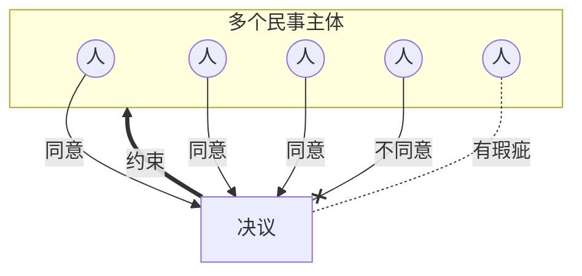

# 一、财产行为与身份行为

## （零） **分类标准**
- 根据法律行为所产生==**效果**的不同==

1. **财产行为**：发生**财产关系**变动或**财产法**上效果的法律行为。
	例：*买卖、租赁、抛弃所有权、债权让与等*

2. **身份行为**：发生**身份关系**变动或**身份法**上效果的法律行为。
	例：*结婚、离婚、收养、意定监护等*

|      比较对象       |      财产行为      |                      身份行为                       |
| :-------------: | :------------: | :---------------------------------------------: |
|   **法律效果**不同    | 发生**财产法**上的效果  |                  发生**身份法**上的效果                  |
| 是否有 **特别规则** | 不具备较强的人身性，通常无❌ |     具备较强的人身性，通常有✅ （例如==结婚的行为能力、不得代理==等）      |
|   可适用的**规则**    |      较为全面      | 并不全面，需参照适用 **财产法**规则（[[民法典#第四百六十四条\|第464条]]） |

---

# 二、单方行为与多方行为

## （零） **分类标准**
- 法律行为成立所需要的==**意思表示**的数量==

## （一）单方行为
- **概念**：根据**一项**意思表示即可成立的法律行为
- 类型：

## （二）（广义的）多方行为

### 1.  **概念**
- 具备**多个**意思表示才能成立的法律行为。

###  2.**类型**
####  （1）**双方行为**
- **两个**意思表示==**对立一致**==而成立的法律行为
	- *例如买卖合同、收养协议等*

#### （2） **共同行为**
- **两个以上**==同一内容==的意思表示**==并行一致==**而成立的法律行为，多个表意人具有同一目的
	- *例如合伙协议、设立公司的协议等。*

#### （3）决议行为
- **多个**民事主体在表达其意思表示的基础上根据法律或者章程等规定的议事方式和表决程序，为形成==团体意思==而作出的法律行为。
	- *例如公司股东会决议、业主大会的决议等*

## （二）区分意义
- 确定意思表示对法律行为成立的影响
![[截屏2025-08-20 14.51.57.png]]

---
# 三、 要式行为与不要式行为

## （零） **分类标准**
- 法律行为的成立是否需要具备约定或法定的形式

### 1. 概念
1. **要式行为**：法律、行政法规规定或者当事人约定成立或生效必须采取特定形式的法律行为。
2. **不要式行为**：不需要采取特定形式的法律行为。

### 2. 特定形式的类型

1. **书面形式**
>[[民法典#第三百四十八条-第1款|第348条第1款]]（建设用地使用权）、[[民法典#第三百六十七条-第1款|第367条第1款]]（居住权）、[[民法典#第三百七十三条-第1款|第373条第1款]]（地役权）、[[民法典#第四百条-第1款|第400条第1款]]（抵押合同）、[[民法典#第七百八十九条|第789条]]（建设工程合同）、[[民法典#第九百三十八条|第938条]]（物业服务合同）、[[民法典#第一千零六十五条-第1款|第1065条第1款]]（婚姻关系中的财产合同）、[[民法典#第一千一百二十四条|第1124条]]（放弃继承）等。

2. **登记形式**
>[[民法典#第一千零四十九条|第1049条]]（结婚）、[[民法典#第一千零七十六条-第1款|第1076条第1款]]（协议离婚）、[[民法典#第一千一百零五条-第1款|第1105条第1款]]（收养）

3. **公证形式**
>[[民法典#第六百五十八条-第2款|第658条第2款]]（公证赠与）、[[民法典#第一千一百三十九条|第1139条]]（公证遗嘱）

## （一）欠缺形式的效果

1. 欠缺书面形式的**治愈/补正**：[[民法典#第四百九十条-第2款|第490条第2款]]$$履行主要义务＋对方接受$$
	举例：*工程已快建设完毕，发包人已支付大部分工程款项*

2. 欠缺登记形式时的**不成立**
	举例：*不登记不成立婚姻关系、不登记不成立收养关系*

3. 欠缺公证形式时**效力减弱**
	举例：*未公证的赠与合同可以随时被撤销*

---
# 四、诺成行为与要物行为
>[[Chap3. 合同概说#五、诺成合同/要物（实践性）合同]]

## （零）分类标准
- 法律行为除了意思表示之外**是否还应具备物的交付**作为[[1. 法律行为的成立#三、法律行为的特别成立要件|成立要件]]
- 债权合同外，实践中无要物合同

1. **诺成行为**：仅意思表示一致即可成立的法律行为（=**不要物行为**）
2. **要物行为**：除了意思表示之外还须有物的交付才能成立的法律行为（=**实践行为**）

## （一）区分意义

|   比较对象    |    诺成行为     |                                         要物行为（=实践行为）                                          |
| :-------: | :---------: | :------------------------------------------------------------------------------------------: |
|   常见类型    | 无特别规定原则上均诺成 | 定金合同（[[民法典#第五百八十六条\|第586条]]）、自然人之间的借款合同（[[民法典#第六百七十九条\|第679条]]）、保管合同（[[民法典#第八百九十条\|第890条]]）等 |
|   成立要件    |   双方合意即可    |                                         除合意外还需标的物的交付                                         |
| 交付标的物的意义  |   履行合同义务    |                                            使得合同成立                                            |
| 不交付标的物的后果 |    违约责任     |                                            缔约过失责任                                            |
| 在法律史上的地位  |   范围越来越广    |                                            范围越来越小                                            |

---
# 五、有偿行为与无偿行为
## （零）分类标准
- 财产给付是否获得对方的**对待给付**（→详见债法课程）

1. **有偿行为**：一方当事人以财产上的给付而取得对方对待给付的法律行为。
2. **无偿行为**：一方当事人为财产上的给付而未取得对方对待给付的法律行为

## （一）区分意义

|                                  比较对象                                   |         有偿行为          |                            无偿行为                             |
| :---------------------------------------------------------------------: | :-------------------: | :---------------------------------------------------------: |
|                                **常见类型**                                 |     买卖、租赁、承揽、运输等      |                       赠与、自然人之间的无息借款等                        |
| 是否构成[[1. 自然人#b.单独实施法律行为的效力（ 民法典 第二十二条 22 ， 民法典 第一百四十五条 145 ）\|纯获法律上利益]]的行为 |          不构成          |                      **不带任何义务**的无偿行才构成                      |
|                                 注意义务的程度                                 | 程度较高 （无论故意或过失均要负责） | 程度较低 （例如参见[[民法典#第八百九十七条\|第897条]]、[[民法典#第九百二十九条\|第929条]]） |

---
# 六、负担行为与处分行为

![[截屏2025-08-20 15.59.15.png|235]]
![[截屏2025-08-20 15.59.49.png]]
![[截屏2025-08-20 16.01.26.png]]
## （零）分类标准
- 产生**新的债务**还是**变动既有权利**

### 1. 负担行为与处分行为的概念

-  ==**负担行为**==：以**创设债权债务关系**为内容的法律行为（===债权行为==）
	举例：*买卖合同、互易合同、赠与合同、租赁合同等*→债法课程

-  ==**处分行为**==：**直接使权利发生变动**的法律行为
	- **物权行为**：直接引起**既有物权**变动的处分行为
		- 举例：*所有权的转让、所有权的抛弃、设定抵押权、变更抵押权的顺位等*
	- **准物权行为**：引起物权之外**其他既有权利**变动的处分行为
		- 举例：*债权让与等*

### 2. 负担行为与处分行为的关系

1. 有负担行为，无处分行为
	举例：*无偿委托、无偿保管、借用等*
2. 有处分行为，无负担行为
	举例：*所有权的抛弃*
3. 有负担行为，有处分行为（重点！）
	例：*买卖、赠与等*

>[!tip] 提示
>处分行为既可能是**单方行为**（例如*抛弃所有权*），也可能是**双方行为**（例如*物权合同*）

![[区分原则.png]]
>[[解释：区分原则]]

>[!caution]
>$$动产物权的变动=物权合同（法律行为）＋交付（公示手段）＋有处分权$$

## （一）区分意义

|       比较对象       |         负担行为         |             处分行为              |
| :--------------: | :------------------: | :---------------------------: |
|       法律效果       | 产生新的**债务**/新的**债权**  |         使**既有权利**发生变动         |
| 是否以**有处分权**为生效要件 | ❌ （出卖他人之物，买卖合同有效） | ✅ （无处分权时物权不发生变动，*例外：善意取得*） |
|   是否要求**客体特定**   |  ❌ （买卖种类物、未来物均可）  |      ✅ （权利变动时客体必须特定）       |
## （二）物权行为理论：分离原则&抽象原则

### 1. 分离原则
	物权行为的独立性/区分原则，【无争议】

1. **内涵**：**负担行为**与**处分行为**相互分离、彼此独立，是否成立和生效应**分别判断**
2. **举例**
	1. 例1：【**行为能力前后不一**】订立合同时为完民行，交付手机前被宣告为无民行。交付时手机所有权转移了吗？
	2. 例2：【**出卖他人之物**】你卖掉同学让你保管的大佬签名书，买卖合同有效吗？交付时书的所有权转移了吗？

### 2. 抽象原则
	物权行为的无因性，【有争议】

1. 内涵：处分行为的效力**不受**负担行为效力的影响

>[!question] 知识背景
法律行为的效力是否受到原因行为效力的影响？
→受影响：有因（负担行为无效，处分行为亦无效）
→不受影响：无因（负担行为无效，处分行为的效力仍应单独判断）

2. 举例
	1. 例1：12岁的小明以自己的小米手机加2000元人民币换购乙的华为手机。若事后父母不同意，结果如何？
	2. 例2：甲在精神病发作期间与乙订立了买卖自行车的合同，恢复正常后将自行车交付给乙。此时车是乙的吗？

# 七、法律行为的其他分类

## （一）生前行为&死因行为

### 1. 分类标准
- 法律行为发生效力的时间

1. **生前行为**：法律行为于行为人**生存时就已发生效力**的法律行为
2. **死因行为**：法律行为于行为人**死后才发生效力**的法律行为

### 2. 举例

1. **生前行为**：*买卖、赠与、租赁*等绝大多数的法律行为
2. **死因行为**（通常需适用特殊规则）：*遗嘱、遗赠*

## （二）有因行为&无因行为

### 1. 分类标准
- 是否受原因行为瑕疵的影响

1. **有因行为**：行为的效力受原因行为效力影响的法律行为。原因行为无效，该行为亦无效。
2. **无因行为**：行为的效力与其原因行为效力**相互独立**的法律行为。该行为的效力不受原因行为的影响。

### 2. 举例

1. **有因行为**：大多数债权行为（例如 “我要给你钱”的原因是“你要给我东西”）
2. **无因行为**：*债权让与、债务承认、票据行为*→票据法课程