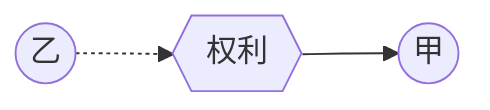
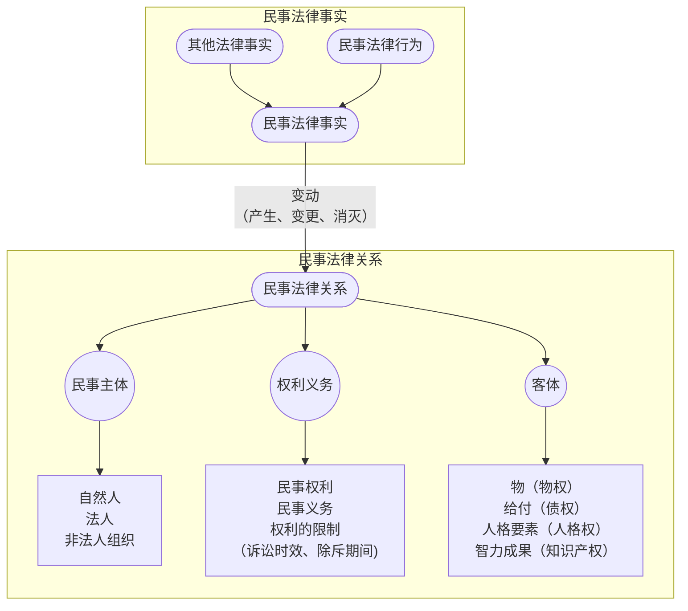

# 一、民事法律关系的变动概述
## （一）民事法律关系变动的类型

- 民事法律关系的**发生**
	- *第一组例子：买电影票、医院挂号、买新衣服、结婚……*
	- [[3. 民事法律关系的变动与法律事实#（1）权利的原始取得：权利的取得不依赖他人的在先权利。|第二组例子]]：*出生、采蘑菇、把玉石加工成手镯、撞伤他人、写论文……*

- 民事法律关系的**变更**
	- *举例：火车票改签、出让电影票……*

- 民事法律关系的**消灭**
	- *第一组例子：协商退货退款、离婚……*
	- *第二组例子：死亡、撞伤他人后赔了钱……*
## （二）权利变动的类型

### 1. 权利的取得
#### （1）权利的原始取得：
- 权利的取得**不依赖他人的在先权利**
	- 例1：出生（取得人格权）
	- 例2：订立买卖合同（取得债权）
	- 例3：加工成新物（取得所有权）

#### （2）权利的继受取得/传来取得：
- 权利的取得**依赖**他人的在先权利
	- 例1：买下蛋糕（从蛋糕店处取得蛋糕的所有权）、
	- 例2：得到遗产（从被继承人处取得财产所有权）

### 2. 权利的变更
#### （1）权利主体变更
- 举例：债权让与（权利主体换人）→债法课程
#### （2）权利客体变更
- 举例：油漆附合于墙→物权法课程
### 3. 权利的消灭
#### （1）权利的绝对消灭
- 权利本身彻底不复存在。
	- 举例：抛弃所有权（某物即成为无主物）、债权获得清偿
#### （2）权利的相对消灭
- 权利转移给了他人，相对于原权利人而消灭。
	- 举例：汽车所有权通过买卖合同从出卖人处转移到买受人处
## （三）引起民事法律关系变动/权利变动的原因：（民事）法律事实

### 民事法律事实
- 依法能够引起民事法律关系产生、变更或消灭的客观现象

---

# 二、法律事实类型之一：人的行为

## （一）民事法律行为
### 1. 概念 & 功能
1. **概念**：民事主体通过意思表示设立、变更、终止民事法律关系的行为（[[民法典#第一百三十三条|133]]）。
2. **功能**：贯彻私法自治的工具

### 2. 生活中的例子
- 买东西、租房子、送礼物、扔垃圾、立遗嘱、结婚……

>[!note] 
>$$法律行为=表意＋效果意定$$

### 3. 法律行为与情谊行为的区分

1. 情谊行为的概念
	**==情谊行为==**，又称==**好意施惠行为**==，是指行为人以维护他人的感情为目的所实施的**无偿利他行为**。

2. 法律行为与情谊行为的区分关键：**有无受到法律拘束的意思**
	情谊行为举例：*请吃饭、搭便车、约好看电影、邀请参加聚会、到站叫醒、帮同学收衣服等*

>[!tip] 提示
>需通过解释基于客观相对人的视角，结合诚实信用原则来个案认定。

## （二）事实行为
### 1.概念
- 行为人不具有设立、变更或消灭民事法律关系的意图，但依照法律的规定能引起民事法律后果的行为。

>[!caution] 注意
>行为人可能有内心意思，且内心意思可能是产生特定法律效果的要件，但该内心意思原则上无须表达，行为人内心追求何种法律后果不重要（即使不希望法律现定的效果发生，仍按照法律发生法律效果）。

>[!note]
>$$事实行为=非表意＋效果法定$$

### 2.《民法典》中关于事实行为的规定

1. 建造或拆除房屋（[[民法典#第二百三十一条|第231条]]）→物权法课程
2. 拾得遗失物（[[民法典#第三百一十四条|第314条]]）→物权法课程
3. 加工（[[民法典#第三百二十二条|第322条]]）→物权法课程
4. 先占（可根据习惯法取得物的所有权，[[民法典#第十条|第10条]]）
5. 无因管理（[[民法典#第九百七十九条|第979条]]）→债法课程
6. 侵权行为（[[民法典#第一千一百六十五条-第1款|第1165条第1款]]）→债法课程
7. 创作行为（详见[[著作权法|《著作权法》]]）→知识产权法课程
8. etc.

>[!faq] 思考：无因管理为何是事实行为？
>>[!note] 无因管理的要件
>>**无因管理**是指没有法定的或者约定的义务，为避免他人利益受损失而自愿管理他人事务或为他人提供服务的行为。
>
>虽然无因管理要求管理意思，但这种管理意思是「将管理所产生的利益归属于本人的意思，而非据为己有」，因此，并不需要将意思表达于外

### 3. 法律适用

1. 不适用有关意思表示的规则（例如意思表示瑕疵、意思表示解释等）
2. 不适用关于[[1. 自然人#三、自然人的行为能力|行为能力]]的规定

## （三）准法律行为
### 1. 概念
- 行为人以一定心理状态表现于外部，**效力由法律规定的行为**，不考虑行为人的意图。
	- 须类推适用民事法律行为的规定，包括[[1. 自然人#民事行为能力|民事行为能力]]规则等

>[!tip] 换言之
>行为人对法律效果无认识或追求的法律效果与法律规定不一致时无意义。
 
### 2. 类型

1. ==意思通知==：向他人发出的指向特定目的之表示，表意人通常期待他人实施一定行为
	例1：追认权行使的**催告**（[[民法典#第一百四十五条-第2款|145.2]]）
	例2：债务履行的**催告**（[[民法典#第一百九十五条|195.1]]）
	例3：**期限设置**（[[民法典#第四百五十三条|453]]/[[民法典#第七百一十三条-第1款|713.1]]/[[民法典#第七百二十二条|722]]）

2. ==观念通知/事实通知==：表达特定事项或信息的行为。观念通知属于`纯粹事实`的告知，按照`法律规定`确定通知的后果。
	例1：债权让与通知（[[民法典#第五百四十六条|546]]）
	例2：标的物质量不符合约定的通知（[[民法典#第六百二十一条|621]]）

3. ==情感表示==：表达某种情感的行为
	举例：被继承人的宽恕（[[民法典#第一千一百二十五条|第1125条第2款]]）

### 3. 法律适用：类推适用关于[[3. 民事法律关系的变动与法律事实#（一）民事法律行为|法律行为]]的规定

>[!note]
>$$准法律行为=表意＋效果法定$$

| 比较对象  | 是否必须将内心意思表达出来 | 法律效果是否按内心意思发生 | 是否要求有完全民事行为能力 |
| :---: | :-----------: | :-----------: | :-----------: |
| 法律行为  |       ✅       |       ✅       |       ✅       |
| 准法律行为 |       ✅       |       ❌       |       ✅       |
| 事实行为  |       ❌       |       ❌       |       ❌       |

---

# 三、法律事实类型之二：自然事实

## （一）事件
### 1. 概念与类型
1. **概念**：某种**客观情况**的**发生**（==在一个时间点==）
2. **类型**：*出生、死亡、成年、果实落地等*

### 2. 法律效果
1. 举例：出生导致权利能力产生（[[民法典#第十三条|13]]）、死亡导致继承开始（[[民法典#第一千一百二十一条-第1款|1121.1]]）

## （二）状态
### 1. 概念与类型
1. **概念**：某种**客观情况**的**延续**（==在一个时间段==）
2. **类型**：*下落不明、时间经过、遗失物无人认领等*

### 2. 法律效果
- 例1：下落不明导致宣告失踪或宣告死亡的条件满足
- 例2：时间经过导致时效抗辩权产生（[[民法典#第一百八十八条|188]]）or撤销权消灭（[[民法典#第一百五十二条|152]]）