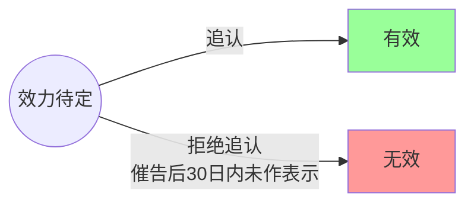
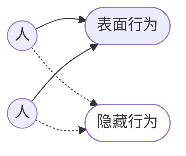
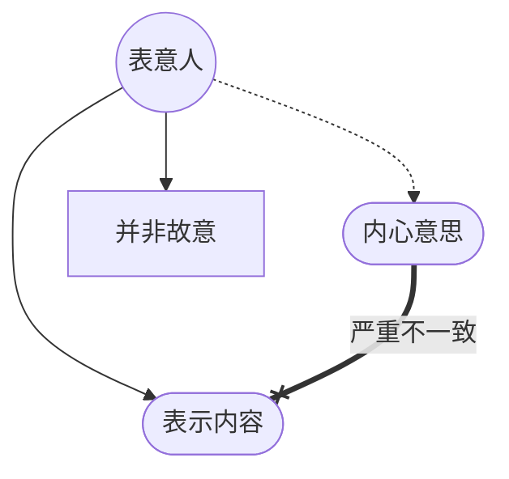
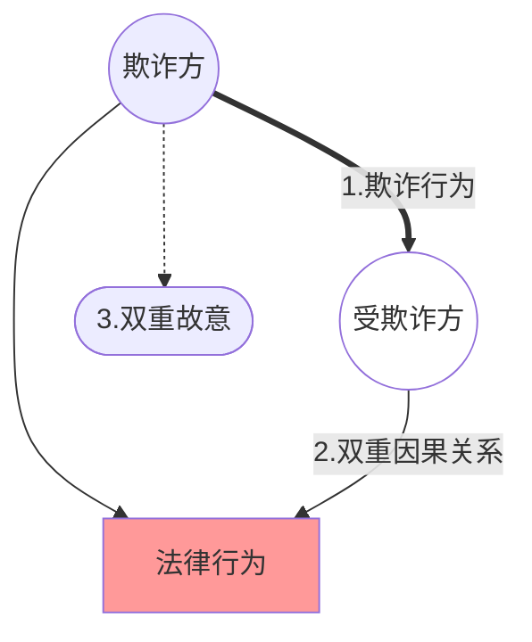
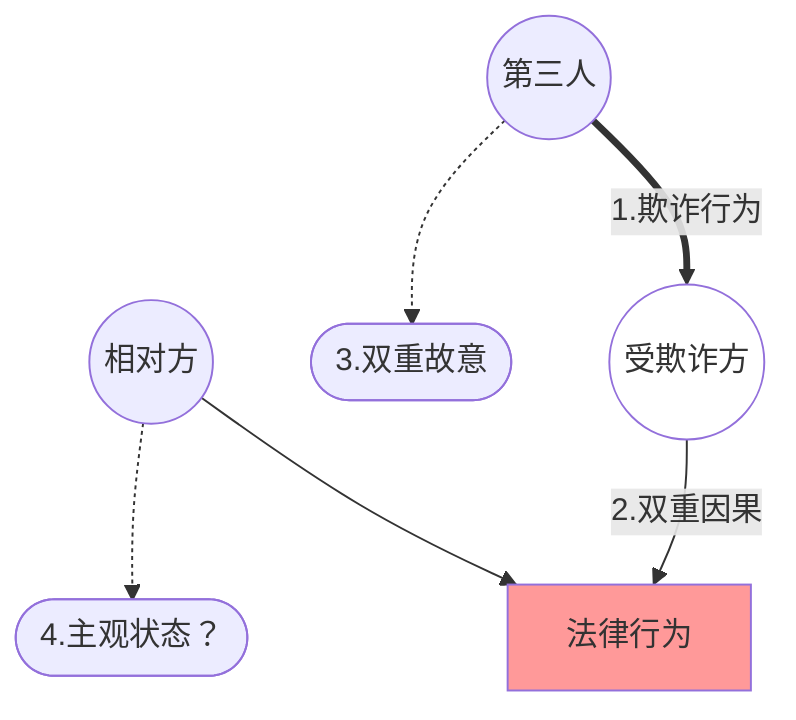
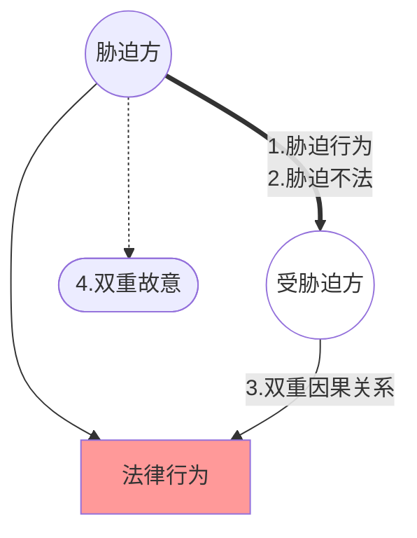
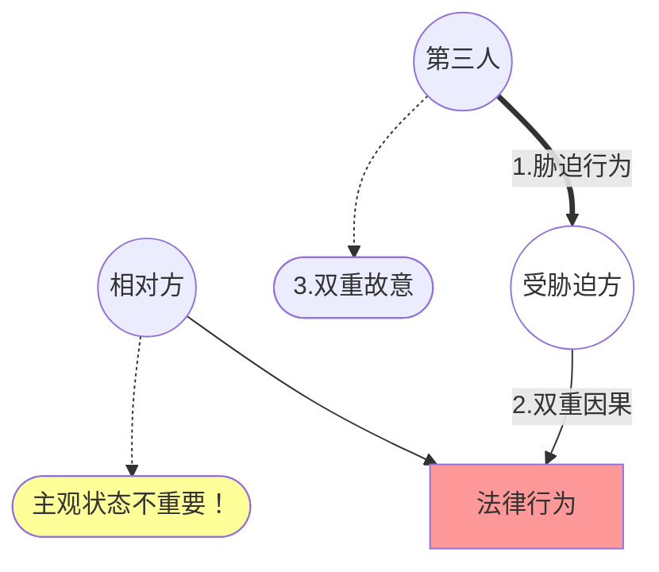
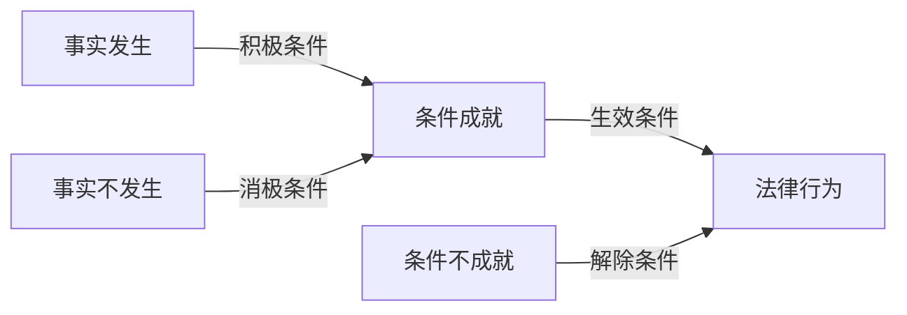

# 一、法律行为的生效要件概览

>[!quote] 一般有效要件：[[民法典#第一百四十三条]]
>具备下列条件的民事法律行为有效：
（一）行为人具有相应的**民事行为能力**；
（二）**意思表示**真实；
（三）不违反法律、行政法规的**强制性规定**，**不违背公序良俗**。

![[截屏2026-05-21 11.13.27.png]]

>[!faq] 法律行为的「成立」、「有效」与「生效」
|比较维度|成立|有效|生效|
|---|---|---|---|
|**性质**|**事实判断**：关注法律事实是否客观存在。|**价值判断**：关注法律对行为效力的肯定性评价。|**时间维度**：关注效力发生的时间起点。|
|**判断标准**|**成立要件**：一般包括当事人、意思表示（标的）；特别要件包括特定形式（如要式行为）或物之交付（如要物行为）。|**一般生效要件**（《民法典》143条）：1. 行为人具有相应行为能力；2. 意思表示真实；3. 不违反法律、行政法规的强制性规定，不违背公序良俗。|**生效规则**：原则上自成立时生效；例外包括法律另有规定（如批准、登记）或当事人另有约定（如附条件、附期限）。|
|**举证责任**|主张法律行为存在的一方（通常是原告）对成立事实承担举证责任。|主张行为无效的一方对瑕疵事由承担举证责任；已成立的行为推定有效。|通常随成立而生效，若主张延迟生效，需证明附条件/期限或特别法定程序的约定。|
|**法律后果**|法律行为客观存在，产生**形式约束力**（不得擅自变更/解除），但不一定产生预期的实质效力。|法律行为具有终局性、完整的效力，受法律保护。|法律行为开始发生实质效力，当事人必须履行义务。|

>[!example] 北大送琴案
>- 12 岁的甲与 18 岁的哥哥乙在 6 月 1 日约定，若乙高考考上北大，甲把父亲留给他的小提琴送给乙。【成立，效力待定】
>- 6 月 10 日，甲乙的父亲丙得知此事，表示同意。【溯及有效】
>- 7 月 10 日，乙收到北大的录取通知书。【生效】

因此，我们得出效力障碍事由：
>[!note] 效力障碍事由
>（一）无相应民事行为能力
>（二）意思表示有瑕疵
>（三）违反强制性规定或公序良俗


---
# 二、法律行为的一般生效要件与效力障碍

## （一）欠缺行为能力与法律行为的效力障碍
>[[1. 自然人#三、自然人的行为能力]]

>[!quote] 法条链接
>[[民法典#第一百四十三条|第143条]] 具备下列条件的民事法律行为**有效**：
（一）行为人具有相应的民事行为能力；
（二）意思表示真实；
（三）不违反法律、行政法规的强制性规定，不违背公序良俗。
>
>[[民法典#第一百四十四条|第144条]] **无民事行为能力人**实施的民事法律行为**无效**。
>
>[[民法典#第一百四十五条|第145条]] **限制民事行为能力人**实施的<u>纯获利益的民事法律行为</u>或者<u>与其年龄、智力、精神健康状况相适应的民事法律行为</u>**有效**；实施的<u>其他民事法律行为</u>经法定代理人同意或者追认后有效。
  相对人可以<u>催告</u>法定代理人自收到通知之日起三十日内予以追认。法定代理人<u>未作表示的，视为拒绝追认</u>。民事法律行为被追认前，善意相对人有撤销的权利。撤销应当以通知的方式作出。
 > 
>[[民法典#第十八条|第18条]] 成年人为**完全民事行为能力人**，可以独立实施民事法律行为。
>十六周岁以上的未成年人，以自己的劳动收入为主要生活来源的，视为完全民事行为能力人。
> 
> [[民法典#第十九条|第19条]] 八周岁以上的未成年人为**限制民事行为能力人**，实施民事法律行为由其法定代理人代理或者经其法定代理人同意、追认；但是，可以独立实施纯获利益的民事法律行为或者与其年龄、智力相适应的民事法律行为。
> 
> [[民法典#第二十条|第20条]] 不满八周岁的未成年人为**无民事行为能力人**，由其法定代理人代理实施民事法律行为。
> 
> [[民法典#二十三|第23条]] 无民事行为能力人、限制民事行为能力人的**监护人是其法定代理人。**

1. [[1. 自然人#A.无民事行为能力人|无民事行为能力人]]独立实施的法律行为效力：[[4. 法律行为的生效与效力障碍#1. 无效的法律行为及其后果|一律无效]]（[[民法典#第一百四十四条|第144条]]）
>[!question] 争议
>无民事行为能力人实施的纯获法律上利益的法律行为亦无效吗？

2. [[1. 自然人#B. 限制民事行为能力人|限制民事行为能力人]]独立实施的法律行为效力：视情况而定（[[民法典#第一百四十五条|第145条]]）
	1. 经过法定代理人事先允许（=”同意”）的法律行为：有效✅
	2. 纯获法律上利益的法律行为：有效✅
	3. 与其年龄、智力、精神健康状况相适应的法律行为：有效✅
	4. 其他法律行为：[[4. 法律行为的生效与效力障碍#2. 效力待定法律行为及其后果|效力待定]]❓

>[!example] iPad iPhone 互易案
>案情：12 岁的甲约定以自己价值超 7k 元的 iPad 与 20 岁的乙的 iPhone 互换。
>- 互易合同效力如何？
>	- 互易合同的订立是负担行为，从成立要件看来，甲是限制民事行为能力人，合同效力待定。
>- 甲对 iPad 的处分行为/物权行为效力如何
>	- 甲对处分行为效力待定。
>- 乙对 iPhone 的处分行为/物权行为的效力如何
>	- 若认为甲取得 iPhone 的所有权是纯获利益的，有效
>- 若 iPad 系甲父所有，甲对处分行为/物权行为效力如何
>	- 无权处分，无效
>- 设甲 15 岁，iPad 残值 200 元，乙 17 岁且在外打工月入 8k ，上述问题如何？

---
## （二）意思表示瑕疵与法律行为的效力障碍

>[!quote] 法条链接1：民法典
> [[民法典#第一百四十六条|第146条]] 行为人与相对人以虚假的意思表示实施的民事法律行为无效。
> 以虚假的意思表示隐藏的民事法律行为的效力，依照有关法律规定处理。
> 
> [[民法典#一百四十七|第147条]] 基于**重大误解**实施的民事法律行为，行为人有权请求人民法院或者仲裁机构予以撤销。
> 
> [[民法典#一百四十八|第148条]] 一方以**欺诈**手段，使对方在违背真实意思的情况下实施的民事法律行为，受欺诈方有权请求人民法院或者仲裁机构予以撤销。
> 
> [[民法典#一百四十九|第149条]] **第三人实施欺诈行为**，使一方在违背真实意思的情况下实施的民事法律行为，对方知道或者应当知道该欺诈行为的，受欺诈方有权请求人民法院或者仲裁机构予以撤销。
> 
> [[民法典#第一百五十条|第150条]] 一方或者第三人**以胁迫手段**，使对方在违背真实意思的情况下实施的民事法律行为，受胁迫方有权请求人民法院或者仲裁机构予以撤销。
> 
> [[民法典#一百五十一|第151条]] 一方利用**对方处于危困状态、缺乏判断能力**等情形，致使民事法律行为成立时显失公平的，受损害方有权请求人民法院或者仲裁机构予以撤销。
>
>🌟小复习：[[2. 权利的分类#（四）形成权]]

>[!quote] 法条链接2：合同编通则解释
>[[合同编通则解释#第十一条|第11条]]  当事人一方是自然人，根据该<u>当事人的年龄、智力、知识、经验并结合交易的复杂程度</u>，能够认定其对<u>合同的性质、合同订立的法律后果或者交易中存在的特定风险</u>缺乏应有的认知能力的，人民法院可以认定该情形构成民法典[[民法典#第一百五十一条|第一百五十一条]]规定的“**缺乏判断能力**”。

>[!quote] 法条链接 3：民法典
>[[民法典#第一百五十二条|第152条]]  有下列情形之一的，**撤销权**消灭：
（一）当事人自知道或者应当知道撤销事由之日起**一年内**、重大误解的当事人自知道或者应当知道撤销事由之日起**九十日内**没有行使撤销权；
（二）当事人受胁迫，自胁迫行为终止之日起**一年内**没有行使撤销权；
（三）当事人知道撤销事由后明确表示或者以自己的行为表明放弃撤销权。当事人自民事法律行为发生之日起**五年内**没有行使撤销权的，撤销权消灭。


>[!summary] 意思表示瑕疵的体系
> ```mermaid
> graph LR
> A((意思表示<br>瑕疵)) --> B{是否<br>自由} --> C([意思与表示不一致]) & D([**意思表示不自由**])
> 	C --> C1([故意的不一致]) & C2([无意的不一致])
> 		C1--> C11([单方虚伪表示]) & C22([双方虚伪表示])
> 		C2--> C21([**重大误解**]) 
> 	D--> D1([**欺诈**]) & D2([**胁迫**]) & D3([**显失公平**])
> 		D1--> D11([**相对人欺诈**]) & D12([**第三人欺诈**])
> ```
> 备注：粗体=可撤销

### 1. 意思与表示不一致：故意不一致

1.  ==单方虚伪表示==
	- **真意保留**（=内心保留=“**恶意的玩笑**”)
		- 构成要件：`表示内容与内心真意不符 + 表意人明知其与真意不符`
			- eg. *为了安抚快去世的母亲，甲将自己最爱的古画赠与弟弟乙，乙接受。*
		- 法律效果
			- 若相对人**不知**真意保留：法律行为的效力不受影响
			- 若相对人**知道**真意保留：法律行为无效☞无效的后果统一参见"[[4. 法律行为的生效与效力障碍#四、法律行为效力障碍的后果|四]]"
		
	- **非诚意表示**（=戏谑表示=“**善意的玩笑**”）
		- 举例
			- *开玩笑：例如“这套房子喜欢吗？送你了。”*
			- *吹牛：例如“我有的是钱，现在就把你的公司买下来。”*
			- *嘲讽：例如“你既然那么爱钱，这些钱都归你了。”*
		- 法律效果：法律行为==一律无效==（无论相对人是否知悉）
	
>[!question] 思考
>无论是“善意的玩笑”还是“恶意的玩笑”，在民法典中都未如是规定，为什么？

2. ==双方的虚伪表示==/==通谋虚伪行为==（[[民法典#第一百四十六条|第146条]]＋[[合同编通则解释#第十四条|《合同编通则解释》第14条）]]
	- **概念**：表意人和相对人`通谋`而作出`与其真实意思不一致`的意思表示。
	- **构成要件**：`意思表示与真意不符＋相对人就该非真实意思有通谋的合意`
		- *例1：阴阳合同（用于逃税）*
		- *例2：名为买卖实为借款*
	- **法律效果**
		- 表面行为：==无效==（[[民法典#第一百四十六条-第1款|第146条第1款]]）
			- 无效的后果参见-->[[4. 法律行为的生效与效力障碍#1. 无效的法律行为及其后果|无效的法律行为及其后果]]
		- 隐藏行为：==按一般规则判断==（[[民法典#第一百四十六条-第2款|第146条第2款]]）
	

### 2. 意思与表示不一致：无意不一致（重大误解/错误）

#### （1）概述

-  **概念**：表意人作出意思表示时对表示的内容发生了具有**交易上重要性**的`认识`或`表示错误`。

##### **错误的构成要件**
	心口不一致，严重非故意
1. 表示内容与表意人的内心意思==不一致==
	- [[4. 法律行为的生效与效力障碍#（2）解释先于错误（=解释先于撤销）|解释先于撤销]]；[[4. 法律行为的生效与效力障碍#（3） 错误的类型|错误的类型]]
2. 表意人==并非故意==导致表示内容与其意思不一致（若故意不一致则属于[[4. 法律行为的生效与效力障碍#1. 意思与表示不一致：==故意==不一致|虚伪行为]]）
3. 此种不一致须较为==严重==
	 →4.“[[4. 法律行为的生效与效力障碍#（4）错误严重性的判断标准|错误严重性的判断标准]]”

- **法律效果**：行为人（===陷入重大误解==/==错误的一方==）[[4. 法律行为的生效与效力障碍#3. 可撤销法律行为及其后果|有权撤销]]（[[民法典#第一百四十七条|147]]）


#### （2）解释先于错误（=解释先于撤销）

1. 虽然表面上有错误，但**经由解释**：
	- **双方未达成合意**
		- 不存在错误问题，此时按合同不成立处理
			- 例：*甲说“9800 dollar手表卖给你”，乙同意，但dollar在香港具有多义性。*
	- **不会得出意思与表示不一致的结论**（→[[1. 法律行为的成立#（四）意思表示的解释|意思表示的解释]]）：
		- 不存在错误问题【误载无害真意】
			- 例：*甲将9800元的手表笔误成980元，乙回信表示同意，之前说好的是9800元。*

2. 在对意思表示进行相应的**解释后仍存在不一致**时，**才可能适用**[[民法典#第一百四十七条|第147条]]
	1. *甲在网上卖手表，本来想卖9800元，不小心打错成980元，乙看到后下单。*
	2. *张某本来想买梨，却买成了苹果（黄元帅）。*

#### （3） 错误的类型
>[[总则编解释#第十九条-第1款|《总则编解释》第19条第1款]]

##### A. 动机错误：内心意思形成阶段的错误

1. **狭义的动机错误**：不构成民法上的错误→==不可撤销！==[^1]
	-   *为了与女友结婚，甲花2万元买了一枚钻戒，后来女友临时悔婚。*
	-  *某商人紧急进了一批货，事后发现另一个仓库里还有很多存货。*		
	-  *以为自己有年休假于是订好了去希腊的酒店和机票。*
	-  *手机进水了之后马上下单一个新手机，但妻子其实已经买好了。*
2. **性质错误**：对对方的特征、资格或标的物的性质产生误认→[[4. 法律行为的生效与效力障碍#B. 内容错误：寻找表意符号阶段|重大时]][^2]可撤销
	1.  第一类：对对方的**资格或特征**产生误认
		-  包括年龄、性别、健康、前科、能力、信用等
			-  eg.*定制家具，师傅的手艺vs师傅的政治立场*
			- *eg.公司招聘司机，司机有醉驾的前科vs司机已婚育*
	2. 第二类：对**标的物的性质**产生误认
		- 包括质量、数量、产地、年代、真假、使用时间等，对物的使用和价值会产生影响。
		- 物的`价格`**不属于性质**，但是「`影响物的价格的因素（形成价值的因素）`」**是性质**
			-  *eg.把白银当成铂金*
			-  *eg.把赝品当成真品*
			-  *eg.看错了二手车的行驶里程*

>[!caution] 
>>[!cite] [[总则编解释#第十九条-第2款]]
>>行为人能够证明自己实施民事法律行为时存在重大误解，并请求撤销该民事法律行为的，人民法院依法予以支持；但是，根据**交易习惯等**认定行为人无权请求撤销的除外

##### B. 内容错误：寻找表意符号阶段

> 使用了其想要适用的表示方法。在内容错误，对行为、当事人、标的物的错误都是「种类」上的。

1. 对**法律行为性质**的认识错误
	- 把买卖当成赠与、把租赁当成借用等
		- *eg.新书签名案2（以为是赠与，其实是买卖）*
		- *eg.以为酒店里的茶叶是免费的，泡茶喝掉*
2. 对**对方当事人**的认识错误
	-  把两个同名或长相相似的人搞错
		- *举例：甲想与张南签合同，却将其双胞胎弟弟张北当成了张南。*
		- *反例：17岁的甲长相老成，乙误以为他已经20岁，于是与之签订合同。*
3. 对**标的物**的认识错误
	-  把狗的品种搞错、将某种商品与另一种商品混淆等
		- *eg.把秋田犬当成柴犬*
		- *eg.把黄元帅（一种苹果）当成梨*

##### C. 表达错误：将内心意思表达于外部阶段的错误

> 没有适用其欲使用的表示方法

1. ==说错==/误言
	- *举例：你想把王泽鉴的《民法总则》送给同学，结果说成了《民法思维》。*
2. ==写错==/误写
	-  采广义理解，包括输错、打错、点错等
		- *举例：电商将13990元的苹果电脑标错成1399元。*
3.  ==拿错==/误取
	- *例1：书店想给会员甲邮寄半价书单，却寄给了乙。*
	- *例2：想给乞丐10块钱，结果掏成100块。*

##### D. 传达错误：传达人传达意思表示时出现的错误

>[!tip] 表意使者的资格
>- 配偶/管家/秘书 

1. **表示传达人**的误传风险：**表意人**承担（可适用[[总则编解释#第二十条|重大误解撤销]]）
>[!question] 思考
>甲想以20万的价格卖掉自己的二手车，他让朋友丙带个口信给乙，结果丙不小心说成12万，乙对甲表示“同意”。合同以哪个价格成立？
>- 误传风险由表意人承担，因此合同以

2. **受领传达人**的误传风险：**受领人**承担
>[!question] 思考
>甲想以20万的价格卖掉自己的二手车，他把这个意思告诉了乙的妻子丙，丙回家后不小心说成是12万，乙打电话跟甲说<u>“同意以12万购买”</u>或<u>“同意你说的那个价格”</u>，结果有何不同？

#### （4）错误严重性的判断标准
>[[总则编解释#第十九条|《总则编解释》第19条]]，同时具备才算重大
`主观重要性+客观重要性 = 重大`

1. **主观重要性**：若表意人`知道实际情况`就不会作出这样的意思表示

>[!example] 反例
>甲欲订购某酒店的517房间，但下单时点成了514，酒店已为其预留514房间。两个房间在价格、面积、设施、窗外景观方面均无太大区别。
>>[!question] 思考
>>上例中，若514是甲和初恋女友分手时的房间号呢？

2. **客观重要性**：若一个理性人知道实际情况就不会作出这样的意思表示

>[!example] 反例
>上例中，甲不想入住514的原因是其谐音为“吾要死”（迷信）呢？

#### （5）排除适用[[民法典#第一百四十七条|第147条]]的情形
>即“虽然属于错误，但不能撤销”

1. ==风险合同==
	- [[总则编解释#第十九条-第2款|《总则编解释》19.2]]：“根据交易习惯等认定…无权…撤销的”
		- *例1：古玩跳蚤市场上的买卖合同*
		- *例2：保证合同中，保证人误以为债务人的信用状况良好。*

2. ==婚姻缔结==过程中出现的错误
	- *举例：女生以为男生是好男人/法学博士，结婚后发现是渣男/只有本科学历。*

### 3. 意思表示不自由： 欺诈

#### （1） 相对人欺诈
>[[民法典#第一百四十八条|第148条]]＋[[总则编解释#第二十一条|《总则编解释》第21条]]，背下来

>[!note] 欺诈
>故意欺骗他人，使他人陷入错误判断，并基于此错误判断而为意思表示的行为。[^3] 为了保护意思决定的自由，即使表意人的内心意思与表示一致，也允许表意人撤销

##### A.相对人欺诈：构成要件
1. 存在针对特定事实的**欺诈行为**
	1. 第一类：积极欺诈
		- *eg.国产牛肉冒充进口牛肉、廉价石雕冒充文物等*
	2. 第二类：消极欺诈
		- *eg.隐瞒房子是凶宅、不告知二手车出过事故等*

>[!info] 告知义务的来源
>I. 法定的告知义务（例如《产品责任法》第27条）
>II. 基于诚信原则产生的告知义务（例如房子是不是凶宅）

2. 欺诈行为**导致他人陷入**[[4. 法律行为的生效与效力障碍#**错误的构成要件**|错误]]，且他人**因错误作出意思表示**（==双重因果关系==）

>[!example] 举例
> - 举例：甲谎称自己的注水牛肉是上等牛肉，乙购买。
> - 反例：甲谎称自己的清代瓷器是明代瓷器，乙**明知**甲说的是谎话仍购买。
> 	- *（没有陷入错误）*
> - 反例：甲**已经决定**购买乙的别墅，乙谎称该别墅有名人住过，甲**更想**买了。
> 	- *（没有因错误做出意思表示）*

3. 欺诈方**希望**他人陷入错误认识，且**希望**他人因错误而作出意思表示（==双重故意==）

>[!example] 反例
>- 三手车**卖家自己也不知道**三手车是事故车（**过失**欺诈不构成欺诈）。

>[!example] 反例：校长贪污案
> - 某校长甲想以50万出售自己的住房，记者乙找到甲想以30万购买，甲不同意。于是乙就说：“我有你贪污的材料，不答应就举报你。”甲信以为真，将房子以30万卖给乙。其实乙并无该材料。
> 	- 校长在此**并非因错误认识**而处分财产，而是**因恐惧心理**而处分财产，是为[[4. 法律行为的生效与效力障碍#（1） 相对人胁迫|胁迫]]
^principalcorruption


##### B. 法律效果：
- ==受欺诈方==有权撤销
	- 撤销权的行使与后果参见“[[4. 法律行为的生效与效力障碍#（3）撤销权的行使及其后果|撤销权的行使及其后果]]

#### （2）第三人欺诈
>[[民法典#第一百四十九条|第149 条]]
##### A. 第三人欺诈：构成要件
1. 第三人实施了针对特定事实的欺诈行为
2. 欺诈行为导致他人陷入错误，且他人因错误做出意思表示
3. 欺诈方存在欺诈的故意
4. ==受欺诈方的**相对方知道或应当知道**该欺诈行为==

>[!question] 思考
>- 前三点同[[4. 法律行为的生效与效力障碍#A.相对人欺诈：构成要件|前]]，为什么需要第 4 点这个要件？
>- 甲得知乙要购买朋友丙的二手车，于是极力推荐并谎称该车未出过事故，乙信以为真而购买。丙知道或不知道甲的欺诈行为，对结果有影响吗？



##### B. 第三人欺诈：法律效果
1. ==受欺诈方==有权[[4. 法律行为的生效与效力障碍#（3）撤销权的行使及其后果|撤销]]（其与相对人之间的法律行为）
2. 受欺诈方有损失的，第三人需承担赔偿责任（[[合同编通则解释#第五条]]）

>[!question] 思考
> - 甲欲购买乙古董店的一幅名画，担心是赝品。著名书画鉴定师丙正好路过。丙嫉妒甲，明知为赝品，仍将其鉴定为真迹。甲遂与乙订立买卖合同。
> - 问：甲可否撤销该合同？

### 4. 意思表示不自由：胁迫

#### （1） 相对人胁迫
>[[民法典#第一百五十条|第150条]]＋《总则编解释》[[总则编解释#第二十二条|第22条]]

##### 相对人胁迫：构成要件

1. 存在==胁迫行为==（向对方预告将来的危害，并声称自己有能力令其实现）
	1. 对象：既可以是针对**受胁迫人本人**，也可以针对**受胁迫人的亲友或同事**等。
	2. 标准：[[1. 法律行为的成立#主观主义|主观主义]]（胁迫人**可能虚张声势**，但只要对方陷入恐惧即成立胁迫）
	3. 举例：见前[[#^principalcorruption|【校长贪污案】]]
2. 胁迫行为具有==不法性==
	1. 手段不法
		-  *例：“不还钱就打断你的腿”“不给钱就杀了你女儿/举报你”（实际上未犯罪，属于虚构犯罪行为）*
	2. 目的不法
		-  *例：“不借我10万块开赌场，就举报你吸毒”“不买我的毒品，就举报你受贿”*
	3. 手段和目的==相结合==不法
		-  *例：“不借我钱/不买我的东西，就举报你犯罪”（实际上确实犯罪，虽手段与目的分开来看并非都不法，但结合起来不法）*
3. 胁迫人希望相对人**陷入恐惧**，且希望相对人**因恐惧**而作出意思表示（==双重故意==）
	- *例：见前[[#^principalcorruption|【校长贪污案】]]*
4. 相对人因胁迫而**陷入恐惧**，并**因恐惧**而作出意思表示（==双重因果关系==）
	- *例：甲想买乙的一套房，乙不愿意卖，甲就说“否则我天天拿针扎你的照片。”乙害怕就卖了。*

- 法律效果：==受胁迫方==有权撤销
	- 撤销权的行使与后果参见“[[4. 法律行为的生效与效力障碍#四、法律行为效力障碍的后果|四]]”



#### （2） 第三人胁迫
>[[民法典#第一百五十条|第150条]]＋[[总则编解释#第二十二条|《总则编解释》第22条]]

1. 构成要件：[[4. 法律行为的生效与效力障碍#相对人胁迫：构成要件|同前]]（唯一的不同：实施胁迫的主体是第三人）
2. 法律效果：
	1. 无论相对方是否知情，**受胁迫方均有权撤销**
		- 对比：注意与[[4. 法律行为的生效与效力障碍#B. 第三人欺诈：法律效果|第三人欺诈]]的区别！背后的原因是？
	2. 若受胁迫方有损失的，第三人需承担赔偿责任
		- [[合同编通则解释#第五条|《合同编通则解释》第5条]]



### 3. 意思表示不自由：显失公平

#### （1）概述
- 概念问题：==显失公平==、==乘人之危==还是==暴利行为==？
- 适用范围：仅适用于==双务有偿合同==，不适用于**无偿合同**、**离婚协议**等

#### （2）构成要件
>[[民法典#第一百五十一条]]

1. **主观要件**：==故意==利用对方处于==危困状态、缺乏判断能力==等情形
	1. ==危困状态==
		- *举例：甲父住院急需用钱，乙趁机以低价收购甲收藏的一幅名画。*
	2. ==缺乏判断能力==（→[[合同编通则解释#第十一条|《合同编通则解释》第11条]]）
		- *举例：金融机构从业人员向文化水平较低的老年人兜售高风险理财产品。*
	3. “==等情形==”（包括==利用优势地位==或==对方严重的意志薄弱状态==等）
		- *举例：领导将车高价卖给员工、把人灌醉后签合同*
2. **客观要件**：法律行为==成立时从客观上==看明显不公平
	1. 公平与否的判断：须==结合个案==具体情况综合判断
		- *例：旅游时导游“忽悠”有钱的老年人以高于市价很多的价格买下海景房。*
	2. 若==成立后==出现明显不公平：可能构成==情势变更==（[[民法典#第五百三十三条|第533条]]）→债法课程
		-  *举例：甲以市价80万元卖了房子，未办理过户，1个月后该房以600万元被征收。*

#### （3）法律效果
- 受损害方有权撤销（[[民法典#第一百五十一条|第151条]]）☞撤销权的行使与后果参见“[[4. 法律行为的生效与效力障碍#（四）法律行为效力障碍的后果|四]]”


>[!quote] 法条链接
>[[民法典#第一百五十三条|第一百五十三条]]  违反法律、行政法规的强制性规定的民事法律行为无效。但是，该强制性规定不导致该民事法律行为无效的除外。
>  违背公序良俗的民事法律行为无效。

>[!question] 问题
> - 如果强制性规定没有规定违反后的效力状态，该如何处理？
> - 何谓“公序良俗”？具体应如何判断？

---
## （三）违法悖俗与法律行为的效力障碍
### 1. 违反强制性规定的法律行为

>[!example] 事例
>- 《法官法》（2001）第32条第11项规定：“**法官不得有下列行为：（十一）从事营利性的经营活动。**”实践中经常出现法官与人合伙开店的现象，合伙协议有效吗？
> - 凌晨3点你还在KTV唱歌，你可以以KTV违反《娱乐场所管理条例》第28条规定的“**每日凌晨2时至上午8时，娱乐场所不得营业**”为由不付钱吗？
> - 甲在乙拍卖行通过竞买买下了一架某名人使用过的钢琴。其后，该名人丑闻暴露，该钢琴身价因此大跌，甲便以拍卖师丙违反《拍卖法》第15条规定的“**拍卖师应当在拍卖企业工作两年以上**”为由，主张拍卖无效，要求退还价金。

>[!quote] 法条链接
>[[合同编通则解释#第十六条-第1款|《合同编通则解释》第16条第1款]]→对[[民法典#第一百五十三条-第1款|《民法典》153.1]]的细化
> 
> 合同违反法律、行政法规的强制性规定，有下列情形之一，由行为人承担行政责任或者刑事责任能够实现强制性规定的立法目的的，人民法院可以依据[[民法典#第一百五十三条-第1款|民法典第一百五十三条第一款]]关于“**该强制性规定不导致该民事法律行为无效的除外**”的规定认定该合同不因违反强制性规定无效：
> - （一）强制性规定虽然旨在维护社会公共秩序，但是合同的实际履行对社会公共秩序造成的影响显著轻微，认定合同无效将导致案件处理结果有失公平公正；
> - （二）强制性规定旨在维护政府的税收、土地出让金等国家利益或者其他民事主体的合法利益而非合同当事人的民事权益，认定合同有效不会影响该规范目的的实现；
> - （三）强制性规定旨在要求当事人一方加强风险控制、内部管理等，对方无能力或者无义务审查合同是否违反强制性规定，认定合同无效将使其承担不利后果；
> - （四）当事人一方虽然在订立合同时违反强制性规定，但是在合同订立后其已经具备补正违反强制性规定的条件却违背诚信原则不予补正；
> - （五）法律、司法解释规定的其他情形。

>[!quote] 法条链接
>《合同编通则解释》第16条第[[合同编通则解释#第十六条-第2款|2]]-[[合同编通则解释#第十六条-第3款|3]]款→对[[民法典#第一百五十三条-第1款|《民法典》153.1]]的细化
>
> 法律、行政法规的强制性规定旨在规制合同订立后的履行行为，当事人以合同违反强制性规定为由请求认定合同无效的，人民法院不予支持。但是，合同履行必然导致违反强制性规定或者法律、司法解释另有规定的除外。
> 依据前两款认定合同有效，但是当事人的违法行为未经处理的，人民法院应当向有关行政管理部门提出司法建议。当事人的行为涉嫌犯罪的，应当将案件线索移送刑事侦查机关；属于刑事自诉案件的，应当告知当事人可以向有管辖权的人民法院另行提起诉讼。

![[新的类型化方法：放弃效力性与管理.png]]


#### （1）影响显著轻微，无效显失公平

 -  强制性规定虽然旨在维护社会公共秩序，但是==合同的实际履行对社会公共秩序造成的影响显著轻微==，认定合同无效将导致案件处理结果有失公平公正
>[!example] 例子
> - 《商业特许经营管理条例》第7条第2款：“**特许人从事特许经营活动应当拥有至少2个直营店，并且经营时间超过1年**。” 行政处罚→第24条第1款
> - 《商业银行法》第47条：“**商业银行不得违反规定提高或者降低利率以及采用其他不正当手段，吸收存款，发放贷款**。”行政处罚→第74条

#### （2）旨在维护非合同当事人的合法利益

-  强制性规定==旨在维护政府的税收、土地出让金等国家利益或者其他民事主体的合法利益==而非合同当事人的民事权益，认定合同有效不会影响该规范目的的实现
>[!example] 例子
> - 《税收征收管理法》第21条第2款：“单位、个人在购销商品、提供或者接受经营服务以及从事其他经营活动中，**应当按照规定开具、使用、取得发票**。”
> - 《城市房地产管理法》第39条第1款第1项：“以出让方式取得土地使用权的，转让房地产时，应当符合下列条件：（一）按照出让合同约定**已经支付全部土地使用权出让金**……；

#### （3）旨在要求一方，对方无力审查

-  强制性规定旨在==要求当事人一方加强风险控制、内部管理等==，==对方无能力或者无义务审查合同是否违反强制性规定==，认定合同无效将使其承担不利后果
>[!example] 例子
> - 《药品管理法》第47条第1款：“药品生产企业应当对药品进行质量检验。**不符合国家药品标准的，不得出厂。**”
> - 《商业银行法》第39条第1款第1项：“商业银行贷款, 应当遵守下列资产负债比例管理的规定：（一）**资本充足率不得低于百分之八**。”

#### （4）违反诚信原则的一方主张合同无效

-  当事人一方虽然在订立合同时违反强制性规定，但是==在合同订立后其已经具备补正违反强制性规定的条件却违背诚信原则不予补正==
>[!example] 例子
> - 《商品房买卖合同解释》第6条第1款：“当事人以商品房预售合同**未按照法律、行政法规规定办理登记备案手续为由**，请求确认合同无效的，不予支持。”
> - 《建设工程施工合同解释》第3条第2款：“发包人**能够办理审批手续而未办理**，并以未办理审批手续为由请求确认建设工程施工合同无效的，人民法院不予支持。”

#### （5）旨在规制合同的履行行为

-  法律、行政法规的==强制性规定旨在规制合同订立后的履行行为==，当事人以合同违反强制性规定为由请求认定合同无效的，人民法院不予支持。但是，合同履行必然导致违反强制性规定或者法律、司法解释另有规定的除外。
>[!example] 例子
《城市房地产管理法》第38条第6项规定：“下列房地产, 不得转让：（六）未依法登记领取权属证书的……

>[!explain] 理解
> 《城市房地产管理法》第38条第6项所影响者**并非国有土地使用权转让合同（负担行为）**, **而是直接移转权利的行为（处分行为）**。在我国司法实务中，针对当事人转让未依法登记领取权属证书的国有土地使用权案件，较多民事裁判能维持前述土地使用权转让合同的有效性，此具有合理性。
> >[!example] 李某雄、刘某华房屋买卖合同纠纷案
> >法院认为，《城市房地产管理法》第38条规定：“下列房地产，不得转让：
> （一）以出让方式取得土地使用权的，不符合本法第三十九条规定的条件的•⋯；
> （六）未依法登记领取权属证书的••••”第40条第1款规定：“以划拨方式取得土地使用权的，转让房地产时，应当按照国务院规定，报有批准权的人民政府审批。有批准权的人民政府准予转让的，应当由受让方办理土地使用权出让手续，并依照国家有关规定缴纳土地使用权出让金。”从条文内容看，第38条、第40条均未直接规定违反后的行为无效。而且在此类纠纷中，认定划拨土地上的房屋买卖合同有效，继续履行合同，也不会侵害国家利益和社会公共利益。
> 

#### （6）兜底条款：其他情形

- ==法律==、==司法解释==规定的==其他情形==
>[!example] 例子
> - 《城市房地产管理法》第58条第2款：“设立房地产中介服务机构，应当向工商行政管理部门申请设立登记，**领取营业执照后，方可开业。**”
> - 《娱乐场所管理条例》第28条：“**每日凌晨2时至上午8时，娱乐场所不得营业。**”
> - 《担保制度解释》第37条第2款第2句：“抵押人**以抵押权设立时财产被查封或者扣押为由**主张抵押合同无效的，人民法院不予支持。”

### 2. 违反公序良俗的法律行为：无效

>[!cite] 法条链接
>[[合同编通则解释#第十七条|《合同编通则解释》第17条]]→对《民法典》153.2的细化
> 
> 合同虽然不违反法律、行政法规的强制性规定，但是有下列情形之一，人民法院应当依据[[民法典#第一百五十三条-第2款|民法典第一百五十三条第二款]]的规定认定合同无效：
> 
> - （一）合同影响政治安全、经济安全、军事安全等国家安全的；
> - （二）合同影响社会稳定、公平竞争秩序或者损害社会公共利益等违背社会公共秩序的；
> - （三）合同背离社会公德、家庭伦理或者有损人格尊严等违背善良风俗的。人民法院在认定合同是否违背公序良俗时，应当以社会主义核心价值观为导向，综合考虑当事人的主观动机和交易目的、政府部门的监管强度、一定期限内当事人从事类似交易的频次、行为的社会后果等因素，并在裁判文书中充分说理。当事人确因生活需要进行交易，未给社会公共秩序造成重大影响，且不影响国家安全，也不违背善良风俗的，人民法院不应当认定合同无效。

1. 影响政治安全、经济安全、军事安全等国家安全的
	- *举例：泄露国家机密、走私、洗钱、武器交易等*

2. 影响社会稳定、公平竞争秩序或者损害社会公共利益等违背社会公共秩序的
	- *举例：贿赂、串通招投标等*

3. 背离社会公德、家庭伦理或者有损人格尊严等违背善良风俗的
	- *举例：包养协议、婚内遗赠小三、代孕协议、互不履行夫妻忠实义务等*

4. 恶意串通损害他人合法权益（[[民法典#第一百五十四条|第154条]]）
	1. 构成要件
		1. 主观要件：双方当事人有损害他人合法权益的==故意==（“恶意”）
		2. 客观要件：双方的法律行为在**客观上**==损害==了**他人的合法权益**
	2. 法律效果
		1. 法律行为**无效**
			- 因为“恶意串通”属于违反公序良俗的情形之一
		2. **双方均承担损害赔偿责任**
			- 连带责任→债法课程

---
## （四）法律行为效力障碍的后果

![[民事法律行为的效力.png]]
### 1. 无效的法律行为及其后果
#### （1）概述

- 内涵：法律行为==不能按照当事人的意思==发生民法上的效果（要发生法律意欲发生的效果）
- 性质
	- **自始**无效→[[民法典#第一百五十五条|第155条]]
	- **确定**无效（vs.[[4. 法律行为的生效与效力障碍#2. 效力待定法律行为及其后果|效力待定的法律行为]]）
	- **当然**无效（vs.[[4. 法律行为的生效与效力障碍#3. 可撤销法律行为及其后果|可撤销的法律行为]]）

#### （2）无效的事由/原因
>（简要归纳，详见[[4. 法律行为的生效与效力障碍#二、法律行为的一般生效要件与效力障碍|前一节]]）
1. 无民事行为能力人单独实施的法律行为（[[民法典#第一百四十四条|第144条]]）
2. 通谋虚伪行为（[[民法典#第一百四十六条|第146条]]）
3. 违反强制性规定（[[民法典#第一百五十三条-第1款|第153条第1款]]＋[[合同编通则解释#第十六条|《合同编通则解释》第16条]]）
4. 违反公序良俗（[[民法典#第一百五十三条-第2款|第153条第2款]]＋[[合同编通则解释#第十七条|《合同编通则解释》第17条]]）
5. 恶意串通（[[民法典#第一百五十四条|第154条]]）

#### （3）无效的后果
>[[民法典#第一百五十七条]]

1. 返还财产
	- 原则：**原物返还**
		- *举例：无效的买卖合同、无效的保管合同等，无效后返还原物*
	- 例外：**折价补偿**
		- *举例：蛋糕被吃掉、公交车已经提供了运输服务等，只能折价补偿*
2. 损害赔偿：缔约过失责任→债法课程

>[!question] 谁是「有过错的一方」？
>重大误解/错误：但基于重大误解撤销时，撤销权人为过错方，应当赔偿对方的信赖利益损失。→参考[[#^hauntedhouse|婚房凶宅案]]

#### （4）部分无效的处理

1. 不影响其他部分效力的，其他部分仍然有效（[[民法典#第一百五十六条|第156条]]）
	- 合同部分条款无效（[[民法典#第四百九十七条|第497条]]）
		- *举例：工伤概不负责、怀孕期间工资停发等*
	- 遗嘱人处分了他人财产（[[继承编解释#第二十六条|《继承编解释一》第26条]]）

2. 影响其他部分效力的，其他部分亦无效（即法律行为全部无效）

### 2. 效力待定法律行为及其后果

#### （1）概述

1. 内涵：效力是否发生尚不确定，有待其他行为使其效力确定。
2. 性质：追认后自始有效，拒绝追认自始无效

#### （2）法律行为效力待定的原因/事由
>（简要归纳）

1. 限制民事行为能力人所实施的其他法律行为（[[民法典#第一百四十五条-第1款|第145条第1款]]）
2. 滥用代理权（≠无权代理）→代理制度
3. 狭义无权代理（[[民法典#第一百七十一条-第1款|第171条第1款]]）→代理制度
4. 无权处分（[[民法典#第五百九十七条|第597条]]）→物权法课程

#### （3）效力待定法律行为的后果

1. 追认：**自始有效**
	- 具体后果→有效的法律行为

2. 拒绝追认/催告后不作表示/善意相对人撤销：**自始无效**
	- 具体后果→无效的法律行为

>[!question] 思考
>[[民法典#第一百四十五条-第2款|第145条第2款]]、[[民法典#第一百七十一条-第2款|第171条第2款]]规定的善意相对人“撤销权”与基于意思表示瑕疵而产生的“撤销权”相同吗？
>前二者主要是保护善意相对人免于长期的效力不确定状态，后者则是保护当事人意思表示自由


### 3. 可撤销法律行为及其后果

#### （1）性质
- 撤销前法律行为有效，撤销后法律行为自始无效（[[民法典#第一百五十五条|第155条]]）

#### （2）法律行为可撤销的原因/事由
>（简要归纳，主要是[[4. 法律行为的生效与效力障碍#（二）意思表示瑕疵与法律行为的效力障碍|意思表示瑕疵]]）

1. 错误/重大误解（[[民法典#第一百四十七条|第147条]]）
2. 欺诈（[[民法典#第一百四十八条|第148]]-[[民法典#第一百四十九条|149条]]）
3. 胁迫（[[民法典#第一百五十条|第150条]]）
4. 显失公平（[[民法典#第一百五十一条|第151条]]）

#### （3）撤销权的行使及其后果

1. **撤销权性质**：形成诉权（向人民法院或仲裁机构申请撤销）
2. **撤销权人**：==表意人==（错误方、受欺诈方、受胁迫方、受损害方）
3. **撤销期间**
	-  短期/主观除斥期间及其起算点（[[民法典#第一百五十二条]]）

|  情形  |         除斥期间         |          起算点          |
| :--: | :------------------: | :-------------------: |
| 重大误解 | 90日内<br>（保护相对人/交易秩序） |    知道或应当知道撤销事由之日起     |
|  欺诈  |         1年内          |    知道或应当知道欺诈事由之日起     |
|  胁迫  |         1年内          | 胁迫行为终止之日起<br>（基于公平原则） |
| 显失公平 |         1年内          |    知道或应当知道撤销事由之日起     |
- **长期/客观除斥期间**：**5 年**（152.2：「自民事法律行为**发生之日起**」）

 >[!note] 除斥期间
 >**除斥期间**，是指法律为了维护 **特定法律关系的稳定**，对权利人行使某些 **形成权** 规定的不可延长、不可中断、不可中止的存续期间。一旦期间届满，该权利 **当然消灭**，法院也应当依职权审查。（by GPT）
^preemption

>[!example] 例子
>2022年1月1日，孟某将自己的欧米茄手表冒充百达翡丽的手表出卖给马某并交付。
> - 情形1：马某在**2022年2月1日**知道自己被骗，马某必须在 **2023年2月1日**前（自知道或应当知道撤销事由之日起**1年内**/主观除斥期间）行使撤销权。
> - 情形2：马某在**2026年10月1日**知道自己被骗，马某必须在**2027年1月1日前**（自民事法律行为发生之日起**5年内**/客观除斥期间）行使撤销权。
> - 情形3：马某在**2027年2月1日**知道自己被骗，马某**不能再行使撤销**，只能依据合法有效的买卖合同追究孟某的违约责任。

>[!question] 思考
>对受胁迫方来说是否合理？[[民法典#第一百五十二条|第152条第2款]]可以适用于“基于胁迫而产生的撤销权”吗？

4.  **撤销的后果**：自始无效（具体后果→[[4. 法律行为的生效与效力障碍#1. 无效的法律行为及其后果|无效的法律行为]]）

>[!cite] 重点法条
>《民法典》[[民法典#第一百五十五条|第155条]]、[[民法典#第一百五十七条|第157条]]＋《合同编通则解释》[[合同编通则解释#第二十四条|第24]]-[[合同编通则解释#第二十五条|25条]]

>[!example] 考试真题
> 	2019年5月，甲为了结婚从乙处以500万的价格购买乙名下的一套房产，在看房的过程中，甲对于房屋户型、周边环境等因素均表示满意，向乙表示这就是他想要的新婚居所，而乙表示自己急需用钱，所以二人快速订立买卖合同，并完成了过户。
> 	然而同年6月，在装修过程中，甲从邻居处获悉一年前有人在该房屋中自杀，该房系“凶宅”，且乙早知此事。甲因此感到非常愤怒，遂找到乙，要求退款。乙表示拒绝，认为“凶宅的概念本身出自迷信，不影响甲对房屋进行正常的使用、居住，因此自己无须承担责任”。
> 	双方反复争执，然而却一直无法达成协议，终于，在2020年8月，甲向法院起诉，请求撤销该合同，要求乙返还价款，并赔偿损失。
请回答以下问题：
1.甲欲撤销合同，其可能提出的法律依据是什么，会进一步导致怎样的法律后果，为什么？
2.甲基于撤销合同的主张最终能否得到支持，为什么？
>>[!answer] 答题要点
>>1. 甲可能依《民法总则》第157条（2分），第148条主张返还价款并赔偿损失。（2分）
>> 	- 凶宅对于婚房而言，是一个需要在缔约时说明的重大事项，如果对该事项进行隐瞒，则构成欺诈。本案中甲曾直接向乙表明自己购买该房是作为婚房，乙对此有明确认识，因此应当对该情形予以披露。其恶意隐瞒构成（沉默）欺诈。（1分）依157条规定，有损失的，由过错方赔偿。本案中乙进行欺诈，是过错方，因此应当赔偿。（2分）
>> 	- 此外，甲还可能依《民法总则》第157条，第147条主张返还价款，但不能主张赔偿损失。（2分）凶宅属于房屋对交易价值有重大影响的性质，因此对性质认识错误可以撤销。但基于重大误解撤销时，撤销权人为过错方，应当赔偿对方的信赖利益损失，因此若甲依《民法总则》第157条，第147条主张权利，则不能请求对方赔偿。（2分，此处性质错误、不能要求赔偿二点指出一点即给分）
>>1. 无论是依重大误解还是依欺诈，甲均无法实现其目的，因为已过除斥期间，撤销权消灭。第152条：“有下列情形之一的，撤销权消灭：（一）当事人自知道或者应当知道撤销事由之日起一年内、重大误解的当事人自知道或者应当知道撤销事由之日起九十日内没有行使撤销权；……”
>> 	- [[#^preemption|除斥期间定义]]（2分），不可中断（1分），因欺诈、重大误解的撤销权为形成诉权，需要向法院主张（1分），故甲虽然向乙主张权利，但其在知道事由一年后才起诉，撤销权已经消灭。因此无法撤销合同。（1分）
^hauntedhouse

---
---
# 三、法律行为的特别生效要件与效力障碍
## （一）法定特别生效要件

1. 审批（[[民法典#第五百零二条-第2款|第502条第2款]]）
	- eg.*甲公司与乙公司订立《股权转让合同》，约定甲将其持有的某保险公司8%的股份转让给乙，转让款50亿元，甲公司负有向保险监管机关办理审批手续的义务。*

2. 处分行为：有处分权→物权法课程

3. 死因行为：遗嘱人死亡（[[民法典#第一千一百二十一条-第1款|第1121条第1款]]）→亲属法与继承法课程

4. 代理行为：有代理权→第五章：代理

## （二）约定特别生效要件
→见[[4. 法律行为的生效与效力障碍#四、附条件与附期限的法律行为|四]]

1. 附生效条件/停止条件
2. 附生效期限/始期

---
---
# 四、附条件与附期限的法律行为

>[!tip] 补充
>附条件或附期限”又被称为法律行为的“附款”。

## （一）附条件的法律行为

###   1. 概述

1. 概念：**附条件的法律行为**，是指当事人约定一定的条件，以该条件的成就与否来决定法律行为效力的发生或消灭的法律行为。

2. 功能：自主地控制法律行为的效力，以更好地实现当事人的特定目的。

### 2. 条件的类型

#### （1） 生效条件与解除条件
>（[[民法典#第一百五十八条|第158条]]）

1. ==生效条件==（=`停止条件`=`延缓条件`）：条件成就时法律行为**生效**的条件
	- eg.*“如果你考上法大，就给你买电脑”*
	- eg.*“如果你考班上前五名，就送你一本书”。*


2. ==解除条件==（=`失效条件`）：条件成就时法律行为**失效**的条件
	- eg.*“送你一部手机，要是下次考试退步，就还给我”*
	- eg.*“未经我同意装修，租赁合同就终止”。*


#### （2）积极条件与消极条件

1. ==积极条件==（=`肯定条件`）：以某种事实的**发生**作为条件的成就。
	- eg.*“如果你考试得满分，就奖励吃一次肯德基”*
	- eg.*“如果你考到驾照，就把车借给你开。”*

2. ==消极条件==（=`否定条件`）：以某种事实的**不发生**作为条件的成就。
	- eg.“*如果你没租到房子，我就把我的房租给你。”* 

### 3. 不得附条件/期限的法律行为

1. **身份行为**原则上不得附条件：
	- 举例：结婚、离婚、收养等

2. **形成权的行使**原则上不得附条件（注意有例外）
	- 举例：撤销、追认、解除、抵销等



### 4. 几种特殊情形的处理

1. 附**既成条件**=`没附条件`
	- eg. *甲对乙说：“如果父亲把遗产都给我，我就送你一套房。”结果甲父早已立遗嘱将财产给甲。*

2. 附**不法条件**=`附了条件，但法律行为无效`
	- eg. *“如果你把授课老师打一顿，我就给你2000块钱。”*

3. 附**法定条件**=`没附条件`
	- eg. *“如果你违约，就要赔我5万违约金。”*（[[民法典#第五百八十五条|第585条]]）→债法课程

4. 附**不能条件**（→[[总则编解释#第二十四条|《总则编解释》第24条]]）
	1. 所附的是**不能的生效条件**=`法律行为不生效`
		- eg*.“如果太阳从西边出来，我就送你一辆车”* =`赠与合同不生效`
	2. 所附的是**不能的解除条件**=`没附条件`
		- eg.*“送你缪宇老师的签名书，如果喜马拉雅山塌下来，就把书还给我。”*=`不附条件的赠与`

### 5. 恶意阻止或促成条件成就的效力
>（[[民法典#第一百五十九条|第159条]]）

1. 当事人为自己的利益不正当地**阻止条件成就**
	- eg.*甲说：“如果明早7点我的屋顶上有喜鹊，我就买你的房。”第二天甲把喜鹊打跑*（=`条件成就`）

2. 当事人为自己的利益不正当地**促成条件成就**
	- eg.*“如果你考100分，我就送你一个玩具。”结果考100分是作弊得来的*（=`条件不成就`）

## （二）附期限的法律行为

### 1. 概述

1. 概念：附期限的法律行为，是指当事人约定一定的期限，以此期限的到来决定法律行为效力的发生或消灭的法律行为。
2. 功能（同[[4. 法律行为的生效与效力障碍#（一）附条件的法律行为|附条件的法律行为]]）

### 2. 期限的类型

1. 始期与终期（[[民法典#第一百六十条|第160条]]）
	1. **始期**（=`生效期限`=`延缓期限`）：决定法律行为效力**发生**的期限。
		- eg.*本租赁合同自2023年6月1日生效。*
	2. **终期**（=`终止期限`=`解除期限`）：决定法律行为效力**终止**的期限。
		- eg.*本租赁合同至2023年12月1日失效/终止。*

2. 确定期限与不确定期限
	1. **确定期限**
		- eg. *“3个月后”“9月1日”*
	2. **不确定期限**
		- eg. *“甲父死亡时”“下次下雨时”*

### 3. 不得附期限的法律行为
（→[[4. 法律行为的生效与效力障碍#3. 不得附条件/期限的法律行为]]）


| 比较对象   |     |
| ------ | --- |
| 发生的必然性 |     |
| 具体区别举例 |     |

[^1]: 理由：动机存在与当事人内心，无法为他人知悉，不是意思表示的一部分，允许动机错误可撤销容易影响交易安全，故表意人自行承担动机错误的风险，**动机错误原则上不可撤销**。

[^2]: 例外具有交易上的重要性时，被认定为内容错误。

[^3]: 欺诈引起受欺诈方的错误认识（重大误解），一般涉及当事人资格错误、物之性质错误、甚至一般的动机错误（eg. 欺诈发给你的支付能力），因此，欺诈规则是动机错误不可撤销的例外。
