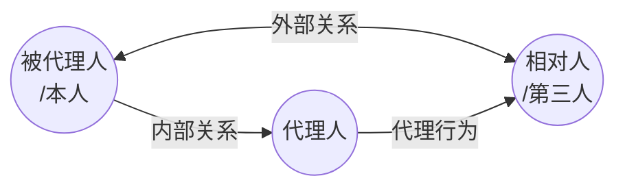

## 一、代理概述

### （一）概念

>[!cite] [[民法典#第一百六十二条]]
>代理人在代理权限内，以被代理人名义实施的民事法律行为，对被代理人发生效力。

### （二）功能

1. 扩大意思自治的范围（意定代理）
2. 弥补行为能力的不足（法定代理）

## 二、代理的分类

>[!cite] [[民法典#第一百六十三条]]
>代理包括委托代理和法定代理。
>委托代理人按照被代理人的委托行使代理权。法定代理人依照法律的规定行使代理权。

### （一）法定代理与意定代理
>产生基础不同

**法定代理**
- 依据法律规定直接取得代理权的代理。
- eg. 父母对未成年人的[[1. 自然人#1. 监护：概念与功能|监护]]；失踪人的财产代管人（[[1. 自然人#（一）宣告失踪|宣告失踪]]）

**意定代理**
- 代理人基于被代理人的授权行为而取得代理权所进行的代理。
	- *旅行社代游客订票*
	- *托人出租房屋*
	- *学校让老师去采购书*
	- *经纪人代歌手签订演出合同*
### （二）积极代理与消极代理
>主动发出还是被动受领意思表示

1. **积极代理**：代理人主动向第三人发出意思表示。
2. **消极代理**：代理人被动受领第三人向其发出的意思表示。

### （三）单独代理与共同代理
>代理人的人数不同

1. **单独代理**：代理人仅有一人的代理。
2. **共同代理**：代理人为两人以上的代理。

### （四）本代理与复代理
>由谁来选任代理人不同

1. **本代理**：被代理人亲自授权的或法律直接规定的代理人所进行的代理。
2. **复代理**：代理人为被代理人选任的其他人所进行的代理。

 ![[意定代理的构造.png]]
### （五）直接代理与间接代理
>是否以被代理人名义活动且法律效果直接归属于被代理人？

1. **直接代理**：代理人以被代理人的名义（显示被代理人的名字=显名）实施代理行为，法律效果直接归属于被代理人的代理。

2. **间接代理**：代理人以自己的名义（隐去被代理人的名字=隐名）实施法律行为，法律效果原则上先对代理人发生，然后再根据代理人与被代理人之间的内部关系间接归属于被代理人（例外《民法典》[[民法典#第九百二十五条|第925条]]）。

## 三、有权代理

### （一）有权代理的构成要件

#### 1. 行为能够被代理

- 事实行为不可被代理
- 准法律行为可以被代理

#### 2. 代理人发出自己的或者受领他人的意思表示

#### 3. 代理人以他人名义发出或受领他人的意思表示

#### 4. 代理人有代理权