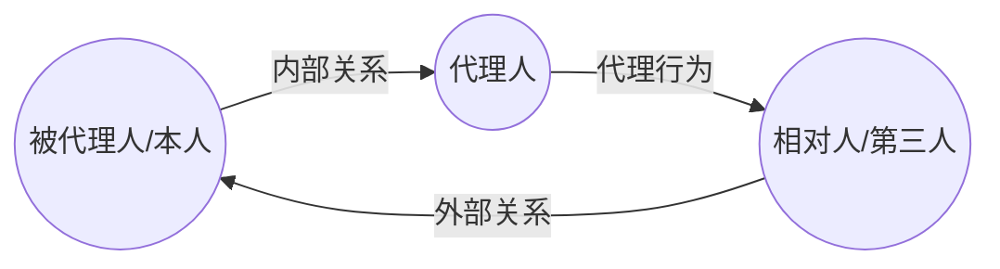
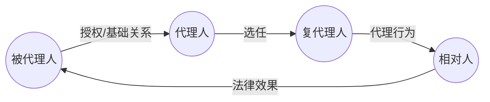
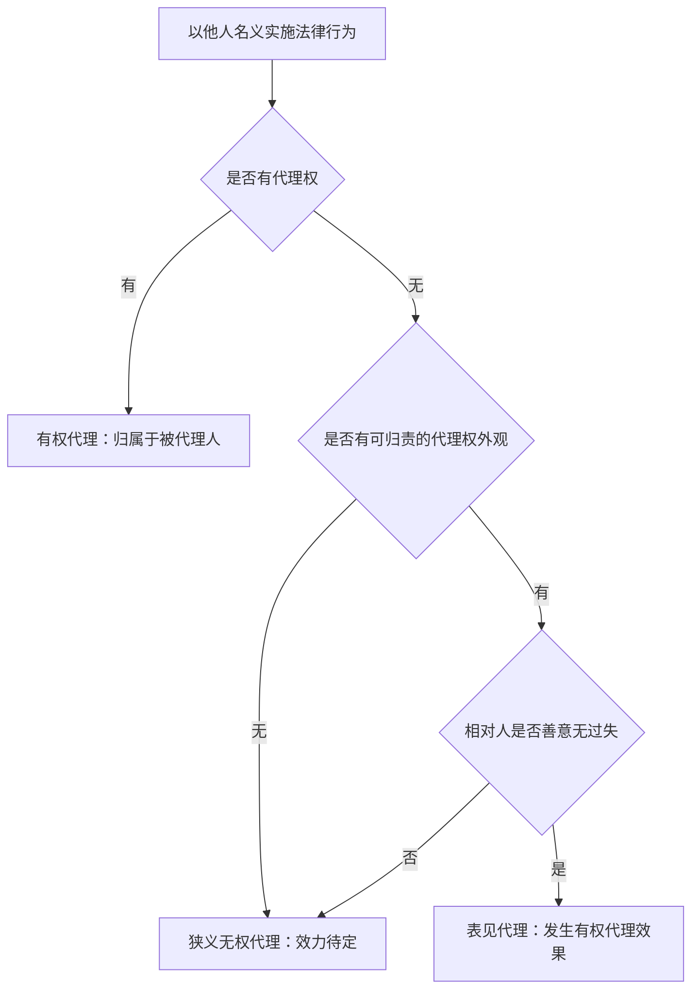

# 为他人实施法律行为：代理

代理是行为人以被代理人名义实施或受领意思表示，并使法律效果归属于被代理人的制度。其功能在于扩张意思自治的活动范围，并弥补行为能力不足。

---

## 一、代理制度概述

### （一）概念与特征

* 代理人在代理权限内，以被代理人名义实施的民事法律行为，对被代理人发生效力（《民法典》第162条）。
* 代理结构包括三组关系：
  * 被代理人与代理人之间的内部关系；
  * 代理人与相对人之间的代理行为；
  * 相对人与被代理人之间的外部关系。
* 代理的法律效果不是先归属于代理人再转移，而是直接归属于被代理人。

### （二）功能

1. 扩大意思自治的范围：本人无需亲自实施所有法律行为。
2. 弥补行为能力不足：法定代理使行为能力欠缺者可以参与民事活动。

### （三）代理的分类

| 分类 | 标准 | 类型与要点 |
| --- | --- | --- |
| 法定代理 / 意定代理 | 代理权产生基础 | 法定代理基于法律规定；意定代理基于授权行为 |
| 积极代理 / 消极代理 | 发出或受领意思表示 | 积极代理为发出意思表示；消极代理为受领意思表示 |
| 单独代理 / 共同代理 | 代理人人数 | 共同代理原则上须共同作出代理行为 |
| 本代理 / 复代理 | 代理人来源 | 复代理由代理人为本人选任复代理人 |
| 直接代理 / 间接代理 | 是否以本人名义、效果是否直接归属 | 总则编代理原则上为直接代理；委托合同中另有隐名、间接代理规则 |

> [!caution] “委托代理”的术语
> 《民法典》第163条使用“委托代理”，但从代理权来源看，“意定代理”更能概括授权行为取得代理权的结构；委托合同只是意定代理的常见基础关系之一。

---

## 二、有权代理

### （一）构成要件

1. 行为能够被代理。
   * 事实行为不可被代理，如先占、拾得遗失物、侵权行为、创作行为。
   * 准法律行为可以被代理，如催告、期限设置、瑕疵通知。
   * 法律行为原则上可以被代理，但法律规定、行为性质或当事人约定不得代理的除外。
2. 代理人发出自己的意思表示，或受领他人的意思表示。
3. 代理人以被代理人名义实施行为。
4. 代理人具有代理权。

### （二）代理与传达

| 比较对象 | 代理人 | 传达人/使者 |
| --- | --- | --- |
| 行为性质 | 形成或受领自己的意思表示 | 传递他人的意思表示 |
| 行为能力要求 | 意定代理人至少须为限制民事行为能力人 | 无民事行为能力人也可作为传达人 |
| 意思表示到达 | 到达代理人通常等于到达本人 | 到达传达人不当然等于到达本人 |
| 意思表示瑕疵 | 原则上看代理人的意思状态 | 错误告知、错误传达均可能构成错误 |

### （三）显名原则及其边界

* 直接代理以显名为原则，即代理人以被代理人名义实施法律行为。
* 显名既可以明示，也可以根据交易情境默示推知。
* 无需显名但仍发生效果归属的制度，不一定属于总则编意义上的直接代理，例如日常家事代理权、委托合同中的隐名代理规则。

### （四）代理权的授予

1. 法定代理权由法律直接授予。
2. 意定代理权基于授权行为产生。
   * 内部授权：本人向代理人授予代理权。
   * 外部授权：本人向相对人表示某人为其代理人。
3. 授权行为具有独立性：基础关系存在不当然等于代理权存在，基础关系无效也不当然导致授权行为无效。

> [!example] 授权行为与基础关系分离
> 员工与公司之间存在劳动合同，并不当然取得对外订货代理权；公司分配其负责订货事务，才可能构成独立的职务授权。

### （五）共同代理

* 共同代理是代理人为两人以上的代理。
* 积极代理中，原则上须数个共同代理人共同发出意思表示。
* 消极代理中，表意人向共同代理人之一作出意思表示，通常即可发生到达本人效果。
* 共同代理人之一擅自行使代理权，可能构成广义无权代理。

### （六）复代理

* 复代理是代理人为被代理人选任第三人，使第三人在代理权限内为代理行为。
* 复代理结构：被代理人—代理人—复代理人—相对人。
* 复代理人通常应以被代理人名义实施代理行为，行为效果直接归属于被代理人。
* 原则上，转委托须经被代理人同意或追认；紧急情况下为维护被代理人利益，可以例外转委托。
* 复代理权不得超过本代理权。

### （七）滥用代理权

滥用代理权不同于无权代理。无权代理是突破或欠缺代理权；滥用代理权是在授权范围内实施行为，但违反基础关系、忠实义务或利益冲突规则。

| 类型 | 规则 | 效果 |
| --- | --- | --- |
| 恶意串通型滥用代理权 | 代理人与相对人恶意串通，损害被代理人利益 | 代理行为无效；代理人与相对人承担连带责任 |
| 自己代理 | 代理人以被代理人名义与自己实施法律行为 | 原则禁止；被代理人同意、追认或纯获利益时例外 |
| 双方代理/多方代理 | 同一代理人同时代理双方或多方实施法律行为 | 原则禁止；被代理双方同意、追认或纯获利益时例外 |

### （八）代理权消灭

* 意定代理权消灭：代理期限届满或事务完成；被代理人取消委托或代理人辞去委托；代理人丧失民事行为能力；代理人或被代理人死亡；作为代理人或被代理人的法人、非法人组织终止等。
* 法定代理权消灭：被代理人取得或恢复完全民事行为能力；代理人丧失民事行为能力；代理人或被代理人死亡；法律规定的其他情形。

### （九）有权代理的法律效果

* 代理行为直接归属于被代理人。
* 代理行为的行为能力判断，原则上取决于代理人。
* 意思表示瑕疵的判断，原则上取决于代理人的意思状态；撤销权归属于被代理人。

---

## 三、广义无权代理

广义无权代理是行为人欠缺代理权而以他人名义实施法律行为的情形，包括狭义无权代理与表见代理。

### （一）狭义无权代理

#### 1. 构成要件

1. 行为人以被代理人名义实施法律行为。
2. 行为人欠缺代理权：
   * 从未有代理权；
   * 超越代理权；
   * 代理权终止后继续实施代理行为。
3. 不成立表见代理：相对人没有理由相信行为人有代理权，或者代理权外观不可归因于被代理人。

#### 2. 被代理人与相对人之间

* 被代理人享有追认权。
* 追认前，法律行为效力待定。
* 追认后，自始对被代理人发生效力。
* 拒绝追认或催告期间内未追认的，法律行为对被代理人不发生效力。

#### 3. 相对人的催告权与撤销权

* 相对人可以催告被代理人在30日内予以追认；未作表示的，视为拒绝追认。
* 善意相对人在被追认前有撤销权。
* 撤销须以通知方式作出。

#### 4. 无权代理人的责任

| 相对人状态 | 被代理人不追认时的效果 |
| --- | --- |
| 善意相对人 | 可以请求无权代理人履行债务，或请求赔偿损害；赔偿范围不得超过被代理人追认时相对人所能获得的利益 |
| 恶意相对人 | 相对人与无权代理人按各自过错承担责任 |

> [!caution] 狭义无权代理的定位
> 狭义无权代理并不当然无效，而是效力待定。只有被代理人拒绝追认或视为拒绝追认后，才确定不归属于被代理人。

### （二）表见代理

#### 1. 概念

表见代理是行为人虽无代理权，但因存在可归因于被代理人的代理权外观，善意无过失相对人有理由相信行为人具有代理权，法律为保护交易信赖而使其发生有权代理效果的制度。

#### 2. 构成要件

1. 行为人以被代理人名义实施法律行为。
2. 行为人欠缺代理权。
3. 行为人客观上具有代理权外观，如持有授权委托书、介绍信、合同专用章等。
4. 相对人善意且无过失。
5. 代理权外观可归因于被代理人。

> [!caution] 可归责性
> 公章、合同书、授权委托书被盗或遗失，通常不足以当然认定外观可归因于被代理人；被代理人未及时收回空白授权书、未通知相对人代理权终止，则更可能构成可归责外观。

#### 3. 法律效果

* 对被代理人：发生有权代理效果，法律行为归属于被代理人。
* 对相对人：相对人与被代理人之间成立民事法律关系。
* 对行为人：有基础关系的，可能向被代理人承担违约责任；无基础关系的，可能承担侵权责任或其他责任。

### （三）狭义无权代理与表见代理

| 比较对象 | 狭义无权代理 | 表见代理 |
| --- | --- | --- |
| 共同点 | 行为人均欠缺代理权，且以他人名义实施法律行为 | 行为人均欠缺代理权，且以他人名义实施法律行为 |
| 相对人信赖 | 无合理信赖，或外观不可归因于本人 | 善意无过失，且有合理信赖 |
| 外观归责 | 不可归因于被代理人，或不足以形成表见代理 | 可归因于被代理人 |
| 效力状态 | 效力待定，取决于被代理人追认 | 直接发生有权代理效果 |
| 主要救济 | 被代理人不追认时，相对人向无权代理人主张责任 | 相对人可要求被代理人承担合同效果 |

