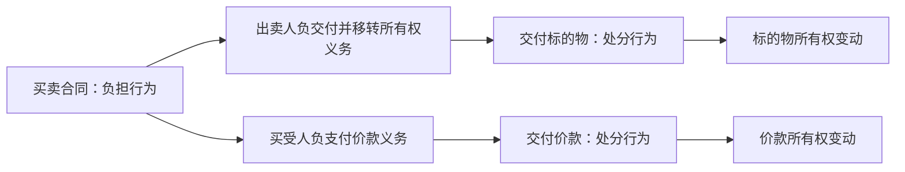

# 区分原则：负担行为与处分行为

区分原则是将“设定债权债务的行为”与“直接发生权利变动的行为”分开判断的法律行为理论。买卖合同是否有效，与所有权是否已经转移，不是同一个问题。

---

## 一、负担行为

* 负担行为又称债权行为，是使当事人负担给付义务、取得请求权的法律行为。
* 典型例子是买卖合同：
  * 出卖人负有交付标的物并转移所有权的义务；
  * 买受人负有支付价款的义务。
* 负担行为本身通常不直接导致物权变动。

> [!example] 买卖合同
> 甲与乙订立羽绒服买卖合同后，乙取得请求甲交付羽绒服的债权，甲取得请求乙支付价款的债权；羽绒服所有权是否转移，还要看后续处分行为是否完成。

---

## 二、处分行为

* 处分行为是直接使既有权利发生变动的行为，包括权利的移转、设定、变更或消灭。
* 动产所有权转移通常需要处分合意与交付；不动产物权变动通常还涉及登记规则。
* 抛弃所有权、债权让与、物权设定等也属于处分意义上的权利变动行为。

| 行为 | 法律功能 | 示例 |
| --- | --- | --- |
| 负担行为 | 产生债权债务 | 买卖合同、租赁合同、赠与合同 |
| 处分行为 | 直接发生权利变动 | 交付动产、办理不动产登记、债权让与、抛弃所有权 |

---

## 三、区分原则的意义

1. 分别判断成立与效力：买卖合同有效，不当然意味着所有权已经转移；所有权转移完成，也不当然排除原因行为存在瑕疵。
2. 解释返还关系：原因行为无效、被撤销或解除后，已经完成的给付通常通过返还、不当得利或合同清算规则处理。
3. 连接物权法规则：动产交付、不动产登记、处分权等规则，主要作用于处分行为层面。

---

## 四、常见误区

> [!caution] 合同成立不等于物权变动
> 合同成立主要产生债权债务；所有权是否移转，还要判断交付、登记、处分权等物权变动要件。

> [!caution] 原因行为瑕疵不等于处分行为当然无效
> 在承认区分原则的分析框架中，原因行为与处分行为应分别评价；原因行为无效或被撤销后的财产返还，通常另由返还规则处理。

> [!tip] 区分抓手
> “承诺以后要给”通常是负担行为；“现在直接让权利变动”通常是处分行为。
