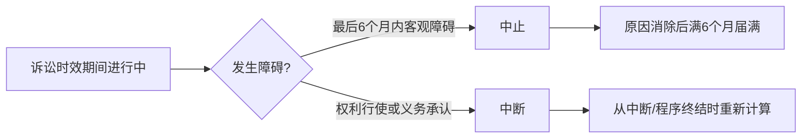

# 诉讼时效

诉讼时效是权利人在一定期间内不行使请求权，期间届满后义务人取得拒绝履行抗辩权的制度。我国现行法以抗辩权发生说为基本理解：时效届满不消灭债权本身，而是使义务人取得时效抗辩权。

---

## 一、时效制度概述

### （一）时效的概念与类型

* 时效是一定事实状态持续一定期间后，在法律上产生特定效果的制度。
* 时效可分为：
  * 取得时效：占有他人之物的事实状态持续经过法定期间后取得权利；我国民法典未一般规定取得时效。
  * 消灭时效/诉讼时效：权利人在期间内不行使权利，期间届满后义务人取得拒绝履行抗辩权。

### （二）制度功能

1. 督促权利人及时行使权利。
2. 维护交易秩序和法律关系稳定。
3. 避免时间过久导致举证困难。

### （三）规范性质

* 诉讼时效的期间、计算方法、中止和中断事由由法律规定，当事人约定无效（《民法典》第197条）。
* 当事人预先放弃诉讼时效利益无效；时效期间届满后的放弃可以发生效力。

---

## 二、诉讼时效的适用对象

### （一）原则：主要适用于请求权

诉讼时效原则上适用于请求权，尤其是债权请求权。

| 类型 | 示例 |
| --- | --- |
| 合同请求权 | 履行请求权、违约损害赔偿请求权 |
| 无因管理请求权 | 管理人请求偿还必要费用等 |
| 不当得利请求权 | 返还不当利益请求权 |
| 侵权损害赔偿请求权 | 财产损害赔偿、精神损害赔偿 |

### （二）不适用诉讼时效的请求权

依据《民法典》第196条，下列请求权不适用诉讼时效：

1. 请求停止侵害、排除妨碍、消除危险。
2. 不动产物权和登记的动产物权的权利人请求返还财产。
3. 请求支付抚养费、赡养费或者扶养费。
4. 依法不适用诉讼时效的其他请求权。

《诉讼时效规定》第1条还排除若干债权请求权的时效抗辩，例如支付存款本金及利息、兑付国债金融债券及向不特定对象发行的企业债券本息、基于投资关系产生的缴付出资请求权等。

> [!caution] 适用对象的判断
> 形成权通常不适用诉讼时效，而受除斥期间控制；支配权本身也不适用诉讼时效，但部分保护请求权是否适用，须结合法条具体判断。

---

## 三、诉讼时效期间的类型及计算

### （一）短期诉讼时效期间

* 普通诉讼时效期间为3年（《民法典》第188条第1款）。
* 特殊诉讼时效期间依特别法规定，例如人寿保险合同给付保险金请求权的期间为5年。
* 短期诉讼时效期间可发生中止、中断，但不得由当事人约定延长或缩短。

### （二）最长诉讼时效期间

* 最长诉讼时效期间为20年，自权利受到损害之日起计算（《民法典》第188条第2款）。
* 最长诉讼时效期间不发生中止、中断，但在特殊情况下可由人民法院根据权利人申请决定延长。

### （三）起算点

| 期间 | 起算标准 | 要点 |
| --- | --- | --- |
| 普通/短期诉讼时效 | 主观标准 | 自权利人知道或者应当知道权利受到损害以及义务人之日起计算 |
| 最长诉讼时效 | 客观标准 | 自权利受到损害之日起计算 |

特殊起算规则：

1. 分期履行债务：自最后一期履行期限届满之日起计算（《民法典》第189条）。
2. 未约定履行期限且不能确定履行期限的合同：原则上自宽限期届满之日起计算；债务人明确拒绝履行的，自明确表示不履行之日起计算。
3. 合同被撤销后的返还或赔偿请求权：自合同被撤销之日起计算。
4. 无民事行为能力人、限制民事行为能力人受第三人侵害：自其法定代理人知道或应当知道权利受损及义务人之日起计算；法律另有规定除外。
5. 对法定代理人的请求权：自法定代理终止之日起计算（《民法典》第190条）。
6. 未成年人遭受性侵害的损害赔偿请求权：自受害人年满18周岁之日起计算（《民法典》第191条）。

> [!tip] 双重期间关系
> 短期诉讼时效与最长诉讼时效只要有一个届满，即发生诉讼时效期间经过的效果。

---

## 四、诉讼时效期间经过的效力

### （一）对义务人的效力

* 义务人取得拒绝履行的永久抗辩权。
* 法院不得主动适用诉讼时效，也不得主动释明诉讼时效问题（《民法典》第193条）。
* 时效抗辩原则上应在一审期间提出；有新证据等例外情形时，二审中也可能提出。

### （二）时效利益的放弃

* 预先放弃无效。
* 诉讼时效期间届满后，义务人可明示或默示放弃时效抗辩。
* 自愿履行后，不得以诉讼时效期间届满为由请求返还。
* 作出同意履行义务的意思表示、制定清偿计划、提供担保、请求延期履行等，均可能构成放弃或承认。

### （三）对权利人的效力

* 实体权利本身不消灭。
* 请求权仍存在，但可行使性受到时效抗辩限制。
* 债权人的受领权、处分权原则上仍存在；抵销权、保全权等可能受特别规则限制。

---

## 五、诉讼时效的中止

### （一）概念

诉讼时效中止，是在诉讼时效期间届满前6个月内，因法定障碍导致权利人不能行使请求权，时效期间停止计算；障碍消除后，自原因消除之日起满6个月，诉讼时效期间届满。

### （二）构成要件

1. 发生法定中止事由。
2. 中止事由导致权利人不能行使请求权。
3. 中止事由发生在诉讼时效期间的最后6个月内。

### （三）法定事由

《民法典》第194条列举：

1. 不可抗力。
2. 无民事行为能力人、限制民事行为能力人没有法定代理人，或者法定代理人死亡、丧失民事行为能力、丧失代理权。
3. 继承开始后未确定继承人或者遗产管理人。
4. 权利人被义务人或者其他人控制。
5. 其他导致权利人不能行使请求权的障碍。

### （四）法律效果

* 短期诉讼时效：自中止原因消除之日起满6个月，诉讼时效期间届满。
* 最长诉讼时效：不适用中止规则。

---

## 六、诉讼时效的中断

### （一）概念

诉讼时效中断，是在诉讼时效期间进行中，因权利人积极行使请求权或义务人同意履行义务等法定事由，使已经经过的期间归于无效，并从中断、有关程序终结时起重新计算诉讼时效期间。

### （二）构成要件

1. 发生法定中断事由。
2. 中断事由发生在诉讼时效期间进行中。

### （三）法定事由

《民法典》第195条列举：

1. 权利人向义务人提出履行请求。
2. 义务人同意履行义务。
3. 权利人提起诉讼或者申请仲裁。
4. 与提起诉讼或者申请仲裁具有同等效力的其他情形。

### （四）法律效果

* 短期诉讼时效：从中断、有关程序终结时起重新计算。
* 最长诉讼时效：不适用中断规则。
* 特殊规则包括部分债权主张、部分履行、连带债权债务、代位权诉讼、债权让与通知等，通常在债法中展开。

---

## 七、中止与中断的比较

| 比较对象 | 中止 | 中断 |
| --- | --- | --- |
| 性质 | 时效进行过程中的障碍 | 时效进行过程中的障碍 |
| 典型事由 | 客观障碍，如不可抗力、无法定代理人 | 权利行使或义务承认，如催告、起诉、同意履行 |
| 发生阶段 | 最后6个月内 | 时效期间进行中的任何时候 |
| 法律效果 | 暂停后继续计算，原因消除后满6个月届满 | 已经过期间归零，重新计算 |
| 适用对象 | 短期诉讼时效 | 短期诉讼时效 |

