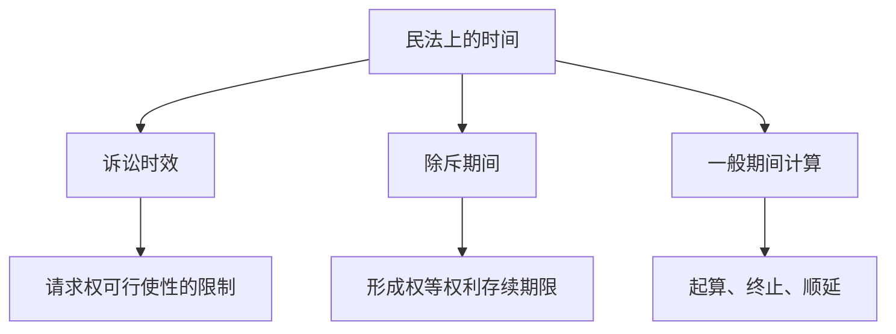

# 期间的计算

期间是民法中以时间经过控制权利义务发生、变动、消灭或履行的制度工具。总则编的期间计算规则为一般规则；诉讼时效、除斥期间和具体履行期限还须结合特别规定判断。

---

## 一、期间在民法上的意义

1. 引起民事法律关系的产生、变更或消灭。
2. 决定民事权利的存续期限。
3. 作为权利、义务的履行期限。

---

## 二、期间的类型

### （一）可变期间与不变期间

| 类型 | 含义 | 典型例子 |
| --- | --- | --- |
| 可变期间 | 可发生中止、中断、延长等变化 | 诉讼时效期间 |
| 不变期间 | 原则上不发生中止、中断、延长 | 除斥期间 |

### （二）诉讼时效期间与除斥期间

| 比较对象 | 诉讼时效期间 | 除斥期间 |
| --- | --- | --- |
| 期间性质 | 可变期间 | 不变期间 |
| 适用对象 | 主要适用于请求权 | 通常适用于形成权，也包括某些请求权 |
| 期间经过效果 | 义务人取得时效抗辩权 | 权利本身消灭 |
| 法院援引 | 不得主动适用 | 应依职权审查 |
| 利益放弃 | 届满后可放弃时效利益 | 不存在放弃抗辩的问题 |
| 制度目的 | 促使权利人及时行使权利、稳定新关系 | 维护既有法律关系稳定 |

---

## 三、除斥期间

### （一）概念

除斥期间是法律规定或者当事人约定的形成权和某些请求权存续的有效期间。期间经过后，权利消灭（《民法典》第199条）。

### （二）常见类型

| 条文/制度 | 期间 | 起算点或说明 |
| --- | --- | --- |
| 重大误解撤销权 | 90日 | 自知道或应当知道撤销事由之日起 |
| 欺诈撤销权 | 1年 | 自知道或应当知道欺诈事由之日起 |
| 胁迫撤销权 | 1年 | 自胁迫行为终止之日起 |
| 显失公平撤销权 | 1年 | 自知道或应当知道撤销事由之日起 |
| 撤销权最长期间 | 5年 | 自民事法律行为发生之日起 |
| 占有人返还原物请求权 | 1年 | 自侵占发生之日起，超过期间未行使的消灭 |
| 买受人检验通知相关期间 | 依合同编具体规则 | 多与质量瑕疵通知、检验期间衔接 |
| 保证期间 | 一般6个月 | 债法课程展开 |

> [!caution] 撤销权期间
> 撤销权的短期期间与5年长期期间并行。只要长期除斥期间届满，即使权利人刚知道撤销事由，撤销权也消灭。

---

## 四、期间计算的具体规则

### （一）期间开始

* 按小时计算期间的，自法律规定或者当事人约定的时间开始计算（《民法典》第201条第2款）。
* 按年、月、日计算期间的，开始的当日不计入，自下一日开始计算（《民法典》第201条第1款）。

### （二）期间终结

* 按日计算的期间，到最后一日24时终止；有业务时间的，到停止业务活动的时间终止（《民法典》第203条第2款）。
* 按星期、月、季度、年计算的期间，按照对应日确定；没有对应日的，月末日为期间最后一日（《民法典》第202条）。

### （三）期间顺延

* 期间的最后一日是法定休假日的，以法定休假日结束的次日为期间最后一日（《民法典》第203条第1款）。
* 业务活动时间截止早于24时的，以停止业务活动的时间为期间终点。

---

## 五、计算示例

| 情形 | 计算方式 | 结论 |
| --- | --- | --- |
| 2026年5月1日通知，期间为10日 | 5月1日不计入，自5月2日起算 | 通常至5月11日届满；遇法定休假日按规则顺延 |
| 2026年1月31日起1个月 | 按月计算，无对应日时取月末日 | 2月末日届满 |
| 按小时计算的2小时期间 | 自约定时刻直接计算 | 不适用“次日起算”规则 |
| 最后一日为法定休假日 | 顺延至休假日结束的次日 | 期间不在休假日终止 |

---

## 六、体系位置

> [!tip] 判断顺序
> 先判断该期间是诉讼时效、除斥期间还是普通履行期间；再判断起算点；最后适用终止和顺延规则。
