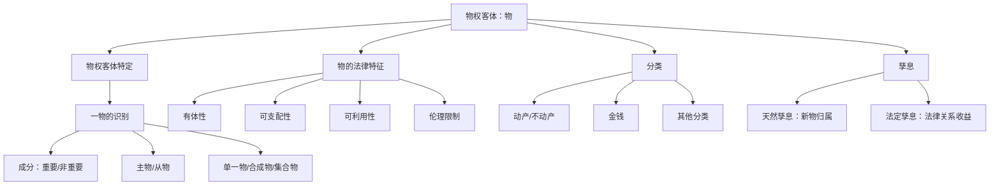

> [!note] 来源
> 《物权法》课件（2025）第二章；刘家安：《民法物权》，中国政法大学出版社 2023 年版第二章。  
> 本章的核心不在背诵“物”的抽象定义，而在把 `物权客体特定`、`一物的识别`、`成分/从物/孳息` 与 `动产不动产区分` 串成同一套客体判断规则。

## 一、物作为物权客体

### （一）物权的客体原则上为物

物权系以“物”为其客体，体现权利人对特定物的控制与支配关系。就所有权而言，客体必须是不动产或者动产，不存在“所有权以权利为客体”的技术意义。

> [!cite] [[民法典#第一百一十五条|民法典第115条]]
> 物包括不动产和动产。法律规定权利作为物权客体的，依照其规定。

- [[V 所有权|所有权]]：总是以有体之物为客体。
- [[VI 用益物权|用益物权]]：原则上以不动产为核心客体，也可能涉及动产。
- [[VII 担保物权|担保物权]]：因具有价值权属性，法律可允许权利作为客体。
	- 抵押权客体：可包括建设用地使用权、海域使用权等权利。
	- 权利质权：可包括债权、股权、知识产权中的财产权等。

> [!caution] “归我所有”不等于物权法上的所有权
> “债权归我所有”“著作权归我所有”只是日常语言中的归属表达，并不意味着债权、著作权成为所有权客体。技术意义上的所有权仍以有体物为客体。

### （二）物权客体特定原则

物权的客体须为**特定的一物**。物权直接支配标的物，若客体边界不明，权利支配、排他效力、交易公示和物权保护都无法展开。

> [!tip] 物权客体特定
> 物权客体特定 = `边界确定` + `经济/功能上的一物` + `可识别的支配对象`。

1. **物权须成立于经济上、功能上完整的一物之上**
	- 机动车构成功能上的“一物”，所有权存在于整个机动车上，而非分别存在于发动机、车身、轮胎之上。
	- 车辆解体后，仍有独立利用价值的零部件因分离而成为新的独立物。
2. **原则上有多少独立之物，就有多少物权**
	- 一整套 12 张生肖邮票并非一个所有权客体，而是在每张邮票上分别存在所有权。
	- 羊群、粮食堆、图书馆藏书可以成为交易标的，但物权仍原则上落实到各个独立物。
3. **客体特定服务于物权变动**
	- 债权行为可约定“交付羊群中的 10 只羊”。
	- 所有权移转等处分行为须最终指向具体确定的 10 只羊。

> [!caution] 特定之物 ≠ 特定物
> “特定之物”是物权客体特定原则中的客体边界要求；“特定物/种类物”是债法上给付标的的分类。种类物经特定化后也可以成为物权变动的客体。

### （三）物权客体特定的缓和

客体特定原则并非绝对僵硬规则。担保物权尤其是不移转占有的担保，可能在设立时以概括描述确定客体，只要在实现权利时可得确定并有适当公示。

- **浮动抵押**：以企业、个体工商户、农业生产经营者现有及将有的生产设备、原材料、半成品、产品为客体。
- 其特殊性在于客体具有流动性，但《民法典》第411条规定了抵押财产确定机制。
- 因此，浮动抵押可理解为客体“可得确定”，而非完全否定物权客体特定。

---
## 二、物的概念与法律特征

### （一）物的概念

民法上的物，系指**除人的身体外，能够为人力所支配，并能满足人类社会生活需要的有体物**。

- 《民法典》第115条只列明“不动产和动产”，没有直接给出物的定义。
- 民法上的“物”不同于自然科学或哲学意义上的“物质”。
- 物是权利客体，定义目的在于判断某对象能否成为民事归属、利用和交易秩序的对象。

> [!question] 日月星辰是不是物
> 日月星辰是物理学意义上的物，但在现行法律秩序下不能为人力支配，也不能成为民事权利客体，故不是民法上的物。

### （二）有体性

有体物是占据一定空间而有形存在的物质实体。物权法以有体物为物的基本形态，原因在于物权体系以所有权为核心，而所有权观念与占有、管领事实紧密相连。

- 权利、数据、网络虚拟财产虽可能具有财产价值，但不当然属于物权法上的“物”。
- 将债权、知识产权等无体利益直接纳入“物”，会导致“对债权享有所有权”等体系混乱。
- 网络虚拟财产、数据可受法律保护，但其保护路径不必当然进入物权体系。

> [!tip] 有体性的例外或类推
> 液体、气体在被容器装盛或被禁锢于一定空间时，可以成为物。电能、热能、光能等自然力虽非典型有体物，但在可存储、可输送、可控制且有经济价值时，可视为民法上的物并类推适用动产规则。

### （三）可支配性

物必须能够为人力控制和支配。凡人力不能支配者，即使客观存在，也不能成为物权客体。

- 自然喷涌之泉不是物；装瓶之后的水可以成为物。
- 外层空间、月球等即使将来技术上可接近，也受国际法限制，不当然可成为民事物权客体。
- 公海、南极大陆等也涉及法律是否允许支配的问题。

### （四）可利用性

物须能够满足人的物质利益或精神利益，通常表现为经济价值。其基础是稀缺性：因稀缺而产生冲突，因冲突而需要定分止争。

- 空气、阳光、海水通常不作为私法上的物权客体，因为不具有排他归属的必要。
- 不要求具有客观市场价值；只要对特定主体具有精神或纪念意义，也可能成为民法上的物。
	- eg.`一张对特定人具有纪念意义的老照片`

### （五）伦理考量

法律界定“物”并非纯粹自然科学判断，还受伦理和公序良俗影响。

- 人之活体不构成物：人的身体是主体人格的组成，不是权利客体。
- 遗体通常不作为一般物对待，也不属于普通继承财产。
- 脱离人体的器官、组织、胚胎等，须结合生命伦理、人格利益和特别法限制判断。

> [!example] 冷冻胚胎案
> 冷冻胚胎处于人与物之间的特殊状态，不能按一般物任意买卖、赠与或继承；但权利人对其可能享有监管、处置等受限制的利益。该案说明“是否为物”不是单纯物理判断，而是规范评价。

> [!question] 动物是不是物
> 动物在民法上通常仍作为权利客体处理，但因生命伦理和动物保护规则，所有权人的支配受到更多公法和公序良俗限制。德国民法典所谓“动物非物”主要是强调特别保护，并非将动物人格化。

---
## 三、物的构成

### （一）物的成分

物的成分，是指物的构成部分。成分问题只对组合物有意义，其核心功能在于界定物权客体边界和返还请求的可能性。

### （二）重要成分

重要成分，是指非经毁损不能分离，或者分离将耗费过高成本之物的构成成分。判断标准是**不可分离性**，而非该部分在功能上是否重要。

- 重要成分不得单独成为物权客体。
- 独立的 A 物一旦与 B 物结合并成为 B 的重要成分，A 在法律上消灭。
- 该规则通常进入添附问题：法律为维护整体物经济价值，避免因返还而强行毁损整体物。

> [!example] 偷木料建房
> 甲盗取乙木料作为房屋栋梁。木料与房屋结合后若非经毁损不能分离，木料成为房屋的重要成分，乙通常不能请求返还木料本身，而应转向损害赔偿或添附规则下的利益调整。

### （三）非重要成分（一般成分）

非重要成分，是指可从物中分离并独立存在，且分离不毁坏整体物、不明显减损价值或不耗费过高成本的部分。

- 非重要成分在结合于整体物期间，也不单独作为物权客体。
- 分离后可重新成为独立物权客体。
- 他人之物成为整体物的一般成分时，通常不发生添附；分离后仍可能请求原物返还。

> [!example] 偷轮胎装车
> 轮胎通常属于汽车的一般成分。若乙的轮胎被甲装到汽车上，乙在轮胎可分离且不造成过高损害时，仍可能请求返还该轮胎。

### （四）房地关系

从物之成分视角观察，房地关系有两种基本处理方式：

| 模式 | 处理 | 后果 |
| --- | --- | --- |
| 房地一体主义 | 建筑物、附着物构成土地的重要成分 | 建筑物随土地归属，适用附合规则 |
| 房地分离主义 | 土地与地上建筑物在法律上分离 | 建筑物可成为独立不动产客体 |

我国采土地公有制，建筑物又可以私有，故总体上采房地分离主义。但房屋所有权仍需有占用土地的用益权基础，如建设用地使用权、宅基地使用权。

---
## 四、主物与从物

### （一）概念

主物与从物都是独立之物，并非整体与组成部分的关系。

1. **主物**：在经济功能上起主导地位，并可独立发挥效用的物。
2. **从物**：不构成主物成分，但经常性地辅助主物发挥效用的物。

从物的识别通常依一般交易观念判断，而非存在脱离交易语境的固定标准。

### （二）从物的识别要素

- 从物须是独立的一物，不是主物的组成部分。
- 从物须经常性地服务、辅助主物，增强主物利用便利。
- 从物与主物之间通常存在一定空间或使用联系。
- 从物是否必须与主物同属一人，取决于所讨论的法律效果；若分别归属不同主体，主物处分原则上不能当然处分他人之物。
- 从物原则上以动产为典型，但实务中某些辅助性建筑物、附属设施也可能被功能性地作为从物处理。

> [!example] 识别例
> 遥控器相对于电视机、备用轮胎相对于汽车、马鞍相对于马，是否构成从物，均须结合交易观念、使用关系和当事人约定判断。

### （三）主从物区分的法律意义

> [!cite] [[民法典#第三百二十条|民法典第320条]]
> 主物转让的，从物随主物转让，但是当事人另有约定的除外。

1. **任意性规范**
	- 当事人可约定从物不随主物转让。
	- 若无约定，则依主从物规则填补交易内容。
2. **债权效力**
	- 负担主物移转义务者，原则上也负担从物移转义务。
	- 此种理解最能说明第320条的交易补充功能。
3. **物权效力**
	- 主物发生物权变动时，从物是否自动移转，存在解释上的限缩必要。
	- 从物毕竟仍有独立性，原则上仍可成为独立处分对象。
4. **担保效力**
	- 抵押权、质权等在一定条件下可及于从物。
	- 《担保制度解释》第40条区分抵押权设立前后产生的从物：设立前从物原则上及于抵押权；设立后从物原则上不及于抵押权，但实现抵押权时可一并处分。

> [!caution] 主从物不是成分关系
> 从物是独立物；成分不是独立物权客体。电视遥控器可能是从物，电视内部芯片则是成分。

---
## 五、孳息

孳息，是由原物产生的收益，包括天然孳息和法定孳息。

### （一）天然孳息

天然孳息，是依物的自然属性或使用方法而产生的收获物、出产物。

- 与原物分离前，天然孳息通常是原物的重要成分。
- 分离后，天然孳息成为独立于原物的新物，可以成为权利客体。
- 并非原物中产生的一切都是孳息；须通常、定期或常规地产出，且原物不因此明显毁损或减少价值。

| 情形 | 是否为天然孳息 | 理由 |
| --- | --- | --- |
| 果树果实 | 是 | 依自然属性常规产出 |
| 土地生长的牧草 | 是 | 土地使用收益 |
| 大风吹断的树枝 | 否 | 非常规收益 |
| 土地中开采的矿石 | 否 | 原物价值被减少，不是常规产出 |

> [!cite] [[民法典#第三百二十一条-第1款|民法典第321条第1款]]
> 天然孳息，由所有权人取得；既有所有权人又有用益物权人的，由用益物权人取得。当事人另有约定的，按照其约定。

天然孳息归属规则：

1. 原则归原物所有权人。
2. 既有所有权人又有用益物权人时，由用益物权人取得。
3. 当事人另有约定的，从其约定。
4. 买卖合同中，标的物交付前产生的孳息归出卖人，交付后产生的孳息归买受人。

> [!caution] 所有权保留买卖中的孳息
> 买受人虽未取得所有权，但标的物交付后通常已取得使用收益地位，交付后产生的孳息原则上归买受人。此处不能机械套用“所有权人取得孳息”。

### （二）法定孳息

法定孳息，是原物依一定法律关系而产生的收益，典型如租金、利息。

> [!cite] [[民法典#第三百二十一条-第2款|民法典第321条第2款]]
> 法定孳息，当事人有约定的，按照约定取得；没有约定或者约定不明确的，按照交易习惯取得。

- 法定孳息主要表现为金钱。
- 其并非自然产生的新物，而是法律关系中的给付利益。
- “法定孳息”更准确地说是“法律上的孳息”，其基础常常是租赁、借贷等意定关系。

### （三）孳息规则的适用提示

- 用益物权人享有收益权，故通常取得天然孳息。
- 质权人、留置权人可依法收取质押财产、留置财产的孳息，但孳息应先充抵收取孳息的费用。
- 无权占有人返还原物时，孳息返还问题进入“回复请求权人—占有人关系”。

> [!tip] 天然孳息与法定孳息的区别
> 天然孳息解决“新物归谁”；法定孳息解决“基于法律关系发生的收益给谁”。二者都叫孳息，但法律构造并不相同。

---
## 六、单一物、合成物与集合物

### （一）单一物

单一物，是形态上自成一体且构成部分已失去个性的物。

- eg.`一匹马、一只电灯泡、一个水杯`
- 单一物通常不再需要识别成分。
- 原则上不存在部分分离后重新成为独立物的问题。

### （二）合成物

合成物，是由数个单一物结合成一体的物。

- eg.`由发动机、轮胎、轴承等组合成的汽车`
- 合成物在交易观念上是一物。
- 构成成分并未完全丧失个性，分离后仍可成为独立物。

### （三）集合物

集合物，是多个单一物或合成物为共同目的集合而成的聚合体。

| 类型 | 含义 | 例 |
| --- | --- | --- |
| 事实上的集合物 | 同质或相近物为共同目的集合 | 羊群、成套藏书、库存商品 |
| 法律上的集合物 | 不同性质财产为共同目的集合 | 企业、遗产、责任财产 |

集合物可以作为交易对象，但原则上不是物权法意义上的单一物。

- 羊群可整体买卖，但所有权仍存在于每一只羊上。
- 企业可被转让，但企业财产包括动产、不动产、债权、知识产权、债务等，不可能成为一个普通所有权客体。
- 浮动抵押是我国法上最接近“以集合物为客体”的担保制度，但其仍通过抵押财产确定规则回到可识别客体。

> [!caution] 集合物的审查次序
> 交易层面可整体看；物权变动层面须拆到构成物。集合物概念不能取代物权客体特定原则。

---
## 七、不动产与动产

### （一）区分标准

不动产与动产是物权法上最重要的物的分类。《民法典》第115条确认二分，但未作定义。通常以物是否能够移动，以及移动是否损害其价值为标准。

- **不动产**：性质上不能移动，或虽可移动但移动会严重损害价值的物。
- **动产**：能够移动且不因移动损害其价值的物。

现行有效规范中，《不动产登记暂行条例》第2条第2款将不动产界定为土地、海域以及房屋、林木等定着物。

### （二）不动产中的“一物”

不动产的“一物”识别比动产复杂，通常须依登记单元、权属界线和独立使用价值确定。

- **土地**：需通过人为划界形成权属界线封闭的地块。
- **宗地/不动产单元**：不动产登记中的基本单位，强调权属界线封闭并具有独立使用价值。
- **房屋等建筑物**：我国法上可独立于土地成为不动产物权客体。
- **矿藏**：埋藏于土地中时具有不动产属性，但我国法明确其属于国家所有；开采出来的矿石、原油、天然气等成为动产。
- **海域**：法律上作为不动产登记对象，海域使用权与建设用地使用权具有相似的权利属性。

### （三）动产的特殊类型

- 机动车、船舶、航空器本质上是动产，但因登记公示可能性强，常被称为“准不动产”。
- 电能、热能等自然力可支配、可利用时，类推适用动产规则。
- 活动板房、轻型可拆卸轨道等若未长期稳定附着于土地且未纳入不动产登记，以认定为动产为宜。
- 某些未纳入登记的不动产，在涉及物权变动时可能需借用动产物权变动规则处理。

### （四）分类意义

| 维度 | 不动产 | 动产 |
| --- | --- | --- |
| 公示方法 | 登记 | 占有、交付 |
| 物权变动要件 | 原则上登记生效 | 原则上交付生效 |
| 典型物权 | 土地承包经营权、建设用地使用权、居住权、地役权、不动产抵押权 | 动产所有权、动产质权、留置权、动产抵押权 |
| 交易风险控制 | 登记簿查询 | 占有外观与交付 |

> [!tip] 区分的真正基础
> 不动产与动产不再必然对应“重要财产/普通财产”的价值差异；其物权法意义主要在于公示方法和变动规则不同。

---
## 八、作为物的金钱

金钱是否为物，须区分有体货币与账户存款。

### （一）现金

纸币、硬币具有有体性，可被占有，原则上可成为物权客体。

- 物权客体特定仍然适用：所有权落实在每一张纸币、每一枚硬币上。
- 金钱作为一般等价物，高度可替代，混合后通常难以再维持个别所有权识别。
- “金钱占有即所有”并非严格概念，而是对金钱高度流通性、可替代性和混合效果的概括。

### （二）银行账户中的钱

银行账户余额不是储户对特定现金的所有权，而是储户对银行享有的还本付息债权。

- 存入银行的现金所有权转归银行。
- 储户取得对银行的债权请求权。
- 银行保险箱保管现金不同：现金作为寄存物，所有权不因保管而转移。

### （三）数字货币

数字货币须区分法定数字货币、平台记账利益和加密资产等不同对象。判断重点仍是：

- 是否有法定货币地位；
- 是否能作为特定财产利益归属；
- 是否具有可支配性、排他性和可公示的交易结构；
- 是否应适用物权规则，或仅适用债权、数据、网络虚拟财产保护规则。

---
## 九、其他几组物的分类

### （一）可分物与不可分物

- **可分物**：分割后不改变性质、不显著减损价值的物。
- **不可分物**：分割会改变性质、毁损价值或使用途不能实现的物。
- 主要意义在共有物分割、债的履行和损害赔偿方式选择。

### （二）特定物与种类物

- **特定物**：以个别特征确定的物。
- **种类物**：以种类、品质、数量确定的物。
- 主要意义在债法给付、风险负担、履行不能等问题。

> [!caution] 与物权客体特定的关系
> 物权变动最终必须指向特定之物；种类物在特定化前可作为债权给付标的，但不能直接承载具体物权变动。

### （三）消耗物与非消耗物

- **消耗物**：依通常使用方法会消耗其本体或处分其经济价值的物，如粮食、燃料、现金。
- **非消耗物**：通常使用不消耗其本体的物，如房屋、车辆、机器。
- 主要意义在借贷、租赁、使用收益和返还义务。

### （四）流通物、限制流通物与禁止流通物

- **流通物**：可自由进入交易。
- **限制流通物**：须满足特定资格、审批或用途限制方可交易。
- **禁止流通物**：依法不得作为交易对象。

该分类不改变对象作为“物”的可能性，但决定其能否交易、如何交易以及法律行为效力。

---
## 十、章节抓手

> [!tip] 一句话压缩
> “物”不是自然科学概念，而是能够承载归属、支配、公示和交易秩序的民法客体；本章所有分类最终都服务于物权客体边界、物权变动规则和收益归属判断。
