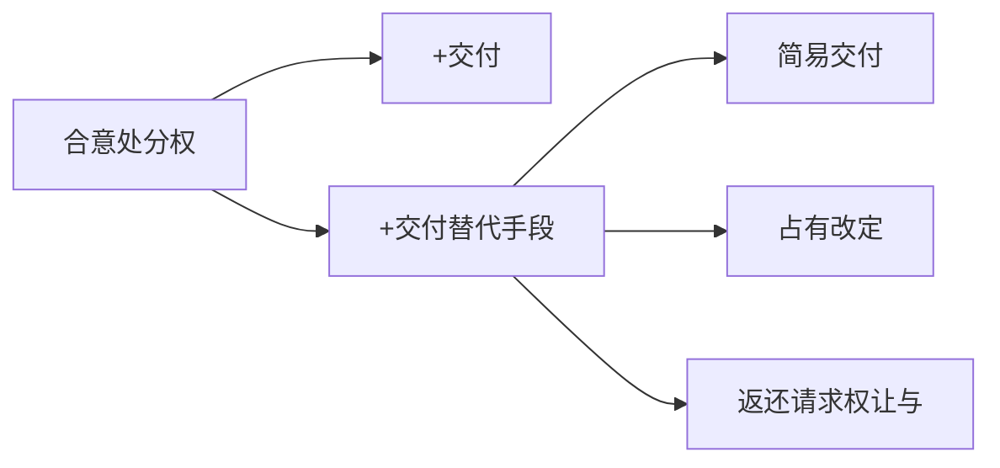

# 第四章 物权变动

> [!note] 来源
> 《物权法》课件（2025）第 99-156 页。  
> 参照《【2025期末笔记】物权法》与刘家安《民法物权》第四章作必要校准。

## 一、章节地图

> [!tip] 复习抓手
> 本章可以压缩为四条主线：
> `变动类型`、`公示生效/对抗`、`债权行为与处分行为区分`、`不动产登记/动产交付的具体规则`。

---

## 二、物权变动概述

### 1. 物权变动的含义

- 物权变动，是指物权的`发生`、`变更`与`消灭`。
- 从权利人角度观察，分别表现为：
  - 取得物权
  - 物权内容或客体发生变化
  - 丧失物权

### 2. 物权的发生

#### 原始取得

- 非依据他人既存权利而取得物权。
- 典型情形：
  - 先占无主物
  - 添附取得
  - 善意取得
  - 生产、收取孳息等
- 核心效果：取得人通常不承受前手权利负担。

#### 继受取得

- 基于他人既存权利而取得物权。
- 包括：
  - `移转型继受取得`：如买卖、赠与中受让所有权。
  - `创设型继受取得`：如所有权人为他人设立用益物权、担保物权。
- 核心效果：取得人原则上继受前手法律地位，物上既存负担通常继续存在。

> [!caution] 原始取得与继受取得
> 关键不在“有没有前手”这一事实描述，而在取得是否基于前手既存权利。善意取得虽常发生在前手交易场景中，但通说上仍属原始取得，因其权利取得来自法律特别规定，而非真正继受无处分权人的权利。

### 3. 物权的变更

- 广义变更包括主体、客体、内容变更。
- 狭义变更通常不包括主体变更，因为主体变更实际上表现为一方取得、另一方丧失。
- 典型类型：
  - 客体变更：如添附后标的物范围扩大。
  - 内容变更：如地役权期限由 10 年变为 20 年；抵押权顺位、担保债权数额变更。

### 4. 物权的消灭

- `绝对消灭`：物权本身终局消灭，如标的物灭失、担保债权清偿导致担保物权消灭。
- `相对消灭`：物权离开原权利主体而归属于他人，如所有权转让。

#### 混同

- 混同，是指无并存必要的法律地位归于同一人。
- 在物权法上，典型是所有权与其上定限物权同归一人。
- 传统理解：定限物权原则上被所有权吸收而消灭。
- 但若定限物权存续对所有人或第三人有法律利益，则不宜当然消灭。

> [!example] 混同不当然消灭的利益场景
> 甲享有 A 房第一顺位抵押权，丁享有第二顺位抵押权。甲后来取得 A 房所有权。若第一顺位抵押权因混同消灭，丁的顺位升进，甲将丧失原本的优先受偿利益。此时维持甲的抵押权存续具有法律利益。

#### 抛弃

- 抛弃是物权人以单方意思表示使物权归于消灭。
- 动产所有权抛弃：需要抛弃意思 + 放弃占有。
- 不动产物权抛弃：除抛弃意思外，通常还需要办理注销登记或涂销登记。
- 若物权存续涉及他人利益，抛弃不得任意损害他人。

### 5. 引起物权变动的法律事实

| 变动原因 | 典型情形 | 是否以登记/交付为当然生效要件 |
| --- | --- | --- |
| 法律行为 | 买卖、赠与、设立抵押、设立居住权、抛弃 | 通常需要结合登记或交付 |
| 裁判、征收决定 | 形成判决、征收决定 | 自法律文书或征收决定生效时发生效力 |
| 继承 | 法定继承、遗嘱继承 | 自继承开始时发生效力 |
| 事实行为 | 合法建造、拆除房屋 | 自事实行为成就时发生效力 |

- 本章的重点是`因法律行为引起的物权变动`。
- 非因法律行为发生的不动产物权变动虽不以登记为生效要件，但后续处分该不动产时，仍须先完成登记。

---

## 三、物权变动的公示与公信原则

### 1. 公示原则的含义

- 公示原则，是指物权变动必须以一定公开方式表现出来，才能发生相应法律效果的原则。
- 《民法典》第 208 条确立基本规则：
  - 不动产物权的设立、变更、转让和消灭，应当依法登记。
  - 动产物权的设立和转让，应当依法交付。
- 公示原则主要适用于`基于法律行为发生的物权变动`。

### 2. 公示原则的必要性

- 物权具有对世性和排他性，其变动会影响交易当事人以外的不特定第三人。
- 欠缺公示时，第三人无法识别物上权利状态，交易安全会被秘密物权安排破坏。
- 因此，物权变动需要以外部可识别方式呈现：
  - 不动产以登记为中心。
  - 动产原则上以交付或占有移转为中心。

> [!tip] 公示原则的制度逻辑
> 物权不是只在当事人内部发生效力的安排。既然要让不特定第三人尊重物权，就必须给第三人可查询、可观察、可预期的权利外观。

### 3. 公示方法的确定标准

- 公示方法应当：
  - 面向不特定第三人。
  - 简便、低成本。
  - 能够对应特定客体。
  - 尽量使权利外观与真实权利状态一致。
- 不动产登记具有较强的积极公示功能，能够以登记簿呈现权利主体、类型、内容、来源、期限、限制等事项。
- 动产占有和交付的公示能力较弱，更多是基于事实控制产生权利推定或警示功能。

> [!caution] 动产交付与不动产登记的差异
> 不动产登记能够较直接地展示“物上有什么权利”。动产交付或占有通常只能展示“谁在事实控制该物”，并不当然展示所有权、质权、租赁等完整权利状态。

### 4. 公示的效力：生效主义与对抗主义

| 类型 | 基本规则 | 法律效果 |
| --- | --- | --- |
| 公示生效主义 | 未登记或未交付，不发生物权变动 | 当事人之间也不发生物权变动效果 |
| 公示对抗主义 | 未登记或未交付，仍可在当事人间发生物权变动 | 不得对抗善意第三人或不特定第三人 |

- 我国原则上采`公示生效主义`。
- 主要依据：
  - 《民法典》第 209 条：不动产物权变动经依法登记发生效力，未登记不发生效力，法律另有规定除外。
  - 《民法典》第 224 条：动产物权设立和转让自交付时发生效力，法律另有规定除外。
- 例外采登记对抗或类似对抗规则：
  - 特殊动产物权变动：第 225 条。
  - 土地承包经营权部分规则。
  - 地役权设立：第 374 条。
  - 动产抵押权设立：第 403 条。

### 5. 公信原则

- 公信原则，是指登记或占有等公示外观即使与真实权利状态不一致，法律仍保护善意信赖该外观并进行交易的第三人。
- 公信原则的核心功能：
  - 分配登记错误或占有外观错误的风险。
  - 降低交易调查成本。
  - 在静态财产安全与动态交易安全之间，优先保护符合条件的交易安全。
- 我国未以抽象条文直接规定统一的公信原则，而是主要通过`善意取得`制度实现。

> [!example] 登记公信的基本例型
> 甲为房屋真实所有人，登记簿误记乙为所有人。乙恶意将房屋出卖并过户给善意的丙。丙基于登记簿信赖交易并完成登记时，法律通常通过善意取得保护丙，使其取得所有权。

> [!caution] 公信原则的边界
> 公信原则保护的是信赖公示外观进行交易的善意第三人。名义登记人或占有人不能仅凭登记、占有外观对真实权利人主张“公信力”。

---

## 四、物权变动的立法模式与物权行为

### 1. 立法模式问题的提出

> [!question] 导入问题
> 甲将 A 物出售给乙：  
> 1. A 物所有权何时移转？  
> 2. 所有权移转的效力来自买卖合同本身，还是来自登记、交付环节中的其他法律行为或事实行为？  
> 3. 买卖合同无效、被撤销时，已经发生的登记或交付是否当然失去物权效力？

- 物权变动模式要回答的是：`因法律行为发生物权变动时，意思表示、公示、原因行为效力之间如何组合`。

### 2. 三种基本模式

| 模式 | 代表 | 物权变动原因 | 登记/交付地位 | 原因行为无效的影响 |
| --- | --- | --- | --- | --- |
| 意思主义 | 法国、日本 | 债权合同即可直接引起物权变动 | 对抗要件 | 原因行为无效，物权变动不发生 |
| 物权形式主义 | 德国、我国台湾地区 | 债权行为 + 独立物权合意 + 登记/交付 | 生效要件 | 原因行为瑕疵原则上不当然影响物权行为 |
| 债权形式主义 | 奥地利、瑞士通说 | 有效债权行为 + 登记/交付 | 生效要件 | 原因行为无效，物权变动原则上不发生 |

#### 意思主义

- 不区分债权效果意思与物权变动意思。
- 买卖合同等债权合同直接产生物权变动效果。
- 登记或交付只是对抗要件。
- 优点是交易简便；问题是容易产生“未公示但当事人间有效的物权”，与物权对世性存在紧张。

#### 物权形式主义

- 区分债权行为与物权行为。
- 买卖合同只产生债权债务关系。
- 所有权移转还需要独立的物权合意，并履行登记或交付。
- 物权行为具有独立性；在抽象原则下，其效力不受原因行为效力当然影响。

#### 债权形式主义

- 不承认或弱化独立物权行为。
- 债权合同本身是物权变动原因，但不是充分条件。
- 物权变动通常需要：
  - 有效债权合同
  - 处分权
  - 不动产登记或动产交付

### 3. 我国法上的基本解释

- 我国法显然不是意思主义，因为《民法典》第 209 条、第 224 条明确要求登记或交付。
- 我国究竟属于物权形式主义还是债权形式主义，实证法并未完全明示。
- 目前更常见的解释是`债权形式主义`：
  - 买卖合同成立生效只发生债的效力。
  - 物权变动还需要处分权和公示要件。
  - 原因行为效力通常仍是物权变动的基础。
- 但课件强调：物权行为理论在解释若干疑难问题上有较强说明力，未来成为更有影响的解释方案并非没有可能。

> [!tip] 常用公式
> 基于法律行为的典型物权变动，可以先按以下结构审查：  
> `有效原因行为 + 处分权 + 登记/交付 = 物权变动`  
> 但若题目专门考查物权行为理论，还须展开分离原则与抽象原则。

### 4. 《民法典》第 215 条的意义

- 第 215 条规定：有关设立、变更、转让、消灭不动产物权的合同，自合同成立时生效；未办理物权登记的，不影响合同效力，法律另有规定或合同另有约定除外。
- 该条至少确立：
  - 债权合同效力与物权变动效力可以区分。
  - 买卖合同等负担行为不以登记为生效要件。
  - 买卖合同等负担行为原则上也不以处分权为生效要件。
- 该条本身不能直接推出我国法承认独立物权行为，但为负担行为与处分行为区分提供了重要规范基础。

### 5. 物权行为的含义

- 物权行为有两种常见定义：
  - 以物权得丧变更为直接内容的法律行为。
  - 由物权意思表示与外部变动特征（登记或交付）结合而成的法律行为。
- 物权行为属于：
  - 法律行为：以意思表示为构成要素。
  - 处分行为：直接引起权利发生、变更、消灭。
- 因其为处分行为，行为人原则上必须具有处分权。

### 6. 负担行为与处分行为

| 比较点 | 负担行为 | 处分行为 |
| --- | --- | --- |
| 效果 | 产生给付义务 | 直接引起权利变动 |
| 典型 | 买卖合同、赠与合同 | 所有权移转、抵押权设立、债权让与 |
| 是否需要处分权 | 原则上不需要 | 原则上需要 |
| 与登记/交付关系 | 通常不以登记/交付为生效要件 | 物权处分通常需要登记/交付等公示要件 |

> [!example] 无权处分中的区分
> 出卖人不享有标的物处分权时，买卖合同作为负担行为仍可有效；但所有权能否转移，是处分行为层面的问题。若无处分权且不构成善意取得，物权变动不发生。

### 7. 分离原则与抽象原则

#### 分离原则

- 物权行为独立于债权行为。
- 买卖中至少可区分：
  - 买卖合同
  - 标的物所有权移转合意
  - 价金所有权移转合意
- 分离原则的价值在于把“债的发生”与“物权变动”分开处理。

#### 抽象原则

- 物权行为的效力不受其原因行为效力当然影响。
- 原因行为无效、被撤销或不成立时，物权行为若自身有效，仍可发生物权变动。
- 出让人不能再以所有权人身份主张物上返还请求权，而通常只能主张不当得利返还。

> [!caution] 有因性与无因性的请求权差异
> 有因性规则下，原因行为无效通常导致物权变动不发生，出让人仍可基于物权请求返还。无因性规则下，物权已经移转，出让人通常只能基于不当得利请求返还利益。差异主要体现在请求权基础与第三人交易安全保护上。

### 8. 对物权行为理论的评价

- 物权行为理论结构复杂，未必符合日常交易经验。
- 但其解释力强，尤其适合说明：
  - 买卖合同效力与所有权移转效力的区分。
  - 所有权保留中的条件附着对象。
  - 简易交付、占有改定等场景中“什么时候发生所有权转移”。
  - 预告登记规则中处分行为的独立地位。

---

## 五、不动产物权变动与不动产登记

### 1. 非依法律行为发生的不动产物权变动

> [!cite] [[民法典#第二百二十九条]]
>因人民法院、仲裁机构的法律文书或者人民政府的征收决定等，**导致**物权设立、变更、转让或者消灭的，自法律文书或者征收决定等生效时发生效力。
>- 仅有形成之诉才可能引起 229 条的适用[^1]

| 原因                                     | 生效时间         | 规范抓手         |
| -------------------------------------- | ------------ | ------------ |
| [[物权编解释（一）#第七条\|人民法院、仲裁机构法律文书]]或政府征收决定 | 法律文书或征收决定生效时 | 《民法典》第 229 条 |
| 继承                                     | 继承开始时        | 《民法典》第 230 条 |
| 合法建造、拆除房屋等事实行为                         | 事实行为成就时      | 《民法典》第 231 条 |

- 这些情形不以登记为物权变动的生效要件。
- 但处分由此取得的不动产物权时，若依法需要登记，未经登记不发生物权效力。

### 2. 依法律行为发生的不动产物权变动要件

- 行为人对不动产享有处分权。
- 存在变动不动产物权的意思表示，通常表现为合同。
- 原则上须办理不动产登记。

### 3. 不动产登记的基本功能

| 功能 | 内容 |
| --- | --- |
| 设权功能 | 登记是不动产物权依法律行为设立、变更、转让、消灭的生效要件 |
| 宣示功能 | 对非依法律行为取得的不动产物权进行权利外观呈现，并为后续处分准备条件 |
| 推定功能 | 登记簿记载推定为真实权利状态 |
| 公信功能 | 善意第三人可在一定条件下信赖登记簿取得权利 |

### 4. 登记簿与权属证书

- 不动产登记簿是物权归属和内容的根据。
	- 该“根据”宜理解为`权利推定效力`，而非不可推翻的绝对标准，存在「确权之诉」
	- 更多地是一种举证责任的配置功能
- 权属证书是不动产权利人享有物权的证明。
- 权属证书与登记簿不一致时，除有证据证明登记簿确有错误外，以登记簿为准。
	- [[物权编解释（一）#第二条|登记错误时]]，真实权利人可通过确认物权、申请更正登记、异议登记等路径保护权利。

### 5. 登记资料查询

- 权利人、利害关系人可以申请查询、复制登记资料。
- 登记查询制度需要平衡：
  - 登记的公示功能
  - 权利人隐私与交易安全
- 过度限制查询会削弱登记的公示价值。

### 6. 更正登记

- 适用前提：权利人或利害关系人认为登记簿记载错误。
- 登记机构可更正的情形：
  - 登记簿记载的权利人书面同意更正。
  - 有证据证明登记确有错误。
- 若登记权利人不同意更正，通常说明存在权属争议，登记机构不宜自行裁决。

### 7. 异议登记

- 异议登记，是将利害关系人对登记事项的异议记载于登记簿。
- 前提：利害关系人申请更正，但登记权利人不同意。
- 效力：
  - 提醒交易相对人登记可能错误。
  - 排除或削弱登记公信力，使受让人难以主张善意取得。
  - 异议登记之日起 15 日内不起诉的，异议登记失效。
  - 异议登记不当造成损害的，申请人承担损害赔偿责任。

> [!example] 异议登记的典型结构
> 甲死亡后，乙依真实遗嘱应取得 A 房；丙伪造遗嘱并登记为权利人。乙申请更正，丙不同意，乙遂申请异议登记。丙又将房屋出卖给丁。若乙最终胜诉，丁因登记簿上已有有效异议登记，通常难以主张善意取得。

> [!caution] 异议登记不等于冻结登记簿
> 异议登记期间，登记簿记载权利人仍可申请处分登记；登记机构通常应告知异议登记风险。若申请人坚持办理并承诺自担风险，登记机构可以继续办理。异议最终成立时，之前登记不发生相应物权变动效力或应被更正、涂销。

### 8. 预告登记

- 预告登记，是为保障将来实现不动产物权而进行的登记。
- 典型场景：
	- 商品房预售
	- 不动产买卖
	- [[担保制度解释#第五十二条|不动产抵押]]
	- 预购商品房抵押
- 预告登记的对象不是已经存在的不动产物权，而是旨在将来发生物权变动的债权请求权。
	- 功能：使该债权请求权获得某些物权效力，即“债权物权化”。

#### 预告登记的效力

- 预告登记后，未经预告登记权利人同意，处分该不动产的，不发生物权效力。
- 处分主要指直接引起物权变动的行为，如：
	- 转让不动产所有权
	- 设立建设用地使用权
	- 设立居住权
	- 设立地役权
	- 设立抵押权
- 预告登记影响的是处分行为的物权效力，不当然否定后续买卖合同等负担行为的效力。

#### 预告登记失效

- 债权消灭。
- 自能够进行不动产登记之日起 90 日内未申请登记。

> [!caution] 异议登记 vs 预告登记
> 异议登记针对“登记簿可能错误”，核心作用是削弱登记公信力。预告登记针对“未来物权实现”，核心作用是保全债权请求权并限制未经同意的处分行为。

### 9. 登记类型整理

| 类型 | 作用 |
| --- | --- |
| 首次登记 | 首次将不动产或权利纳入登记系统 |
| 设立登记 | 创设建设用地使用权、居住权、地役权、抵押权等 |
| 转移登记 | 不动产权利主体发生移转 |
| 变更登记 | 权利内容、期限、范围、主体名称等变化 |
| 注销登记 | 不动产权利消灭 |
| 查封登记 | 限制处分，服务执行或保全 |
| 更正登记 | 改正登记错误 |
| 异议登记 | 公示权属争议，排除公信 |
| 预告登记 | 保全未来物权变动请求权 |

---

## 六、动产物权变动与交付

### 1. 动产物权变动的范围

- 课件重点讨论：
  - 动产所有权转让
  - 动产质权设立
- 动产抵押权设立不以交付为要件，适用《民法典》第 403 条的登记对抗规则。
- 留置权属于法定担保物权，不以法律行为设立。

### 2. 依法律行为发生动产物权变动的要件

- **处分权**：行为人对动产享有处分权。
- **主观要件**：存在变动动产物权的意思表示。
- **交付**：须交付，或满足交付替代要求。

> [!tip] 审查顺序
> 动产所有权转让或质权设立，先问处分权与合意，再问是否完成交付或交付替代。特殊动产还要追加登记对抗问题。

### 3. 交付的性质与构成

- 交付通常可理解为让与人促成受让人取得占有的事实。
- 构成要素：
  - 让与人依其意志放弃占有。
  - 受让人取得占有。
  - 受让人取得占有由让与人的意愿促成。
- 不动产也可发生占有移转，但不动产占有移转不影响不动产物权变动。

> [!caution] 交付不是单纯“拿到物”
> 若让与人并无促成受让人取得占有的意思，例如所有人遗失动产后他人捡到，虽发生占有变化，但不构成动产物权变动意义上的交付。

### 4. 交付与交付替代

- 传统上常说“现实交付 + 观念交付”。
- 课件更推荐的理解：
  - 交付是一种要件。
  - 简易交付、返还请求权让与、占有改定是`交付替代手段`。
- 因此，动产物权变动可概括为：
  - 合意 + 处分权 + 交付
  - 合意 + 处分权 + 交付替代手段

### 5. 简易交付

- 《民法典》第 226 条：动产物权设立和转让前，权利人已经占有该动产的，物权自民事法律行为生效时发生效力。
- 适用结构：
  - 受让人在物权变动前已经占有动产。
  - 当事人达成物权变动合意。
  - 无须再发生新的占有移转。

> [!example] 简易交付
> 甲将电脑出借给乙。借用期间，乙提出购买，甲同意。若其他要件具备，乙因已经占有电脑，所有权可于相应法律行为生效时移转，无须甲再把电脑“交付”一次。

> [!caution] 第 226 条中的“民事法律行为”
> 在债权形式主义解释下，常被理解为买卖合同等原因行为；在物权行为解释下，更宜理解为转移动产所有权的物权合意。该争点关系到出卖人的同时履行抗辩与价款风险分配。

### 6. 返还请求权让与

- 《民法典》第 227 条：动产物权设立和转让前，第三人占有该动产的，负有交付义务的人可以通过转让请求第三人返还原物的权利代替交付。
- 适用结构：
  - 标的物由第三人占有。
  - 让与人对第三人享有返还请求权。
  - 让与人与受让人达成返还请求权让与合意。
  - 以返还请求权让与替代现实交付。

> [!example] 返还请求权让与
> 甲将耕牛出借给乙。借用期间，丙向甲购买该牛。甲将请求乙返还耕牛的权利让与丙，丙同意。若甲有处分权且双方有所有权移转合意，所有权可因返还请求权让与而转移给丙。

#### 两个争点

- 返还请求权是否限于债权请求权：
  - 债权性返还请求权，如保管、租赁、借用关系中的返还请求权，适用较无争议。
  - 物权请求权性质的返还请求权是否包括在内，学理有争议；刘家安教材倾向于在受让人同意承受追索风险时，可以包括《民法典》第 235 条意义上的物上返还请求权。
- 是否须通知第三人：
  - 所有权移转场景下，未通知第三人通常不影响所有权移转，但影响第三人向谁履行返还义务。
  - 动产质权设立场景下，为确保质权人取得对质物的控制，通知直接占有人更具必要性。

### 7. 占有改定

- 《民法典》第 228 条：动产物权转让时，双方又约定由出让人继续占有该动产的，物权自该约定生效时发生效力。
- 结构：
  - [ ] 让与人继续直接占有动产。
  - [ ] 双方另行建立占有媒介关系，如租赁、借用、保管。
  - [ ] 受让人因此取得间接占有。

> [!example] 占有改定
> 甲将耕牛出卖给乙。甲因农忙需要继续使用两个月，遂与乙约定由甲按月支付租金继续占有耕牛。该约定生效时，乙取得间接占有，所有权可发生移转。

> [!caution] 占有改定不能设立动产质权
> 第 228 条仅规定“动产物权转让”，而非“设立和转让”。动产质权以质权人控制质物为核心，不能通过出质人继续占有的占有改定方式设立。

#### 占有改定在担保交易中的作用

- 虽不能用占有改定设立动产质权，但可在形式上移转所有权以实现担保目的。
- 典型场景：
  - 动产让与担保。
  - 售后回租型融资租赁。

### 8. 三种交付替代对比

| 类型 | 适用前提 | 物的占有状态 | 生效节点 | 关键词 |
| --- | --- | --- | --- | --- |
| 简易交付 | 受让人已占有 | 物在受让人处 | 物权变动合意或相关法律行为生效时 | 短手交付 |
| 返还请求权让与 | 第三人占有 | 物在第三人处 | 返还请求权让与合意达成时 | 指示交付、长手交付 |
| 占有改定 | 出让人继续占有 | 物仍在出让人处 | 占有媒介约定生效时 | 间接占有 |

### 9. 特殊动产的物权变动

- 《民法典》第 225 条：船舶、航空器和机动车等的物权设立、变更、转让和消灭，未经登记，不得对抗善意第三人。
- 课件强调：该条真正重要的适用对象主要是`特殊动产所有权移转`。
- 基本规则：
  - 特殊动产仍属动产。
  - 所有权转移原则上仍适用第 224 条：交付生效。
  - 登记不是所有权移转的生效要件，而是对抗要件。

> [!tip] 特殊动产公式
> `交付移转所有权 + 登记对抗善意第三人`

#### 善意第三人的范围

- 善意第三人主要指信赖特殊动产占有、登记状态而进行交易的后手交易相对人。
- 不包括转让人的一般债权人。
- 《物权编解释（一）》第 6 条：受让人已支付合理价款并取得占有，虽未登记，转让人的债权人主张其为第 225 条所称善意第三人的，不予支持，法律另有规定除外。

> [!example] 特殊动产二重转让
> 甲将机动车出卖并交付给乙，但未登记。乙将车交回甲处修理。甲又将车出卖给丙，并为丙办理登记。若丙善意，乙未登记的所有权取得不得对抗丙。

#### 第 225 条不宜扩张适用的场景

- 动产质权设立：质权以交付为设立要件，不适用第 225 条。
- 特殊动产抵押权设立：适用动产抵押的特别规则，即《民法典》第 403 条，而非第 225 条。

---

## 七、本章高频区分

### 1. 公示生效主义 vs 公示对抗主义

| 比较点 | 公示生效主义 | 公示对抗主义 |
| --- | --- | --- |
| 公示地位 | 生效要件 | 对抗要件 |
| 未公示效果 | 物权变动不发生 | 当事人间可发生，不能对抗第三人 |
| 我国规则 | 原则 | 例外 |
| 典型 | 不动产登记、动产交付 | 地役权、动产抵押、特殊动产登记 |

### 2. 分离原则 vs 抽象原则

| 比较点 | 分离原则 | 抽象原则 |
| --- | --- | --- |
| 解决问题 | 债权行为与物权行为是否分开 | 物权行为效力是否受原因行为影响 |
| 核心命题 | 买卖合同不是所有权移转本身 | 买卖合同无效不当然导致物权行为无效 |
| 请求权影响 | 区分债的履行与物权变动 | 影响返还请求权基础 |

### 3. 更正登记 vs 异议登记 vs 预告登记

| 类型 | 处理对象 | 核心功能 | 期限/限制 |
| --- | --- | --- | --- |
| 更正登记 | 登记错误 | 直接改正登记簿 | 需登记权利人同意或证据证明错误 |
| 异议登记 | 登记可能错误且权利人不同意更正 | 公示争议、排除善意 | 15 日内不起诉失效 |
| 预告登记 | 将来物权实现请求权 | 保全债权、限制处分 | 债权消灭或可登记后 90 日未申请而失效 |

### 4. 现实交付、简易交付、返还请求权让与、占有改定

| 类型 | 谁占有标的物 | 是否发生现实占有移转 | 规则重点 |
| --- | --- | --- | --- |
| 现实交付 | 出让人 -> 受让人 | 是 | 受让人取得占有 |
| 简易交付 | 受让人已占有 | 否 | 无须重复交付 |
| 返还请求权让与 | 第三人占有 | 否 | 让与返还请求权 |
| 占有改定 | 出让人继续占有 | 否 | 受让人取得间接占有 |

---

## 八、案例切入点

- 一物二卖：先区分买卖合同效力与物权变动效力，再看登记、交付、善意取得、预告登记。
- 房屋买卖未登记：买卖合同可有效，但所有权原则上未移转；买受人可主张合同履行、违约责任，是否可获得物权保护需另查预告登记等规则。
- 继承取得房屋：继承开始时发生物权变动；后续处分该房屋仍需先办理登记。
- 登记错误 + 第三人交易：先判断真实权利状态，再判断第三人是否可基于登记公信和善意取得受保护。
- 异议登记后处分：异议登记通常使受让人难以主张善意取得，但不当然冻结登记簿。
- 商品房预售风险：买受人可通过预告登记保全将来取得所有权的请求权。
- 动产买卖中物在第三人处：优先考虑返还请求权让与是否成立。
- 动产买卖中出卖人继续占有：优先考虑占有改定是否成立，以及是否不适用于质权设立。
- 机动车买卖：所有权以交付移转，登记用于对抗善意第三人。

## 九、复习提示

> [!tip] 简答题：物权公示原则
> `概念 -> 必要性（对世性、交易安全、可识别） -> 公示方法（不动产登记、动产交付） -> 效力类型（生效主义/对抗主义） -> 我国规则及例外。`

> [!tip] 简答题：物权行为理论
> `概念 -> 处分行为属性 -> 分离原则 -> 抽象原则 -> 与我国法的关系 -> 请求权基础差异。`

> [!tip] 案例题：物权变动审查
> `变动原因 -> 是否法律行为 -> 原因行为效力 -> 处分权 -> 登记/交付/替代交付 -> 是否有对抗或善意取得问题。`

## 十、可继续拆分

- 物权变动公示原则
- 公信原则与善意取得
- 比较：公示生效主义 vs 公示对抗主义
- 物权行为理论
- 比较：负担行为 vs 处分行为
- 不动产预告登记
- 比较：更正登记 vs 异议登记 vs 预告登记
- 比较：现实交付 vs 简易交付 vs 返还请求权让与 vs 占有改定
- 特殊动产物权变动

[^1]: **形成判决**，是指那些能够**直接变更或消灭既存民事法律关系**的判决。它的形成力直接作用于物权状态，无需当事人再为任何行为。**典型示例**：在分割共有物之诉中，法院判决原本由甲乙共有的房产归甲一人所有。此判决一旦生效，物权便**直接发生变动**，即使未办理不动产变更登记，甲在法律上也已成为该房产的单一所有权人。形成判决的这种直接变更效果，完美契合了《民法典》第229条“自法律文书生效时发生效力”的规定。
