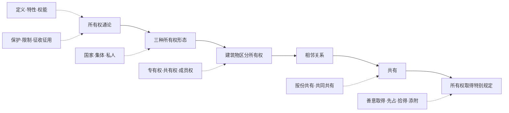

# 第五章 所有权

> [!note] 来源
> 《物权法》课件（2025）第 65-174 页。  
> 参照刘家安《民法物权》第五章作体系补强。

## 章节地图

> [!tip] 复习抓手
> 所有权一章以 `权能—形态—保护—取得` 为主线：
> `所有权通论（定义/特性/权能）` → `三类所有权形态` → `建筑物区分所有权` → `相邻关系` → `共有` → `取得特别规定（善意取得等）`。
> 核心法条：240、235-238、243、245、271、288、297-299、311。

---

## 一、所有权通论

### （一）所有权的含义

>[!cite] [[民法典#第二百四十条]]
>所有权人对自己的不动产或者动产，依法享有占有、使用、收益和处分的权利。

- 所有权系对标的物为全面支配的权利，属完全物权。
- 其他物权（用益物权、担保物权）则为定限物权，须以法律或合同为依据。
- 两个面向：
  - **积极权能**：占有、使用、收益、处分。
  - **消极权能**：排除他人干涉。
- 所有权观念变迁：从"归属中心"走向"利用中心"，强调物尽其用。

> [!quote] 刘家安：抽象概括式定义
> 学理上，抽象概括式的所有权定义——"在法律限制的范围内，对物为全面支配、处分并排除他人干预的权利"——优于法典的权能列举式。理由有三：(1)列举不能穷尽；(2)权能间逻辑不周延（"使用"与"收益"并列，使用本身即获利益）；(3)列举式易误导为"法无规定即无权利"，背离所有权自由价值。第 240 条仅为立法定义，学理应以概括式为主。

> [!tip] 所有权的体系地位
> 在继受罗马法传统的大陆法系，所有权是贯穿整个财产法制度的中心线索：物权以所有权为原型，他物权均为"设立于他人所有物之上"的权利；债法也须借助所有权概念表达——所有权移转常构成债权发生的目的。

### （二）所有权的特性

1. **全面性（完全性）**：所有权人对标的物得为全面支配，定限物权仅就特定方面支配。
	- 全面支配性不意味着所有权人任何时刻都须能现实全面支配——物上存在他物权时，所有权暂时受限。但作为"法律上的力量"而非"现实的力量"，所有权具有面向未来的全面支配力：他物权一旦消灭，所有权立刻恢复圆满。
2. **整体性（单一性）**：所有权为单一权利，非占有、使用、收益、处分四项权能之简单集合。权能可以分离（如设定用益物权、出租），但不改变所有权的单一性。
	1. 即使所有权人设定了终身居住权，长期无法占有、使用，所有权呈现"空虚化"，法律上仍为所有权——并未异化成另一种物权形态。
	2. 所有权不能在时间上分割——分期付款不产生"按进度获得部分所有权"的逻辑，"全有或全无"。
3. **弹力性（归一性）**：所有权上设定他物权后，所有权内容受限制；他物权消灭后，所有权自动回复圆满状态。
4. **恒久性（永久存续性）**：所有权无期间限制，不罹于消灭时效。纵使长期不行使，所有权本身不消灭。
	- 此系逻辑需要：定限物权因期限届满消灭后，弹力性自动恢复——若所有权本身有期限，期限届满后标的物将成为无主物，成为他人竞相争夺的对象。
5. **社会性**：近代以来，所有权负担社会义务，行使须兼顾社会公共利益。

> [!tip] 弹力性
> 弹力性 ：设他物权时受压缩（如设抵押权），他物权消灭后弹回圆满。

### （三）所有权的内容（权能）

#### 1. 积极权能

| 权能 | 含义 | 示例 |
|------|------|------|
| 占有 | 对物的实际管辖与控制 | 居住房屋、保管物品 |
| 使用 | 依物的性质与用途加以利用 | 驾驶汽车、阅读书籍 |
| 收益 | 收取孳息 | 收取房屋租金（法定孳息）、采摘果实（天然孳息） |
| 处分 | 事实上或法律上对物的处置 | 拆除房屋（事实处分）、转让所有权或设定抵押（法律处分） |

> [!caution] 事实处分与法律处分
> - **事实上的处分**：物理上改造、消费、毁损标的物（不可逆或改变物质形态）。
> - **法律上的处分**：通过法律行为移转权利或设定负担（转让、抵押、出质等）。
> - 区分实益：无权处分（法律上的处分）适用善意取得；事实上的处分可能只发生侵权或不当得利。

#### 2. 消极权能

- 排除他人干涉，系所有权对世性的体现。
- 对应民法上的三种物权请求权。

### （四）所有权的保护

#### 1. 物权请求权

| 类型      | 法条           | 要件            | 适用            |
| ------- | ------------ | ------------- | ------------- |
| 返还原物请求权 | 第 235 条      | 他人无权占有其物      | 请求现占有人返还      |
| 排除妨害请求权 | 第 236 条第 1 款 | 他人以占有以外方式妨害物权 | 请求排除妨害        |
| 消除危险请求权 | 第 236 条第 2 款 | 存在妨害物权的现实危险   | 请求消除危险或采取预防措施 |

- **返还原物请求权**：须证明请求权人享有所有权且被请求人为现时无权占有人。占有辅助人不列为请求对象。
- **排除妨害请求权**与**消除危险请求权**：不要求妨害人有过错，不要求实际损害已发生。

#### 2. 债权方式的保护

- **侵权损害赔偿**（第 238 条）：侵害物权造成权利人损害的，权利人可请求损害赔偿。
- **不当得利返还**：他人无法律上原因而获益致权利人受损时，请求返还所受利益。

#### 3. 物权请求权与侵权损害赔偿请求权的区别

| 对比项 | 物权请求权 | 侵权损害赔偿请求权 |
|--------|------------|---------------------|
| 构成要件 | 不以过错和实际损害为要件 | 通常以过错、损害、因果关系为要件 |
| 诉讼时效 | 通说认为不适用（部分适用） | 适用一般诉讼时效（3年） |
| 目的 | 回复物权的圆满状态 | 填补损害 |
| 能否独立转让 | 否（附属于物权） | 可独立转让 |

> [!caution] 考试陷阱
> 返还原物请求权不以占有人有过错为前提；侵权赔偿请求权通常须证明过错（过错责任）。两请求权可以竞合——权利人可以同时或择一行使。

### （五）权利行使限制与征收、征用

#### 1. 权利行使的限制

- 不得违反法律强制性规定。
- 不得损害社会公共利益。
- 不得损害他人合法权益。
- 遵循诚实信用原则与公序良俗。

#### 2. 征收

- **《民法典》第 243 条**：为了公共利益的需要，依照法律规定的权限和程序征收集体所有的土地和组织、个人的房屋以及其他不动产。
- 应依法及时足额支付补偿费用，保障被征收人的居住条件。
- 要件：
  - 公共利益目的
  - 法定权限和程序
  - 公平、合理补偿

#### 3. 征用

- **《民法典》第 245 条**：因抢险救灾、疫情防控等紧急需要，依照法律规定的权限和程序，可以征用组织、个人的不动产或者动产。
- 使用后应当返还；毁损、灭失的，应当给予补偿。

#### 4. 征收与征用的区别

| 对比项 | 征收 | 征用 |
|--------|------|------|
| 适用条件 | 公共利益需要 | 紧急需要（抢险救灾等） |
| 法律效果 | 所有权移转 | 使用权暂时让渡 |
| 补偿 | 公平、合理补偿 | 返还 + 毁损补偿 |
| 标的主要 | 不动产 | 不动产或动产 |

---

## 二、国家所有权、集体所有权、私人所有权

### （一）三种所有权形态

**《民法典》第 246-269 条**规定三类所有权主体。

| 类型 | 主体 | 客体 | 行使方式 |
|------|------|------|----------|
| 国家所有权 | 国家（全民所有） | 矿藏、水流、海域、城市土地、无线电频谱资源、国防资产等 | 国务院代表国家行使 |
| 集体所有权 | 农民集体、城镇集体 | 集体土地、森林、山岭、草原、荒地、滩涂、集体企业财产等 | 集体经济组织或村委会/村民小组 |
| 私人所有权 | 自然人、法人、非法人组织 | 合法收入、房屋、生活用品、生产工具、原材料等 | 私人自行行使 |

### （二）核心原则：平等保护

- 《民法典》第 207 条：国家、集体、私人的物权受法律平等保护，任何组织或者个人不得侵犯。
- 进入民法典时代后，不再区分所有权主体给予不同力度保护。

> [!caution] 理解要点
> "平等保护"不等于三者客体范围、行使规则没有差异，而是保护的**法律效果**平等——受侵害时均享有同等的物权请求权与侵权法保护。

> [!question] 刘家安：集体所有权的体系性困境
> 集体所有权欠缺处分权能——即使全体成员同意，集体土地也不得转让。按所有权一般定义，"欠缺处分权能的权利不能称之为所有权"。土地承包经营权等用益物权在构造上异于比较法上的地上权/永佃权——其本质是集体成员实现集体所有权的方式，而非建构于"他人"所有权之上的典型他物权。故应以私主体所有权为原型理解"所有权"概念，国家/集体所有权不能以通常所有权概念完全阐释。

---

## 三、业主的建筑物区分所有权

### （一）概念与法律依据

**《民法典》第 271 条**：业主对建筑物内的住宅、经营性用房等专有部分享有所有权，对专有部分以外的共有部分享有共有和共同管理的权利。

- 建筑物区分所有权 = **专有权** + **共有权** + **共同管理权（成员权）**。

> [!tip] 三项权能一体性
> 三项权利不得分离转让：转让专有权时，共有权与成员权一并转让。

### （二）专有权

#### 1. 专有部分的认定

- 构造上的独立性 + 使用上的独立性，能够排他使用。
- 专有部分的范围：通常以墙、地板、天花板等边界为界。
- 《区分所有权解释》第 2 条明确三项判断标准：(1)构造上的独立性——通过墙体、地板、天花板等与他部分隔离；(2)利用上的独立性——排他利用且有独立经济效用；(3)可成为独立的登记对象。

#### 2. 专有权的内容

- 占有、使用、收益、处分专有部分。
- 不得擅自改变房屋用途，不得危害建筑物安全。

> [!example] 典型专有部分
> 住宅单元内部空间、经营性用房单元内部空间。

### （三）共有权

#### 1. 共有部分的认定

- 专有部分以外的建筑物部分。
- 典型共有部分：地基、承重结构、外墙、屋顶、楼梯、电梯、走廊、管道、消防设施、公共绿地等。
- 两层区分：
  - **必要共有部分**（构造上不具独立性，如承重墙、屋顶、走廊、消防设施）vs **约定共有部分**（本可成为专有部分，但依规划或约定作为共有，如物业管理用房）。
  - **全体共有部分**（"大公"，供全体业主使用，如小区道路、绿地）vs **一部共有部分**（"小公"，仅部分业主共用，如一栋楼的外墙、楼顶、单元门厅）。

> [!question] 共有部分的法律性质
> 民法典未明确规定共有部分之共有的法律性质。比较法上有直接规定为按份共有的立法例。但刘家安认为，共有部分通常并非独立之物，不能成为独立的物权对象，也不存在分割问题，区分所有权人对共有部分的权利"附着于专有部分所有权之上，随专有部分移转而移转"，故不能也无必要以通常的按份共有或共同共有界定。

#### 2. 共有权的特点

- **不可分割性**：共有部分不得请求分割。
- **从属性**：共有权附随于专有权，随专有权移转而移转。
- 业主对共有部分享有权利，同时承担义务（如维护费用分摊）。

### （四）共同管理权（成员权）

#### 1. 业主大会

- 业主大会由全体业主组成，是建筑物管理的最高决策机构。
- 决议通过比例因事项重要程度而不同（一般事项 vs. 重大事项）。

#### 2. 业主委员会

- 由业主大会选举产生，负责执行业主大会决议，处理日常管理事务。
- 业主委员会作为非法人组织，可成为诉讼当事人。

#### 3. 重要表决事项

**基本规则**（《民法典》第 278 条）：

| 步骤 | 要求 |
|------|------|
| 参与表决门槛 | 专有部分面积占比 **2/3** 以上且人数占比 **2/3** 以上的业主参与表决 |
| 一般事项通过 | 经**参与表决**的专有部分面积**过半数**且**参与表决**人数**过半数**同意 |
| 重大事项通过 | 经**参与表决**的专有部分面积 **3/4** 以上且**参与表决**人数 **3/4** 以上同意 |

**重大事项**包括：筹集维修资金、改建重建建筑物及其附属设施、改变共有部分用途或利用共有部分从事经营活动。

**一般事项**包括：制定和修改业主大会议事规则、选聘和解聘物业服务企业、使用维修资金等。

> [!caution] 表决比例的正确理解
> 重大事项的"双四分之三"是**参与表决者**的四分之三，非全体业主的四分之三。实际门槛 ≈ 全体业主的 1/2（2/3 × 3/4）。注意区分"参与表决"与"同意"两个层次。

### （五）住宅改为经营性用房

- **《民法典》第 279 条**：业主将住宅改变为经营性用房的，除遵守法律、法规以及管理规约外，应当经有利害关系的业主一致同意。

---

## 四、相邻关系

### （一）概念与特征

- **《民法典》第 288 条**：不动产的相邻权利人应当按照有利生产、方便生活、团结互助、公平合理的原则，正确处理相邻关系。

**特征**：
- 发生于相邻不动产权利人之间（不限于所有权人——包括土地承包经营权人、建设用地使用权人、宅基地使用权人、居住权人、地役权人，以及基于债权合同取得利用权的当事人如承租人）。
- 是不动产所有权或使用权的**法定限制或扩张**，非独立的物权类型——学理上所谓"相邻权"并非独立的不动产权利。
- 目的在于提供**必要便利**，维持相邻不动产的正常利用。

> [!tip] 相邻关系 vs. 地役权
> - 相邻关系：法定，无需约定，无对价——仅提供**最低限度利用**（如袋地通行权仅在"别无他法"时方可主张）。
> - 地役权：约定，需设定，可有偿——可依意志确定具体利用方案，须经登记方可对抗第三人。
> - 相邻关系为最低限度利用所必需；地役权为更高程度的便利。

> [!tip] 规范方式的双层结构
> (1)**行为禁止规范**——以"不得"表达（如第 293 条不得妨碍通风采光日照、第 294 条禁止违法排放污染物）；
> 
> (2)**法定利用权规范**——赋予对邻地的排水、通行、管线铺设等法定利用权（第 290-292 条）。相邻关系上的义务多为**容忍义务**（不作为），如邻地通行仅意味着不得阻止通行，不包括积极修建道路等作为义务。

### （二）相邻关系的主要类型

| 类型 | 内容 | 法条依据 |
|------|------|----------|
| 相邻用水、排水 | 合理分配利用自然流水，不得擅自堵截或排放 | 第 289-290 条 |
| 相邻通行 | 必须利用他人土地通行的，应当提供必要通行便利 | 第 291 条 |
| 相邻通风、采光、日照 | 不得妨碍他人通风、采光和日照 | 第 293 条 |
| 相邻管线安设 | 铺设电线、电缆、水管、暖气和燃气管线等须利用相邻不动产的 | 第 292 条 |
| 相邻防险 | 挖掘土地、建造建筑物等不得危及相邻不动产安全 | 第 295 条 |
| 相邻环境保护 | 不得排放污染物、噪声、光、电磁波辐射等 | 第 294 条 |

> [!caution] 通行权边界
> 相邻通行权以"必须利用"为前提——即无其他合理通道。"袋地"指土地四周不通公共道路的情形；"准袋地"指虽有通路但极为不便。但若不构成袋地或准袋地，仅为方便（如穿行邻地可缩短时间），则不产生法定通行权，只能通过地役权合同解决。

> [!caution] 民法典第 296 条的规范漏洞
> 民法典第 296 条删去了原《物权法》第 92 条"造成损害的，应当给予赔偿"的规定。因法定邻地利用权行使所致损害，性质属于**牺牲补偿**，是单独类型的法定之债，不以利用人有过错为要件，不应以侵权责任为请求权基础。此删除造成法律漏洞。

> [!question] 相邻关系未覆盖的冲突
> 民法典相邻关系规范未全面覆盖所有冲突类型。如树木枝蔓越界是否可自行刈除、果实自落邻地归谁所有、建筑越界占用邻地可否要求拆除或仅得赎买等，民法典均未规定，只能依第 10 条（习惯法源）和第 288 条（有利生产、方便生活、公平合理原则）处理。

---

## 五、共有

### （一）共有的含义

- 两个以上主体对同一物共享有一个所有权。
	- 《民法典》[[民法典#第二百九十七条|第 297 条]]：共有包括按份共有和共同共有。
- 与"`总有`"不同：
	- 总有：（日耳曼村落共同体）存在所有权权能的质的分割——处分权归共同体、使用收益归成员；
	- 共有：是对所有权量上的分割，各共有人仍如单独所有人一样有全面权能，仅受其他共有人权利的制约。

> [!tip] 准共有（[[民法典#第三百一十条|第 310 条]]）
> 两个以上组织、个人共同享有用益物权、担保物权的，参照适用共有一章的有关规定。
> 
> 典型包括：用益物权准共有、担保物权准共有（如抵押权部分让与后）、知识产权准共有、债权准共有。
> 
> 依共有人间是否存在共同关系，可区分为准按份共有和准共同共有。

### （二）按份共有

#### 1. 概念

- 共有人按照`各自的份额`对共有财产`分享权利`、`分担义务`。
- 份额为抽象的**价值比例**，非实物分割。共有份额抽象地存在于共有物的全部——
	- 例如：*甲乙各 50% 份额共有一套两居室，并非各有一间，而是各享有房屋所有权的 50%。*
- 份额处分仅限法律上处分，不包括事实上处分（如毁损共有物）；
	- 份额上可设抵押权、质权，但不能设用益物权[^3]。

#### 2. 对内关系

> 按份享有共有权

>[!cite] [[民法典#第三百条]]
>共有人按照约定管理共有的不动产或者动产；没有约定或者约定不明确的，各共有人都有管理的权利和义务。

| 事项        | 规则                                       |
| --------- | ---------------------------------------- |
| 共有物的使用、收益 | 共有人协商确定；按照份额行使，不得损害其他共有人利益               |
| 共有物的管理    | 保存行为：各共有人可单独实施； 改良行为：须经占份额三分之二以上共有人同意 |
| 管理费用      | 有约定从约定，无约定按份额分担                          |

> [!caution] [[民法典#第三百零一条|第 301 条]]"处分"的限缩解释（刘家安）
> 1. 仅限**法律上**的处分（不包括事实上的毁损——多数决不能使不法行为合法化）；
> 2. 不包括**无偿处分**（如赠与、无偿设定居住权——多数决处分须以"可从第三人处获得合理对价"为前提）；
> 3. 持异议的少数共有人可证明多数决定`实质性损害其共有利益`时，不受拘束。

#### 3. 对外关系

- 各共有人可以单独行使物权请求权，请求排除妨害、返还原物等。
- 因共有物产生的债务，对外负连带责任（法律另有规定或第三人知道非连带关系除外）。

#### 4. 份额处分

>[[民法典#第三百零五条]]、[[民法典#第三百零六条]]

| 行为 | 条件 |
|------|------|
| 转让份额 | 自由转让，其他共有人在同等条件下享有**优先购买权** |
| 设定抵押 | 可就自身份额设定抵押 |

> [!caution] 优先购买权
> 按份共有人转让其份额时，应当通知其他共有人。其他共有人在**同等条件**下享有优先购买权。两个以上共有人均主张优先购买的，协商确定购买比例；协商不成的，按各自份额比例行使。
> - **效力**：通说采**形成权说**——共有人单方表示行使优先购买权即发生合同成立效果。刘家安认为我国法上的优先购买权具有**物权效力**（非仅债权效力），理由：《物权编解释(一)》第 14 条规定共有份额权属转移后 6 个月内仍可主张。
> - **期限**：通知载明期间的以该期间为准；未载明的，自通知送达之日起 15 日；未通知的，自知道或应当知道最终同等条件之日起 15 日；未通知且无法确定知道日的，为份额权属转移之日起 6 个月。
> - **适用限制**：仅限对外有偿转让（共有人之间转让、继承、遗赠、赠与不适用）。

> [!tip] 分管协议
> 分管协议是各共有人依约定各自使用、管理共有物的一部分。不同于分割——共有关系未终结，各共有人份额仍指向整个共有物。分管协议原则上仅具债法拘束力，不能对抗受让份额的第三人（继承人除外）。不动产共有人间的分管协议经登记可产生对世效力——可能成为改变物权法定主义僵硬性的突破口。

### （三）共同共有

#### 1. 概念

- 共有人对共有财产`不分份额`地共同享有权利、承担义务。
- 以共有人之间具有**共同关系**为基础（如夫妻关系、家庭成员关系、共同继承关系、合伙关系）。

> [!question] 合伙共有的性质争议
> 有主张按份共有者（以合伙份额可转让为理由），有主张混合共有者。刘家安主张共同共有：
> 1. 合伙合同以共同事业为目的，合伙人之间有共同关系；
> 2. 合伙财产为集合财产，符合共同共有客体特征；
> 3. 合伙份额性质类似股权，转让须经全体合伙人一致同意（民法典第 974 条）。
> 
> 民法典合同编已对合伙财产管理、份额转让、分割等作了具体规定，界定为共同共有更有法律适用意义。

> [!tip] 共有形态推定（[[民法典#第三百零八条|第 308 条]]）
> 共有人对共有性质没有约定或约定不明确的，除共有人具有家庭关系等外，视为**按份共有**。共同共有不能基于共有人间单纯的约定而发生——若不存在共同关系而约定为共同共有，应解释为按份共有加上特别约定。

#### 2. 管理与处分

- 处分共有财产或对共有财产作重大修缮，须经**全体共同共有人同意**。
- 部分共有人擅自处分的，一般构成无权处分。

>[!tip] 共同共有物的对象往往是「集合物」
>由于共同共有人之间存在稳定的共同关系（`婚姻、家庭共同生活、共同继承、合伙等`），其共有的财产通常呈现出集合物的形态，如`夫妻婚后所得财产、未分割的遗产、合伙财产等`。

#### 3. 外部债务

- 因共有财产产生的债务，共有人对外承担连带责任。

### （四）共有财产的分割

#### 1. 分割请求权

- **按份共有**：共有人可以随时请求分割（有约定从约定，但重大理由时仍可请求分割）——体现**分割自由原则**。
- **共同共有**：在共有的基础丧失或有重大理由时，可以请求分割（如夫妻离婚、合伙解散）。

> [!question] 分割请求权的性质
> 通说采**形成权说**（不受诉讼时效限制）。但刘家安主张**请求权说**——共有人请求分割是请求其他共有人履行分割所需行为，仍属给付范畴，从共有人间为法定债之关系的角度观察更具说服力。

#### 2. 分割方式

| 方式 | 适用情形 |
|------|----------|
| 实物分割 | 共有物可分且分割不损害其价值 |
| 折价分割（变价分割） | 共有物不可分或分割会严重损害其价值时，变卖后分割价款 |
| 作价补偿 | 部分共有人取得实物，向其他共有人支付对价 |

#### 3. 分割效力

- 分割后各共有人取得单独所有权。
- **协议分割**：仅具债的效力，须完成登记或交付后始生物权变动效果。
- **裁判分割**：依《民法典》第 229 条，法院判决书生效时即发生物权变动效力——不动产无需登记、动产无需交付。
- 分割前存在的物上担保（如抵押）不因分割而消灭。
- 共有人对共有物的瑕疵互负担保责任（第 304 条第 2 款），包括权利瑕疵担保和物的瑕疵担保。

> [!tip] 按份共有与共同共有的核心区分
>
> | 对比项 | 按份共有 | 共同共有 |
> |--------|----------|----------|
> | 份额 | 有明确份额 | 不分份额 |
> | 基础关系 | 无需特殊基础关系 | 须有共同关系（夫妻、家庭等） |
> | 份额处分 | 自由转让 | 不分份额，无从单独转让 |
> | 分割请求 | 可随时请求 | 须基础丧失或重大理由 |
> | 分管物同意门槛 | 份额三分之二以上（改良） | 全体同意 |

---

## 六、所有权取得的特别规定

### （一）善意取得

#### 1. 概念与法条

- 制度目的：平衡静态所有权保护与动态交易安全。

>[!cite] [[民法典#第三百一十一条]]
>无处分权人将不动产或者动产转让给受让人的，所有权人有权追回；除法律另有规定外，符合下列情形的，受让人取得该不动产或者动产的所有权： 
>- （一）受让人受让该不动产或者动产时是善意； 
>- （二）以合理的价格转让；
>- （三）转让的不动产或者动产依照法律规定应当登记的已经登记，不需要登记的已经交付给受让人。 
>
>受让人依据前款规定取得不动产或者动产的所有权的，原所有权人有权向无处分权人请求损害赔偿。 当事人善意取得其他物权的，参照适用前两款规定。

#### 2. 善意取得的要件（五项）

|        要件         |                                                     不动产                                                     |        动产        |
| :---------------: | :---------------------------------------------------------------------------------------------------------: | :--------------: |
|   让与人为无权处分人[^2]   |                                                      ✓                                                      |        ✓         |
|   转让合同（负担行为）有效    | 合同[[4. 法律行为的生效与效力障碍#1. 无效的法律行为及其后果\|无效]]或[[4. 法律行为的生效与效力障碍#3. 可撤销法律行为及其后果\|被撤销]]，[[物权编解释（一）#第二十条\|不成立善意取得]] |      同左[^1]      |
|     受让人受让时为善意     |                                               完成登记时为善意，无重大过失                                                |     交付完成时为善意     |
| 合理价格（约定即可，无需实际支付） |                                            包括买卖、互易、以物抵债、出资等有对价交易                                            |        同左        |
|       公示完成        |                                                    已完成登记                                                    | 已完成交付（现实交付或简易交付） |
> 受让人的善意，填充了处分权的缺失

> [!caution] 善意的认定
> 善意 = [[物权编解释（一）#第十五条|不知且不应当知道让与人无处分权]]
> 
> 判断时点：
> - **不动产**为完成移转登记时（登记簿无[[IV 物权变动#7. 异议登记|异议登记]]、[[IV 物权变动#8. 预告登记|预告登记]]或查封登记的，原则上为善意）；
> - **动产**为交付完成时（[[IV 物权变动#5. 简易交付|简易交付]]为达成合意时，指示交付为返还请求权让与协议生效时）。
> 
> 注意：受让人须尽一定注意义务——理性人略尽注意即会对处分权产生怀疑的，不能主张善意。

> [!question] 占有改定能否善意取得？
> 刘家安明确反对通过占有改定方式善意取得。
> 
> 理由：在占有改定情形下，原所有人尚未完全丧失对物的占有（仍保留间接占有），受让人未现实取得占有，无占有上的优势，故不宜承认。受让人须**现实**地自转让人处取得占有。

>[!tip] 机动车、船舶、航空器的善意取得需要登记吗？
>>[!cite] 不需要： [[物权编解释（一）#第十九条]]
>>转让人将民法典[[民法典#第二百二十五条|第二百二十五条]]规定的船舶、航空器和机动车等交付给受让人的，应当认定符合民法典[[民法典#第三百一十一条|第三百一十一条]]第一款第三项规定的善意取得的条件。
>
>>[!cite] 但是≠不需要谨慎交易：[[物权编解释（一）#第十六条]]
>>受让人受让动产时，交易的对象、场所或者时机等**不符合交易习惯的**，应当认定受让人具有**重大过失**。

#### 3. 善意取得的效果

受让人取得**所有权**。

>[!cite] [[民法典#第三百一十三条|第 313 条]]
>善意取得动产后，该动产上的原有权利消灭（但受让人知道或应当知道该权利的除外）。

- 通说定性为**原始取得**。但刘家安提出质疑：善意取得以有效法律行为为前提，与先占、添附等典型原始取得不同；且第 313 条但书——"受让人知道或应当知道该权利的除外"——原始取得说对此无法提供合理解释。
- 不动产善意取得：登记簿上已记载的其他权利（如抵押权）应继续存在——受让人不得主张"善意不知"。
- 原所有权人丧失所有权，对无权处分人的权利转为债权请求权（侵权赔偿或不当得利）。

#### 4. 不适用善意取得的情形

- 无偿取得（赠与、继承）。
- 受让人受让时为恶意。
- 转让合同无效或被撤销（《物权编解释(一)》[[物权编解释（一）#第二十条|第 20 条]]）。

#### 5. 占有脱离物的特殊规则

| 类型     | 规则                                                | 依据                       |
| ------ | ------------------------------------------------- | ------------------------ |
| 遗失物    | 原权利人自知道或应当知道受让人之日起**二年内**可请求返还（刘家安主张此二年为**除斥期间**） | [[民法典#第三百一十二条\|第 312 条]] |
| 盗赃物    | 民法典未明文规定，刘家安主张类推适用遗失物规则（第 312 条）                  | 类推适用                     |
| 公开市场保护 | 受让人通过拍卖或向有经营资质者购买的，权利人请求返还时须支付受让人所付费用             | 第 312 条                  |

> [!question] 遗失物善意取得的两学说
> (1)**原权利人归属说**——二年期间届满前受让人尚未取得所有权；
> 
> (2)**受让人归属说**——受让人立即取得所有权但非终局性，原权利人主张返还时溯及消灭。
> 
> >[!tldr] 太长不看
> >刘家安支持**受让人归属说**——可使受让人在面对第三人时获得充分保护（如可主张所有物返还请求权）。遗失物善意受让人若已将该物有偿转让给第三人，为维护交易安全，原权利人应仅能向第一次购买遗失物的受让人请求回复。

> [!note] 善意取得 = 原始取得（通说）
> 通说认为善意取得是原始取得——权利来自法律规定而非让与人的权利。
>
> 1. **通常取得“干净”的权利**：受让人原则上不成手前手权利上的原有负担。 
> 2. **善意取得不以让与人意思表示有效为前提**，本质上系法律为保护交易安全直接赋权。
> 3. **原所有权人丧失所有权**：真实权利人不能再向善意的受让人主张返还原物，其权利只能转化为对无权处分人的**债权请求权**（如侵权损害赔偿或不当得利返还）
>>[!tip] 反思
>>刘家安教授对此提出质疑。他认为，善意取得以**有效法律行为**为前提（如转让合同有效），这与先占、添附等典型的、无需法律行为的原始取得不同。此外，民法典第313条的但书规定（受让人知道或应当知道原有权利的除外）也难以用原始取得说完全解释。

#### 6. 善意取得的扩张

>（[[民法典#第三百一十一条|第 311 条第 3 款]]）

当事人善意取得其他物权的，参照适用前两款规定。典型适用：
- **动产质权的善意取得**（出质人无处分权，债权人善意取得质权）
- **不动产抵押权的善意取得**（登记错误的名义权利人抵押，善意债权人取得抵押权）
- **地役权、居住权的善意取得**（须以有偿 + 已登记为要件）

> [!caution] 排除情形
> 动产抵押权原则上不承认善意取得（不须移转占有，缺乏公示基础）。
> 
> 留置权是法定担保物权，不依托处分行为，不存在善意取得问题。

### （二）拾得遗失物

- **《民法典》第 312-318 条**。

**遗失物五要件**：
1. 须为动产。
2. 须为有主物（无主物适用先占）。
3. 占有人丧失占有（依社会观念判断——如自习室短暂离开、书本留在桌上，未丧失占有）。
4. 丧失占有非基于占有人意思（若占有人故意放弃，构成抛弃→无主物；非所有人放弃占有→不构成遗失）。
5. 拾得时该物处于无人占有状态。拾得包含**发现 + 占有**两个环节，性质为事实行为，不以拾得人有行为能力为必要。

- 拾得人的义务：通知权利人、送交公安等有关部门（第 314 条可直接作为权利人的请求权基础规范，无需援引物权请求权或无因管理）。
- 拾得人的权利：请求权利人支付保管遗失物等支出的必要费用。
- 悬赏广告：权利人悬赏寻找遗失物的，领取遗失物时应按承诺履行义务。
- 公告后一年内无人认领的，归国家所有（第 318 条）。

> [!caution] 拾得遗失物不当然取得所有权
> 我国不承认拾得人取得遗失物所有权（不同于某些比较法立法例——比较法上拾得人一般有两项主要权利：报酬请求权 + 取得无人认领遗失物所有权）。我国法上拾得人仅有保管费等必要费用求偿权（第 317 条）。从体系上看，民法典第九章的拾得遗失物规定，与其说是"所有权取得的特别规定"，不如说是"法定债权债务关系的规范"。

### （三）发现埋藏物/隐藏物

- 所有人不明的埋藏物、隐藏物，归国家所有（第 319 条：参照适用拾得遗失物的有关规定）。
- 能确定所有人的返还；无法查明所有人的均归国家所有。
- 这与比较法不同——比较法上最常见的规则是发现人和埋藏物所在不动产所有权人各得一半。

> [!caution] 埋藏物与遗失物的区分
> 埋藏物系所有人有意埋藏但已不明；遗失物系所有人无意丧失占有。埋藏物归国家，遗失物最终也归国家——但遗失物有招领公告起 1 年认领期。

### （四）先占

- 以所有的意思，先于他人占有无主动产，取得其所有权。
- 性质：事实行为（通说），非法律行为——"所有的意思"并非意思表示，而是事实上将物据为己有的主观目的。
	- 我国《民法典》未就先占作明文规定，但刘家安认为先占取得构成《民法典》第 10 条意义上的"习惯"，为我国民法所承认。理由：(1)保护名录外野生动物可先占；(2)他人抛弃的无主物之先占取得势在必行。《民法典》第 251 条：法律规定属于国家所有的野生动植物资源属国家所有——但保护名录外的仍可认定为无主物（先占取得）。

**四要件**：
1. 标的物须为动产（不动产不存在先占——土地公有，抛弃的不动产归国家）。
2. 须为无主物——自始无主（如保护名录外野生动物）或抛弃物。注意：**遗失物为有主物，不适用先占**。
3. 以所有的意思为占有——可通过占有辅助人取得（如雇佣他人采摘野生蘑菇）。
4. 无法律禁止性或他人享有先占权（如渔业权人对特定水域内水产有独占捕捞权，排除一般人的先占）。

> [!example] 先占判断困局
> 甲射伤野兔，野兔带伤奔走，甲循迹追击；野兔力竭而亡，恰被乙所获。此时应赋予占有的意志因素以更强效力，判定击伤猎物并持续追击者为先占人。类比：甲驶过停车空位后换倒挡欲倒入，乙径直开入——开始停车操作时即构成对车位的先占。

### （五）添附

#### 1. 概念

- 不同所有人的物结合或混合，形成不可分离或分离费用过巨的新物。
	- 类型：**附合**、**混合**、**加工**。
- 添附系**非法律行为**的原始取得方式，仅适用于不在当事人合同计划范围内的情形。若物与物或物与劳动的结合发生在合同交易框架内（如承揽合同），则不适用添附规则。
- 两项基本原则：
	- (1)**单一化优先于共有**——有合理基础即尽量由一人独有，这是权利的初次分配
	- (2)**所有权配置是技术性规范**——主要基于物之效用考量，原则上不考虑当事人主观上的善意与恶意。

#### 2. 民法典第 322 条的规范不足

>[!cite] [[民法典#第三百二十二条]]
>因加工、附合、混合而产生的物的归属，有约定的，按照约定；没有约定或者约定不明确的，依照法律规定；法律没有规定的，按照充分发挥物的效用以及保护无过错当事人的原则确定。因一方当事人的过错或者确定物的归属造成另一方当事人损害的，应当给予赔偿或者补偿。

> [!caution] 规范供给不足
> 民法典第 322 条存在严重缺漏：
> 1. "有约定的按约定"——有约定时本不属于添附制度问题；
> 2. "没有约定或约定不明确的，依照法律规定"——但民法典本身未提供具体规则；
> 3. "充分发挥物的效用以及保护无过错当事人"原则过于宽泛，无法直接推导出具体归属。须以民法学通说配合第 322 条的解释适用。

#### 3. 添附的具体规则

| 类型       | 含义                     | 归属规则                                             |
| -------- | ---------------------- | ------------------------------------------------ |
| 动产附合于不动产 | 动产成为不动产的重要成分（非经毁损不能分离） | 不动产所有人取得添附物所有权，动产原所有权消灭                          |
| 动产与动产附合  | 两动产结合成新物               | 原则：按附合时价值比例**按份共有**； 有主次之分（如油漆 + 家具），主物所有人取得  |
| 混合       | 动产混合至不能识别或识别花费过巨       | 准用动产附合规则：原则上按混合时价值比例按份共有；有主次之分（如咖啡 + 方糖），主物所有人取得 |
| 加工       | 在他人动产上劳作形成新物           | 加工增值显著大于材料价值者，归加工人；否则归材料所有人                      |

**加工四要件**：
1. 对象须为动产（在他人不动产上劳作不构成加工）；
2. 加工的动产须为他人所有；
3. 须形成新物（依一般交易观念判断——布料制成衣服、玉石雕刻成工艺品）；
4. 不属于合同框架内的情形。

- 丧失所有权的一方有权依不当得利请求补偿。如系恶意（如盗窃他人木料建房），被侵权人也可依侵权责任请求赔偿。

> [!caution] 添附与善意取得的区别
> 添附是物的事实状态改变，属于**非法律行为**的物权取得方式；善意取得依赖**法律行为**（转让行为）的存在。判断是否构成添附的关键：发生结合后是否能简单分离回复原状——松散、临时的结合（如将他人轮胎安装在自己车上）不构成添附。

### （六）时效取得（比较法概念）

- 时效取得（占有时效）是指以所有的意思，和平、公然、持续占有他人之物达法定期间而取得所有权的制度。
- 功能：(1)维护长期形成的事实秩序；(2)终结所有权归属的长期不确定状态。
- 比较法上五要件：
	1. 标的物为他人动产或**未登记的不动产**（已登记的不动产不适用——秩序应依登记状况识别）。
	2. 以所有的意思为占有（自主占有——他主占有如承租、借用不产生时效取得效果）。
	3. 和平占有——非以强暴、胁迫方式。
	4. 公然占有——非以隐秘方式（如拾得珠宝后公开佩戴为公然，藏入保险柜为非公然）。
	5. 持续法定期间（不动产通常长于动产，善意占有短于恶意占有）。

> [!question] 我国法上的体系漏洞
> 民法典未规定取得时效。刘家安认为"社会主义公有制等特殊国情并不足以成为拒绝承认取得时效的理由"，此构成体系漏洞。但取得时效是典型实证法规范，无法律规定则不能由习惯或学理替代，只能由未来立法解决。我国仅承认诉讼时效（第 188 条），时效届满后义务人取得抗辩权，权利本身不消灭——因此不存在通过时效直接取得物权。

---

> [!tip] 第五章复习要点回顾
> 1. **所有权通论**：240 条列举式 vs 概括式定义；五项特性（全面/整体/弹力/恒久/社会性）；四项积极权能 + 消极权能；三种物权请求权（235/236）。
> 2. **征收 vs 征用**：效果（所有权移转 vs 使用权让渡）+ 条件（公益 vs 紧急）。
> 3. **集体所有权困境**：欠缺处分权能，不能以通常所有权概念完全阐释。
> 4. **建筑物区分所有权**：271 条三项一体（专有 + 共有 + 成员）；共有部分两层区分（必要/约定，大公/小公）；表决需先满足 2/3 参与门槛。
> 5. **相邻关系 ≠ 地役权**：法定最低限度便利 vs 约定提高便利；规范方式（行为禁止 + 法定利用权）；容忍义务性质。
> 6. **按份共有 vs 共同共有**：有无份额 + 可否随时分割 + 处分同意门槛（第 301 条限缩解释）+ 优先购买权效力层次 + 准共有（310 条）。
> 7. **善意取得**：311 条**五要件**（含负担行为有效 + 合理价格仅需约定）；占有改定不成立善意取得；遗失物二年除斥期间 + 盗赃物类推；性质争议（原始/继受）+ 对用益物权/担保物权的扩张。
> 8. **先占**：事实行为 + 四要件 + 习惯法依据。
> 9. **添附**：非法律行为原始取得 + 第 322 条规范不足 + 附合/混合/加工具体规则 + 单一化优先原则。
> 10. **时效取得**：五要件 + 民法典未规定构成体系漏洞。

[^1]: 这说明：我国法上仅支持独立性、但不支持无因性。

[^2]: 否则直接适用[[IV 物权变动#继受取得|继受取得]]

[^3]: 用益物权以对物直接占有利用为内容，无从在抽象份额上创设
