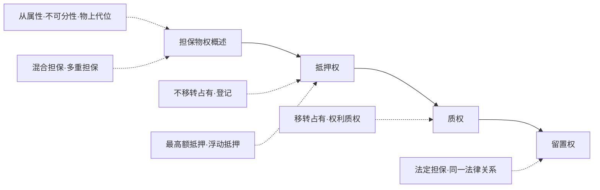
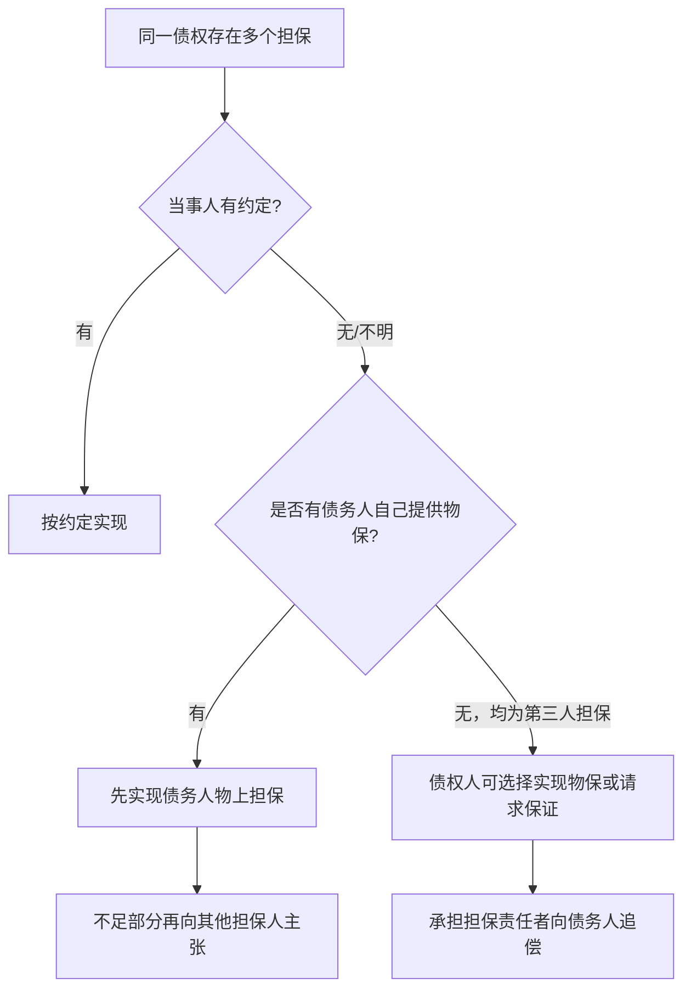
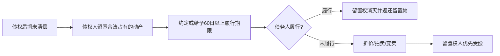

担保物权，是为担保债权实现而在债务人或第三人的特定财产上成立的定限物权，其核心不是使用物，而是支配担保财产的**交换价值**。

本章的主线可以压缩为三组问题：

1. **价值权结构**：担保物权以变价权和优先受偿权为中心，通常不以取得物的使用收益为目的。
2. **公示与控制**：抵押权多以登记发挥公示功能；动产质权和留置权以占有控制发挥担保功能。
3. **顺位与实现**：多个担保权并存时，核心是确定谁先受偿、是否有追偿、实现时是否需要清算。

> [!note] 课程范围
> 本章对应课件第七章“担保物权”，第 232-274 页。教材校准主要使用刘家安《民法物权》第七章。法条依据以《民法典》第 386-457 条及《担保制度解释》有关条文为中心。

## 章节地图

> [!tip] 复习抓手
> 担保物权一章先分清 `抵押=不移转占有`、`质权=约定交付控制`、`留置=法定占有控制`。随后围绕四个问题展开：设立、公示/占有、顺位、实现。

---

# 一、担保物权概述

## （一）概念与功能

> [!cite] [[民法典#第三百八十六条|民法典第386条]]
> 担保物权人在债务人不履行到期债务或者发生当事人约定的实现担保物权的情形，依法享有就担保财产优先受偿的权利，但是法律另有规定的除外。

担保物权的基本结构：

- 目的：确保债务清偿。
- 客体：债务人或第三人的物、权利或其他可供担保的财产利益。
- 内容：变价权 + 优先受偿权。
- 性质：他物权、定限物权、价值权。
- 典型类型：抵押权、质权、留置权。

刘家安将物上担保的基本思想概括为：在特定财产上确立特定债权人的优先受偿地位，使债权人不只依赖债务人的一般责任财产。

| 担保形态 | 担保基础        | 典型制度     | 风险控制方式    |
| ---- | ----------- | -------- | --------- |
| 人的担保 | 第三人信用及其责任财产 | 保证       | 扩张责任财产范围  |
| 物的担保 | 特定财产的交换价值   | 抵押、质押、留置 | 对担保财产优先受偿 |

> [!caution] 第三人物上担保
> 第三人为他人债务提供物上担保，属于“无债务，有责任”。担保财产变价不足以清偿全部债务时，债权人不得要求第三物上担保人继续清偿差额；第三人承担担保责任后，可以向债务人追偿。

## （二）担保物权的特性

### 1. 从属性

担保物权通常从属于被担保债权：

- 主债权不发生，担保物权原则上不发生。
- 主债权转让，担保物权原则上随同移转。
- 主债权消灭，担保物权原则上消灭。

> [!cite] [[民法典#第三百八十八条-第1款|民法典第388条第1款]]
> 担保合同是主债权债务合同的从合同。主债权债务合同无效的，担保合同无效，但是法律另有规定的除外。

最高额抵押、最高额质押是从属性缓和的典型场景：担保权可先于具体债权发生，担保范围待未来债权确定。

### 2. 不可分性

担保债权未受全部清偿前，担保物权人原则上可就担保财产的全部行使担保权。

- 债权部分清偿，不当然要求担保物权部分消灭。
- 担保物分割后，担保物权原则上仍存在于分割后的各部分。
- 实现时若担保财产为可分物，应受债权数额与比例限制，避免过度变价。

### 3. 物上代位性

> [!cite] [[民法典#第三百九十条|民法典第390条]]
> 担保期间，担保财产毁损、灭失或者被征收等，担保物权人可以就获得的保险金、赔偿金或者补偿金等优先受偿。

担保物权支配的是交换价值，因此担保财产灭失时，若出现价值替代物，担保物权可及于保险金、赔偿金、补偿金等。

> [!caution] 金钱给付后的特定化问题
> 物上代位的难点在于：保险金、赔偿金一旦支付给担保人并混入一般财产，担保物权人很难再就特定金钱主张优先。刘家安倾向于用“法定债权质”理解物上代位，即担保物权的效力先及于担保人对给付义务人的保险金、赔偿金、补偿金债权。《担保制度解释》第42条体现了这一思路。

### 4. 变价与优先受偿

> [!cite] [[民法典#第三百八十九条|民法典第389条]]
> 担保范围包括主债权及其利息、违约金、损害赔偿金、保管担保财产和实现担保物权的费用；当事人另有约定的，按照其约定。

担保物权不是取得担保财产所有权的工具。债务不履行时，担保权人原则上仍须通过折价、拍卖、变卖等方式实现担保，并进行清算：多退少补。

## （三）混合担保与多重担保

> [!cite] [[民法典#第三百九十二条|民法典第392条]]
> 同一债权既有物的担保又有人的担保时，先按约定实现；无约定或约定不明，债务人自己提供物保的，债权人应先就该物保实现债权；第三人提供物保的，债权人可以就物保实现债权，也可以请求保证人承担保证责任。

清偿顺序的判断：

第三担保人之间的相互追偿，原则上依约定或特定共同担保外观判断：

- 明确约定相互追偿及分担份额：按约定。
- 约定连带共同担保，或约定相互追偿但未约定份额：按比例分担不能向债务人追偿的部分。
- 未约定相互追偿，也未约定连带共同担保，且不属于同一份合同共同签署等情形：原则上不得请求其他担保人分担。
- 依据：[[担保制度解释#第十三条|担保制度解释第13条]]。

## （四）典型担保与非典型担保

《民法典》物权编典型担保物权为抵押权、质权、留置权。合同编及司法解释还承认若干具有担保功能的非典型担保，如所有权保留、融资租赁、保理、让与担保、保证金账户担保等。

| 类型 | 法律形态 | 担保实质 | 公示/对抗 |
| --- | --- | --- | --- |
| 所有权保留 | 出卖人形式上保留所有权 | 价款债权担保 | 未登记不得对抗善意第三人 |
| 融资租赁 | 出租人保有租赁物所有权 | 融资本息担保 | 未登记不得对抗善意第三人 |
| 让与担保 | 权利移转给债权人 | 清算型担保权 | 依财产类型完成相应公示 |

> [!tip] 功能主义理解
> 非典型担保的关键不是形式名称，而是是否“为债权实现提供特定财产上的优先受偿”。但在物权法定框架下，担保效果仍须受公示、清算和第三人保护规则限制。

---

# 二、抵押权

## （一）概念与特征

> [!cite] [[民法典#第三百九十四条-第1款|民法典第394条第1款]]
> 为担保债务的履行，债务人或者第三人不转移财产的占有，将该财产抵押给债权人的，债务人不履行到期债务或者发生当事人约定的实现抵押权的情形，债权人有权就该财产优先受偿。

抵押权的关键词是：**不移转占有 + 变价受偿 + 登记公示**。

- 抵押权为担保物权，以抵押财产的交换价值为内容。
- 抵押财产可为债务人财产，也可为第三人财产。
- 抵押权不要求抵押权人占有标的物，抵押人可继续利用抵押物。
- 抵押权实现时，抵押权人只能就抵押财产折价、拍卖、变卖所得优先受偿。

| 比较项 | 抵押权 | 动产质权 |
| --- | --- | --- |
| 是否移转占有 | 不移转占有 | 须移转或由质权人实际控制 |
| 公示基础 | 登记为中心 | 占有为中心 |
| 担保财产利用 | 抵押人继续使用 | 出质人通常失去直接使用机会 |
| 商业融资功能 | 适合保留生产经营使用 | 控制力强，但占用成本较高 |

## （二）抵押权的设立

### 1. 抵押合同

抵押合同属于设立抵押权的负担基础，通常应采用书面形式，并至少明确：

- 当事人：抵押权人、抵押人。
- 抵押财产：须为抵押人有权处分的财产。
- 被担保债权：种类、数额、履行期限、担保范围。
- 抵押财产名称、数量或可合理识别的描述。

> [!caution] 合同有效不等于抵押权已设立
> 不动产抵押尤其要区分抵押合同效力与抵押权设立效力。抵押合同生效后，抵押人负有协助办理登记的义务；登记完成前，债权人尚未取得不动产抵押权。

### 2. 不动产抵押：登记设立

> [!cite] [[民法典#第四百零二条|民法典第402条]]
> 以建筑物、建设用地使用权、海域使用权及正在建造的建筑物抵押的，应当办理抵押登记。抵押权自登记时设立。

不动产抵押的规则：

- 抵押合同生效：产生协助登记义务。
- 抵押登记完成：抵押权设立。
- 登记后：抵押权具有完整对世效力，可追及抵押财产受让人。

未办理抵押登记时的处理：

- 债权人可请求抵押人办理抵押登记：[[担保制度解释#第四十六条-第1款|担保制度解释第46条第1款]]。
- 因不可归责于抵押人的原因不能登记：债权人原则上不得请求抵押人承担约定担保范围内责任；若抵押人取得保险金、赔偿金、补偿金，可在所获金额范围内承担赔偿责任。
- 因可归责于抵押人的原因不能登记：债权人可请求抵押人在约定担保范围内承担责任，但不得超过抵押权能够设立时的责任范围。

### 3. 动产抵押：合同设立，登记对抗

> [!cite] [[民法典#第四百零三条|民法典第403条]]
> 以动产抵押的，抵押权自抵押合同生效时设立；未经登记，不得对抗善意第三人。

动产抵押的两层效力：

| 层次 | 规则 | 效果 |
| --- | --- | --- |
| 设立 | 抵押合同生效 | 抵押权已成立 |
| 对抗 | 完成动产抵押登记 | 可对抗善意第三人 |

未登记动产抵押权的主要弱点，见 [[担保制度解释#第五十四条|担保制度解释第54条]]：

- 受让人占有抵押财产后，抵押权人原则上不得向其行使抵押权，除非证明受让人知道或应当知道抵押合同。
- 抵押财产出租并移转占有后，租赁关系原则上不受影响。
- 其他债权人已申请保全或执行并采取措施，未登记抵押权人不得主张优先受偿。
- 抵押人破产时，未登记抵押权人不得主张优先受偿。

> [!cite] [[民法典#第四百零四条|民法典第404条]]
> 以动产抵押的，不得对抗正常经营活动中已经支付合理价款并取得抵押财产的买受人。

> [!example] 正常经营活动买受人
> 超市将一批货物设立动产抵押并办理登记后，在店内向顾客销售。顾客在正常经营活动中支付合理价款并取得货物，抵押权人不得向顾客主张抵押权。

### 4. 流押规则

> [!cite] [[民法典#第四百零一条|民法典第401条]]
> 抵押权人在债务履行期限届满前，与抵押人约定债务人不履行到期债务时抵押财产归债权人所有的，只能依法就抵押财产优先受偿。

流押约定并非当然导致担保合同无效。其效果是：债权人不能无清算地取得抵押财产所有权，仍须依抵押权实现规则变价或折价，实行多退少补。

## （三）抵押权的效力

### 1. 担保债权范围

担保范围先依当事人约定；无约定时，适用 [[民法典#第三百八十九条|民法典第389条]]：

- 主债权。
- 利息。
- 违约金。
- 损害赔偿金。
- 保管担保财产费用。
- 实现担保物权费用。

### 2. 抵押权标的物范围

抵押权效力可能及于：

- 从物：抵押权设立前产生的从物原则上及于抵押权；设立后产生的从物原则上不及于抵押权，但实现时可一并处分。依据 [[担保制度解释#第四十条|担保制度解释第40条]]。
- 添附物或补偿金：抵押后发生附合、混合、加工的，依 [[担保制度解释#第四十一条|担保制度解释第41条]] 判断。
- 孳息：抵押财产被法院扣押后，抵押权人有权收取天然孳息或法定孳息，但孳息先充抵收取费用。依据 [[民法典#第四百一十二条|民法典第412条]]。
- 代位物：保险金、赔偿金、补偿金等，依据 [[民法典#第三百九十条|民法典第390条]]。

### 3. 房地一体规则

> [!cite] [[民法典#第三百九十七条|民法典第397条]]
> 以建筑物抵押的，该建筑物占用范围内的建设用地使用权一并抵押；以建设用地使用权抵押的，该土地上的建筑物一并抵押。

房地一体的处理：

- 既有建筑物与建设用地使用权原则上一并抵押。
- 抵押后新增建筑物不属于抵押财产，但实现建设用地使用权抵押权时应一并处分；新增建筑物所得价款，抵押权人无权优先受偿。依据 [[民法典#第四百一十七条|民法典第417条]]。

### 4. 抵押权人的权利

| 权利 | 内容 | 依据 |
| --- | --- | --- |
| 变价权 | 折价、拍卖、变卖抵押财产 | [[民法典#第四百一十条|第410条]] |
| 优先受偿权 | 就变价所得优先清偿 | [[民法典#第三百八十六条|第386条]] |
| 保全权 | 抵押财产价值减少时请求停止、恢复价值、补充担保或提前清偿 | [[民法典#第四百零八条|第408条]] |
| 顺位利益 | 多重抵押时按登记/未登记规则清偿 | [[民法典#第四百一十四条|第414条]] |
| 物上代位 | 就保险金、赔偿金、补偿金等优先受偿 | [[民法典#第三百九十条|第390条]] |

### 5. 抵押人的处分权

> [!cite] [[民法典#第四百零六条-第1款|民法典第406条第1款]]
> 抵押期间，抵押人可以转让抵押财产。当事人另有约定的，按照其约定。抵押财产转让的，抵押权不受影响。

《民法典》第 406 条的核心变化，是回归抵押权的物权属性：

- 抵押人仍可转让抵押财产。
- 抵押权不因抵押财产转让而当然消灭。
- 抵押权人可在抵押财产转让可能损害抵押权时，请求提前清偿或提存转让价款。
- 禁止或限制转让约定是否对抗受让人，取决于是否登记及受让人是否知情，见 [[担保制度解释#第四十三条|担保制度解释第43条]]。

> [!caution] 抵押权关系不是单纯合同关系
> 抵押权设立后，担保物权关系可能存在于未参与抵押合同的人之间。例如抵押物转让后，抵押权人面对的是抵押物现所有人。刘家安因此主张：解释抵押权效力规则时，应将“抵押人”在许多场合理解为“抵押物所有人”。

### 6. 抵押权顺位

> [!cite] [[民法典#第四百一十四条|民法典第414条]]
> 同一财产向两个以上债权人抵押的：已登记的按登记时间先后；已登记的先于未登记的；未登记的按债权比例清偿。

顺位规则：

| 情形 | 清偿顺序 |
| --- | --- |
| 两个抵押权均已登记 | 登记在先者优先 |
| 一个已登记，一个未登记 | 已登记者优先 |
| 均未登记 | 按债权比例受偿 |
| 其他可登记担保物权 | 参照第414条 |

同一动产既有抵押权又有质权时，按登记、交付的时间先后确定清偿顺序。依据 [[民法典#第四百一十五条|民法典第415条]]。

## （四）特殊抵押权

### 1. 最高额抵押

> [!cite] [[民法典#第四百二十条-第1款|民法典第420条第1款]]
> 为担保一定期间内将要连续发生的债权，债务人或第三人提供担保财产的，抵押权人有权在最高债权额限度内优先受偿。

最高额抵押解决的是持续交易中的重复设押成本问题。

特征：

- 担保对象为一定范围内连续发生的不特定债权。
- 设立时须明确最高债权额、债权发生范围、确定期间或确定方法。
- 在债权确定前，单个债权转让时，最高额抵押权原则上不随之转让。
- 债权确定后，最高额抵押转化为担保确定债权的一般抵押权。

债权确定事由见 [[民法典#第四百二十三条|民法典第423条]]：

- 约定确定期间届满。
- 未约定或约定不明，设立满二年后请求确定。
- 新债权不可能发生。
- 抵押权人知道或应当知道抵押财产被查封、扣押。
- 债务人、抵押人被宣告破产或解散。
- 法律规定的其他情形。

### 2. 浮动抵押

> [!cite] [[民法典#第三百九十六条|民法典第396条]]
> 企业、个体工商户、农业生产经营者可以将现有以及将有的生产设备、原材料、半成品、产品抵押。

浮动抵押的特殊性：

- 抵押人限于经营主体。
- 客体为现有及将有的经营性动产。
- 客体具有集合性和动态性。
- 抵押财产在实现前需要确定。
- 属于动产抵押，仍适用登记对抗和正常经营活动买受人规则。

抵押财产确定事由见 [[民法典#第四百一十一条|民法典第411条]]：

- 债务履行期限届满，债权未实现。
- 抵押人被宣告破产或解散。
- 当事人约定的实现抵押权情形发生。
- 严重影响债权实现的其他情形。

### 3. 购置款抵押权

> [!cite] [[民法典#第四百一十六条|民法典第416条]]
> 动产抵押担保的主债权是抵押物的价款，标的物交付后十日内办理抵押登记的，该抵押权人优先于抵押物买受人的其他担保物权人受偿，但是留置权人除外。

购置款抵押权的制度功能，是避免在先浮动抵押“锁住”经营者未来融资能力。

适用要点：

- 主债权须为抵押物的购置价款或购置款融资。
- 抵押客体须为新购入的动产本身。
- 标的物交付后 10 日内完成登记。
- 可优先于买受人的其他担保物权人，但不得优先于留置权人。

## （五）抵押权的实现与消灭

抵押权实现方式：

- 协议折价。
- 协议拍卖、变卖。
- 未达成实现协议时，请求人民法院拍卖、变卖。
- 折价或变卖应参照市场价格。

抵押权消灭原因：

- 主债权消灭。
- 抵押权实现。
- 抵押物灭失且无代位物。
- 抵押权人放弃抵押权。
- 主债权诉讼时效期间届满后未行使，人民法院不予保护；《担保制度解释》第44条进一步明确抵押人可据此主张不承担担保责任。

> [!caution] “不予保护”与抵押权消灭
> 课件提示九民纪要与《担保制度解释》的表述差异。复习上宜掌握结论：抵押权人应在主债权诉讼时效期间内行使抵押权；届满后主张行使抵押权的，法院不予支持。至于实体上是否当然消灭，属于解释论争点。

---

# 三、质权

## （一）概念与类型

质权，是债权人为担保债权，基于对债务人或第三人移交的动产的占有，或基于可转让财产权，在债务不履行时就该动产或权利变价并优先受偿的担保物权。

《民法典》下的质权包括：

- 动产质权。
- 权利质权。

> [!tip] 质权的体系位置
> 动产质权以“占有控制”为核心；权利质权以“权利凭证交付或登记”为核心。二者同名为质权，但客体、公示和效力结构差异很大。

## （二）动产质权

### 1. 意义与特征

> [!cite] [[民法典#第四百二十五条-第1款|民法典第425条第1款]]
> 为担保债务的履行，债务人或者第三人将其动产出质给债权人占有的，债权人有权就该动产优先受偿。

动产质权特征：

- 客体为动产，不承认不动产质权。
- 须移转或由质权人取得实际控制。
- 内容为留置质物、变价处分、优先受偿。
- 质权人占有质物，负妥善保管义务。

### 2. 质押合同与流质规则

动产质权为意定担保物权，以质押合同为基础。质押合同应为书面形式，并明确被担保债权、质押财产、交付方式等事项。

> [!cite] [[民法典#第四百二十八条|民法典第428条]]
> 质权人在债务履行期限届满前，与出质人约定债务人不履行到期债务时质押财产归债权人所有的，只能依法就质押财产优先受偿。

流质约定与流押约定同理：不允许无清算取得质物所有权，仍须通过实现质权方式清算。

### 3. 质物交付

> [!cite] [[民法典#第四百二十九条|民法典第429条]]
> 质权自出质人交付质押财产时设立。

可设立动产质权的交付方式：

| 方式 | 是否可设立质权 | 说明 |
| --- | --- | --- |
| 现实交付 | 是 | 质权人取得直接占有 |
| 简易交付 | 是 | 质权人在质权设立前已占有质物 |
| 返还请求权让与 | 是 | 第三人直接占有时，通知直接占有人更具必要性 |
| 占有改定 | 否 | 出质人仍直接控制质物，不能实现质权的控制功能 |
| 债权人委托监管 | 可 | 监管人受债权人委托并实际控制货物时设立 |

> [!caution] 占有改定不能设立动产质权
> 第 228 条仅规定“动产物权转让”，而第 429 条要求质物交付。若出质人继续直接占有质物，债权人仅取得间接占有，质权的留置和控制功能落空，故不能设立动产质权。

委托监管设立质权：

- 债权人、出质人、监管人订立三方协议。
- 监管人受债权人委托监管，并实际控制货物。
- 质权自监管人实际控制货物之日起设立。
- 若监管人受出质人委托，或虽受债权人委托但未实际控制，质权未设立。
- 依据：[[担保制度解释#第五十五条|担保制度解释第55条]]。

### 4. 质权的善意取得

设立质权属于处分行为，出质人原则上须有处分权。若出质人无处分权，但其占有质物形成处分权外观，债权人善意并取得质物交付，可参照善意取得规则取得质权。

> [!caution] 动产抵押与动产质权的善意取得差异
> 动产质权依赖交付和占有外观，因此可较自然地适用善意取得。动产抵押不移转占有，缺乏足够公示基础，原则上不宜承认善意取得。

### 5. 动产质权的效力

质权人的权利：

- 留置质物：债权未清偿前拒绝返还。
- 收取孳息：除合同另有约定外，质权人可收取质物孳息；孳息先充抵收取费用。依据 [[民法典#第四百三十条|民法典第430条]]。
- 保全权：质押财产可能毁损或价值明显减少时，请求出质人提供相应担保；不提供的，可拍卖、变卖并提前清偿或提存。依据 [[民法典#第四百三十三条|民法典第433条]]。
- 物上请求权：质权受侵害时，质权人可请求返还、排除妨害、消除危险。
- 变价权与优先受偿权。

质权人的义务：

- 妥善保管质物；保管不善导致毁损、灭失的，承担赔偿责任。依据 [[民法典#第四百三十二条|民法典第432条]]。
- 不得未经同意擅自使用、处分质押财产。依据 [[民法典#第四百三十一条|民法典第431条]]。
- 债务履行或出质人提前清偿后返还质物。依据 [[民法典#第四百三十六条-第1款|民法典第436条第1款]]。

质权与抵押权并存：

| 情形 | 顺位 |
| --- | --- |
| 抵押先设立且先登记，质权后交付 | 抵押权优先 |
| 抵押先设立但未登记，质权后交付 | 质权优先 |
| 质权先交付，抵押后登记 | 质权优先 |

依据：[[民法典#第四百一十五条|民法典第415条]]。

## （三）权利质权

> [!cite] [[民法典#第四百四十条|民法典第440条]]
> 可出质的权利包括票据、债券、存款单、仓单、提单、可转让基金份额和股权、知识产权中的财产权、现有及将有的应收账款等。

权利质权是以可转让财产权为客体的质权。其存在基础是：可转让的财产权具有交换价值，可成为优先受偿对象。

| 客体 | 设立方法 | 依据 |
| --- | --- | --- |
| 汇票、本票、支票、债券、存款单、仓单、提单 | 权利凭证交付；无凭证的登记 | [[民法典#第四百四十一条|第441条]] |
| 基金份额、股权 | 办理出质登记 | [[民法典#第四百四十三条-第1款|第443条第1款]] |
| 注册商标专用权、专利权、著作权等知识产权中的财产权 | 办理出质登记 | [[民法典#第四百四十四条-第1款|第444条第1款]] |
| 应收账款 | 办理出质登记 | [[民法典#第四百四十五条-第1款|第445条第1款]] |

> [!caution] 不动产用益物权不作为权利质权客体
> 建设用地使用权、海域使用权等不动产用益物权可作为抵押权客体，而非权利质权客体。权利质权主要处理类似动产的可转让财产权。

---

# 四、留置权

## （一）意义

> [!cite] [[民法典#第四百四十七条-第1款|民法典第447条第1款]]
> 债务人不履行到期债务，债权人可以留置已经合法占有的债务人的动产，并有权就该动产优先受偿。

留置权是法定担保物权。其核心不是当事人约定设权，而是在满足法定要件时，由法律直接赋予债权人留置并优先受偿的地位。

特征：

- 法定担保物权。
- 客体为动产。
- 以债权人合法占有为前提。
- 具有留置、变价、优先受偿效力。
- 对动产质权和动产抵押权具有优先性。

## （二）构成要件

### 1. 债权人合法占有动产

债权人须已经合法占有留置财产。典型来源：

- 保管合同中的保管物。
- 承揽合同中的工作成果。
- 运输合同中的运输货物。
- 行纪关系中的委托物。
- 无因管理、拾得遗失物等法定之债场景中的可返还动产。

### 2. 债权与留置物属于同一法律关系

> [!cite] [[民法典#第四百四十八条|民法典第448条]]
> 债权人留置的动产，应当与债权属于同一法律关系，但是企业之间留置的除外。

同一法律关系的典型：

- 保管人因保管合同取得保管物占有，同时享有保管费债权。
- 修理人因承揽合同占有维修物，同时享有报酬债权。
- 承运人因运输合同占有货物，同时享有运费债权。

企业之间留置的例外，应结合 [[担保制度解释#第六十二条|担保制度解释第62条]] 限制理解：

- 企业之间非同一法律关系的留置，债权仍应属于企业持续经营中发生的债权。
- 企业之间非同一法律关系时，留置第三人财产的，第三人可请求返还。

> [!caution] “牵连关系”不等于“同一法律关系”
> 旧法和旧解释常用“牵连关系”，范围较宽。《民法典》第448条改用“同一法律关系”，刘家安认为应体现适当限制留置权发生的政策，以保护留置物所有人。

### 3. 债权已届清偿期

债权须已届清偿期且债务人未履行。若债权未届期，原则上不得以留置迫使债务人提前清偿。

### 4. 不存在不得留置的情形

不得留置的情形：

- 法律规定不得留置。
- 当事人约定不得留置。
- 留置违背公序良俗或特定公共利益，如紧急救灾物资。

## （三）留置权的效力

### 1. 留置标的物

留置权人可以拒绝返还留置物。该抗辩不仅可对债务人主张，也可对留置物受让人等第三人主张。

> [!tip] 裁判结构
> 留置抗辩成立时，不宜简单驳回返还请求。更适合的结构是附条件给付：回复请求权人履行债务后，留置权人返还留置物。

### 2. 收取孳息

> [!cite] [[民法典#第四百五十二条|民法典第452条]]
> 留置权人有权收取留置财产的孳息，孳息应当先充抵收取孳息的费用。

孳息充抵顺序：

1. 收取孳息费用。
2. 债权利息。
3. 原债权。

### 3. 变价处分与优先受偿

> [!cite] [[民法典#第四百五十三条-第1款|民法典第453条第1款]]
> 留置权人与债务人应当约定留置财产后的债务履行期限；无约定或约定不明的，留置权人应给债务人六十日以上履行期限，但鲜活易腐等不易保管的动产除外。

留置权实现需要经历：

> [!cite] [[民法典#第四百五十六条|民法典第456条]]
> 同一动产上已经设立抵押权或者质权，该动产又被留置的，留置权人优先受偿。

### 4. 物上请求权

留置权人为有权占有人。留置物被侵夺时，留置权人可基于占有保护请求返还，也可基于担保物权主张物权请求权。

## （四）留置权人的义务

- 妥善保管留置财产；保管不善导致毁损、灭失的，承担赔偿责任。依据 [[民法典#第四百五十一条|民法典第451条]]。
- 留置权消灭后返还留置财产。
- 实现留置权时应清算，多退少补。

## （五）留置权的消灭

> [!cite] [[民法典#第四百五十七条|民法典第457条]]
> 留置权人对留置财产丧失占有或者留置权人接受债务人另行提供担保的，留置权消灭。

消灭原因：

- 主债权清偿或因其他原因消灭。
- 留置权实现。
- 留置权人抛弃留置权。
- 留置权人接受债务人另行提供担保。
- 留置权人丧失占有。

> [!caution] 留置财产被盗时的解释
> 课件以“甲留置乙仓储货物，丙窃取该批货物”为例，提示第457条应限缩解释。刘家安亦认为，非基于留置权人意思而丧失占有时，若仍可通过占有保护或物权请求权回复占有，不宜认定留置权立即消灭；“丧失占有”更适合解释为自愿放弃占有或终局性丧失占有。

---

# 五、对比与考点压缩

## （一）抵押权、质权、留置权

| 比较项 | 抵押权 | 质权 | 留置权 |
| --- | --- | --- | --- |
| 发生原因 | 意定 | 意定 | 法定 |
| 是否移转占有 | 不移转 | 原则上须交付或实际控制 | 债权人已合法占有 |
| 典型客体 | 不动产、不动产权利、动产 | 动产、可转让财产权 | 动产 |
| 公示基础 | 登记 | 占有或登记 | 占有 |
| 核心功能 | 不影响担保物利用而融资 | 以控制物增强担保安全 | 以扣留物促使清偿 |
| 实现前宽限 | 一般无特别60日宽限 | 一般无特别60日宽限 | 原则上须约定或给予60日以上期限 |
| 优先规则 | 依登记/顺位 | 依交付/登记及第415条 | 同一动产上优先于抵押、质权 |

## （二）高频易混点

> [!caution] 易混点
> - 不动产抵押：登记设立；动产抵押：合同设立、登记对抗。
> - 动产抵押即使登记，也不得对抗正常经营活动中支付合理价款并取得抵押财产的买受人。
> - 占有改定可以转让动产所有权，但不能设立动产质权。
> - 留置权不是约定担保物权；不得以合同“创设留置权”，只能在法定要件具备时发生。
> - 流押、流质不再按“当然无效”处理，核心是禁止无清算取得担保财产。
> - 留置权优先于同一动产上的抵押权和质权，但其发生本身受严格要件限制。

> [!tip] 作答顺序
> 担保物权题可按 `权利类型 -> 设立要件 -> 公示/占有 -> 效力范围 -> 顺位 -> 实现/消灭` 展开。遇到多重担保，先问有无约定，再问是否有债务人自己提供物保，最后处理第三担保人追偿。
