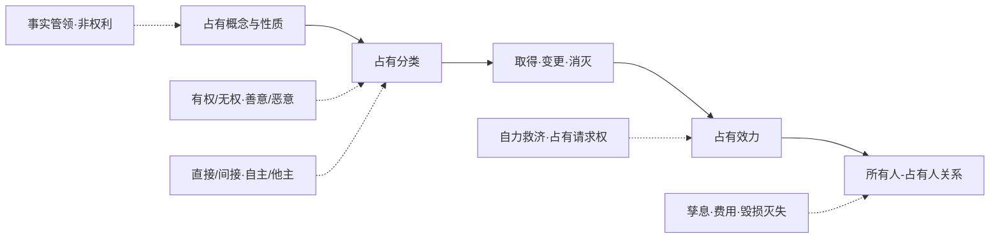
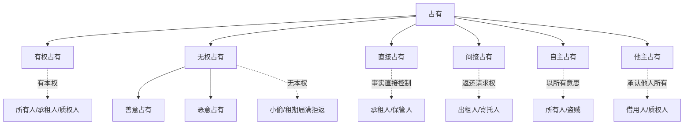

占有，是人对物事实上的管领与控制。它本身不是所有权、用益物权或担保物权，也不是一项独立的“占有权”，但法律会围绕占有事实配置保护、推定、取得和返还关系中的权利义务。

本章的主线可以压缩为四组问题：

1. **占有不是本权**：小偷、恶意占有人也可能成立占有，但不因此取得所有权。
2. **占有独立受保护**：占有保护旨在维护事实秩序与社会和平，不以占有人有本权为前提。
3. **占有类型决定效果**：有权/无权、善意/恶意、直接/间接、自主/他主，会影响返还、费用、孳息、损害赔偿等后果。
4. **回复请求权人—占有人关系**：权利人请求返还原物后，还要处理孳息、使用利益、必要费用、毁损灭失责任等附随问题。

> [!note] 课程范围
> 本章对应课件第八章“占有”，第 275-286 页。教材校准主要使用刘家安《民法物权》第八章。法条依据以《民法典》第 458-462 条为中心，并回接第 235 条返还原物请求权。

## 章节地图

> [!tip] 复习抓手
> 占有题先问：`谁在事实上控制物`，再问：`是否有本权`，再分善意/恶意、直接/间接、自主/他主。请求权基础不要混淆：权利人基于物权请求返还，多用第235条；占有人保护占有，多用第462条。

---

# 一、占有的概念、性质与功能

## （一）占有的概念

占有，是对物事实上的管领支配。判断时通常包含两个要素：

- **体素**：对物具有事实上的管领、控制。
- **心素**：具有占有意思，即将物置于自己事实支配之下的自然意思。

占有的客体原则上限于有体物，包括动产和不动产。占有可以发生在物的一部分上，如占有一宗土地中的特定区域。

> [!example] 小偷的占有
> 小偷盗得笔记本电脑后，虽不能取得所有权，也无占有本权，但其对电脑的事实控制仍构成民法上的占有。占有制度保护的是事实秩序，不先判断占有人是否为权利人。

## （二）占有不是权利

我国通说采占有事实说：占有本身不是一项权利，而是可引发法律效果的事实状态。

占有不是权利的理由：

- 《民法典》物权编第五分编名为“占有”，未称“占有权”。
- 占有保护独立于本权：即便占有人无权占有，也可在其占有被侵夺时请求保护。
- 占有保护的功能不在于确认权利归属，而在于防止私人暴力破坏既有事实秩序。

但占有也不只是纯粹事实：

- 占有人可享有占有返还、排除妨害、消除危险等请求权。
- 占有可成为善意取得、先占、取得时效等制度的事实基础。
- 在租赁、质押、留置等关系中，占有会强化占有人或间接占有人的法律地位。

> [!caution] “占有”不等于“占有权”
> 课件导入问题中“占有是否意味着占有权”的答案应是否定的。更准确的表述是：占有是一种事实状态，法律基于该状态赋予占有人若干保护和效果。

## （三）占有的功能

### 1. 保护事实秩序

占有保护以维护社会和平秩序为主要理由。即使所有权人认为他人无权占有，也不能以私人暴力夺回标的物，而应请求公力救济。

### 2. 权利推定

动产占有常与权利归属相吻合，因此法律可在一定范围内根据占有事实推定占有人享有相应权利。这种推定有利于降低举证成本并维护交易安全。

### 3. 权利取得

占有可能成为权利取得的基础：

- 动产物权变动通常以交付或交付替代为公示。
- 先占取得以占有无主动产为基础。
- 动产善意取得以受让人善意取得占有为核心要件之一。
- 取得时效制度中，占有期间是权利取得的中心事实。

---

# 二、占有的分类

## （一）有权占有与无权占有

| 类型 | 判断标准 | 示例 | 主要意义 |
| --- | --- | --- | --- |
| 有权占有 | 基于本权或法律上原因占有 | 所有人、承租人、质权人、留置权人 | 权利人不得依第235条请求其返还 |
| 无权占有 | 无本权或占有原因已消灭 | 小偷、租期届满拒不返还者 | 权利人可请求返还原物及处理孳息、费用、损害 |

> [!cite] [[民法典#第二百三十五条|民法典第235条]]
> 无权占有不动产或者动产的，权利人可以请求返还原物。

区分意义：

- 所有权保护中，权利人只能向无权占有人主张返还原物请求权。
- 占有保护中，无权占有人也可受保护。
- 善意占有、恶意占有的划分以无权占有为前提。

> [!caution] 无权占有也受占有保护
> 无权占有不等于占有不受保护。无权占有人不能对抗权利人的返还请求，但可对抗第三人的侵夺、妨害，以维护事实秩序。

## （二）善意占有与恶意占有

善意占有与恶意占有是无权占有的再分类。

| 类型 | 判断标准 | 效果重点 |
| --- | --- | --- |
| 善意占有 | 无权占有人误信自己有占有权源 | 费用偿还、使用利益、毁损灭失责任上较受优待 |
| 恶意占有 | 明知无权源，或对权源是否存在有怀疑仍占有 | 孳息、使用利益、损害赔偿责任更重 |

区分意义：

- 动产善意取得要求受让人取得占有时善意。
- 取得时效期间常因善意/恶意而不同。
- 回复请求权人—占有人关系中，善意与恶意影响孳息、费用、毁损灭失责任。

## （三）直接占有与间接占有

| 类型 | 判断标准 | 典型主体 |
| --- | --- | --- |
| 直接占有 | 对物有事实上的直接管领力 | 质权人、承租人、借用人、保管人 |
| 间接占有 | 基于占有媒介关系，对直接占有人享有返还请求权，从而间接支配物 | 出质人、出租人、出借人、寄托人 |

间接占有的成立基础是占有媒介关系，如租赁、借用、保管、质押等。直接占有人承认将来负返还义务，间接占有人通过该返还请求权维持观念上的管领。

> [!tip] 直接占有与交付替代
> 承认间接占有，是理解简易交付、返还请求权让与、占有改定的前提。占有改定之所以可移转动产所有权，是因为受让人取得间接占有；但其不能设立动产质权，因为质权需要质权人取得足以控制质物的占有。

## （四）自主占有与他主占有

| 类型 | 判断标准 | 示例 | 主要意义 |
| --- | --- | --- | --- |
| 自主占有 | 以所有的意思占有 | 所有人、小偷、拾得后据为己有者、所有权保留买受人 | 先占、善意取得、取得时效通常要求自主占有 |
| 他主占有 | 不以所有的意思占有，承认他人所有 | 承租人、借用人、保管人、质权人、留置权人 | 通常不发生取得时效等所有权取得效果 |

> [!caution] 自主占有不要求真实所有权
> 自主占有只看占有人的主观占有意思，不看客观上是否真的享有所有权。小偷对盗窃物通常是自主占有，但不是有权占有。

## （五）其他分类

| 分类 | 含义 | 主要意义 |
| --- | --- | --- |
| 和平占有 vs. 强暴占有 | 是否以暴力、胁迫方式取得或维持占有 | 影响取得时效、占有保护等评价 |
| 公然占有 vs. 隐秘占有 | 占有状态是否公开可被识别 | 影响取得时效等制度 |
| 自己占有 vs. 占有辅助 | 是否为自己占有，或仅受他人指示辅助占有 | 雇员、司机等通常为占有辅助人 |
| 单独占有 vs. 共同占有 | 一人或数人共同管领同一物 | 影响占有保护和返还关系 |

占有辅助人通常不是占有人。例如司机受雇驾驶车辆，事实控制车辆，但其控制基于雇主指示，通常由雇主作为占有人。

---

# 三、占有的取得、变更与消灭

## （一）占有的取得

占有取得可分为：

| 类型 | 含义 | 示例 |
| --- | --- | --- |
| 原始取得 | 非基于前占有人的占有移转而取得 | 先占无主动产、拾得遗失物、盗窃取得事实控制 |
| 继受取得 | 基于前占有人意思移转占有 | 买受人受领交付、承租人受领租赁物 |

取得占有通常要求对物形成事实支配，并具备占有意思。判断是否已取得占有，应结合生活观念与制度目的。

> [!example] 猎物追踪
> 猎人击伤野兔并持续追踪，虽尚未实际抓获，但在先占取得语境中，可较宽地认定其已开始取得占有；若讨论占有保护或取得时效，则更强调稳定、现实的事实管领。

## （二）占有的变更

### 1. 他主占有变更为自主占有

他主占有人若要变更为自主占有人，不能仅凭内心意思改变，通常须通过外部行为向间接占有人或权利人表现出“为自己所有”的意思。

eg.`承租人租期内默默产生“房屋归我”的想法，不足以使他主占有变更为自主占有；若明确拒绝返还并以所有人自居，才可能发生占有性质变化。`

### 2. 善意占有变更为恶意占有

善意占有人在知道或应当知道自己无占有权源时，其占有转为恶意占有。转为恶意后，使用、孳息、毁损灭失等责任加重。

## （三）占有的消灭

占有消灭包括：

- 因占有人意思消灭：抛弃占有。
- 非因占有人意思消灭：被窃、被抢、遗失、他人排他性取得占有。
- 间接占有消灭：占有媒介关系消灭，或直接占有人以自主占有意思否认间接占有人的返还请求。

> [!caution] 占有丧失的判断会随制度目的变化
> 为占有保护目的，被侵夺即通常构成占有丧失；为取得时效期间连续性目的，若短暂失去控制后及时回复，未必当然中断占有。

---

# 四、占有的效力

## （一）占有保护效力

### 1. 自力救济

占有人在特定范围内可行使自力救济：

- 自力防御：正在被侵夺或妨害时，即时防御。
- 自力取回：占有刚被侵夺后，在必要限度内及时取回。

自力救济须受必要性、即时性、比例性限制，不能扩张为私人暴力报复。

### 2. 占有请求权

> [!cite] [[民法典#第四百六十二条-第1款|民法典第462条第1款]]
> 占有的不动产或者动产被侵占的，占有人有权请求返还原物；对妨害占有的行为，占有人有权请求排除妨害或者消除危险；因侵占或者妨害造成损害的，占有人有权依法请求损害赔偿。

占有请求权包括：

| 类型 | 适用场景 | 功能 |
| --- | --- | --- |
| 占有物返还请求权 | 占有被侵夺 | 回复事实管领 |
| 占有妨害排除请求权 | 占有受妨害但未丧失 | 排除现实妨害 |
| 占有妨害预防/消除危险请求权 | 存在妨害危险 | 防止妨害发生 |
| 损害赔偿请求权 | 侵占或妨害造成损害 | 赔偿损失 |

> [!cite] [[民法典#第四百六十二条-第2款|民法典第462条第2款]]
> 占有人返还原物的请求权，自侵占发生之日起一年内未行使的，该请求权消灭。

### 3. 第462条与第235条的区分

| 比较项 | 第235条返还原物请求权 | 第462条占有物返还请求权 |
| --- | --- | --- |
| 请求权基础 | 物权或有占有权能的本权 | 占有事实 |
| 请求权人 | 所有权人及其他有占有权能的权利人 | 被侵夺占有的前占有人 |
| 相对人 | 现时无权占有人 | 侵夺人、概括继受人、恶意特定继受人等 |
| 是否考虑本权 | 要证明权利基础 | 原则上不以本权为判断中心 |
| 期间限制 | 不适用第462条一年除斥规则 | 侵占发生之日起一年内未行使即消灭 |

> [!caution] 本权抗辩受限制
> 占有保护制度的重点是禁止私力侵夺。即便侵夺人是所有权人，也不得当然以所有权作为抗辩来否定占有返还请求。

### 4. 谁可以主张占有返还

可主张者：

- 被侵夺占有的直接占有人。
- 间接占有人，原则上也应受占有保护，但主张方式可能表现为请求返还给直接占有人或请求让与返还请求权。
- 瑕疵占有人、无权占有人，也可基于占有事实主张保护。

相对人：

- 侵夺人。
- 侵夺人的概括继受人。
- 明知占有瑕疵而从侵夺人处受让占有的特定继受人。

## （二）权利推定效力

占有可推定占有人享有与其占有意思相应的权利，尤其在动产领域具有重要意义。占有外观通常是交易相对人判断权利归属的基础。

权利推定的作用：

- 减轻占有人证明权利的负担。
- 支撑善意取得中的交易信赖。
- 保护动产交易安全。

## （三）权利取得效力

占有可作为取得权利的事实环节：

- 动产所有权继受取得：交付通常是所有权变动要件。
- 善意取得：受让人须善意取得占有。
- 先占：以所有意思先于他人占有无主动产。
- 取得时效：以持续自主占有为核心。

---

# 五、回复请求权人—占有人关系

## （一）问题框架

当权利人向无权占有人请求返还原物时，原物返还之外还会产生四类附随问题：

1. 占有人是否返还孳息或使用利益。
2. 占有人能否请求偿还必要费用、有益费用。
3. 占有物毁损、灭失时谁承担损失。
4. 占有人能否在费用未受偿前拒绝返还。

> [!caution] 特别规范与一般规范
> 刘家安将第459-461条视为“回复请求权人—占有人关系”的特别规范。其目的主要是优待善意自主占有人，而非简单惩罚所有恶意占有人。但现行规范较粗，仍须与不当得利、无因管理、侵权责任等一般规则协调。

## （二）使用利益与孳息

### 1. 使用造成损害

> [!cite] [[民法典#第四百五十九条|民法典第459条]]
> 占有人因使用占有的不动产或者动产，致使该不动产或者动产受到损害的，恶意占有人应当承担赔偿责任。

规则整理：

- 恶意占有人使用占有物造成损害，应承担赔偿责任。
- 善意占有人正常使用造成损耗，原则上更受优待。
- 刘家安认为，若善意占有人对使用导致的损害尚可免责，则其对单纯使用利益原则上也不应负返还义务；恶意占有人即使未造成损害，也可能依不当得利返还使用利益。

### 2. 孳息返还

> [!cite] [[民法典#第四百六十条|民法典第460条]]
> 不动产或者动产被占有人占有的，权利人可以请求返还原物及其孳息；但是，应当支付善意占有人因维护该不动产或者动产支出的必要费用。

现行法文字上不区分善意、恶意，均要求返还孳息。但解释上仍需区分：

- 善意占有人已收取且仍存在的孳息，应返还。
- 善意占有人未收取或非因其消费、处分而不复存在的孳息，不宜要求折价补偿。
- 恶意占有人因过失未收取孳息，或使已收取孳息毁损灭失，可能须折价赔偿。

> [!caution] 使用利益与孳息的评价冲突
> 现行法对孳息返还采取较严格文字规则，但对善意占有人的使用利益可作较宽解释。刘家安指出二者存在评价张力：善意占有人自行使用挖掘机无需返还使用利益，却出租挖掘机必须返还租金，结果上并不完全协调。

## （三）费用偿还

费用类型：

| 类型 | 含义 | 处理规则 |
| --- | --- | --- |
| 必要费用 | 维持、保存占有物所必要的支出 | 善意占有人可依第460条请求偿还；恶意占有人在特定情形可依不当得利或无因管理主张 |
| 有益费用 | 改良物并增加现存价值的支出 | 善意占有人可在现存价值增加限度内请求偿还 |
| 奢侈费用 | 与保存或通常改良无关的高额装饰、无谓支出 | 原则上不得请求偿还 |

> [!example] 笔记本电脑风扇
> 甲窃取乙的笔记本电脑并赠与善意的丙。丙发现风扇损坏，花费 500 元更换。乙请求丙返还电脑时，若更换风扇属于维持电脑正常功能所必要的维修，丙作为善意占有人可主张必要费用偿还；若只是升级改装，则转入有益费用，只能在现存价值增加限度内处理。

### 费用未偿还前的拒绝返还

刘家安认为，现行法缺乏专门规则。可尝试通过留置权解释占有人在费用未受偿前拒绝返还，但该解释并不完全理想：

- 占有人费用偿还请求通常在回复请求权人请求返还时才现实发生。
- 此时更像“留置抗辩”，未必应产生变价优先受偿权。
- 同时履行抗辩也难以直接适用，因为返还请求与费用偿还请求并非双务合同对待给付。

> [!tip] 答题表达
> 费用问题可按“三分法”处理：必要费用先看善意占有人明文请求权；有益费用看现存价值增加；奢侈费用原则上不赔。恶意占有人的必要费用不要机械反面解释，可说明存在不当得利、无因管理补充适用空间。

## （四）占有物毁损、灭失

> [!cite] [[民法典#第四百六十一条|民法典第461条]]
> 占有的不动产或者动产毁损、灭失，权利人请求赔偿的，占有人应当将因毁损、灭失取得的保险金、赔偿金或者补偿金等返还给权利人；权利人的损害未得到足够弥补的，恶意占有人还应当赔偿损失。

规则分层：

| 占有人状态 | 保险金/赔偿金/补偿金 | 额外损害赔偿 |
| --- | --- | --- |
| 善意自主占有人 | 应返还已取得的替代利益 | 原则上不再赔偿不足部分 |
| 恶意占有人 | 应返还已取得的替代利益 | 权利人损害未足额弥补时，还应赔偿损失 |
| 善意他主占有人 | 应返还替代利益 | 不当然享受善意自主占有人免责，因其通常负有保管义务 |

> [!caution] 善意占有人的优待限于适当范围
> 善意自主占有人主观上以为自己是所有人，因此对其毁损、抛弃等行为不宜完全套用“对他人之物”的侵权注意义务。但承租人、保管人、质权人等他主占有人，即使不知道真正权利归属，也通常基于其占有媒介关系负有保管义务。

---

# 六、对比与考点压缩

## （一）第235条与第462条

| 题型提示 | 优先考虑 |
| --- | --- |
| 所有权人请求无权占有人返还物 | 第235条 |
| 质权人、居住权人等有占有权能的物权人请求返还 | 第235条 |
| 占有人被侵夺，要求恢复占有事实 | 第462条 |
| 占有受到妨害但未丧失 | 第462条排除妨害/消除危险 |
| 返还物后处理孳息、费用、毁损灭失 | 第459-461条 |

## （二）占有分类一图

## （三）高频易错点

> [!caution] 易错点
> - 占有不是权利，小偷也可能是占有人。
> - 无权占有仍可受占有保护；无权占有只是在面对权利人返还请求时处于不利地位。
> - 善意/恶意是无权占有的再分类，不是所有占有的通用前置分类。
> - 间接占有人没有直接控制物，但可被作为占有人保护。
> - 占有辅助人直接控制物，却通常不是占有人。
> - 自主占有看“所有意思”，不看是否真实享有所有权。
> - 第462条占有返还请求权有一年期间限制，第235条返还原物请求权不适用该期间。
> - 第460条的“返还原物及其孳息”应限于无权占有人返还关系，不宜替代第235条成为一般原物返还请求权基础。
