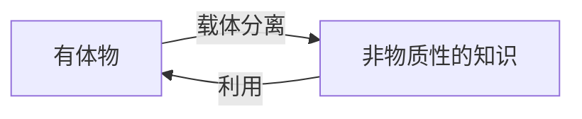
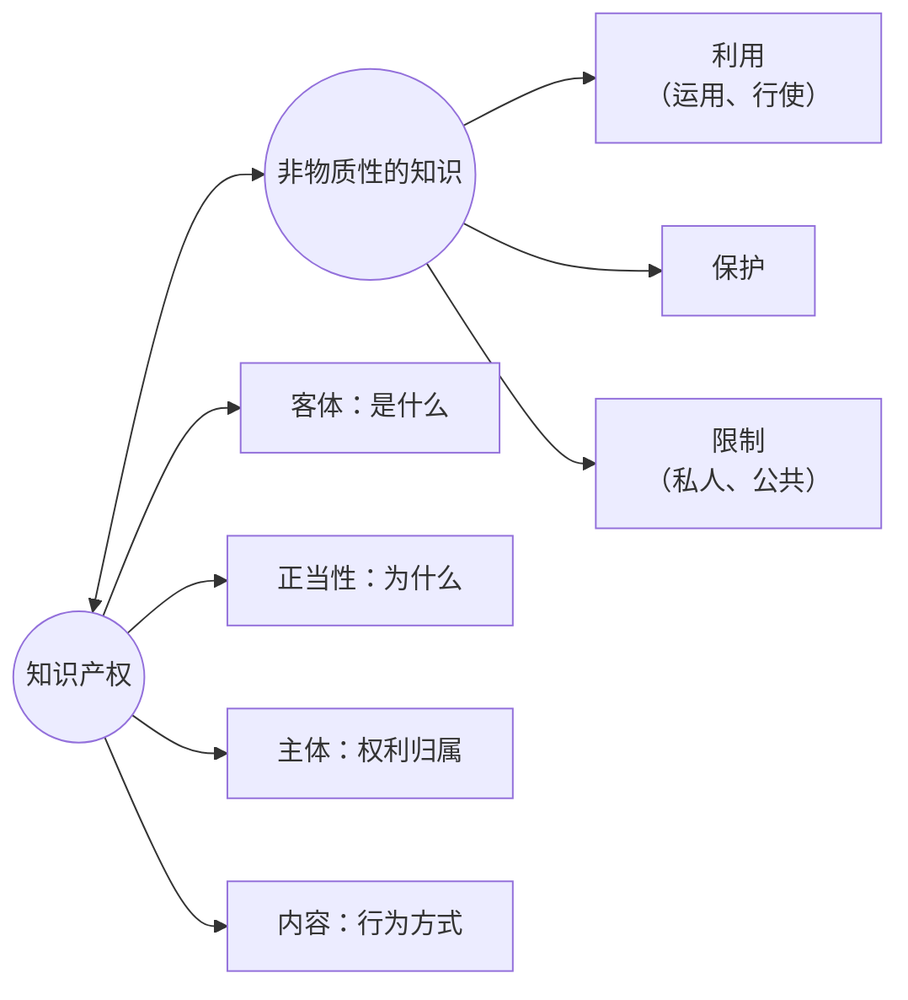
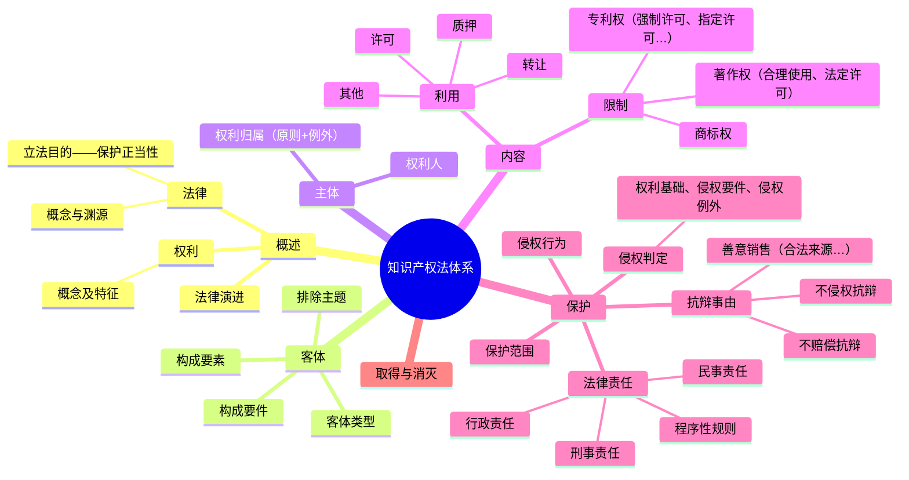
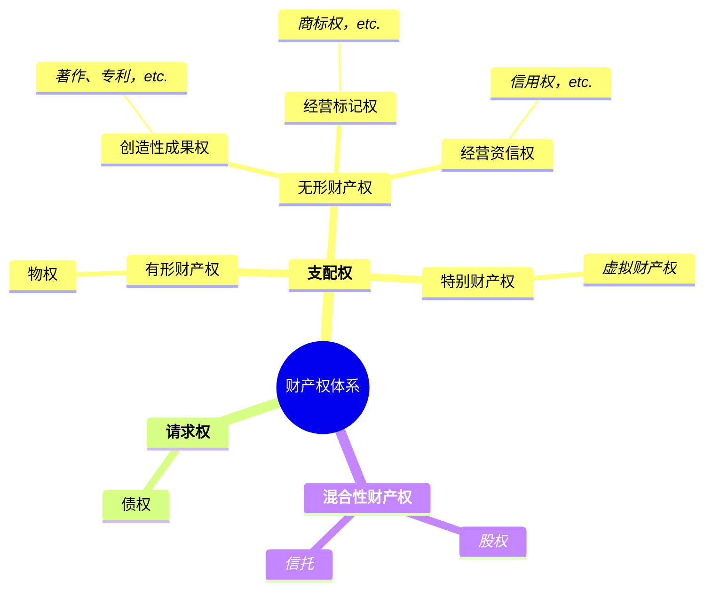
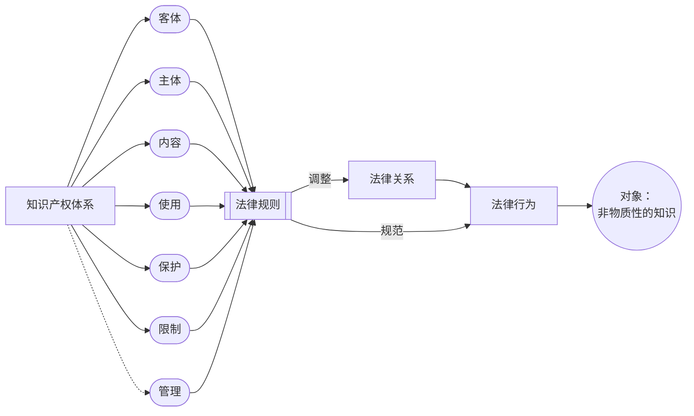
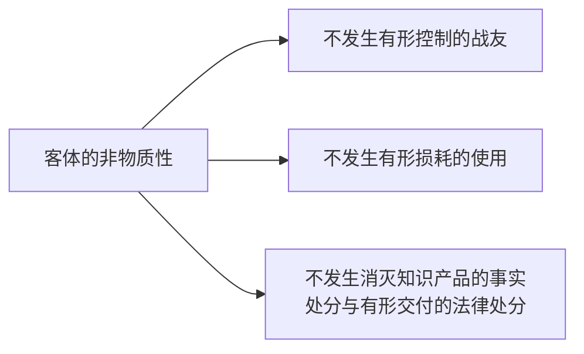

- 知识产权是在非物质性的知识的利益上赋予法的力量，其客体是非物质的知识

# 一、知识产权的概念与范围

## （一）知识产权的概念与分类
1. Intellectual Property
	1. Intellectual:智力成果——规制对象
	2. property:所有权，财产权

2. 什么知识能获得财产所有权？
	- 只有符合知识产权法规定的特定形态和特定的知识才可能成为知识产权的客体——知识产权法定
	- 知识财产→法定的稀缺性、排他性

> [!cite] 
> 波斯纳等认为法律上的财产应当具有三个特征：稀缺性、排他性、可交易性。
> 一是因稀缺而具有价值；二是能够归属于某一特定主体，该主体能够排除他人的共享和干涉；三是可以以一定的价格让渡给他人。——王迁：《知识产权法教程》

3. 知识产权的体系分析
	1. 财产权体系
		1. 物债二分
		2. 有体财产权、无体财产权
		3. 狭义财产权（有体、无体）、广义财产权（包括债权）

![[截屏2025-09-05 16.26.59.png]]

## （二）知识产权的定义

- 列举式
	- 列举知识产权主要组成
		- *将著作权、商标权、专利权合称为知识产权*
	- 完全列举知识产权的保护客体
		- eg. Trips, [[民法典#第一百二十三条]]

- 概括式
> [!cite] 
> - 知识产权是基于**创造成果**和**商业标记**依法产生的权利的统称。（刘春田）
> - 知识产权是人们对其**智力活动创造的成果**和**经营管理活动中的标记、信誉**依法享有的权利。（吴汉东）
> - 知识产权指在科学、技术、文化、艺术、工商等领域内，**智力创造成果**的完成人、所有人或**工商业经营活动**中工商业标志所有人依法享有的专有权利。（冯晓青）

- 定义式
> [!note] 定义：知识产权
>知识产权是<u>民事主体（自然人、法人、非法人组织）</u>依法对<u>创造成果、商业标记</u>等**知识**享有的**专有权利**

- Q.为什么是「**创造成果**」？
	- 不是劳动成果：成果非同质
	- 智力劳动
	- 智力成果
- Q.识别性的商标是创造成果吗？

## （三）知识产权的范围

- 广义
	- 著作权及相关权利
	- 专利权
	- 商标权
	- 商号权
	- 地理标志权
	- 商业秘密权
	- 集成电路布图设计权
	- 植物新品种权等
- 狭义
	- 著作权
		- 作品
	- 专利权
		- 发明、外观、实用新型
	- 商标权
		- 商标

# 二、知识产权的客体与分类 

## （一）知识产权的客体

### 1. **争议1** ：知识产权”客体——对象“合一说 vs. 二分论
-  ”客体——对象“二分论
	- 知识产权的**对象**：知识
		- 借由对它的支配、利用、控制而发生法律关系的事物：前提和手段
	- 知识产权的**客体**：权利人有权在对象上施加的能够产生一定利益关系的==行为==
		- 产生、变更、消灭相应的法律关系

- 民事权利客体比较

| 民事权利 | 权利客体 |
| ---- | ---- |
| 知识产权 | 知识   |
| 物权   | 物    |
| 债权   | 行为   |

### 2. **争议 2**：知识产权客体不同学说
1. **智力成果说**
	- Pro: 知识产权是智力劳动的成果
	- Con: 知识产权$\neq$智力成果权
		- 智力活动直接产生的是智力成果，而非法律上某项权利
		- 并非所有智力成果都能作为知识产权的客体受到法律保护
		- 概念外延不够周全，未涉及商业标记
2. **信息说**
	- 作为知识产权的客体的智力成果，一般均表现为一定的信息
3. **符号说**
	- 知识产权对象的财产形态均相似，同属于符号组合。→符号具有直观的形态样式。
4. **知识产品说**
	- 人们**在科学、技术、文化等精神领域所创造的产品**，具有发明创造、文学艺术创作等各种表现形式，是与物质产品（有体物）相区别而独立存在的客体范畴。→==知识形态的商品==
5. **知识说**
	- 知识产权的对象是以确定的、有限的「形式、结构、符号系统」等为存在方式的知识

![[DIKW model.png]]

### 3. 知识产权客体的特点
1. **非物质性**
	- （知识）时间上具有永续性
	- （载体）空间上可复制、可再现
	- 非竞争性、无法独占→法定
	- 因此，[[Chap1. 知识产权概述#（3）知识产权私权公权化的讨论与质疑|会有大量公权参与]]

2.  **创造性**
	- 独创性、先进性、显著性（可识别性）

3. **公开性**
	- 并非所有

### 4. 知识产权的客体类型

- ==创造成果==
	- **作品及其传播媒介**：
		- 文学、艺术、科学作品；表演、录音制品、广播电视
	- **发明创造**：
		- 发明、实用新型、外观设计
	- **商业秘密**：
		- 技术信息、经营信息等商业信息
	- **集成电路布图设计**：
		- 集成电路中至少有一个是有源元件的两个以上元件和部分或者全部互连线路的三维配置，或者为制造集成电路而准备的上述三维配置
	- **植物新品种**：
		- 经过人工培育的或者对发现的野生植物加以开发，具备新颖性、特异性、一致性和稳定性并有适当命名的植物品种

- ==商业标记==
	- 商标
		- 商品商标、服务商标
	- 地理标志
	- 商号
		- 区分生产经营主体的标识，是生产经营者的表征或标识。实践中多用「字号」或「企业名称」
	- 域名
		- 对应于互联网上数字地址的一串字母数字

> [!question] 知识产权客体的范围
> 1. 数据、网络虚拟财产（[[民法典#第一百二十七条]]）
> 2. 民法典涉及的其他权益——形象权/商品化权的法律属性
> 	- 《电影产业促进法》第 7 条 第 4 款  国家⿎励公民、法⼈和其他组织依法开发电影形象产品等衍⽣产品 。

## （二）知识产权客体的分类

### 1. 按客体功能分类

- **文学产权**
	- 著作权、邻接权
- **工业产权**
	- 专利权
	- 商标权
	- 商号
	- 商业秘密
	- 正当竞争权益
	- etc.

![[知识产权按客体功能分类.png]]

- 独占性、排他性程度
	- ==著作权==：
		- 他人独立完成的与之相近似甚至相同的作品？
			- **不排除偶合作品**
		- 对权利人有独创性的作品未经许可的商业性利用？
			- **排他性弱**
	- ==专利权==
		- 最先完成发明创造或就其发明创造最先提出专利申请
			- **一成果一权利**
	- ==商标权==：
		- 最先使用该商标或最先申请该商标注册
			- 例外：**商标共存**（有争议）
		- 与注册商标近似商标和与注册商标核定使用的商品类似的商品？
			- **排他性强**

- 权利取得
	- 自动取得；
	- 法定程序+注册/使用
- 取得条件
	- 独创性；
	- 新颖性、创造性、实用性；
	- 显著性
- 权利内容
	- 财产权+人身权；
	- 财产权
- 权利保护期
	- 作者有生之年+50年；
	- 20年、10年、15年；
	- 10年（续展）

工业版权：既需要保护表达、又需要保护功能

### 2. 按知识产权价值来源划分

![[截屏2025-09-06 14.54.32.png]]

# 三、知识产权的性质与特征

！！！！按照师姐 PPT 重新整理

## （一）知识产权的性质

### 1. 知识产权的本质是私权

- 这是由知识产权法所调整的社会关系的性质决定的

#### （1）知识产权作为私权：内容

| 确认标准 |     私权 VS 公权      | 知识产权 |
| ---- | :---------------: | :--: |
| 关系说  |   私人的权利——平等民事主体   | 平等主体 |
| 法律说  |  私有的权利——特定人享有的私权  |  私有  |
| 利益说  | 私益的权利——私人利益（意思自治） |  私益  |

（？存疑）

- 知识产权符合私权的一般确认标准，其产生、行使、保护适用民法的基本原则和制度。

> [!question] 发现权：是否属于知识产权
> - 发现权：发现人基于在自然科学研究中阐明自然现象、特征和规律，做出科学发现而依法享有的权利。
> - 内容：人身权主要表现表明身份权和荣誉权；财产权主要表现为获得报酬权和获得物质奖励权。
> 	- 因此，发现权不属于知识产权。但是，利用科学发现制成的产品受专利保护。

#### （2）知识产权作为私权：法律意义

1. 历史背景：知识产权的产生是来自封建特许权（国际、国内）
2. 现代：知识产权是私权为私人提供了获取财产的方式
	- 为权利人提供法律保障，激发从事智力活动的创造性和积极性。
	- 为知识的推广应用提供保障，使其产生市场上竞争力（经济效益和社会效益）。
	- 为国际文化交流和国际贸易提供法律准则，促进经济发展和人类进步。
	- 完善民事权利体系。
3. 知识产权是私权$\neq$不受国家公权力的调整与干预
> [!example] 举例
>- 举例1：著作权法——合理使用、法定许可专利法——强制许可、指定许可
>- 举例2：专利权由国家知识产权局审查授权商标权由国家知识产权局核准注册

#### （3）知识产权私权公权化的讨论与质疑

> [!question] 知识产权公权化
> 知识产权存在大量公权力的调整与干预，为什么说它是私权？

> [!example]  举例
>- 举例1：房屋（不动产）所有权
>	- 国家为了公共利益的需要，依法定程序征用私人房产一所有权是私权？公权？
>- 举例2：不动产登记
>	- 私房买卖需要在国家房地产管理机关进行产权变更登记一买家对不动产的所有权是否有行政权的性质？

> [!tip] 私权 vs. 公权
>公权与私权的判断标准：
>主体之间的关系：平等的关系 vs 不平等的关系
>权利的行使：以国家单方面意志为主vs以意思自治为主

- 私权是目的，公权是手段
- 在知识产权领域，尽管存在着公权力的调整和干预，但它调整的关系主要是民事主体之间的关系，权利的行使主要取决于民事主体之间的意思自治，知识产权是私权。

### 2. 知识产权法定

- **实体上**
	- **种类和内容法定**：知识产权种类、内容、保护期限等由法律明确 “规定”和“限定”，当事人不能自由创设（债权）。

- **程序上**
	- **行政确认**：国家主管部门对知识产权的确认和管理。

$$专门法律+法律保护范围+程序确认 \to 取得知识产权$$

| 知识产权 |             行政管理部门              |
| :--: | :-----------------------------: |
| 著作权  | 国家新闻出版署和国家版权局 （一个机构两块牌子，中宣部） |
| 专利权  |    国家知识产权局，下设专利局 内设复审无效部     |
| 商标权  |   国家知识产权局，下设商标局 内设商标评审委员会    |

### 3. 知识产权的人权属性

> [!example] 例子
>- 著作权的自动取得
>- 商标权通过使用而获得

> [!cite] 世界人权宣言
> 1948 年《世界人权宣言》第27条提出了知识产权意义上的三项人权：
> - “参加社会文化生活的权利”；
> - “享受科学进步及其产生的利益的权利”；
> - “对自己的智力成果享有法律保护的权利”。

1. 知识产权作为人权的**内容**
	- 创造者专有权
	- 社会公众使用权

2. 知识产权人权属性的**价值意义**
	- 知识产权为一项普遍的人权
	- 知识产权的保护对象是体现人类尊严和价值的智力成果
	- 知识产权的保护模式和水准，应有助于其他人权的实现

> [!question] 思考
>1. 如何理解社会公众对创造成果等知识的合理使用与享受？
>2. 是否可以称“使用者权”？
>	- 公众的“使用者权”是消极的使用者权，在到期后可使用

### 4. 社会性

- 知识产品进入市场流通后又成为促进社会发展与文明进步的重要因素，为后续知识产品的产生创造了条件。

### 5.人身权与财产权的融合性

- 一体两权
	- （部分知识产权）同时具备人身权和财产权的属性。
		- eg.*著作权*

### 6. 政策工具性

知识产权是国家用于维护自身利益，促进科技和社会发展的工具。

## （二）知识产权的特点

|      知识产权      | 物权  |
| :------------: | :-: |
| 财产权+（智力成果权）人身权 | 财产权 |
|    客体的非物质性     |  物  |
|   特定的专有性/排他性   | 排他  |
|    时间性、地域性     |     |
- 共同点：都是财产权、绝对权

#### 1. 客体的非物质性

![[知识产权与载体.png]]

> [!example] 举例
>- 举例1：权利取得
>	- 甲（画家）创作水墨画，出售给乙
>		- 甲享有著作权，乙享有所有权
> - 举例2：权利转让
> 	- 甲创作小说，手稿赠予乙，发行权转让丙
> 	- 甲享有著作权（除发行权），乙享有所有权，丙享有发行权
> - 举例3：权利侵犯
> 	- 丙偷了乙买的一本甲创作的小说，侵犯何人何种权利？
> 		- 丙侵犯了乙的所有权
> 	- 丙偷了乙买的一本甲创作的小说，将小说内容上传至互联网，丙侵犯何人何种权利？
> 		- 丙侵犯了乙的所有权，甲的信息网络传播权

客体的非物质性：
1. 知识产权利益实现需要法律保障
	- 知识产权法定  
2. 权价值实现源于客体的使用价值
	- 知识的利用  
3. 与物权发生权利冲突：让位于物权
	- 如：原件所有权转移的作品

> [!example] 《赤壁之战》壁画案
> `某饭店委托湖北美院画家创作壁画《赤壁之战》，十余年后，饭店翻修致壁画拆毁。画家认为其实施了“其他侵犯著作权益的行为”。`
> `1997年，该画（长17米、高3米）被收入《中国现代美术全集》壁画卷，被评价为“中国壁画复兴的代表作品之一”。`
> - 涉及法律问题：
> 	- 美术作品作者的著作权vs美术作品原件所有权人的所有权裁判要旨：
> - 美术作品原件所有权的转移，不视为作品著作权的转移。
> - 未约定权属，著作权属于画家，饭店取得了原件所有权及展览该原件的权利。
> - 作为美术作品原件的所有人，在法律规定范围内全面行使支配美术作品原件的权利时，可排除他人干涉。
> ==著作权人对作品原件的利用受到作品原件所有权的限制。==
> ——湖北省高级人民法院民事判决书（2003）鄂民三终字第18号

### 2. 特定的专有性

1. **知识产权的专有性**：主体、客体
	- 体现为保障**知识产权人**对其取得**知识产权**的知识使用的控制。

2. **知识产权的排他性**：他人、禁止权
	- 权利人依法可以独占其知识产权，排除他人未经许可的使用，以及获得许可但超出许可范围或者许可期限的使用。

3. 专有性、排他性例外：限制制度
	- 注意：
		- 知识——公开共享 vs 知识产权——专有性（有限制的专有性）

|         | 物权     | 知识产权                     |
| ------- | ------ | ------------------------ |
| 专有性来源   | 自然权利   | 法定权利                     |
| 侵犯专有性表现 | 直接作用于物 | 未经许可/无法律规定，实施侵权行为        |
| 保护专有性方式 | 可依靠占有  | 只能依靠法律（公开后的使用）           |
| 专有性受到限制 |        | 知识产权受到更多限制（限制制度；时间性、地域性） |

> [!question] 思考
> 1. 一项知识只能授予一个知识产权吗？
> 	1. 原则上是的：一项知识只能授予一个知识产权
> 	2. 例外：
> 		- eg. 实用艺术品著作权保护 vs. 外观设计专利权保护
> 			- 一个香水瓶，理论上既能申请实用艺术品著作权（最快），又能申请外观设计专利权
> 2. 一项知识只能授予一个知识产权吗？（接续？）
> 	1. 原则上是的
> 	2. 例外：实际上，在司法实务中没有明文禁止

### 3. 地域性

- **地域限制**：效力限于本国境内（一般采用领土说）
- **域外效力**：国际公约/双边、多边协定
- **地域限制的原因**
	- 客体非物质性
	- 权利法定 

### 4. 时间性

法律规定的期限内受保护（各国不同）

超过法定期限 一知识进入公共领域知识产权的社会性

知识客观上的“永续性”vs知识产权法律规定的“时间性”

目的：促进知识的传播、利用一科学文化发展

