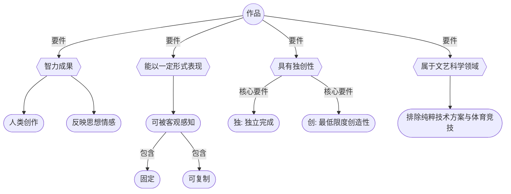
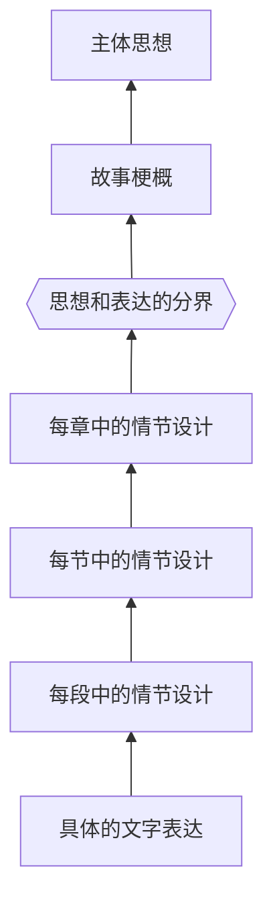
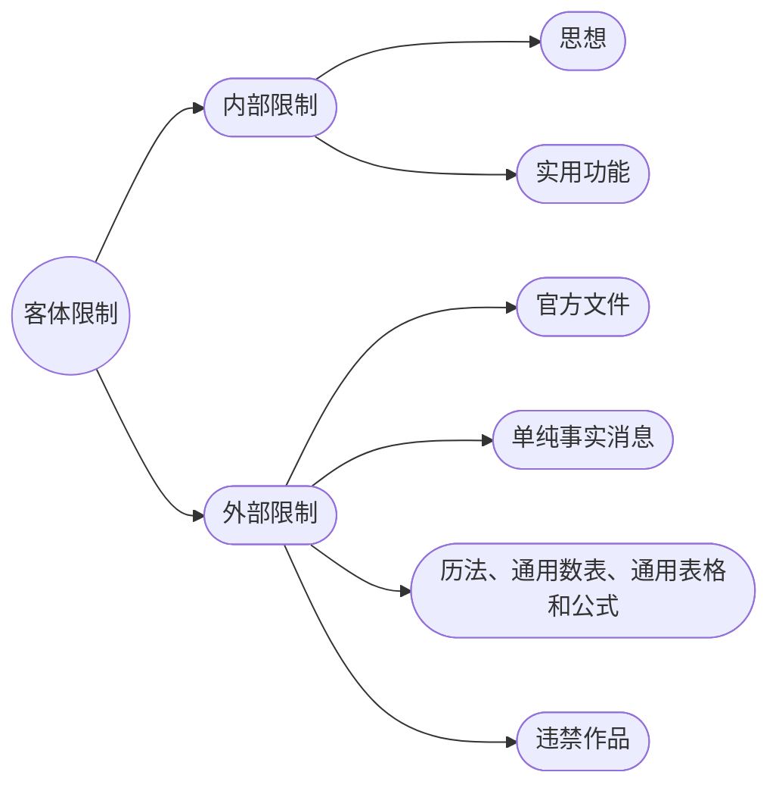
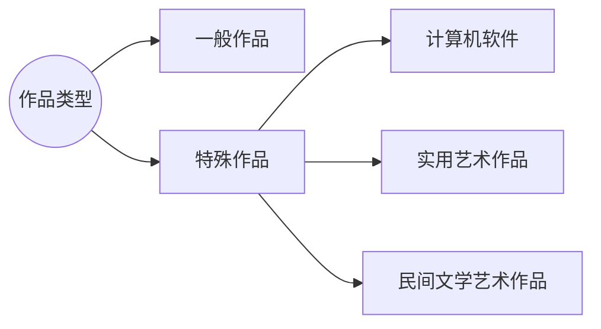

## 一、作品概念及构成要件
### (一) 作品的概念与构成要件

> [!cite] [[著作权法#第三条]]
>  本法所称的作品，是指<u>**文学、艺术和科学领域内**</u>具有<u>**独创性**</u>并能<u>**以一定形式表现**</u>的<u>**智力成果**</u>。
 
#### 作品构成要件清单 

- [ ]  **1. 属于智力成果**
- [ ]  **2. 能以一定形式表现**
- [ ]  **3. 具有独创性**
- [ ]  **4. 属于文学、艺术和科学领域内**

#### 1. 智力成果

- **核心**
	- 必须是**人类**智力劳动的创造性成果，
	- 反映作者的**思想情感**。
    
- **排除项**
    
    - **纯粹的自然风光** 
    - **动物的“创作”**：如著名的“猕猴自拍照案”，美国版权局裁定动物不能成为作者，作品必须由人创作 。
    - **人工智能生成内容 (AIGC)**：若无人类的智力干预和选择，仅为机器自动生成，目前司法实践倾向于不认定为作品。

> [!example] “文生图第一案”（春风送来了温柔案）
>“智力成果”指的是只有当作品凝结了人的智力劳动之后，才可能构成作品。
>法院认为，本案原告从构思图片起，到最终选定图片为止，进行了很多智力投入，比如设计人物的呈现方式、设计提示词、安排提示词的顺序、设计相关的参数等，因此认定涉案的图片满足“智力成果”要求。

> [!example] 例子
>案例：自动抓拍照片的可版权性？
>A产品名称：不按规定使用远光灯自动记录系统
>B演讲：“科技助力滥用远光灯专项整治”
>法院：著作权法保护的作品，其保护的对象为特定领域内人的思想的表达，且该种表达应具有独创性。
>涉案图片系由机器设定程序进行自动拍摄产生。机器设备、机器设备的所有者不必然为作品的创作主体，只有利用机器设备创作作品的人才能成为作品的实际创作者。
>A在机器设备预设自动抓拍程序，属于对生产销售产品的技术功能性设置，未体现其利用包含该技术功能的设备创作涉案图片的意图及表现，未实际进行图片创作。

#### 2. 能以一定形式表现

##### （1）内涵

- **核心**：作品能够被他人客观感知，存在不取决于作品的形式。
    
- **表现形式**: 文字、语言、声音、色彩、造型等 。
    
- **辨析“表现”、“固定”与“可复制”** 
    
    - **可表现 (感知)**：构成作品的必要条件。即兴演讲只要能被人听到，即可构成口述作品。
        
    - **可复制**：能以某种有形形式复制。
        
    - **固定**：被录制在一定介质上。对于电影等视听作品，固定是其构成要件之一。（更多是证据意义上的，而非法律意义上的）
        
    - **关系**：感知是前提，不要求必须固定或可复制。但固定是权利行使和证据保存的基础。$$可表现>可复制>可固定$$

##### （2）核心原则：思想表达二分

**理论基础**: 著作权保护思想的**表达方式**，而不延及**思想、程序、操作方法或数学概念**本身 。
    
- **目的**: 在保护作者表达与促进思想自由传播之间取得平衡。
    
- **如何区分“思想”与“表达”**：采用 **“抽象—过滤—比较”测试法**  。
    
    1. **抽象 (Abstraction)**: 将作品从最具体的文字表述层层向上抽象，直至最概括的主题思想。
        
    2. **过滤 (Filtration)**: 在抽象出的各个层次中，过滤掉属于“思想”范畴和“公有领域”的部分（如通用情节、历史事实、有限表达等）。
        
    3. **比较 (Comparison)**: 将过滤后剩下的具有独创性的“表达”部分与被诉侵权作品进行比较，判断是否构成实质性相似。

##### “思想”范畴的常见例子

- **题材**: 作品反映的社会现象或具体事物 。
    
- **主题**: 作品通过描绘现实生活或塑造艺术形象所表现出来的意义 (中心思想) 。
    
- **事实**: 某一事物的发展过程和规律 。
    
- **综艺节目模式**: 创意、流程、规则、技术规定等属于思想的综合体，不受保护。但节目中的剧本、舞美设计、音乐等具体表达可构成作品 。
    

##### 不受保护的特定表达

- **混同原则 (Merger Doctrine)**
	- 当某种“思想”只有一种或极其有限的表达方式时，该表达不受保护，以避免思想本身被垄断。
	    - _案例_: 答题卡、通用表格、北京地铁线路图 。
    
- **场景原则 (Scènes à Faire)**
	- 指由于主题或中心思想相同，故事的情节场景必定会发生，则必要场景不受保护。
	    - _案例_: 张剧雷剧案，以“英雄末路、骑兵绝唱”为主题的电视剧，三角恋、官兵关系等人物设置和关系属于必要场景 。

- 理论基础：思想——表达二分。保护表达不保护思想。

> [!cite] 法条
>- TRIPs协议第9条第2款        
>	- 版权的保护仅延伸至表达方式，而不延伸至思想、程序、操作方法或数学概念本身。
> - 美国《版权法》第102条（b）    
> 	- 在任何情形之下，不论作者在作品中是以何种方式加以描述、表达、展示或显现的，对原创作品的版权保护都不扩及作品中的一切属于想法、程序、过程、系统、操作方法、概念、原理及发现的部分。

> [!cite] 《北京市高级人民法院关于审理涉及综艺节目著作权纠纷案件若干问题的解答》（2015）
>综艺节目模式是综艺节目创意、流程、规则、技术规定、主持风格等多种元素的综合体。
>**综艺节目模式属于思想的，不受著作权法的保护**。综艺节目中的节目文字脚本、舞美设计、音乐等构成作品的，可以受著作权法的保护。

- 思想与表达的分界

#### 3. 文学、艺术和科学领域内

> [!cite] 伯尔尼公约指南
> 2.1 这一款的目的是给“文学和艺术作品”**下一个定义**。它通过两个手段来实现这一目的:行文时设想到**文学、科学和艺术领域内的一切产物**，并且不准许因它们的表现形式或方法而进行任何限制。
>
> 2.2 关于第一个手段，值得指出的是，这一概念也包含科学作品在内，尽管公约中没有明确提到它们。科学作品受著作权保护，不是因为它们的内容具有科学性:一部医学教科书、一部物理学论著、一部星空记录片之所以受保护，不是因为它们涉及医学、物理学和月球表面，而是因为它们是书籍和电影。**作品的内容绝不是受保护的条件**。通过提到一个不仅涉及文学和艺术而且涉及科学的领域，公约就把因它们采用的形式而受到保护的科学作品包含在这一概念之内。

#### 4. 具有独创性 (核心要件)

- **定义**: “原创性”，作品源于作者并能体现作者个人特征的本质属性 。
    
**包含两方面**:

- **（1）“独” (独立创作、源于本人)**: 
	- 不是对现有作品的复制、抄袭，也不是按照既定规则或常规进行的简单操作 。
	- 这是一个“有和无”的量上的判断。
		- 从无到有的原创
		- 在已有作品的基础上的再创作：可被识别的差异
    
> [!cite] 《最高人民法院关于审理著作权民事纠纷法律若干问题的解释》第15条 
 由不同作者就同一题材创作的作品，作品的表达系独立完成并且有创作性的，应当认定作者各自享有独立著作权。

- **(2) “创” (最低限度的创造性)**: 
	- 能够辨识出的属于作者特有的内容，如语言、逻辑、选择、编排等。成果完成过程给劳动者留下智力创作空间 。
	- 是一种“高与低”的判断，即对“质”的要求。
		- 与成果的质量/价值无关
	
- **与新颖性、艺术性的区别**:
    
    - **独创性 ≠ 新颖性/创造性 (专利法)**: 著作权法不要求作品是前所未有的，只要求是作者独立创作的 。
        
    - **独创性 ≠ 艺术性**: 法律不进行艺术或审美价值的判断，即使是艺术价值不高的涂鸦，只要满足独创性要求，也受保护 。

### （三）作品的组成要素

#### 1. 素材

#### 2. 整体与部分

#### 3. 角色

#### 4. 标题

---

## 二、不受著作权法保护的对象

著作权的客体是“作品”，但并非所有智力成果都能成为作品。著作权法通过一系列的“客体限制”来划定其保护范围，这些限制可以分为两大类：内部限制和外部限制。

> [!cite] [[著作权法#第五条]]
>本法不适用于：
>（一）法律、法规，国家机关的决议、决定、命令和其他具有立法、行政、司法性质的文件，及其官方正式译文；
（二）单纯事实消息；
（三）历法、通用数表、通用表格和公式。
## （一）官方文件

- **定义**：指法律、法规，国家机关的决议、决定、命令和其他具有立法、行政、司法性质的文件，及其官方正式译文。 
    
- **不保护原因**：
    
    1. **公共属性**：这类文件体现国家意志，是要求社会公众普遍了解和遵守的行为规范，必须允许自由地复制、传播和使用。 
        
    2. **公共资金支持**：国家机关由税收支持，其职能是为全体纳税人服务，因此其产出的官方文件不应为个人所独占。 
        
- **注意要点**：
    
    1. **法律汇编**：虽然法律条文本身不受保护，但对法律法规进行选择、编排而形成的“法律汇编”，如果体现了独创性，则汇编人对该汇编作品享有著作权。个人不得编辑出版法规汇编。 
        
    2. **官方发布**：著作权法不保护的是“官方发布”的文件，这与文件的起草者是谁无关。即使某法律草案由专家学者起草，一旦被国家机关采纳并作为官方文件发布，即进入公有领域。

## （二）单纯事实消息

- **定义**：指通过报纸、期刊、广播电台、电视台等媒体报道的，仅由客观事实（时间、地点、人物、事件）组成的消息。 12121212
    
 >[!note] 2020年修法变化
 2020年《著作权法》将第五条中的“时事新闻”修改为“单纯事实消息”，《著作权法实施条例》也相应将“时事新闻”定义为“通过……媒体报道的单纯事实消息”，使得表述更为精准。 
    
- **不保护原因**：
    
    1. **发现而非创作**：事实本身是客观存在的，报道事实属于“发现”，而非具有独创性的“创作”。 
        
    2. **唯一/有限表达**：对于一个客观事实，其表达方式非常有限，如果给予保护，会造成对事实本身的垄断。 
        
    3. **公共利益**：保障公民获取资讯和知识的基本权利，促进信息自由流通。 

> [!caution] 辨析：单纯事实消息 vs 时事性文章（新闻作品）
> 
> **单纯事实消息**：不受保护。例如：“十四届全国人大二次会议于今日在北京闭幕。” 
> **时事性文章（新闻作品）**：受保护，但其合理使用受到一定限制。
> 指对政治、经济、宗教等问题进行分析、评论、建议的文章。
> 例如：《人民日报社论：凝心聚力，推进强国建设、民族复兴伟业》。  根据《著作权法》[[著作权法#第二十四条|第二十四条]]，媒体之间可以相互刊登或播放已发表的时事性文章，但著作权人声明不得刊登、播放的除外。

## （三）历法、通用数表和公式

- **不保护原因**：这些内容是人类知识的共同财富，已为人们普遍运用，其本身是为了推动社会进步，不适用于著作权法保护。 
    
- **区分**：
    
    - **历法**揭示的日期、节气、节日等信息不受保护，但根据历法绘制的、具有独创性设计的==挂历、台历、日历==则可能构成美术作品而受保护。
        
    - **通用数表**（如元素周期表、函数表）vs **非通用数表**（如五代以内血亲表）。前者不受保护。
        
    - **通用表格**：如通用发票、通用会计账册表格等。
        
    - **公式**：如数学公式、物理公式等。

## （四）违禁作品

> [!cite] [[著作权法#第四条]]
>著作权人和与著作权有关的权利人行使权利，不得违反宪法和法律，不得损害公共利益。国家对作品的出版、传播依法进行监督管理。

- **历史演变**：
    
    - **1990/2001年《著作权法》**：明确规定“依法禁止出版、传播的作品，不受本法保护。”
        
    - **2010年《著作权法》**：删除了上述规定，改为“著作权人行使著作权，不得违反宪法和法律，不得损害公共利益。”
        
    - **2020年《著作权法》**：沿用了2010年的表述，并在第四条增加了“国家对作品的出版、传播依法进行监督管理。”

> [!attention] 改了吗？如改
>从“不受保护”到“依法监管”的修改使得违禁作品能被著作权法保护了吗？实际上在实务中没有区别。

---
## 三、作品的类型

### （〇）分类标准

- **是否公开发表**
	- 发表作品、未发表作品
- **署名方式** 
	- 真名作品、变名作品
- **创作基础**
	- 原创作品、二创作品（演绎作品）
- **创作内容**、**人员组织方式**
	- 职务作品与非职务作品
	- 单一作品与合作作品

### （一）按照表达形式划分

| 2010年《著作权法》                     | 2020年《著作权法》                     |
| ------------------------------- | ------------------------------- |
| （一）文字作品                         | （一）文字作品                         |
| （二）口述作品                         | （二）口述作品                         |
| （三）音乐、戏剧、曲艺、舞蹈、杂技艺术作品           | （三）音乐、戏剧、曲艺、舞蹈、杂技艺术作品           |
| （四）美术、建筑作品                      | （四）美术、建筑作品                      |
| （五）摄影作品                         | （五）摄影作品                         |
| （六）**电影作品和以类似摄制电影的方法创作的作品**     | （六）**视听作品**                     |
| （七）工程设计图、产品设计图、地图、示意图等图形作品和模型作品 | （七）工程设计图、产品设计图、地图、示意图等图形作品和模型作品 |
| （八）计算机软件                        | （八）计算机软件                        |
| （九）法律、行政法规规定的其他作品               | （九）**符合作品特征的其他智力成果**            |

> [!tldr] 作品类型化的必要性
>依据作品的表达形式不同，将作品划分为不同类型的必要性在于：
>**形式的不同导致保护规则（侧重）不同**，这体现在权利、归属、保护范围等
>>[!example] 例如
>>文字作品：侧重禁止他人非法复制作品
>>音乐、舞蹈等：侧重控制表演行为

#### 1. 文字作品
以语言文字为表达形式，体现一定思想情感。

> [!cite] 《著作权法实施条例》第四条
> 文字作品，是指小说、诗词、散文、论文等以文字形式表现的作品。

- **形式**：可以是文字（甚至具有独创性的产品说明书），也可以是数字形式（如具有独创性的统计分析表），甚至是符号（如盲文）。

> [!faq] 书法作品是文字作品，吗？
>书法作品是与文字相关的美术作品。
>如果我们关注其内容（eg.《兰亭集序》）则是文字作品
>如果我们关注其有独创性的线条等，是美术作品

#### 2.口述作品

- 即兴而作，口头语言组成，未以任何形式固定，直接承受者（听众）

> [!cite] 《著作权法实施条例》第4条
>口述作品，是指即兴的演说、授课、法庭辩论等以口头语言形式表现的作品。

- **定义**：指即兴的演说、授课、法庭辩论等以口头语言形式表现的作品。
    
- **独创性条件**：
    
    1. **完整的论述/叙述结构**：能够完整表达作者的思想情感。
        
    2. **独创的语言表达形式**。
        
    3. **口述的场合和环境**：区别于非公开的自言自语，==得有人听==。
        
- **保护难点**：
    
    - **固定问题**：口述作品无需固定在任何物质媒介上即可产生。这与美国法要求“固定”在有形媒介上不同，也因此在中国存在大量民间文学艺术作品的保护需求。
        
    - **举证问题**：由于未固定，权利人难以证明其内容和侵权行为。因此，对口述作品进行录音录像等==口述作品记录==是维权的关键。

> [!faq] 判断下列内容是否是口述作品，下列行为是否侵权
>（1）论坛专家讲解理论，听众记录并整理发表。✅侵权
>（2）体育赛事讲解员解说，平台未经许可转播。✅侵权
>（3）朗读郁达夫的《故都的秋》并解说，听众录音并传播。✅侵权
>（4）太太的客厅中的交谈，记录并发表。❌不是
>	日常谈话不是，因为没有完整表达一定思想情感

#### 3. 音乐、戏剧、曲艺、舞蹈、杂技艺术作品

这些统称为“艺术表演作品”，通过听觉、视觉感受，并以表演作为最终的实现形式。

##### （1）音乐

- **定义**：指歌曲、交响乐等能够演唱或者演奏的带词或者不带词的作品。
	
- **构成要素**：旋律（独创性最主要来源）、节奏、合声。
	
- **表现形式**：乐谱或即兴演奏。
	
> [!caution] 辨析：歌词是文字作品还是音乐作品？
> 在产业实践中，有时候，作词和作曲不会完全分开（周杰伦/方文山），因此歌词不必被强行分开规定为文字作品。音乐可以是带词或者不带词的作品。
> 当然，也有作词作曲可以分割的情况。
> >[!example] 《五环之歌》案
> >涉案广告中的“啊五环”“啊三环，你比五环少两环”以及“啊外环”“啊中环，你比外环少一环”四句内容较之《牡丹之歌》中“啊牡丹，百花丛中最鲜艳”一句，除仅有“啊”字这一不具有独创性的语气助词外，歌词部分既不相同也不相似，未使用歌词部分具有独创性的基本表达，表达的思想感情与主题亦完全不同，故**未侵害众得公司就歌词部分享有的改编权。**
> >
> >虽然被诉广告中的相应词句与《牡丹之歌》相应唱词的曲谱相同，但上述使用方式是涉及《牡丹之歌》曲作品和歌曲整体的改编权问题。而众得公司仅从词作者处获得相应授权，**未获得曲作者的相应授权**，无法以自己的名义单独主张曲作品及歌曲整体的相关权利。故法院最终判定驳回众得公司的全部诉讼请求。

##### （2）戏剧

> [!cite] 《著作权法实施条例》第 4 条
>戏剧作品，是指话剧、歌剧、地方戏等供舞台演出的作品。

> [!question] 戏剧作品是“剧本”，还是指包含了文学、音乐、舞蹈、舞美等元素的“一整台戏”？
>著作权法上的戏剧作品是「剧本」，“一整台戏”是「表演」。
>>[!cite] 著作权法导读与释义
>>戏剧作品，是以剧本等形式表现的作品，如话剧、京剧、广播剧等。
>
>我国著作权法倾向于将**剧本**视为**戏剧作品**。戏剧的表演中有独创性的部分，如舞美、音乐等可作为**美术作品**作品受保护。这有利于权利救济中进行“实质性相似”比对。

##### （3）曲艺作品

- **定义**：指相声、快书、大鼓、评书等以说唱为主要形式表演的作品。
	
- **表现形式**：文字（剧本）或口述。

##### （4）舞蹈作品

- **定义**：指通过连续的动作、姿势、表情等表现思想情感的作品。
        
- **表现形式**：
	- 舞谱，或人体动作、姿态、节奏、表情的组合。

> [!example] 单个、具体的舞蹈动作是否存在[[第2节 著作权客体：作品#4. 具有独创性 (核心要件)|独创性]]？
>一审：被诉装饰图案与《月光》舞蹈作品具有独创性的静态舞蹈动作存在实质性相似，侵权。
>
>二审：单从舞蹈作品保护客体的角度，单人的单一舞蹈动作，不足以达到舞蹈作品的独创性要求，不能作为舞蹈作品获得保护。
>
>再审：《月光》舞蹈中结合了人物造型、月光背景、灯光明暗对比等元素的特定舞蹈姿态并非进入公有领域的舞蹈表达，属于《月光》舞蹈作品具有独创性表达的组成部分。
^moonlightcase
##### （5）杂技艺术作品
- **定义**：指杂技、魔术、马戏等通过形体动作和技巧表现的作品。

- **区分**：保护的是具有美感的**艺术**，而非单纯的**技巧**。
	- 翻腾、跳跃、爬竿、顶碗等基本技巧，以及魔术中的掩饰性动作和技术方法，不受保护。
		- 例如，蹬伞和莲花舞蹬伞，前者是技巧，后者通过艺术化编排成为作品。

#### 4. 美术作品、建筑作品 

这类属于静态观看和欣赏的“造型艺术”。

#####  **美术作品**

- **定义**：指绘画、书法、雕塑等以线条、色彩或者其他方式构成的有审美意义的平面或者立体的造型艺术作品。
	
- **平面造型艺术**：线条、色彩、明暗构成的素描、油画、版画、书法等。
	
- **立体造型艺术**：三维空间内构造的雕塑、铸像、纪念碑等。

- [[第2节 著作权客体：作品#10. 实用艺术作品|实用艺术作品]]
##### **建筑作品**

- **定义**：指以建筑物或者构筑物形式表现的有审美意义的作品。
	
- **核心特征**：==艺术设计 + 实用功能==。
	- **保护审美**：
		- 保护的是形体构造（点、线、面等组成的建筑形象）
		- 与内部构造（墙壁、屋顶、地面组合）所表现的造型美。
	- 建筑材料、建筑方法、功能性设计不受保护。
	
- **保护客体**：既包括已建成的建筑物本身，也包括体现其外观美感的建筑设计图。仅用于施工的建筑设计图则属于“图形作品”。

> [!faq] 建筑作品 vs. 设计图纸、建筑模型
>>[!cite] WIPO《著作权与邻接权法律术语汇编》
>>建筑作品，是美术领域内的一种建造建筑物的创作。这种创作通常被理解为包含设计图、草稿和模型，以及已建成的建筑物或其他建筑性构筑物。
>
>在我国，**建筑作品**指的主要是**实体的「建筑物」**；
>- 体现了建筑美感的设计图可作为「美术作品」来保护；
>- 工程设计图可作为「图形作品」来保护。
>- 建筑作品模型具有一定独创性，满足[[第2节 著作权客体：作品#**模型作品**|模型作品]]要求的，可作为模型作品。

> [!cite] 《北京市高级人民法院侵害著作权案件审理指南》
> 
> 2.7【建筑作品】
> 建筑物本身或者建筑物的外部附加装饰具有美感的独创性设计，可以作为建筑作品受著作权法的保护。
> 建筑材料、建筑方法、功能性设计等不受著作权法保护。
> 体现建筑作品外观美感的建筑设计图，可以作为美术作品予以保护。
> 
> 2.8【图形作品】
> 仅用于施工的建筑设计图属于工程设计图。

#### 5. 摄影作品

- **定义**：指借助器械在感光材料或者其他介质上记录客观物体形象的艺术作品。
    
- **独创性体现**：
    
    1. 拍摄角度、距离、光线、明暗等因素的富有个性化的选择。
        
    2. 捕捉“瞬间的艺术”，体现作者的判断和构思。
        
    3. 对拍摄场景或者人物进行的独创性安排。
        
- **不受保护的情形**：
    
    1. **无独创性安排的拍摄**：对同一场景、人物的拍摄，无权阻止他人从同一角度进行。例如，游客照。
        
    2. **翻拍平面艺术作品**：属于复制行为，无法体现个性创作。例如，翻拍一幅画。
        
    3. **证件照**：通常因缺乏个性化选择而不被认定为作品。

#### 6. 视听作品

- **定义演变**：2020年《著作权法》将原“电影作品和以类似摄制电影的方法创作的作品”修改为“视听作品”，以适应技术发展。
    
- **定义**：指摄制在一定介质上，由一系列有伴音或者无伴音的画面组成，并且借助适当装置放映或者以其他方式传播的作品。
    
- **分类**：
    
    - **电影和电视剧作品**：著作权归制作者。
        
    - **其他视听作品**：如体育赛事直播画面、短视频、游戏画面等，著作权归属由当事人约定；无约定则归制作者。

> [!faq] 视听作品截图的保护：摄屏会导致侵权吗？
> 屏摄不是连续的画面，严格来说不是视听作品，当然也不是摄影作品（*归谬：以作为领接权的录像作品为例，假如其截图成为了著作权保护的摄影作品，那么截个图反而获得了更大的保护*）。
> 有观点认为，截图可以作为作品的组成部分，参照[[#^moonlightcase|舞蹈作品的保护]]。

#### 7. 图形作品、模型作品

##### **图形作品**

指为施工、生产绘制的工程设计图、产品设计图，以及反映地理现象、说明事物原理或者结构的地图、示意图等作品。

- **独创性**：体现在对素材的“取舍”、“判断”和艺术处理上，如地图对对象的选择（文物、美食）、标注和绘制方式。

##### **模型作品**
指为展示、试验或者观测等用途，根据物体的形状和结构，按照一定比例制成的立体作品。

- **独创性**：在于不违反科学性前提下的改变。精确按照一定比例对实物进行放大、缩小的模型，属于==复制件==，不构成模型作品。

> [!example] Model vs. Replica ：歼十模型案
>本案中要求保护的歼十飞机模型与歼十飞机，除材质、大小不同外，外观造型完全相同。无论模型制作者在将歼十飞机等比例缩小的过程中付出多么艰辛的劳动，未经过自己的选择、取舍、安排、设计，属于严格按比例缩小的技术过程。**产生的是复制件**，不构成受我国著作权法所保护的模型作品。

#### 8. 符合作品特征的其他智力成果

- **演变**：2020年《著作权法》将原“法律、行政法规规定的其他作品”修改为“符合作品特征的其他智力成果”。
    
- **意义**：从“法定主义”走向“开放式”条款。使得法院可以根据作品的“独创性”和“可复制性”等本质特征，将新技术发展带来的新类型表达形式（如音乐喷泉、烟花表演）及时纳入著作权保护范围，增强了法律的适应性。

#### 9. 特殊作品——计算机软件

- **定义**：指计算机程序及其有关文档。
    
- **特殊性**：其作用并非展示文学、艺术或科学美感，而是指挥计算机完成任务，**是一种实用工具。**
    
- **保护渊源**：起源于美国，后被《TRIPS协议》第10条规定，计算机程序应作为“文字作品”加以保护。
    
- **保护目的**：主要是为了防止未经许可的复制与抄袭。

#### 10. 实用艺术作品

- **定义（修订草案送审稿）**：指玩具、家具、饰品等具有实用功能并有审美意义的平面或者立体的造型艺术作品。
    
- **特点**：实用功能 + 审美功能。
    
- **保护条件**：==可分离性==，即其艺术性（审美功能）可以和实用功能**在物理上或观念上**分离开来。著作权法保护的是其实用艺术作品的==艺术性而非实用性==。

> [!note] 可分离性的判定
> 改动艺术性部分，会不会影响实用性的功能。

- **保护方式**：著作权（作为实用艺术作品或[[第2节 著作权客体：作品#**美术作品**|美术作品]]）和专利法（外观设计专利）可提供双重保护。

#### 11. 民间文学艺术作品

- **定义**：指由特定的民族、族群或者社群内不特定成员集体创作和世代传承，并体现其传统观念和文化价值的文学艺术的表达。
    
- **特征**：集体创作、口头流传、动态创作、变异性大、延续性长。
    
- **保护争议**：由于其权利主体难确定、缺乏固定形式、独创性较弱、创作期限久远等特点，与传统著作权制度存在冲突，保护面临困境。
    
- **现状**：我国《著作权法》第六条规定“民间文学艺术作品的著作权保护办法由国务院另行规定”，但相关条例（征求意见稿）尚未正式出台。

