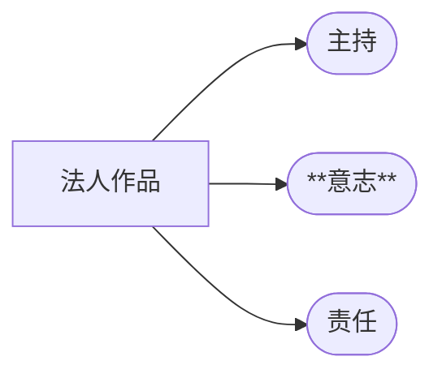
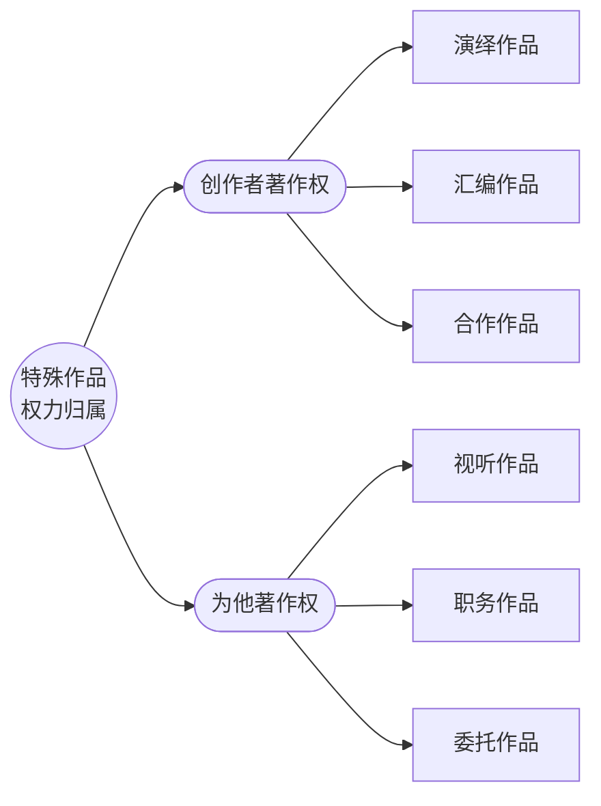

## 一、著作权主体 

### （一）著作权人的概念
著作权主体，即**著作权人**，是指依法对文学、艺术和科学作品享有著作权的人 。

> [!cite] 《著作权法》[[著作权法#第九条|第九条]]
> 著作权人包括:
> （一）作者；
> （二）其他依照本法享有著作权的自然人、法人或者非法人组织。

### （二）著作权人的类型

#### 1. 作者
- **事实作者**：客观上，只有具有思维能力的**自然人**才能进行创作活动，是作品唯一的事实作者 。
- **拟制作者 (Fictitious Author)**：在特定情形下，法律将**法人或非法人组织**视为作者 。
    - **要件**：
        1.  由法人或非法人组织**主持**创作；
        2.  代表法人或非法人组织的**意志**；
        3.  由法人或非法人组织**承担责任**。

 > [!cite] 《著作权法》第十一条第三款
> 由法人或者非法人组织**主持**， 代表法人或者非法人组织意志**创作**，并由法人或者非法人组织**承担责任**的作品，法人或者非法人组织视为作者。 

#### 2. 其他著作权人
指作者以外，通过法律规定或法律行为取得著作权的主体。
- **原始取得**：非作者，但在作品创作完成后直接取得著作权。
    - 视听作品的制作者（出品单位） 
    - 特殊职务作品的单位
    - 约定归委托人的委托作品 
    - 美术、摄影作品原件的展览权归属于原件所有人 
- **继受取得**：通过转让、继承/承受等方式从原权利人处获得著作权的主体 。

>[!question] 作者与著作权人是同一概念吗？
>不完全是。
>作者一定是进行事实创作的自然人，但著作权人可以是未参与创作的法人、非法人组织或通过继受方式取得权利的个人或组织。反之，作者也可能因法律规定（如特殊职务作品）或合同约定而不享有（完整的）著作权 。

## 二、著作权的取得

### （一）权利取得的原则：自动取得
我国著作权法采用**自动取得**原则，即著作权的产生无需履行任何手续。

- **实质要件**：**作品的产生**。这是取得著作权的唯一法律事实 。
- **形式要件**：在我国，无形式要件。作品一经创作完成，无论是否发表，作者即自动享有著作权。
	- 有的国家有对形式要件有要求，形式上主要有：
		- 加注标记取得（版权所有，all rights reserved，©️）
		- 登记取得（各国改进，用以确权）

>[!cite] [[著作权法#第二条-第1款]]
> 中国公民、法人或者非法人组织的作品，不论是否发表，依照本法享有著作权。

 > [!cite] 《著作权法实施条例》第六条
> 著作权自作品**创作完成之日**起产生。
>>[!faq] 什么是「创作完成」
>>包括**整体**创作完成与**局部**创作完成。
>>只要能够完整表达作者的思想情感，即使仅仅完成一个部分，也可以就这个部分获得著作权。

### （二）自愿登记制度
虽然著作权自动产生，但法律也设立了自愿登记制度。

- **法律依据**：
>[!cite] 《著作权法》[[著作权法#第十二条-第2款|第十二条第二款]] (新增)
> 作者等著作权人**可以**向<u>国家著作权主管部门认定的登记机构</u>办理作品登记。
- **登记作用**：
    1.  **证据作用**：登记并非产生著作权的前提，而是作为权利归属和合法来源的**初步证据** 。在诉讼中，著作权登记证书可以作为证据，减轻权利人的举证责任。
    2.  **交易便利**：在著作权交易和维权过程中，登记证书可以方便地证明权利状态。

### （三）著作权取得的类型

```mermaid
graph TD
    A[著作权的取得] --> B{{**原始取得**}};
    A --> C{{**继受取得**}};
    B --> B1["作品创作完成时即取得<br><i>(不依赖于在先权利)</i>"];
    B1 --> B2["<b>示例</b>: 作者对其创作的作品、法人作品"];
    C --> C1["通过受让、继承、受赠等方式<br>从原始著作权人处获得"];
    C1 --> C2["<b>示例</b>: 合同转让、遗产继承"];
````

- **原始取得 (Original Acquisition)**：基于创作事实而首次产生的权利，不依赖于任何在先权利。
    
- **继受取得 (Derivative Acquisition)**：通过法律行为（受让、受赠）或法律事件（如继承）从原权利人处取得权利。
    
    - **著作人身权的继受**：原则上，著作人身权（署名权、修改权、保护作品完整权）不可转让与继承。
        
    - **例外**：
        
        - **署名权**：绝对不可转让、继承。
            
        - **修改权、保护作品完整权**：作者死后，由其继承人或受遗赠人进行保护，使其不受侵犯。
            
        - **发表权**：有条件行使。若作者生前未明确表示不发表，其继承人或受遗赠人可以行使发表权。

>[!faq] 著作人身权是否可以继受取得？
> - 原则：著作人身权不可转让与继承
> - 例外：
> 	- 署名权一❌不可转让、继承
> 	- 修改权、保护作品完整权一✅继承人保护不受侵犯
> 	- 发表权一❓有条件行使
> 		- 作者生前未发表作品，作者未明确表示不发表，继承人可以发表；
> 		- 作者生前表示不发表，继承人不得发表

> [!question] 原始取得著作权人一定是作者吗？
> 
> 不一定。
> 例如，特殊职务作品的单位、视听作品的制作者，他们是原始取得著作权，但并非事实上的作者。他们的权利范围可能不完整（如不享有署名权）。

>[!faq] 原始取得和继受取得有什么差异？  
> 权利范围不同：是否可以享有完整的著作权
> ![[原始取得与继受取得的差异.png]]

## 三、权利归属基本原则：著作权属于作者

> [!cite] 《著作权法》第十一条
> 
> 著作权属于作者，本法另有规定的除外。
> 
> 创作作品的自然人是作者。
> 
> 由法人或者非法人组织主持，代表法人或者非法人组织意志创作，并由法人或者非法人组织承担责任的作品，法人或者非法人组织视为作者。 

```mermaid
graph LR
A((权力归属))
B{{基本原则：<br>权利属于作者}}
C([作者：<br>创作作品自然人])
D([拟制作者：<br>法人作品])
E[作者的确认：署名推定]
A-->B--> C & D -.->E
```

### （一）创作作品的自然人是作者

**创作活动**是著作权原始取得的根据

>[!cite] 《著作权法实施条例》第3条
著作权法所称创作，是指**直接产生**文学、艺术和科学作品的智力活动。
为他人创作进行组织工作，提供咨询意见、物质条件，或者进行其他辅助工作，均不视为创作。

### （二）拟制作者：法人作品



由法人或者非法人组织**主持**，代表法人或者非法人组织意志**创作**，并由法人或者非法人组织**承担责任**的作品，法人或者非法人组织视为**作者**。


### （三）作者的确认：署名推定原则

- **规则**：在作品上署名的自然人、法人或非法人组织，在没有相反证据的情况下，被推定为作者，并享有相应权利 。
    
- **意义**：这是一项证据规则，旨在减轻权利人的举证责任，加强著作权保护 。
    
- **署名方式**：可以是真名、笔名、艺名等，也可以是法人/组织的实际名称。署名方式通常遵循行业习惯（如音乐作品署作词、作曲）。
    
- **争议处理**：当署名发生争议时，法院会综合考虑作品性质、行业习惯、公众认知、技术因素（如数字水印）以及其他证据进行综合判断 。
	- 仅凭水印或权利声明不足以在有争议时确定权属 。


## 四、具体作品的著作权归属



### （一）创作者享有著作权的作品

#### 1. 演绎作品 
	派生作品、二手作品、“二创”

>[!cite] [[著作权法#第十三条]]
>改编、翻译、注释、整理已有作品而产生的作品，其著作权由改编、翻译、注释、整理人享有，但行使著作权时不得侵犯原作品的著作权。

- **定义**：改编、翻译、注释、整理已有作品而产生的新作品 。
    
- **权利归属**：著作权由==演绎者（改编人、翻译人等）享有==，但行使其权利时不得侵犯原作品的著作权 。

>[!faq] 思考
> 1. 创作演绎作品是否需要经过原作品著作权人许可？未经许可创作的演绎作品，是否会获得著作权？
> 演绎作品著作权的产生不依赖于原作品著作权人的许可。
> 演绎作品的使用需要双重许可。
> 
> 2. 演绎作者放弃其著作权，原作者权利是否受到影响？
> 不影响原作者权利的行使

- **独创性**：演绎者必须做出独立的智力贡献，产生实质性变化或差异。
    
- **“双重许可”**：使用演绎作品进行出版、表演等，需要同时取得**演绎作品著作权人**和**原作品著作权人**的许可，并支付报酬 。
  
 >[!note] 
> 演绎作品的著作权产生不依赖于原作者的许可。未经许可创作的演绎作品虽然也能自动获得著作权，但在行使（如发表、复制）时会受到限制，并可能构成对原作品的侵权 16。

>[!faq] 问题
>3. 古籍点校成果是事实还是整理类的演绎作品？
>	- 有争议，实践中认为有独创性的“注释”等可以是演绎类作品


#### 2. 汇编作品 

- **定义**：汇编若干作品、作品的片段或者不构成作品的数据或者其他材料，对其内容的**选择或者编排**体现独创性的作品。
    
- **权利归属**：著作权由==汇编人享有==，但行使时不得侵犯原作品的著作权 。
    
- **保护对象**：著作权仅保护其具有独创性的选择和编排结构，不延及内容本身 。


#### 3. 合作作品 

- **定义**：两人以上经过共同创作形成的作品。
    
- **构成要件**：
    
    1. **共同创作的合意**：各方有共同创作的意图。
        
    2. ==**共同创作的行为**==：各方均为创作成果做出了实质性的、独创性的贡献。仅提供辅助性工作（如资料整理、后勤支持）的人不能成为合作作者。
        
- **权利行使**：
    
    - **可分割使用的合作作品**：
	    - 作者对各自创作的部分可以单独享有著作权，但行使时不得侵犯合作作品整体的著作权 。
        
    - ==**不可分割使用的合作作品**==：
        
        - **协商一致原则**：著作权由合作作者共同享有，通过协商一致行使 。
            
        - **有限行使原则**：不能协商一致，又无正当理由的，任何一方不得阻止他方行使除**转让、许可他人专有使用、出质**（非权利变动）以外的其他权利，
	        
        - **正当行使原则**：但是所得收益应当合理分配 。
            
- **继承**：合作作者之一死亡后，其对合作作品享有的财产权，如无人继承又无人受遗赠，**由其他合作作者享有 。**

>[!example] 《我的前半生》著作权归属
>溥仪口述
>溥仪弟弟溥杰执笔
>出版社李某修改并重新构思，与溥仪重新撰写
>>[!cite] 《关于审理著作权民事纠纷案件适用法律若干问题的解释》第14条
>>当事人合意以特定人物经历为题材完成的自传体作品，当事人对著作权权属有约定的，依其约定；**没有约定的，著作权归该特定人物享有**，执笔人或整理人对作品完成付出劳动的，**著作权人可以向其支付适当的报酬。**


### （二）为他人创作而著作权另有归属的作品

#### 1. 视听作品

- **电影、电视剧作品**：著作权由**制作者**（出品单位）享有。但编剧、导演、摄影、作词、作曲等作者享有署名权，并有权按照合同获得报酬。

>[!caution]
>制作者$\neq$制片人（产业概念）

>[!note] 视听作品 vs. 演绎作品、合作作品
>视听作品是特殊的演绎作品、合作作品。
>对视听作品的使用不需要双重许可。
>但是，对视听作品再演绎需要取得对两个在先作品双重许可。


- **其他视听作品**（如短视频、体育赛事直播等）：
    
    - **约定优先**：著作权归属由当事人约定。
        
    - **无约定或约定不明**：归**制作者**享有，但作者享有署名权和获得报酬的权利。
        
- **可单独使用的部分**：视听作品中的剧本、音乐等可以单独使用的作品，其作者有权单独行使其著作权 。

>[!example] 迪迦奥特曼 上海

#### 2. 职务作品 
- **定义**：自然人为完成法人或非法人组织的**工作任务**所创作的作品。
    
- **构成要件**：
    
    1. **劳动或雇佣关系**：创作者是单位的工作人员。
        
    2. **履行职务行为**：创作是为了完成工作任务 。
        
- **权利归属与行使**：
    
  
```mermaid
    graph TD
        A[职务作品] --> B[一般职务作品];
        A --> C[特殊职务作品];
        B --> B1["<b>著作权归作者(员工)</b><br>但单位在其业务范围内有优先使用权。<br>作品完成两年内，未经单位同意，作者不得许可第三人以相同方式使用。"];
        C --> C1["<b>作者仅享有署名权</b><br>其他著作权归单位享有。<br>单位可给予作者奖励。"];
 ```
    
- **特殊职务作品的情形** ：
	
	1. 主要是利用单位的物质技术条件创作，并由单位承担责任的**工程设计图、产品设计图、计算机软件**等。
		
	2. 报社、期刊社、通讯社、广播电台、电视台的工作人员创作的职务作品。
		
	3. 法律、行政法规规定或合同约定著作权由单位享有的职务作品。

```mermaid
---
title: 特殊作品的构成要件
---
graph LR
A[特殊职务作品]
B([劳动关系])
C([主要利用条件])
D([责任])
A --> B & C & D
```
> 对比：[[第3节 著作权主体#（二）拟制作者：法人作品|法人作品]]，最大不同来自“意志”
> pov: 法人作品学习了版权法系的雇佣作者，在实务中法人作品和特殊职务作品区分的冲突是版权法系和作者权法系调和之间的冲突。

#### 3. 委托作品

- **定义**：受托人根据委托人的委托而创作的作品 。
    
- **权利归属**：
    
    1. **合同约定优先**：由委托人和受托人通过合同约定 。
        
    2. **无约定或约定不明**：著作权属于**受托人**。

- **委托人的使用权利**：
	1. **按约定使用：** 委托人**有权在约定的使用范围内使用该作品**。
	2. **在特定目的内使用：** 如果双方没有约定使用作品范围的，**委托人可以在委托创作的特定目的范围内免费使用该作品**

> 委托作品产生的是承揽合同，link 债法

### （三）与物权相关的特殊归属

#### 1. 作品原件所有权转移的作品

- **基本原则**：物权（所有权）与著作权相分离。作品原件所有权的转移，不改变作品著作权的归属 。
    
- **例外**：
    
    - **展览权**：美术、摄影作品原件的展览权由**原件所有人**享有 。
        
    - **发表权**：作者将**未发表**的美术、摄影作品原件转让给他人，受让人展览该原件不构成对作者发表权的侵犯 。

>[!example]  **案例启示**：
> - **《开国大典》油画案** ：博物馆拥有油画原件的所有权，但其著作权（如复制权）仍属于作者的继承人。博物馆提供底板给第三方制作金箔画并发行，构成侵权。
> - **钱钟书书信手稿拍卖案** ：书信手稿的原件所有权属于收信人（李国强），但信件内容的著作权、以及可能涉及的隐私权仍属于作者（钱钟书）及其继承人（杨季康）。未经著作权人许可，拍卖并展示手稿内容的行为可能构成侵权。

#### 2. 作者身份不明的作品

- **规则**：作者身份不明的作品，除署名权外，其著作权由**作品原件的所有人**行使。作者身份确定后，由作者或者其继承人行使著作权 。
    
- **孤儿作品 (Orphan Works)**：指作者身份不明，或者身份明确但查找不到的在保护期内的已发表作品。这类作品的使用在实践中存在障碍，《著作权法》修订草案曾提出过相应的许可使用机制，但现行法未明确规定。
    

## 案例分析 (IRAC)

### 案例1：《我的前半生》著作权归属案

- **I (Issue)**:
    
    - 溥仪口述、其弟溥杰执笔、出版社编辑李某修改并重新构思的自传《我的前半生》，其著作权应归属于谁？是否构成合作作品？
        
- **R (Rule)**:
    
    - `《最高人民法院关于审理著作权民事纠纷案件适用法律若干问题的解释》第十四条`：当事人合意以特定人物经历为题材完成的自传体作品，当事人对著作权权属有约定的，依其约定；没有约定的，著作权归该**特定人物**享有，执笔人或整理人对作品完成付出劳动的，著作权人可以向其支付适当的报酬。
        
    - 合作作品要求各方有共同创作的合意和共同创作的行为，且均对作品的独创性表达做出贡献。
        
- **A (Application)**:
    
    - 法院认为，该书的整个修改出版过程是在有关部门组织下进行的，李文达（出版社编辑）是有组织地指派帮助溥仪修改书稿，双方不存在合作创作的事实。
        
    - 《我的前半生》一书既由溥仪署名，又是溥仪以第一人称叙述其亲身经历为内容的自传体文学作品。该书的形式及内容均与溥仪个人身份联系在一起，反映了溥仪思想改造的过程和成果，体现了溥仪的个人意志。该书的舆论评价和社会责任也由其个人承担。
        
- **C (Conclusion)**:
    
    - 法院认定，溥仪是《我的前半生》一书的唯一作者和著作权人 43。
        
- **Practical Takeaway**:
    
    - 对于口述、他人执笔整理形成的自传体作品，在没有明确约定的情况下，著作权倾向于归属于经历的叙述者本人，执笔者、整理者的劳动可通过报酬方式获得补偿，一般不认定为合作作者。这体现了对作品思想内容来源和最终责任承担者的尊重。
        

### 案例2：小徐小说信息网络传播权转让案

- **I (Issue)**:
    
    - 9岁的小徐（限制民事行为能力人）创作了小说并将其信息网络传播权转让给某网站，该转让合同的效力如何？小说的著作权归谁？
        
- **R (Rule)**:
    
    - **著作权取得**：《著作权法》规定，作品自创作完成之日起自动产生著作权，作者即为著作权人。这与作者的民事行为能力无关。
        
    - **合同效力**：《民法典》第十九条规定，限制民事行为能力人实施的民事法律行为，需要经其法定代理人同意或者追认后才有效，但纯获利益或与其年龄、智力相适应的行为除外。转让财产权并非纯获利益行为，9岁儿童转让著作权也超出了与其年龄智力相适应的范围。
        
- **A (Application)**:
    
    - 小徐虽然只有9岁，是限制民事行为能力人，但他独立创作了小说，符合作品的构成要件，因此他自动成为该小说的作者和著作权人。其父母并未参与创作，不享有著作权。
        
    - 小徐转让信息网络传播权的行为属于处分财产权利的民事法律行为。由于他是限制民事行为能力人，且该行为超出了其年龄和智力可以独立实施的范围，因此需要其法定代理人（父母）的同意或追认。
        
    - 题中其父母明确表示反对，因此该转让合同无效。
        
- **C (Conclusion)**:
    
    - 正确说法是：小徐享有小说的著作权，但信息网络传播权转让合同无效 44。
        

## 引用法条

- **《中华人民共和国著作权法》**
    
    - 第2条 (p13)
        
    - 第9条 (p5, 6)
        
    - 第10条 (p9, 17)
        
    - 第11条 (p7, 24)
        
    - 第12条 (p14, 30)
        
    - 第13条 (p41)
        
    - 第14条 (p59)
        
    - 第15条 (p57)
        
    - 第16条 (p50)
        
    - 第17条 (p73)
        
    - 第18条 (p79)
        
    - 第19条 (p89)
        
    - 第20条 (p67)
        
    - 第21条 (p17)
        
    - 第48条 (p76)
        
- **《中华人民共和国著作权法实施条例》**
    
    - 第3条 (p26)
        
    - 第6条 (p13)
        
    - 第11条 (p85)
        
    - 第12条 (p83)
        
    - 第13条 (p71)
        
    - 第14条 (p64)
        
- **《中华人民共和国民法典》**
    
    - 第770条 (p90)
        
    - 第919条 (p90)
        
- **《最高人民法院关于审理著作权民事纠纷案件适用法律若干问题的解释》**
    
    - 第7条 (p14)
        
    - 第11条 (p64)
        
    - 第12条 (p89)
        
    - 第13条 (p8)
        
    - 第14条 (p65)
        
- **《世界版权条约》**
    
    - 第3条第1款 (p12)
        
- **《伯尔尼公约》**
    
    - 第2条第3款 (p47)
        

## 假设与备注

- **日期**：YAML frontmatter 中的日期 `2025-10-10` 是基于用户请求中提供的当前时间生成的。课件本身标注为“2025-2026秋季学期第四周”。
    
- **文件引用**：本笔记内容主要来源于 `2-3 著作权主体与权利归属--郝明英.pdf`，部分概念的理解参考了 `markDown1760083047936.md` 的录音稿内容，以确保对课件内容的准确阐释。
    
- **图片**：笔记中的内容为纯文本，无法直接嵌入PDF中的图片，但案例分析部分已根据图片内容进行了描述。
    
- **法条缩写**：在思维导图和部分文本中，`F` 加上数字（如 `F11`）是对《著作权法》第11条的缩写引用，与PPT课件中的标注方式保持一致。