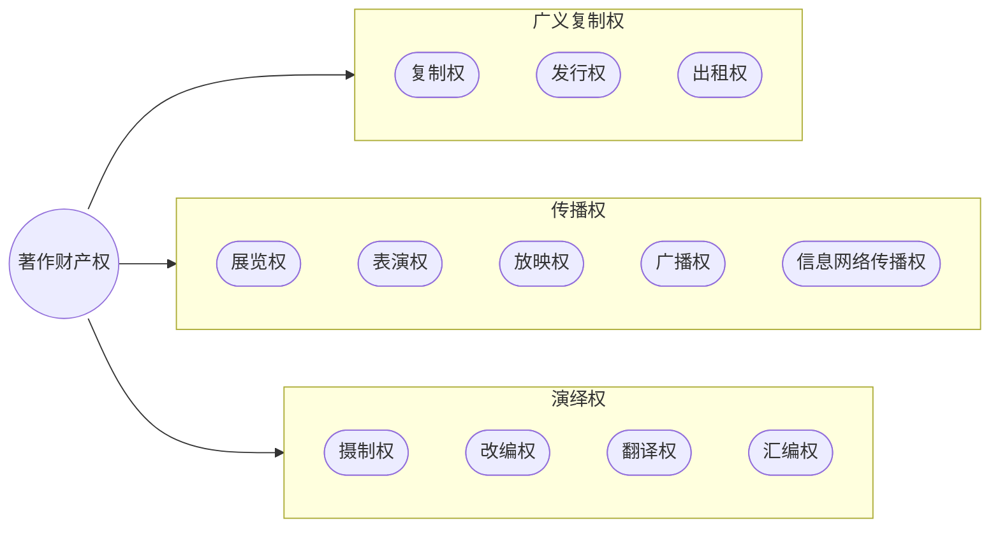
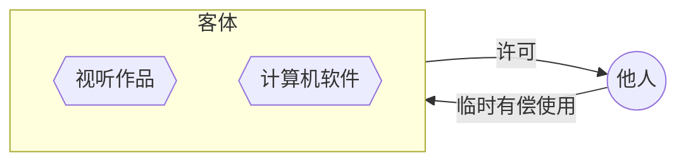
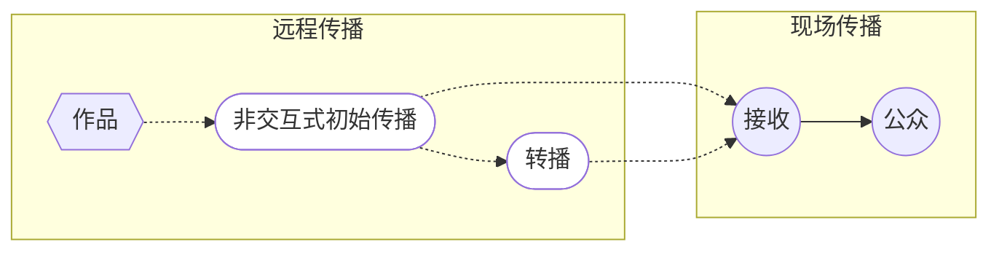

# 一、著作人身权

著作人身权，又称精神权利，是作者因创作作品而依法享有的、与作者人格利益和精神联系紧密的专有权利。

## （一）著作人身权概述

#### 1. 特点
- **权利产生**：源于作品的创作事实，区别于与生俱来的一般民事人格权 。
- **权利主体**：不仅自然人作者享有，被“视为作者”的法人或非法人组织也可享有 。
- **权利性质**：具有法定性和专属性，原则上==不得转让、继承和放弃== 。
- **权利保护期**：署名权、修改权、保护作品完整权的保护期**不受限制** 。

> [[2. 权利的分类#（二）人格权|比照学习：人格权]]

>[!tip] 著作人身权是民法人格权的一种特殊形态。
> - **相同**：**权利客体**——人格利益（不可转让）
> - **区别**：（著作人身权/民法人格权）
> 	- **权利产生**（依赖法律事实）
> 		- 作品的创作 vs 生命的存续
> 	- **保护范围**
> 		- 只涉及与作品有关的精神联系vs与主体紧密联系（姓名、肖像、荣誉、名誉等）
> 	- **权利性质**
> 		- 法定性 vs 自然权利
> 	- **权利存续**
> 		- 死后存续 vs. 消亡

#### 2. 权利内容
我国《著作权法》规定了四项著作人身权：发表权、署名权、修改权和保护作品完整权 。

> [!cite] 《著作权法》[[著作权法#第十条-第1款|第十条第一款]]
> 著作权包括下列人身权和财产权：
> （一）发表权，即决定作品是否公之于众的权利；
> （二）署名权，即表明作者身份，在作品上署名的权利；
> （三）修改权，即修改或者授权他人修改作品的权利；
> （四）保护作品完整权，即保护作品不受歪曲、篡改的权利；
> ……

## （二）发表权 

1.  **概念**：决定作品是否向不特定的公众公开的权利 。
	- **公之于众**：$$将作品公之于众的意愿+将作品公之于众的事实$$ 指将作品置于**不特定人**可以接触、感知的状态，**不以公众实际知晓为必要条件** 。
    - 形式包括有形的提供（出版、出租）和无形的感知（表演、广播、展览）
2.  **内容**：
    - **积极权能**：决定是否公开、何时、何地、以何种方式公开。
    - **消极权能**：有权阻止他人违背作者意愿将未发表作品公之于众 。
	    - 他人未经许可擅自发表其作品，作者不丧失对作品的发表权。
3.  **特点**：
    - **一次性权利、不可逆转**：作品一经发表，权利即告穷尽。后续的使用行为受著作财产权控制，而非发表权。
    - **与财产权关系密切**：发表是作品实现财产利益的起点 。
    - **可继承（有条件行使）**：作者生前未明确表示不发表的作品，其发表权在作者死后50年内可由继承人、受遗赠人，或作品原件所有人（无继承人/受遗赠人）行使 。

>[!caution] 限制
>1. 转让许可协议（使用权）对发表权的限制
>2. 合作作品、演绎作品规则对发表权的限制
>	任何一方不得阻止（除转让、许可转有使用、出质外的）其他权利/双重许可
>3. 第三人权利的限制（肖像、民语、隐私、个人信息保护）
>4. 保护期的限制

## （三）署名权 
1.  **概念**：表明作者身份，在作品上署名的权利 。
2.  **内容**：
    - **积极权能**：决定是否署名、署何种名（真名、笔名、艺名等），以及署名方式 。
    - **消极权能**：禁止他人在自己的作品上冒名署名 。
3. **署名权的规则**：
	1. 一般作品
	2. 特殊类型作品（[[第3节 著作权主体#1. 演绎作品|演绎]]、[[第3节 著作权主体#2. 职务作品|特殊职务]]、[[第3节 著作权主体#1. 视听作品|视听作品]]）
	3. 限制：另有约定/无法指明（实用艺术品、建筑作品）
4.  **署名权的放弃**：
    - 理论上，作为人身权，署名权不得放弃和转让 。
    - 司法实践中，“放弃署名权”的声明通常被解释为作者“**同意不署名**”作为署名权的行使，而非权利本身的丧失。作者依然有权阻止他人冒用其名义 。

>[!question] 冒名作品侵犯了何种权利？
>1.  **侵犯了著作权人的署名权**：冒用他人之名发表劣质作品，会损害作者的声誉（精神权利）。
>2.  **侵犯姓名权**：[[2. 权利的分类#（4） 民法典 第一千零一十二条 姓名权 / 民法典 第一千零一十三条 名称权|冒用]]
>3.  **可能构成不正当竞争**：假借他人名声捞取利益，属于“搭便车”行为 。
>2020年《著作权法》第五十三条第八项明确将“制作、出售假冒他人署名的作品”列为侵权行为 。但是在理论上有争议：因为。???????????

>[!example] 署名顺序不受署名权控制
>合作作品的所有参与者均已在作品上署名的情况系发生署名顺序纠纷，不涉及“表明作者身份”的署名权利益被侵害的问题，仅涉及各个创作者对在合同创作中的地位或贡献的争议。

## （四）修改权 

1.  **概念**：修改或者授权他人修改作品的权利 。
2.  **内容**：对作品内容局部的变更以及文字内容的修正。已完成的作品（[[第3节 著作权主体#（一）权利取得的原则：自动取得|完整表达作者思想情感]]），因作者思想感情变化而进行修改。
3.  **限制**：
	- **合同限制**：在图书出版、视听作品制作等过程中，作者许可他人使用作品时，通常也默许对方进行必要的、非实质性的修改、删节 。
	- **物权限制**：修改权并非绝对，不能对抗物权。
		- 例如，*美术、建筑作品的原件所有人有权处分其财产，即使这种处分会改变作品形态 *

 >[!cite] 《著作权法》第三十六条
图书出版者经作者许可，可以对作品修改、删节。
报社、期刊社可以对作品作文字性修改、删节。对内容的修改，应当经作者许可。

## （五）保护作品完整权 

1.  **概念**：保护作品不受歪曲、篡改的权利，是一种消极权能 。
2.  **歪曲、篡改的判断标准**：
    - **主观标准**：未经许可改动作品 。
    - **客观标准**：改动行为的后果足以损害作者的名誉或声望 。
	    - 其实，如果改动行为违背作者意思地增益其名誉，也算侵害。
3.  **侵权行为类型**：
    - **更改**：对美术作品进行切割，改变作品主题、名称、标题等，损害作品声誉 。
    - **不当使用**：作品本身未改变，但其使用方式损害了作者的名誉与声望。
	    - 例如，*将用于公益广告的美术作品改作商业用途 。*
4.  **限制**：
    - **合同限制**：作者许可他人将作品摄制成视听作品，视为其已同意对作品进行必要的改动，但这种改动不得歪曲篡改原作品 。
    - **物权限制**：与修改权类似，也受到物权限制。
    - “滑稽模仿、戏仿”

---

# 二、著作财产权 

著作财产权，又称著作权中的经济权利，是著作权人享有的**以特定方式使用作品并获得经济利益**的权利 。

### （一）著作财产权概述
- **特点**：分离性、扩展性、期限性、限制性 。
- **权能**：包括使用权、许可使用权、转让权、获得报酬权。
- **权利体系**：我国采用“列举+兜底”的立法模式，将财产权分为三大体系：
    1.  **广义复制权**：对作品<u>有形载体的控制</u>，包括复制权、发行权、出租权、展览权 。
    2.  **传播权**：对作品的<u>无形利用</u>，包括表演权、放映权、广播权、信息网络传播权 。
    3.  **演绎权**：在原作品基础上产生新的作品，包括改编权、翻译权、汇编权、摄制权。
    4. 兜底：其他应当······的权利

### （二）广义复制权体系

该权利体系的核心在于**通过有形方式**利用作品，通常涉及作品物质载体的制作与流转。

>[!note] 区分
>**复制**：重复、再现作品
>**发行**、**出租**：复制件的有偿提供
>其中，出租是发行的一种特殊方式。

#### 1. 复制权

- **定义**：以印刷、复印、拓印、录音、录像、翻录、翻拍、**数字化**等方式将作品制作一份或者多份的权利。

- **特征**：
    - **重复、再现**：将作品的表达形式在有形载体上增加，并相对稳定地固定下来 。
    - **非创造性**：产生与原作品内容相同的复制件 。
	    - 内容相同不意味着一模一样，包括精确复制与非精确复制。
        
- **分类**：
    - **同形复制**：平面到平面，立体到立体 。
    - **异形复制**：无载体到有载体（如口述作品录音）、平面到立体（如根据设计图建造建筑）、立体到平面（如对雕塑进行无独创性的拍摄） 。

> [!question] 临摹是否构成复制？
> 
> 这取决于临摹的独创性程度。
> 
> - 如果临摹旨在精确再现原作，付出的努力只是为了“再现”而非“创作”，则该临摹品属于**复制件**，行为受复制权控制，临摹人无法就复制件享有著作权，临摹行为是对原件的合理使用。
>     
> - 如果临摹融入了临摹者独特的艺术风格和理解，与原作产生了实质性差异，则可能构成**演绎作品**，行为受改编权控制。
>     

>[!note] 数字环境中的复制行为
>数字化：
> - 将作品以各种技术手段固定在芯片、光盘和硬盘等媒介上
>- 将作品从网络服务器或他人计算机中下载到本地计算机中
>- 通过网络向其他计算机用户发送作品。
>
>>[!faq] 与[[第4节 著作权的内容#8. 信息网络传播权|信息网络传播权]]的区别
>>- 数字化复制：一次性行为
>>- 信息网络传播：持续行为，将作品置于互联网，使得公众能够在其选定的时间与地点获取作品。
>

#### 2. 发行权

- **定义**：以**出售或者赠与**方式**向公众**提供**作品的原件或者复制件**的权利。
    
- **核心**：转移作品有形物质载体的**所有权**。
    
- **发行权权利用尽（首次销售原则）**：著作权人将作品的原件或复制件投入市场后（即第一次销售或许可销售后），其发行权即告穷尽，他人可自由转售该原件或复制件，不构成侵权 。
	- eg.*购买正版书籍后，可以将其作为二手书再次出售。*

>对比：[[第4节 著作权的内容#（二）发表权|发表权]]（一次性权利），发行权需转移作品所有权

>对比：[[第4节 著作权的内容#1. 复制权|复制权]]，复制是发行的前置条件。$出版=复制+发行$

>对比：[[第4节 著作权的内容#8. 信息网络传播权|信息网络传播权]]，网络发行未转移有形载体所有权，更接近信息网络传播权而非发行权。

#### 3. 出租权

- **定义**：
	- 有偿许可他人**临时使用**视听作品、计算机软件的原件或者复制件的权利，
		- 但计算机软件不是出租的主要标的的除外。
	- ==无偿许可不是出租==

>[!faq] 如何理解但书
>- 关键在于判断租金的收取主要针对硬件设备还是软件内容。
>	- 例如，*租赁一台内置操作系统的电脑，出租的主要标的是电脑硬件，而非操作系统软件，此时不涉及软件出租权。*

- **适用客体**：仅限于**视听作品**和**计算机软件** 。
- **权利不穷尽**：出租权不适用权利穷竭原则，著作权人可以持续控制其作品的每一次出租行为。
- **核心**：转移有形载体的**临时占有和使用权**。出租是发行的一种方式，不存在发行权告穷的情况。

> [!question] SaaS（软件即服务）模式是否涉及出租权？    
> 存在争议。SaaS模式下，用户通过网络在线使用软件，并未获得有形载体。一种观点认为这不属于出租权的控制范围，而可能落入信息网络传播权的范畴。

### （三）传播权体系

该权利体系的核心在于**以无形方式**向公众提供作品，使公众无需占有有形载体即可感知作品内容。所有传播行为都必须是**公开的**。

![[传播权体系.png]]
> 图源：王迁《知识产权法教程》

#### 4. 展览权

- **定义**：公开陈列美术作品、摄影作品的原件或者复制件的权利。
    
- **适用客体**：仅限于**美术作品**和**摄影作品** （原件/复制件）。
    
- **权利限制**：
    
	- **物权优先**：美术、摄影作品**原件**的所有人天然享有对该原件的展览权。
	- **发表权限制**：作者将未发表的美术、摄影作品原件所有权转让给他人的，受让人展览该原件不构成对作者发表权的侵犯。
        
>[!cite] [[著作权法#第二十条]]
>作品原件所有权的转移，不改变作品著作权的归属，但美术、摄影作品原件的展览权由原件所有人享有。
作者将未发表的美术、摄影作品的原件所有权转让给他人，受让人展览该原件不构成对作者发表权的侵犯。

#### 5. 表演权

- **定义**：公开表演作品，以及用各种手段公开播送作品的表演的权利 。
    - 都需要$许可+支付报酬$
- **类型**：
    
    - **现场表演（活表演）**：通过声音、表情、动作直接公开再现作品 。
        
	- **机械表演（间接表演）**：对作品的表演进行录制后，再利用机器设备向现场公众进行。 
		- 主要控制对作品的表演进行录制后的再利用行为。
		- 例如，*在KTV、酒店、商场等营业场所播放背景音乐 。*
        

- **限制**：
	- **合理使用**：**免费表演**已经发表的作品，该表演未向公众收取费用，也未向表演者支付报酬，且不以盈利为目的（不许可，不付费）

|      | 现场表演      | 机械表演                  |
| ---- | --------- | --------------------- |
| 表现形式 | 声音、表情、动作  | 借助技术设备播放**表演的录制品**    |
| 传播主体 | 表演者、表演组织者 | 一系列机构                 |
| 使用目的 | 传播作品      | 改善环境，吸引客流（一般为商业性使用行为） |
| 适用场所 | 演出活动等     | KTV、酒店、商场             |
| 授权方式 | 著作权人      | 集体管理组织                |

#### 6. 放映权

- **定义**：通过放映机、幻灯机等技术设备公开再现美术、摄影、视听作品等的权利。
	- 典型：电影院放电影
    
- **与机械表演的区别**：二者都是利用技术设备进行的现场传播，但客体不同 。
	- **放映权**（作品本身）针对美术、摄影、视听作品；
	- **机械表演**（作品的表演）针对音乐、戏剧作品等 。
    

#### 7. 广播权

- **定义**：
	- 以有线（光纤）或者无线方式（无线电波）公开传播或者转播作品，以及通过扩音器或者其他传送符号、声音、图像的类似工具向公众传播广播的作品的权利。

- **核心特征**：**非交互式**的远程或现场传播。公众只能被动接收，不能选择内容和时间。

- **类型**：
	- ==第一项子权利==
		1. **初始广播**（远程传播）：电视台、广播电台、网络平台首次以有线或无线方式向公众单向、线性地传播节目。如电视直播、网络定时播放节目。
		2. **转播**（远程传播）：将初始广播的信号同步转发给公众。如地方台转播中央台的新闻联播。
	- ==第二项子权利==
		1. **公开传播广播**（现场传播）：在公共场所（如酒吧、餐厅）通过电视机、投影仪等设备接收并向现场公众播放正在广播的节目。其信号**初始来源必须是广播信号**。

![[广播权的三种类型.png]]

>[!tip] 区分：机械[[第4节 著作权的内容#5. 表演权|表演权]]、[[第4节 著作权的内容#6. 放映权|放映权]]、广播权（二）
>- **机械表演权**：传播==作品的表演==（音乐/戏剧的表演）
>- **放映权**：传播特定类型的==作品本身==（美术/作品/视听）
>- **广播权（二）**：传播来自广播信号的内容

#### 8. 信息网络传播权

- **定义**：以有线或者无线方式向公众提供作品，使公众可以在其**选定的时间和地点**获得作品的权利。
	- **信息网络**：计算机互联网、广播电视网、固定通信网、移动通信网，以及像公众开放的局域网
	- **提供行为**：将作品置于信息网络中（making available），包括上传服务器/共享文件/文件分享软件等等
		- 提供作品
		- 提供服务（平台，看有无过错）
	- **按需获取**（可获取）：在选定时空获取。不要求已获取/anyone/anywhere/anytime
    
- **核心特征**：**交互式传播**。公众可以根据个人意愿，主动获取作品内容。
	- 如网络点播视频、在线听音乐。
    
- **受控行为**：“提供”行为，即将作品置于网络服务器上，使其处于公众可获取的状态。
	- 不要求公众已实际获取。
    

> [!question] 深度链接是否侵犯信息网络传播权？ 
> 深度链接（Deep Linking）指绕过目标网站主页，直接链接到其具体内容页面。此行为是否构成“提供”作品，司法实践中存在争议，主要有两种认定标准：
> 
> 1. **服务器标准**：只有将作品上传至自己控制的服务器才构成“提供”。依此标准，深度链接因作品仍在原网站服务器上，链接方不构成直接侵权。这是目前司法实践的主流观点。
>     
> 2. **实质替代标准**：如果链接行为实质性地替代了原网站向公众提供作品的功能，则可能构成侵权。 在服务器标准下，深度链接行为可能不构成著作权侵权，但可能构成《反不正当竞争法》所规制的不正当竞争行为。
>

### （四）演绎权体系

>[[第3节 著作权主体#1. 演绎作品]]

演绎权是在已有作品基础上进行二次创作，从而产生新作品的权利。

>[!tip] 著作权人权利 vs. 演绎者的权利
> - **演绎权**：是著作权人可以控制他人的演绎行为，有权许可他人使用并收取报酬的一系列有关权利的集合。
> - **演绎者的权利**：对原作品的具有独创性利用形成新的作品从而产生的权利。

#### 9. 摄制权

- **定义**：以摄制视听作品的方法将作品固定在载体上的权利 。
- **行为**：将小说、剧本、音乐等已有作品“电影化”的过程，是一种再创作。

#### 10. 改编权

- **定义**：改变作品，创作出具有独创性的新作品的权利 。
    
- **改编行为**：在保留原作品基本表达的基础上，通过具有独创性的改变，形成一种新的表达形式。
	- *如小说改编为剧本、歌曲改编为不同配器的版本。*

#### 11. 翻译权

- **定义**：将作品从一种语言文字转换成另一种语言文字的权利 。

 >[!note] 计算机语言的改变不属于翻译
> - 《计算机软件保护条例》中的翻译权特指将源软件从一种**自然语言**文字转换成另一种**自然语言**文字的权利 。

#### 12. 汇编权

>复习：[[第3节 著作权主体#2. 汇编作品|汇编作品]]

- **定义**：将作品或者作品的片段通过选择或者编排，汇集成新作品的权利。
    
    - **注意**：汇编权属于**原作品著作权人**。
	    - 汇编者行使汇编行为，需要获得原作品著作权人的许可。
	    - 汇编完成后，汇编者对具有独创性的选择或编排部分享有著作权（汇编作品著作权）。
        

> [!tip] 演绎作品的双重许可原则 
> 使用演绎作品（如改编、翻译、汇编后的作品）时，不仅需要获得**演绎者的许可**，还需要获得**原作品著作权人的许可**，并向二者支付报酬。
> 复习：[[第3节 著作权主体#1. 演绎作品|演绎作品]]

### （五）其他

#### 13. 应当由著作权人享有的其他权利

开放规定，解决技术的进步性和法律的落后性之间的矛盾

>[!caution] 注意
**只有新的作品使用方式严重损害既有著作权**，才可援引此条款

- 注释权：作者自己对作品注释或者授权他人注释的权利（注释：对原作品进行释义、解读、阐明）
- 整理权：作者自己整理或者授权他人整理作品的权利（整理：对散乱的作品/材料进行删节、组合、编排，经加工梳理使其具有可读性）

#### 14. 获得报酬权

>[!summary] 小结
![[著作权内容.png]]
> by 郝明英

---
# 三、权利的保护期

#### （一）著作人身权

- **署名权、修改权、保护作品完整权**：保护期**不受限制**。
    
- **发表权**：
    
    - **自然人的作品**：作者终生及其死亡后五十年。
    - **合作作品**：作者终身（最后一人）及其死亡后五十年
    - **法人或非法人组织的作品、职务作品**：作品创作完成后五十年。
    - **视听作品**：作品创作完成后五十年。

#### （二）著作财产权

- **自然人的作品**：作者终生及其死亡后五十年，截止于作者死亡后第五十年的12月31日。
    
- [[第3节 著作权主体#3. 合作作品|合作作品]]：截止于最后死亡的作者死亡后第五十年的12月31日。
    
- **法人或非法人组织的作品、职务作品、视听作品**：首次发表后五十年，截止于作品首次发表后第五十年的12月31日。但作品自创作完成后五十年内未发表的，不再受保护。
    
- **作者身份不明的作品**：首次发表后五十年。如能确定作者身份，则适用自然人作品的保护期规定。

|**权利类型**|**权利内容**|**保护期（自然人作品）**|**保护期（法人/非法人组织作品、视听作品）**|
|---|---|---|---|
|**著作人身权**|署名权、修改权、保护作品完整权|**永久保护**|**永久保护**|
||发表权|作者终生 + 死后50年|创作完成后50年|
|**著作财产权**|复制权、发行权、信息网络传播权等|作者终生 + 死后50年|首次发表后50年 (若50年内未发表则不受保护)|