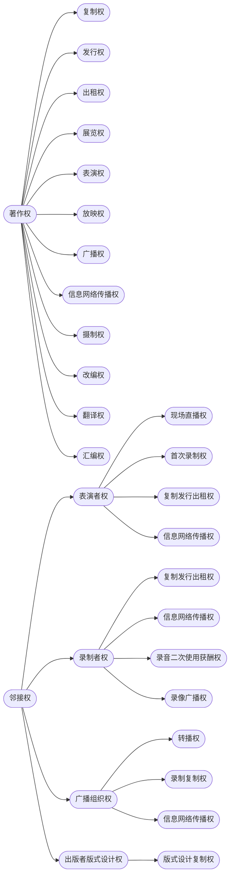

# 一、邻接权概述

## （一）概念

**邻接权**：又称**与著作权有关的权利**、**相关权**，有时也称传播者权。

* **定义**：
	* 指作品的**传播者**在其传播作品的过程中，因**付出了创造性劳动或投资**而依法享有的、与著作权相类似的权利。
		* 它并非单纯指传播作品的权利，而是基于传播行为中的投入所产生的权利。
* **主要类型**：
    1.  **表演者权**
    2.  **录音录像制作者权** (简称录制者权)
    3.  **广播组织权**
    4.  **出版者的版式设计权**（中国特色）
        * 源于我国特定历史背景，出版机构话语权较强，国际公约一般不含此项。

## （二）产生原因

* **技术发展**: 留声机、电影、广播、电视、网络等新技术的发展，使得作品的传播方式多样化，不再局限于现场。
* **利益保护需求**:
    * 表演者因录音录像的传播而减少现场演出收入，要求保护其表演。
    * 录音录像制作者投入资金和劳动，其制品易被盗版复制，要求法律保护。
    * 广播组织投入资源进行广播，其信号易被截取转播，要求保护。
* **与著作权的区别**: 传播者的行为（表演、录制、广播）通常未达到作品的独创性标准，难以获得著作权保护，但其投入又与作品密切相关，故法律创设了邻接权这一“类似著作权的权利”进行保护。

## （三）与著作权的关系

* **联系**：
    * **客体关联性**: 邻接权的客体（表演、录制品、广播信号）通常与作品有关。
    * **权利性质**: 均为法定的专有权利，具有排他性。
    * **权利特征**: 均具有时间性和地域性限制。
* **区别**：

| **比较项目** |    **著作权（Copyright）**     |  **邻接权（Neighboring Rights）**   |
| :------: | :-----------------------: | :----------------------------: |
| **产生原因** |          创作行为产生           |         传播活动中的投入或劳动产生          |
| **权利客体** |         具有独创性的作品          | 作品的传播形式或载体 （如表演、录音录像、广播信号等） |
| **权利主体** |         作者（或著作权人）         |   传播者 （表演者、录音录像制作者、广播组织等）   |
| **权利内容** |       含人身权与财产权，权能丰富       | 以财产权为主，仅表演者权含部分人身权， 权能类型较少  |
| **保护期限** | 保护期较长： 作者终生及死后50年（或更长） |    保护期较短： 通常为行为发生或完成后50年    |
| **保护强度** |         保护力度强，范围广         |            保护力度相对较弱            |

# 二、表演者权

## （一）权利客体：表演

* **定义**: 表演者以自身形象、动作、表情、声音或其组合**再现作品的活动**。
* **表现形式**: 
	* 声音表演（→录音制品）、视听表演（→视听制品/录像制品）。
* **特点**：
    * **人身性**: 体现表演者的个性与“创作”，具有人身权属性。
    * **复合性/派生性**: 对作品的再现 + 表演者的二次创作。
    * **独立性**: 每一次表演活动都产生一个独立的表演者权，即使表演同一作品。

> [!tip] 表演权 vs. 表演者权
>* **表演权**: 著作权人享有的财产权之一，控制他人公开表演其作品的行为。
>* **表演者权**: 表演者就其表演活动本身享有一系列权利（人身权+财产权）。

|     | [[第4节 著作权的内容#5. 表演权\|表演权]]  |                表演者权                |
| :-: | :-------------------------: | :--------------------------------: |
| 属性  |             著作权             |                邻接权                 |
| 来源  |            基于作品             |              基于作品的表演               |
| 主体  |             作者              |                表演者                 |
| 客体  |             作品              |                 表演                 |
| 内容  |          著作财产权的一种           |                权利束                 |
| 保护期 | 一般作者有生之年+50年 （不同作品有不同规定） | 人身权不受限制； 财产权截止于表演发生后第50年的12月31日 |

## （二）权利主体：表演者

* **定义**: 以朗诵、演唱、演奏以及其他方式表演文学艺术作品或民间文学艺术表达的**自然人**。
	* **关键**: 必须是**自然人**。
		* 单位（如演出单位）不能成为表演者主体

> [!question] 思考
> * 表演不受著作权法保护的作品（如已过保护期的作品），表演者是否享有表演者权？
> 	* **是**。权利基于表演行为本身产生。
> * 没有作品的即兴表演，表演者享有什么权利？
> 	* 同时享有**著作权**（作为创作者）和**表演者权**（作为表演者）。

## （三）权利归属

* **个人表演**: 权利归表演者个人。
* **职务表演** （《著作权法》[[著作权法#第四十条|第40条]]）
    * **定义**: 演员为完成本演出单位的演出任务而进行的表演。
    * **权利归属规则**：
        1.  **人身权**（表明身份、保护表演形象不受歪曲）：始终由**演员**享有。
        2.  **财产权**
            * **约定优先**: 由当事人（演员与单位）约定归属。
            * **无约定或约定不明**: 归**演出单位**享有。
        3.  **特殊情况**: 若约定财产权归演员享有，演出单位可以在其**业务范围内免费使用**该表演。

> [!caution] 与职务作品、职务发明的区别
>[[第3节 著作权主体#2. 职务作品|职务作品]]
>三者的权利归属规则不同，需分开记忆。职务表演强调约定优先，无约定才归单位。

> [!faq]  **举例判断是否享有表演者权**：
> * 足球运动员展示球技：**否** (机械性、生理性反应，非艺术再现)。
> * 古筝弹奏《高山流水》：**是** (艺术表演，即使作品过保护期)。
> * 表演民间礼仪、民族舞蹈：**是** (属于表演行为)。
> * 曹植作诗并吟诵《七步诗》：**是** (既是作者也是表演者)。
> * ==在家中演唱周杰伦《发如雪》==：
> 	* **是** (表演行为，不要求公开)。若被他人私录上传，侵犯表演者的信息网络传播权。

## （四）权利内容

依据《著作权法》[[著作权法#第三十九条|第39条]]

### 1. 人身权/精神权利

* **(1) 表明表演者身份**：
    * 形式：节目单列名、播出时显示姓名、主持人介绍等。
	    * 例外：人数众多的合唱、群舞、交响乐演奏等，可省略逐一标注，仅标明团体名称（如“北京舞蹈学院”）或领衔者，属合理简化。
	    *  “对口型假唱”案：*甲演唱录音，乙在活动上对口型假唱，标注演唱者为乙，侵犯了甲表明表演者身份的权利。*
* **(2) 保护表演形象不受歪曲**：
    * **表演形象**：指表演者在表演时所表现的艺术形象。
	    * 禁止他人歪曲、篡改表演者的艺术形象。
		    * *表演中的特定动作镜头被用于艾滋病纪录片，构成侵权。*
		    

> [!note] 笔记
>邻接权中，只有表演者享有这两项人身权。

### 2. 财产/经济权利

#### （1） 现场直播权

许可他人从现场直播和公开传送其现场表演，并获得报酬。

* 控制范围：**正在进行**的现场表演的直播、转播、利用技术设备公开传送。
	* **不包括**：重播（表演结束后回放）、机械表演（播放录制品）。

#### （2） 首次录制权 (首次固定权)

许可他人对其表演进行录音录像，并获得报酬。将表演首次固定到载体上的权利。

#### （3）复制、发行、出租权

* **复制权**: 许可他人复制录有其表演的录音录像制品，并获得报酬。
* **发行权**: 许可他人发行录有其表演的录音录像制品，并获得报酬。
* **出租权** （新增权利）: 许可他人出租录有其表演的录音录像制品，并获得报酬。
    * 目的：弥补因录制品传播导致表演机会减少的损失。
    * **注意**: 出租录音制品**无需**[[第4节 著作权的内容#3. 出租权|著作权人许可]]，因客体针对视听作品/计算机软件。

#### （4）信息网络传播权

 许可他人通过信息网络向公众传播其表演（通常指已录制的表演），并获得报酬。

> [!summary] 权利客体区分
>* 现场直播权针对**未固定**的现场表演活动。
>* 首次录制权是**首次固定**表演的行为。
>* 复制、发行、出租、信息网络传播权均针对**已录制**的表演（录音录像制品）。

### 3. 不享有的权利

* **广播权**: 广播电台、电视台播放其录音录像制品，不侵犯表演者权，无需许可也无需付费给表演者。
* **机械表演权**: 在音乐餐厅等场所播放其录音制品作为背景音乐，不侵犯表演者权，无需许可也无需付费给表演者。

## （五）保护期

* **人身权**（表明身份、保护表演形象不受歪曲）：**不受限制**。
* **财产权**: **五十年**，截止于该表演发生后第五十年的12月31日。

## （六）表演者 vs 著作权人、录制者

* **表演者的义务 (vs 著作权人)**：
    1.  使用他人作品进行演出，应取得著作权人许可并支付报酬（表演权 [[著作权法#第三十八条|F38]]）。由演出组织者组织的，由组织者负责取得许可和支付报酬。
	    - 例外：免费表演构成合理使用。
    2.  使用演绎作品（改编、翻译等）演出，需取得原作品和演绎作品著作权人的**双重许可**并支付报酬 ([[著作权法#第十六条|F16]])。
    3.  使用他人作品，不得侵犯作者的署名权、修改权、保护作品完整权和获得报酬的权利 ([[著作权法#第三十一条|F31]])。
* **视听作品中的表演者权 (推导，有争议)**：
    * **电影、电视剧作品**: 著作权归制作者，作者（编剧、导演等）仅享有署名权和获酬权。类推：表演者（演员）也仅享有**表明表演者身份**（署名）和**获得报酬**的权利，不享有其他表演者财产权。黄梅戏电影《天仙配》案支持此观点。
    * **其他视听作品**: 著作权归属可约定，无约定归制作者。类推：表演者权利也可通过约定明确。
* **录像制品中的表演者权**: 录像制品不同于视听作品，其独创性较低（它都不是作品）。录像制品中的表演者**仍然享有**相应的表演者权（复制、发行、出租、信息网络传播等）。使用录像制品需要同时获得**著作权人**（如果包含作品）和**表演者**的许可并支付报酬。

> [!example] 课堂录像
>老师讲课被学生录制成视频（录像制品，非视听作品因缺乏独创性安排）。
>将此录像制品复制、发行或网上传播，需经老师（可能既是作者又是表演者）许可。如果讲课内容引用了他人作品，还需该作品著作权人许可。

> [!faq] **思考：出租录音录像制品需要谁的许可？**
> * 需要**表演者**和**录制者**的许可。
> * **不需要**著作权人的许可，因为著作权法未赋予作者对录音录像制品的出租权（仅对计算机软件和视听作品中的电影、电视剧作品有出租权）。

## （七）侵权行为举例

* 在网络上提供歌手演唱歌曲的免费试听：
	* 侵犯表演者享有的**信息网络传播权**（中国）。
* 在演唱会现场通过抖音直播歌手表演：
	* 侵犯**现场直播权**。
* 对演唱会表演录像并上传至互联网：
	* 侵犯**信息网络传播权**；若是首次录制，还可能涉及**首次固定权**。
* 广播电台、电视台播放歌手的录音录像制品：
	* **不侵权**（表演者无广播权）。
* 在音乐餐厅播放歌手CD作为背景音乐：
	* **不侵权**（表演者无机械表演权）。

---
# 三、录制者权

## （一）权利客体：录音、录像制品

* **定义**: 即已被录制（固定）的声音或连续图像。
    * **录音制品**: 指任何对表演的声音和其他声音的录制品（《实施条例》第5条）。
    * **录像制品**: 指电影作品和以类似摄制电影的方法创作的作品（视听作品）以外的任何有伴音或者无伴音的连续相关形象、图像的录制品（《实施条例》第5条）。
* **关键区别**: 录音录像制品 vs. **视听作品**
    * 核心在于**独创性有无**。视听作品要求有独创性的选择和编排，达到作品高度；录像制品通常是对客观活动或表演的机械录制，独创性低或无。
    * 新浪诉天猫九州案：直播共用信号形成的连续画面，法院认为未达到电影作品独创性高度，不构成电影作品。

### （二）权利主体：录音录像制作者

* **定义**: 首次制作录音、录像制品的人。
* **身份**: 可以是自然人，也可以是法人或非法人组织。
* **关键**: 指的是**发起并承担投资责任**的人（如华纳唱片公司），而非具体操作录制设备的工作人员。

### （三）权利内容

依据《著作权法》第44条、第45条、第48条:

#### 1. 共有权利

* **(1) 复制权**: 许可他人复制其录音录像制品的权利。
    * 包括：对母带翻录、通过广播电视节目录制等。
    * **不包括**: 独立模仿制作。
	    * B公司请歌手重新演唱录制与A公司制品相同的歌曲，不侵犯A公司的复制权，因为B公司也独立投入了劳动和投资。
* **(2) 发行权**: 许可他人发行其录音录像制品的权利。
* **(3) 出租权**: 许可他人出租其录音录像制品的权利。
* **(4) 信息网络传播权**: 许可他人通过信息网络向公众传播其录音录像制品的权利（交互式传播）。

#### 2. 特有权利

* **(5) 录音制作者的二次使用获酬权** (新增权利): 
	* 将录音制品用于有线或者无线公开传播（广播），或者通过传送声音的技术设备向公众公开播送（机械表演）
	* **无需许可**，但**应当支付报酬** ([[著作权法#第四十五条|F45]])。类似于法定许可。
* **(6) 录像制作者的广播权**: 
	* 电视台播放他人的录像制品，**应当取得录像制作者许可**，并支付报酬 ([[著作权法#第四十八条|F48]])。
	* 注意与录音制作者的区别，这是需经许可的权利类型。

### （四）保护期

* **五十年**，截止于该制品**首次制作完成**后第五十年的12月31日。

### （五）录制者 vs 著作权人、表演者、使用人

* **录制者 vs 著作权人**:
    1.  使用他人**作品**制作音像制品，应取得著作权人许可并支付报酬 (如复制权)。
    2.  使用**演绎作品**制作音像制品，应取得原作品和演绎作品著作权人的双重许可并支付报酬。
    3.  **法定许可**: 使用他人已合法录制为**录音制品**的**音乐作品**，制作**录音制品**，可以不经许可，但应按规定支付报酬（著作权人声明不许使用的除外 F42）。
        * **限制**: 仅限“音乐作品”的“录音-录音”复制，不适用于其他类型作品或录像制品。
* **录制者 vs 表演者**:
    * 制作录音录像制品，应与表演者订立合同，取得许可并支付报酬 (F43)。
* **录制者 vs 使用人 (被许可人)**:
    * **复制、发行、信息网络传播**录音录像制品：需取得**著作权人、表演者、录制者**三方许可并支付报酬。
    * **出租**录音录像制品：需取得**表演者、录制者**许可并支付报酬（无需著作权人许可）。

> [!faq] 一场演唱会，需要哪些主体许可？
> 
> 假设小徐（表演者）在新年晚会（组织者CUPLTV）上演唱了歌曲《大鱼》（词曲作者为著作权人），某唱片公司（录制者）制作了该表演的音像制品。分析以下行为需经谁许可并支付报酬：
> 
> 1.  **小徐演唱《大鱼》**:  需经《大鱼》著作权人许可，支付报酬（表演权）。
> 2.  **CUPLTV组织新年晚会演出《大鱼》**: 由组织者CUPLTV负责取得《大鱼》著作权人许可，支付报酬。
> 3.  **唱片公司制作音像制品**: 需经《大鱼》著作权人许可、表演者小徐许可，并支付报酬。
> 4.  **唱片公司发行该音像制品**: 需经《大鱼》著作权人许可、表演者小徐许可、录制者（自身）许可，并支付报酬。
> 5.  **租赁商行出租该音像制品**: 需经表演者小徐许可、录制者唱片公司许可，并支付报酬。（无需著作权人许可）。
> 6.  **网站在线提供该音像制品点播**: 需经《大鱼》著作权人许可、表演者小徐许可、录制者唱片公司许可，并支付报酬（信息网络传播权）。
> 7.  **广播电台播放该录音制品**:
>     * 著作权人：不需许可，但需支付报酬（法定许可 [[著作权法#第四十六条|F46]]）。
>     * 录音制作者：不需许可，但需支付报酬（二次使用获酬权 [[著作权法#第四十五条|F45]]）。
>     * 表演者：不需许可，**不需支付报酬（无广播权）**。
> 8.  **电视台播放该录像制品**:
>     * 著作权人：需要许可并支付报酬（广播权）。
>     * 录像制作者：需要许可并支付报酬（广播权 [[著作权法#第四十八条|F48]]）。
>     * 表演者：不需许可，不需支付报酬（无广播权）。

> [!tip] 分析思路
>1. 确定行为涉及的**主体**（著作权人、表演者、录制者、广播组织）。
>2. 判断该主体对该行为是否享有**控制权**（专有权利）。
>3. 考虑是否存在**权利限制**（合理使用、法定许可）。

## 四、广播组织权

### （一）权利客体：广播、电视

* **定义**: 广播组织对其播放的广播、电视享有的专有权利。

* **争议：节目 vs. 信号**：
    * **节目说**: 保护的是广播电视节目内容本身。
    * **信号说**: 保护的是承载节目的广播信号（一种国际条约思路，旨在避免将权利延伸至内容本身）。
    * **我国立法**: 《实施条例》曾采“节目说”；《著作权法》（2001, 2010, 2020）表述为“广播、电视”，回避了术语；修法草案曾用“载有节目的信号”。争议较大。
    * **郝明英观点**: 宜采“行为与对象二分法”理解，广播组织权控制的是**通过其传播渠道对节目进行传播的行为**，信号仅是载体。

### （二）权利主体：广播组织

* **定义**: 无线广播组织和有线广播组织，即广播电台、电视台。
	* 广播电台/电视台：指采编、制作并通过有线或无线方式播放广播电视节目的机构。
	* **网络广播组织**: 通常**不包括**在内。
* **广播组织的多重地位**：
    * 可作为**著作权人**（如自制节目）。
    * 可作为**录制者**（如录制活动）。
    * 享有**广播组织权**，仅限于其作为**节目传播者**，通过**自身渠道**传播节目时。

### （三）权利内容

依据《著作权法》第47条:

* **(1) 转播权**: 有权禁止他人未经许可以**有线或无线**方式转播其播放的广播、电视。
    * 转播：指**同步**传播，不包括录播、重播。
    * 新增“有线”方式，与广播权的修改一致。
* **(2) 录制复制权**: 有权禁止他人未经许可对其播放的广播、电视进行录制和复制其录制品。
* **(3) 信息网络传播权** (新增权利): 有权禁止他人未经许可将其播放的广播、电视通过信息网络向公众传播。
* **(宣示性条款，新增)**: 广播电台、电视台行使权利，不得影响、限制或者侵害他人行使著作权或者与著作权有关的权利。

### （四）保护期

* **五十年**，截止于该广播、电视**首次播放**后第五十年的12月31日。

### （五）广播组织 vs 著作权人、录制者

* **vs 著作权人**:
    * 播放他人**未发表**的作品：需许可并支付报酬 (F46)。
    * 播放他人**已发表**的作品：可不经许可，但需支付报酬（法定许可 F46）。
* **vs 录制者**:
    * 播放他人的**视听作品**：需经著作权人（通常是制作者）许可并支付报酬 (因制作者享有广播权 F48)。
    * 播放他人的**录像制品**：需经**著作权人**（如有作品）和**录像制作者**许可并支付报酬 (F48)。
    * 播放他人的**录音制品**：需向**著作权人**和**录音制作者**支付报酬（法定许可 F45, F46）。

### （六）思考题

* 广播组织对**现场作品**（已发表）的表演进行直播：
    * 需经**著作权人**许可并支付报酬（表演权）。
    * 需经**表演者**许可并支付报酬（现场直播权）。
* 广播组织播放对作品进行表演的**录像制品**：
    * 需经**著作权人**许可并支付报酬（广播权）。
    * 需经**录像制作者**许可并支付报酬（录像制作者广播权）。
    * **无需**表演者许可或付费（表演者无广播权）。
* 广播组织将其播放的、载有作品表演的**录像制品**置于网络供公众点播：
    * 需经**著作权人**许可并支付报酬（信息网络传播权）。
    * 需经**表演者**许可并支付报酬（信息网络传播权）。
    * 需经**录像制作者**许可并支付报酬（信息网络传播权）。
    * 需经**广播组织**（自身）许可（信息网络传播权）。
* 广播组织播放已发表作品表演的**录音制品**：
    * 需向**著作权人**支付报酬（法定许可）。
    * 需向**录音制作者**支付报酬（二次使用获酬权）。
    * **无需**表演者许可或付费（表演者无广播权）。

## 五、出版者权

### （一）版式设计权

* **定义**: 出版者对其出版的图书、期刊的版式设计享有的专有权利。
* **权利客体**: 版式设计，指图书、期刊的版式设计。
    * 具体内容：整个版面格式的设计，包含版心设计、排版格式、字体、行距、页边空白、标题、标点符号、页码、脚注等版面布局因素的安排。
    * 区别于**装帧设计**（封面、插图、护封、扉页等外部装饰），装帧设计可能构成美术作品。
* **权利主体**: 图书、期刊出版者。
* **权利内容**: 有权许可或者禁止他人使用其出版的图书、期刊的版式设计 (F37)。主要是防止他人影印、扫描复制。
* **保护期**: **十年**，截止于使用该版式设计的图书、期刊首次出版后第十年的12月31日。
* **条件**: 不以作品受著作权保护为前提。

### （二）专有出版权 (非邻接权，源自合同)

* **来源**: 图书出版者与著作权人约定的独家享有排除他人出版某作品的权利 (F32, F33)。
* **性质**: 属于著作权许可使用合同产生的权利，而非邻接权。
* **图书出版者 vs 著作权人**：
    1.  出版图书应订立合同并支付报酬 (F32)。
    2.  重印、再版应通知著作权人并付费；图书脱销后，出版者拒绝重印、再版，著作权人可终止合同 (F34)。
    3.  经作者许可，可对作品修改、删节 (F36)。
* **报刊社 vs 著作权人**：
    1.  法定限期内禁止一稿多投 (F35)。
    2.  报刊社可作文字性修改、删节；内容修改需作者许可 (F36)。
    3.  作品刊登后，除作者声明不得转载、摘编外，其他报刊可转载或作文摘、资料，但需按规定付费 (F35)。
    4.  报刊转载的法定许可：刊登后除著作权人声明不得转载、摘编的外，其他报刊可以转载或者作为文摘、资料刊登，但应按规定向著作权人支付报酬（F35条第2款）。转载未注明被转载作品的作者和最初登载的报刊出处的，应承担消除影响、赔礼道歉等民事责任（《审理著作权民事纠纷案件适用法律若干问题的解释》第17条）。

## 六、邻接权整体思维导图

