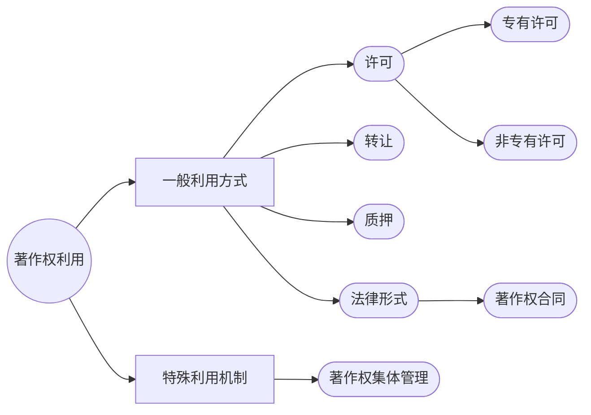
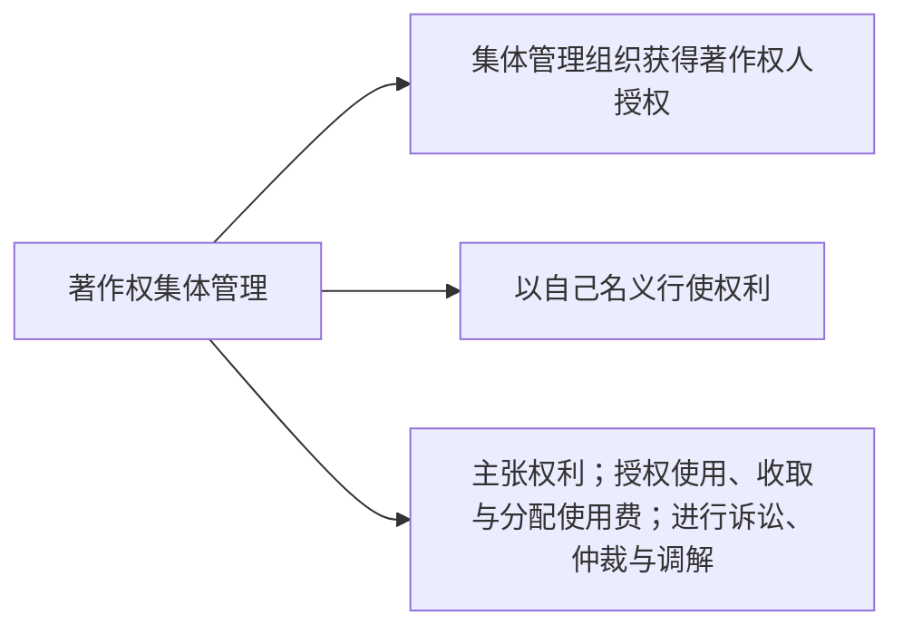
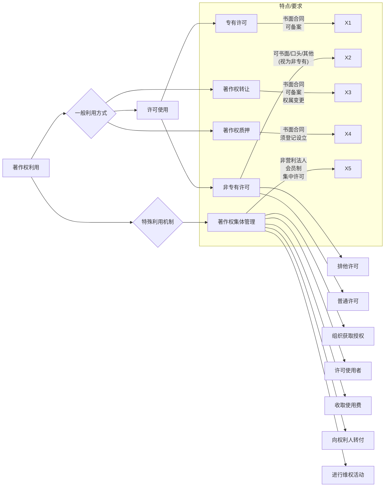

# 一、许可使用 

## （一）含义 

- 著作权人在==保留著作权==的前提下 ，在保护期内 ，授权他人在一定期限、范围、以一定方式使用其作品的法律行为。
    
- 通常通过订立**许可使用合同**实现 。
    

## （二）类型 

1. **专有许可使用 (Exclusive License)** 
    
    - 含义：著作权人在约定的时间和地域范围内，仅许可**一个**被许可人以特定方式利用作品 。
        
    - 排他性：被许可人有权排除**包括著作权人在内的任何人**以同样的方式使用作品（若合同无约定或约定不明） 。
        
    - 类比：类似专利的独占实施许可/商标的独占使用许可 。
        
    - 举例：图书出版者的“专有出版权” 。
        
    - 合同形式：**应当采用书面形式** 。
        
    - 备案：可以向著作权行政管理部门备案 （《著作权法实施条例》第 25 条 ）。
        
2. **非专有许可使用 (Non-exclusive License)** 
    
    - 含义：著作权人可以许可**多个主体**（包括自己和其他人）以相同方式利用作品 。
        
    - 进一步区分（类比专利/商标法）：
        
        - **排他许可 (Sole License)**：许可一个被许可人使用，著作权人自己也可以使用，但不得再许可其他人 。
            
        - **普通许可 (Simple/Ordinary License)**：著作权人可以许可多人使用，自己也可以使用 。
            
    - 法律推定：合同未明确规定为专有使用的，视为非专有使用权 。

## （三）特征 

1. **标的**：以著作财产权为标的 。
    
2. **归属**：不改变著作权的归属 。
    
3. **使用限制**：被许可人只能按照约定方式、地域范围和期限使用作品 。
    
4. **合同形式**：可采用书面、口头或其他形式。专有许可必须书面 。
    
5. **分许可 (Sublicense)**：被许可人许可第三人行使权力
	- 原则上须取得著作权人的许可，约定优先 。依据《著作权法实施条例》第 24 条 。
    
6. **诉权**：
    
    - **专有许可**：被许可人可因权利被侵害提起诉讼 ，但仅限于合同授予的权利范围 。
        
    - **非专有许可**：一般无独立诉权，需著作权人起诉 。
        

## （四）合同内容 

- 依据[[著作权法#第二十六条|《著作权法》第 26 条]] ，许可使用合同主要内容包括 ：
    
    - 许可使用的权利种类 （财产权的各项子权利可以分开许可）。
        
    - 权利是专有还是非专有 。
        
    - 许可使用的地域范围、期间 。
        
    - 付酬标准和办法 。
        
    - 违约责任 。
        
    - 双方认为需要约定的其他内容 。
        
- **付酬标准** (依据[[著作权法#第三十条|《著作权法》第 30 条]] )：
    
    - 可由当事人约定 。
        
    - 可按照国家主管部门会同有关部门制定的标准 。
        
    - 约定不明确的，按国家标准执行 。

---
# 二、著作权转让

## （一）含义

- 著作权人在著作权有效期内，将著作财产权的**全部或部分**权利出让给他人的民事法律行为。

## （二）法律后果（性质）

- **著作权权属变更**。
	-  对比许可使用，前者不转移财产权权属
    
- 转让后，出让人丧失该权利。
    
- **邻接权的转让**可以参照适用著作权转让制度的规定。

## （三）特征

1. **转让内容**：
    
    - 对比所有权（不可分割），著作财产权**可分割**转让（全部/部分财产权）。
        
    - 转让未发表作品的著作财产权，推定为许可发表。
        
2. **转让模式**：
    
    - 对比所有权（不动产登记/动产交付），著作权转让通过**意思表示（合同）**生效。
        
    - 著作权转让与载体所有权无关。

##### （四）许可使用 vs 转让区别

|**特征**|**许可**|**转让**|
|---|---|---|
|权利主体|不发生转移|发生转移|
|权利性质|使用权|专有权（所有权）|
|合同方式|书面、口头、其他|**书面合同**|
|分许可|非经著作权人同意不得|（受让人可自行决定）|

> [!faq] 思考：专有许可使用 vs. 转让
>     
> - **权利主体**：不转移 vs. 转移
> 	
> - **权利内容**：使用权 vs. 所有权
> 	
> - **分许可权来源**：著作权人 vs. 受让人
> 	
> - **诉讼地位**：被许可人 vs. 权利人

## （五）转让合同：书面合同

- 依据[[著作权法#第二十七条|《著作权法》第 27 条]]，转让财产权（[[著作权法#第十条-第1款|第 10 条第 1 款]]第 5-17 项），应当订立**书面合同**。
	- 在这里，著作权法与[[民法典#第四百九十条|民法典490 条]]接轨，同样可以适用[[Chap3. 合同概说#要式合同|履行治愈]]。
    
- 合同主要内容：
    
    - 作品名称
        
    - 转让的权利种类、地域范围
        
    - 转让价金
        
    - 交付价金的日期和方式
        
    - 违约责任
        
    - 其他约定内容
        
- **备案**：《著作权法实施条例》第 25 条规定，转让合同可以向著作权行政管理部门备案。备案非生效要件。

---
# 三、著作权质押

## （一）含义

- 著作权质押，作为一种担保方式，是为担保债务履行，债务人或第三人将其**财产权利**出质给债权人，当债务人不履行到期债务或发生约定情形时，债权人有权就该权利优先受偿的法律制度。
    
- 《民法典》[[民法典#第四百四十条|第 440 条]]第5项规定可以出质的权利包括著作权等知识产权中的财产权。

## （二）动产质权 vs 权利质权

| **特征** | **相同点**                      | **区别**         |
| ------ | ---------------------------- | -------------- |
| 实现目的   | 担保债务履行和债权实现                  | 标的：动产 vs. 权利   |
| 权利性质   | 担保物权                         | 权利设立：交付 vs. 登记 |
| 法律适用   | 权利质权无规定时**适用**（不是参照适用）动产质权规定 |                |

## （三）合同、设立、内容与限制

1. **设立质权**：
    
    - 应采用**书面形式**订立质押合同（要式合同）。
        
    - 质权自**登记**时设立（依据《著作权法》[[著作权法#第二十八条|第 28 条]]，《民法典》[[民法典#第四百四十四条|第 444 条]]）。
        
2. **出质后限制**：
    
    - 出质人不得转让或许可他人使用，但经出质人与质权人协商同意的除外。
        
3. **所得价款处理**：
    
    - 转让、许可所得价款，应当向质权人提前清偿债务或者提存。
        

> [!tip] 扩展：著作权其他利用方式
> - 信托
> - 证券化
> - 强制执行
> - 破产清算
> - 离婚财产分割

# 四、著作权集体管理 

## （一）概念

- 著作权集体管理组织经权利人授权，集中行使权利人的有关权利并**以自己的名义**进行的管理活动。
    
- 实质：权利人著作权利用的**特殊机制——集中许可**。
    
- 主要活动（依据《著作权集体管理条例》第 2 条）：
    
    - 与使用者订立许可合同。
        
    - 向使用者收取使用费。
        
    - 向权利人转付使用费。
        
    - 进行诉讼、仲裁等。

## （二）意义与作用

- **对著作权人**：保证权利实现（特别是难以单独行使的权利，如表演权、广播权等）。
    
- **对市场/使用者**：满足市场经济发展需要，提高经营效率。
    
- **对社会**：促进作品传播、利用和保护；协调著作权人与社会公众利益。
    

## （三）我国著作权集体管理组织

- **概念**：为权利人利益依法设立，根据授权集体管理权利（著作权&邻接权）的社会团体。
    
- **设立条件** (依据《著作权集体管理条例》第 7 条)：
    
    - 发起设立的权利人不少于 50 人。
        
    - 不与已登记组织的业务范围交叉、重合。
        
    - 能在全国范围代表相关权利人利益。
        
    - 有章程草案、使用费收取标准草案和转付办法草案。

## （四）性质

- 依法设立的著作权集体管理组织是[[2. 法人#（三）营利法人与非营利法人（我国立法分类）|非营利法人]]（依据《著作权法》[[著作权法#第八条-第1款|第 8 条]]）。

## （五）职责

- 根据授权**向使用者收取使用费**
	- 使用费收取标准由组织与使用者代表协商确定；协商不成，可申请主管部门裁决或向法院起诉。
    
- **公示**
	- 应当将使用费的收取和转付、管理费的提取和使用等情况定期公布，并建立查询系统。
    
- **受监督**
	- 国家著作权主管部门依法进行监督、管理。
    

## （六）主要活动/权利

1. **取得权利人授权**：
    
    - 针对表演权、放映权、广播权、出租权、信息网络传播权、复制权等权利人自己难以有效行使的权利——法定许可报酬转付
        
    - 管理方式：会员制。
        
    - 权利限制：权利人加入后，在合同约定期限内不得自己行使或者许可他人行使组织管理的权利（依据《著作权集体管理条例》第 20 条）。
        
2. **使用费收取与转付**：
    
    - 收取标准：$与使用者代表协商 → 主管部门裁决 → 法院诉讼$。
        
    - 费用转付：$使用费 - 管理费$（提取比例随收入增加逐步降低）。
        
3. **以自己名义主张权利**：
    
    - 被授权后可以自己名义为著作权人和邻接权人主张权利。
        
    - 可作为当事人进行诉讼、仲裁、调解活动。
        

## （七）义务

1. **强制缔约义务**（双向）：
    
    - 对符合章程的权利人，不得拒绝加入。
        
    - 对使用者以合理条件请求订立许可合同，不得拒绝。
        
2. **信息披露义务**：
    
    - 定期向社会公布使用费收取转付、管理费提取使用、未分配部分等情况。
        
    - 建立权利信息查询系统，供权利人和使用者查询。
        
3. **依法授权义务**：
    
    - 应当与使用者以**书面形式**订立许可使用合同。
        
    - **不得**与使用者订立**专有许可**使用合同。
        
    - 许可使用合同的期限**不得超过 2 年**；合同期满可以续订。
        
4. **接受监督义务**：
    
    - 国家著作权主管部门依法进行监督、管理。
        
    - 接受权利人、使用者和社会的监督、检举。
        

## （八）扩展思考：延伸性集体管理

- **定义**：在法定条件下，特定集体管理组织获得授权后，可以代表该领域**全体权利人**（包括非会员）行使著作权或者相关权，但权利人书面声明排除的除外。
    
- **目的**：扩大许可范围，降低交易成本。
    
- **在我国的争议**：曾写入《著作权法（修订草案送审稿）》第 63 条，但因权利人（特别是音乐界）不信任现有集体管理组织而最终未被采纳。主要担忧在于费用分配不透明、管理效率低下等问题。
    

## Mermaid 可视化

