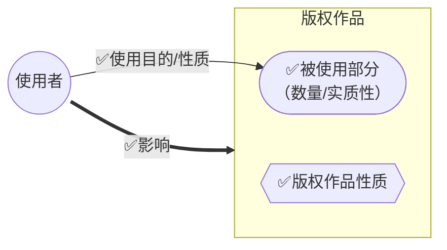

# 一、概述

## （一）著作权限制制度

 **著作权限制** 是为了平衡著作权人与社会公众之间的利益而对著作权人的专有权利所作出的限定。

- **限制方式**：
    
    - **客体限制**：
        
        - 内部限制：思想与表达二分法，实用功能不受保护。
            
        - 外部限制：法律法规、事实消息、通用表格公式等不受著作权法保护的对象（《著作权法》[[著作权法#第五条|第 5 条]]）。
            
    - **权利限制**：
        
        - 空间限制（地域性）。
            
        - 时间限制（保护期）。
            
        - **==权利行使限制==**（本节重点）：合理使用、法定许可、强制许可。
            

## （二）依据（法理基础）

1. **基本人权要求**: 保障公众参与文化生活、分享科技成果的权利。
    
2. **公共利益考量**: 实现著作权人私权与社会公共利益的平衡。
    
3. **克服市场失灵**: 对于交易成本过高或无法控制的使用行为（如个人学习）进行规范。
    
4. **知识产权本质**: 独占性与有限性的统一，避免过度垄断妨碍信息传播。
    

## （三）具体制度

1. **合理使用 (Fair Use / Fair Dealing)**:
    
    - 定义：法定情形下，基于正当目的，使用他人**已发表**作品，**无需许可，无需付费**。
        
    - 要求：需指明作者/作品名称，不得影响作品正常使用，不得不合理损害权利人合法权益。
        
2. **法定许可 (Statutory License)**:
    
    - 定义：法定情形下，使用**已发表**作品，**无需许可，但需付费**。
        
    - 要求：应尊重著作权人其他权利（如署名权、修改权、保护作品完整权）。
        
3. **强制许可 (Compulsory License)**:
    
    - 定义：特定情形下（如权利人无正当理由拒不许可），使用者可向主管部门申请强制许可，**需付费**。
        
    - 现状：**我国《著作权法》未规定强制许可制度**。
        

# 二、合理使用

## （一）含义与特点

- 含义：法律明文规定，可以不经许可、不付报酬地使用他人作品。
    
- 特点：
    
    - 对象：通常是**已发表作品**（例外：图书馆为保存版本复制未发表作品）。
        
    - 主体：不特定。
        
    - 目的：通常为非营利目的（但不绝对排除商业性使用）。
        
    - 法律依据：由法律明确规定。
        
    - 限制条件：不得影响作品正常使用，不得不合理损害权利人其他合法权益。
        

## （二）立法模式

1. **国际公约模式（三步检验法）**：
    
    - 来源：《伯尔尼公约》第 9 条第 2 款、《TRIPS 协议》第 13 条。
        
    - 检验标准（三步）：
        
        1. 必须是法律规定的**某些特殊情况**（法定、有限目的）。
            
        2. 不得损害（或与）作品的**正常使用**（或利用）相冲突。
            
        3. 不得不合理地损害（或无故侵害）作者（或权利持有人）的**合法权益**。
            
2. **大陆法系模式（封闭式“条文主义”）**：
    
    - 代表：德国、日本。
        
    - 特点：详尽列举限制和例外的具体行为及条件，法无明文规定即不可。
        
3. **英美法系模式（开放式“因素主义”）**：
    - 代表：美国（Fair Use），实务中我国常用此标准
        
    - 特点：规定“合理使用”原则，由法院个案裁决。
        
    - **四要素检测标准**：
        
        1. 使用目的和性质（是否具有转换性、商业性）。
            
        2. 版权作品的性质。
            
        3. 被使用部分的数量和实质性。
            
        4. 对被使用作品潜在市场和经济价值的影响。


```mermaid
graph LR

```
 
> [!note] 转换性使用 (Transformative Use)
> 
> 是美国版权法判断合理使用的重要考量，指使用并非简单复制原作，而是增加了新的表达、含义或信息，具有不同的目的或特征。它属于对第一要素“使用目的和性质”的分析范畴。

4. **我国模式**：
    
    - 依据：《著作权法》[[著作权法#第二十四条|第 24 条]]。
        
    - 结构：
	    - 概括性规定（引入三步检验法原则）+ 13 种具体列举情形 + 半开放兜底条款（法律、行政法规规定）。
        
    - 性质：半封闭式 / 走向开放的封闭式。与作品类型（开放）、著作权内容（开放）的规定模式不同。
        

## （三）具体情形

>（《著作权法》[[著作权法#第二十四条|第 24 条]]）

- **前提条件**：
    
    - 可以不经许可，不支付报酬。
        
    - 应当指明作者姓名或者名称、作品名称。
        
    - 不得影响该作品的正常使用。
        
    - 不得不合理地损害著作权人的合法权益。
        

### 1. 个人使用
    
- 为个人学习、研究或者欣赏，使用他人**已发表**的作品。
	
- 主体：个人使用（排除向公众提供复制件）。
	
- 目的：非商业性（学习、研究、欣赏）。
	
- 对象：已发表作品。
	
> [!example] 示例
>图书馆复印教材部分内容、研究需要翻译外文资料。

> [!faq] 争议
>复印整本书、下载大量歌曲、使用盗版软件均不构成个人使用的合理使用。

### 2. 适当引用

- 为介绍、评论某一作品或者说明某一问题，在作品中**适当引用**他人**已发表**的作品。
	- 目的：介绍、评论、说明目的（目的适当）。
	- 前提：独立的新创作（区别于[[第3节 著作权主体#1. 演绎作品|演绎]]）。
	- 程度：数量标准（不超过需要），合理的比例。
	- 对象：已发表作品。
	- 条件：标明姓名和出处。
	
> [!example] 案例分析
>- “80 后独立宣言”海报案（构成合理使用）；
>- 杨家埠年画案（超出合理引用范围）。

> [!faq] 思考
>戏仿（如“一个馒头引发的血案”）是否构成合理使用？需考虑转换性使用等因素。

### 3. 新闻报道使用

 为报道新闻，在报纸、期刊、广播电台、电视台等媒体中**不可避免地**再现或者引用**已发表**的作品。

- **目的**：新闻自由、公众知情权。
	
- **条件**：限定性使用，**不可避免**。
	- 「**不可避免**」的理解（合理使用构成必要条件）：
		- 被使用对象与新闻报道处于同一特定环境，不使用则无法完整报道新闻事件。
	
- **案例分析**：华熔与天府早报社案（未来活动介绍使用照片，不属于不可避免）。
	
- **权利保留**：著作权人**不能**声明禁止此种使用。

### 4. 时事性文章使用

报纸、期刊、广播电台、电视台等媒体刊登或者播放其他报纸、期刊、广播电台、电视台等媒体已经发表的关于**政治、经济、宗教**问题的**时事性文章**。**但著作权人声明不许刊登、播放的除外。**

- **限制条件**：同类媒体之间；

- **限定作品**：
	- 时事文章：时效性、重大性。
	- 主题限定：政治、经济、宗教（没有等）
	
- **权利保留**：著作权人**可以**声明不许刊登、播放。
	
- **案例分析**：《国产手机乱象》案（不具备足够的时效性和重大性，不构成）。

### 5. 公开演讲报道使用

报纸、期刊、广播电台、电视台等媒体刊登或者播放在**公众集会**上发表的**讲话**。
	
- **目的**：公众了解政治生活事件和观点。
	
- **使用范围**：公开讲话（不包括汇编）。
	
- **权利保留**：作者**可以**声明不许刊登、播放。

### 6. 教学、研究使用

为学校**课堂教学**或者**科学研究**，翻译、改编、汇编、播放或者**少量复制已发表**的作品，供教学或者科研人员使用。

- **限制**：**不得出版发行**。
	
- **目的**：学校**课堂**教学（通常指面授）、科研（非商业性）。
	
- **使用主体**：教学、科研人员（**不包括学生**）。
	
- **使用方式**：翻译、改编、汇编、播放、**少量**复制。
	
- **使用范围**：内部使用。

> [!example] 案例分析
>《冲出亚马逊》案（电视台播放有商业目的，不构成）；毕淑敏诉淮北高级实验中学案（网站上传供下载超出范围，不构成）。

### 7. 公务使用

 国家机关为执行公务在**合理范围**内使用**已发表**的作品。

- **使用主体**：国家机关（立法、行政、司法、监察、军事机关）。
	
- **目的**：执行公务需要。
	
- **使用范围**：合理范围内（如复制、翻译）。
	- 示例：*公安机关通缉令使用照片、法院审案复制片段作参考资料。*

> [!example] 案例分析
>何平诉教育部考试中心案（高考使用漫画未署名，法院认为特殊情况不侵权，但建议事后感谢）。

> [!caution] 注意
>合理使用主要限制财产权，仍需尊重人身权（如署名权），除非有特殊例外。

### 8. 图书馆等复制使用

 图书馆、档案馆、纪念馆、博物馆、美术馆、文化馆等为**陈列**或者**保存版本**的需要，**复制**本馆收藏的作品。
	
- **使用主体**：公共文化机构。
	
- **目的**：陈列或保存版本（最低限度）。
	
- **使用范围**：本馆收藏的作品（不限于已发表的作品）
	- 对**未发表作品**：仅限于**保存版本**的需要。
	
> [!tip] **数字化复制**
>根据《信息网络传播权保护条例》第 7 条，在特定条件下（如已损毁、无法购买、天价购买）允许为陈列或保存版本进行数字化复制，并可在**馆舍内**向服务对象提供，不得有经济利益。

> [!faq] 思考：数字图书馆的主体资格？
>案例（陈兴良诉中国数字图书馆案）表明，网络环境下向不特定公众提供下载超出了合理使用范围。

### 9. 免费表演
    
 **免费表演**已发表**的作品，该表演未向公众收取费用，也未向表演者支付报酬，且**不以营利为目的。
	
- **条件**：==双向免费==（对观众免费、对表演者无报酬）、非营利目的、**限于现场表演**（不涉及[[第4节 著作权的内容#5. 表演权|机械表演]]）。
	- *示例：学校迎新晚会。*
	
- **不适用情形**：*企业宣传活动、酒店招揽顾客演奏、企业年会录制上传、收费的赈灾义演。*

> [!example] 案例
>使用他人作品参加无奖金、无门票的比赛，构成合理使用。

### 10. 公共场所陈列作品的使用

对设置或者陈列在**公共场所**（室内/室外）的**艺术作品**进行临摹、绘画、摄影、录像。

- **使用对象**：**永久陈列**在公共场所的艺术作品（雕塑、绘画、书法等）。
	
- **使用方式**：临摹、绘画、摄影、录像（平面复制）。
	
- **目的**：以合理方式、范围再行利用，不构成侵权，不影响原作使用，不损害权利人利益。
	- ==不限于非营利目的，可以营利==
	
> [!example] 案例分析
>“五月的风”案（手机壁纸使用雕塑图像，构成合理使用）。

- 依据：《关于审理著作权民事纠纷案件适用法律若干问题的解释》第 18 条。

### 11. 制作==少数民族==语言文字版本
    
将==中国==公民、法人或者非法人组织已经发表的以**国家通用语言文字**创作的作品翻译成少数民族语言文字作品在==**国内==出版发行**。
	
- **目的**：促进少数民族教育、文化、科技发展。
	
- **使用范围**：==中国人==创作+已发表+通用语言文字作品。
	
- **地域限制**：==国内==出版发行。
	
> [!faq] 思考：是否限文字作品？
>不限，但非文字作品的整体传播利用可能超出合理范围。将少数民族语言译为汉语不适用。

### 12. 为阅读障碍者使用
    
以阅读障碍者能够感知的**无障碍方式**向其提供**已发表**的作品。
	
- **依据**：《马拉喀什条约》。
	
- **适用主体扩大**：阅读障碍者（主要是视障者）。
	
- 作品类型、使用方式增多（如制作有声书）。
	
- **限制条件**：需通过特定渠道，采取技术措施**防止非授权传播**，不得有营利目的。

> [!example] 案例分析
>无障碍电影侵权案（APP未设识别机制限定受众，超出合理范围）。

### 13. 法律、行政法规规定的其他情形
    
兜底条款，体现了立法模式向开放性的转变。

- 思考：该条款性质？是否应进一步放开，采纳更开放的模式？


## （四）网络环境下的合理使用

- 《信息网络传播权保护条例》第 6 条列举了网络环境下的合理使用情形，与《著作权法》第 24 条部分对应。
    
- 值得注意的差异：
    
    - 明确规定了为介绍、评论、报道新闻、教学科研等目的在网络上适当引用或少量使用。
        
    - **未规定**网络环境下的**个人使用**属于合理使用。
        
    - 图书馆等的使用有特殊限制（如馆舍内提供数字化作品）。

## 合理使用：小结

> [!tldr]
![[截屏2025-10-25 14.21.23.png]]

---
# 三、法定许可

## （一）含义与正当性

- **含义**：法律直接规定的范围内对**已发表作品**进行某种使用时，**可以不经许可，但应支付报酬**，并尊重其他权利（“非自愿许可”）。
    
- **正当性**（法理基础）：
    
    - 利益平衡：协调个人权利与社会公共利益（教育、文化宣传）。
        
    - 效率考量：促进作品传播和使用，降低交易成本，减少行业垄断。
        
    - 损害有限：通常不明显损害权利人利益，且对营利性使用支付报酬。
        

## （二）特征

- **客体**：**已发表**的作品。
    
- **主体**：多适用于[[第5节 邻接权|邻接权]]主体（传播者）。
    
- **方式**：不经许可，支付报酬。
    
- **限制**：不损害著作权人的其他人身权和财产权。
    
- **权利保留**：作者有权事先声明其作品不适用法定许可（通常情况，教科书例外）。


## （三）合理使用 vs 法定许可

|**特征**|**合理使用**|**法定许可**|
|---|---|---|
|**相同点**|权力限制制度|权力限制制度|
||大多针对已发表作品|针对已发表作品|
||不需许可|不需许可|
||不得侵害其他权利|不得侵害其他权利|
|**区别**|||
|制度作用|权利限制和例外|权利限制和例外|
|使用条件|不需著作权人同意|不需著作权人同意|
|使用主体|不特定性|特定性（多为传播者）|
|适用对象|原则上所有作品|少数作品/录音制品|
|使用目的|（一般）非商业性|商业性|
|**使用费用**|**不支付报酬**|**支付报酬**|
|权利保留|原则上不可保留（少数例外可保留）|原则上可保留（教科书例外不可保留）|

## （四）具体情形

1. **教科书法定许可** (§25)：
    
    - 目的：为实施**义务教育和国家教育规划**编写出版教科书。
        
    - 使用方式：汇编已发表作品片段或短小文字、音乐、单幅美术、摄影、图形作品。
        
    - 限制：**权利人不得声明禁止使用**。
        
    - 教科书范围：九年义务教育和国家教育规划教科书（不包括教参、教辅）。
        
    - 内容限制：短小文字（一般不超过 2000/3000 字）、短小音乐（一般不超过 5 页/5 分钟）。
        
    - 义务：支付报酬（有标准），指明作者/作品名称，不得侵犯其他权利（如保护作品完整权）。
        
2. **报刊转载法定许可** (§35(2))：
    
    - 条件：作品在报刊**刊登后**。
        
    - 主体：**其他报刊**可以转载或作为文摘、资料刊登。
        
    - 限制：仅限于**报刊之间**，不适用于图书、网络转载。
        
    - 权利保留：著作权人**可以**声明不得转载、摘编。
        
    - 注意：报刊社声明无效，需著作权人声明或属于特殊职务作品。
        
    - 义务：支付报酬。
        
3. **播放已发表作品的法定许可** (§46(2))：
    
    - 主体：**广播电台、电视台**。
        
    - 行为：播放他人**已发表**的作品。
        
    - 限制：**不包括**播放**视听作品、录像制品**（需许可并付费，§48）。**不包括**播放**录音制品**（2020 年修法已删除原播放录音制品的法定许可）。
        
    - 权利保留：著作权人**不可以**声明禁止播放。
        
    - 义务：支付报酬。
        
    - 目的：降低广播组织交易成本，保障公共利益（文化传播媒介）。
        
4. **制作录音制品的法定许可** (§42(2))：
    
    - 主体：**录音制作者**。
        
    - 行为：使用他人已经**合法录制为录音制品**的**音乐作品**制作录音制品（即翻唱录制）。
        
    - 前提：原音乐作品已合法录制为录音制品；限于“音乐作品”；是重新制作录音制品，而非复制原录音制品。
        
    - 权利保留：著作权人**可以**声明不许使用。声明需在该作品首次合法录为录音制品时附带声明。
        
    - 义务：支付报酬。
        
    - 目的：防止唱片公司垄断录音制品市场。
        
    - 案例分析：《传奇》翻唱案（专辑标注“版权所有翻录必究”不等于词曲作者声明禁止使用）。
        
5. **制作和提供课件法定许可** (《信息网络传播权保护条例》§8)：
    
    - 目的：通过信息网络实施九年义务教育或者国家教育规划。
        
    - 行为：使用已发表作品片段或短小文字、音乐、单幅美术、摄影作品制作课件，通过网络向注册学生提供。
        
    - 限制：需采取技术措施防止服务对象外的人获得。
        
    - 义务：支付报酬。
        
6. **通过网络向农村提供特定作品的“准”法定许可** (《信息网络传播权保护条例》§9)：
    
    - 目的：扶助贫困。
        
    - 行为：通过信息网络向农村地区公众免费提供已发表的特定类型作品（种植养殖、防病治病、防灾减灾等）。
        
    - “准”的含义：提供者需**提前公告**拟提供的作品及报酬标准；公告期（30天）内著作权人不同意的不得提供；无异议或异议不成立的可提供；需支付报酬。
        
    - 限制：不得直接或者间接获得经济利益。
        

#### 四、强制许可

- 含义：作品使用人在著作权人**没有正当理由拒绝授权**的情况下，为了教学、科研等需要，可向政府主管部门申请颁发强制许可证，以强制使用其作品。
    
- 条件：需支付报酬，不得损害著作权人其他权利。
    
- 与法定许可的区别：
    
    - 使用主体：特定申请人 vs. 法律规定主体类别。
        
    - 使用条件：需事先申请授权被拒 + 向主管部门申请批准 vs. 法律直接规定。
        
- **我国现状：未规定强制许可制度**。


## 法条与条号

- **《中华人民共和国著作权法》**:
    
    - 第 5 条 (不适用对象)
        
    - 第 24 条 (合理使用)
        
    - 第 25 条 (教科书法定许可)
        
    - 第 35 条 (投稿期限；报刊转载法定许可)
        
    - 第 42 条 (录音制品法定许可)
        
    - 第 46 条 (广播组织播放法定许可)
        
    - 第 48 条 (电视台播放视听作品、录像制品需许可)
        
- **《信息网络传播权保护条例》**:
    
    - 第 6 条 (网络环境下的合理使用)
        
    - 第 7 条 (图书馆等数字化复制与馆内提供)
        
    - 第 8 条 (网络课件法定许可)
        
    - 第 9 条 (网络向农村提供作品准法定许可)
        
- **《关于审理著作权民事纠纷案件适用法律若干问题的解释》**:
    
    - 第 18 条 (公共场所艺术品合理使用再利用)
        
- **《教科书法定许可使用作品支付报酬办法》**
    
- **《伯尔尼公约》** 第 9 条第 2 款 (合理使用三步检验法)
    
- **《TRIPS 协议》** 第 13 条 (合理使用三步检验法)
    

## Mermaid 可视化

代码段

```
graph TD
    A[著作权限制] --> B{权利行使限制};
    B --> C[合理使用 (§24)];
    B --> D[法定许可];
    B --> E[强制许可 (我国未规定)];

    C -- 特点 --> C1[无需许可<br>无需付费];
    C -- 适用 --> C2[法定13种情形<br>+ 兜底条款];
    C -- 要求 --> C3[指明来源<br>不影响正常使用<br>不损害合法权益<br>(三步检验法)];

    D -- 特点 --> D1[无需许可<br>**需付费**];
    D -- 适用 --> D2[教科书 (§25)<br>报刊转载 (§35)<br>广播播放 (§46)<br>录音制作 (§42)<br>网络课件<br>网络助农];
    D -- 要求 --> D3[尊重其他人身权等<br>部分情形权利人可禁止];

    subgraph "合理使用 (§24) 情形"
        C2 --> F1[个人使用];
        C2 --> F2[适当引用];
        C2 --> F3[新闻报道];
        C2 --> F4[时事文章/讲话使用];
        C2 --> F5[教学科研];
        C2 --> F6[公务使用];
        C2 --> F7[图书馆等使用];
        C2 --> F8[免费表演];
        C2 --> F9[公共场所艺术品];
        C2 --> F10[少数民族语言翻译];
        C2 --> F11[为阅读障碍者使用];
        C2 --> F12[其他法定情形];
    end

    subgraph "法定许可 主要情形"
        D2 --> G1[教科书编写 (§25)];
        D2 --> G2[报刊转载 (§35)];
        D2 --> G3[广播电台/电视台播放 (§46)];
        D2 --> G4[录音制品制作 (§42)];
    end

```
