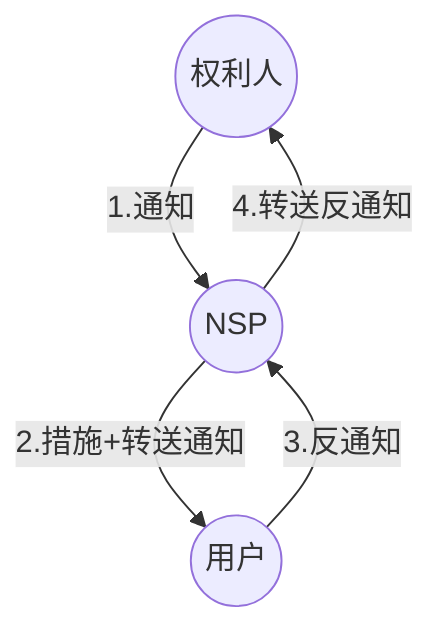
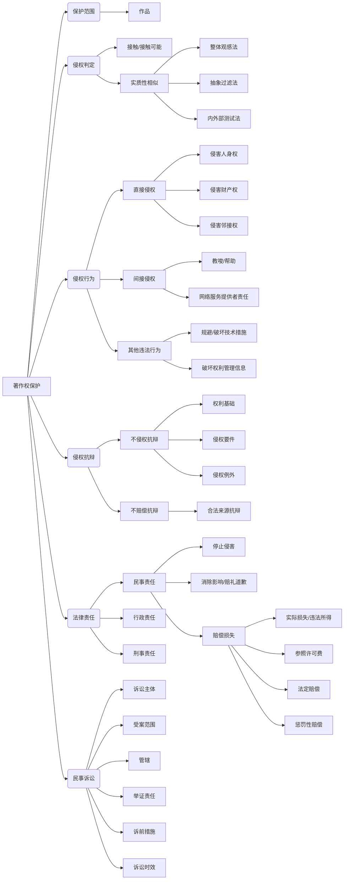

# Executive Summary

本讲义系统阐述了著作权保护的核心内容，包括保护范围的界定、侵权判定的“接触+实质性相似”标准及其判定方法。重点分析了各类直接和间接侵权行为，特别是网络环境下的服务提供者责任。同时，详细讨论了侵权抗辩的类型（如合法来源抗辩），以及侵权行为需承担的民事、行政、刑事法律责任，重点解析了民事责任中的停止侵害、赔偿损失（含法定赔偿与惩罚性赔偿）等。最后，概述了著作权相关的民事诉讼程序性规则，如诉讼主体、管辖、举证责任、诉前措施和诉讼时效等。

# 关键要点

- **保护范围**: 著作权法保护的是具有独创性并能以一定形式表现的作品。
    
- **侵权判定标准**: 核心是“接触 + 实质性相似”原则。需证明行为人接触过在先作品，且在后作品与在先作品的“表达”构成实质性相似。
    
- **实质性相似判定方法**: 包括整体观感法、抽象过滤法（抽象-过滤-对比）、内外部测试法（结合前两者）。
    
- **侵权行为**: 未经许可、无法律依据（如合理使用、法定许可），实施了受著作权人专有权（人身权、财产权）或邻接权控制的行为。
    
- **侵权归责**: 请求停止侵害等不以过错为要件（基于绝对权）；请求损害赔偿通常需要过错（基于相对权）。
    
- **直接侵权**: 直接实施受专有权控制的行为，分为侵犯人身权、财产权、邻接权三大类。根据是否损害公共利益，责任有所不同（民事 vs. 民事+行政+刑事）。
    
- **间接侵权**: 主要指教唆、帮助他人实施侵权行为，常见于网络环境。网络服务提供者（ISP/ICP）在“明知”或“应知”情况下未采取必要措施，承担连带责任。
    
- **通知-必要措施规则**: 判断ISP“明知”的标准，也是“避风港”规则的基础。
    
- **红旗原则**: 判断ISP“应知”的标准，即侵权行为明显可见。
    
- **侵权抗辩**: 包括不侵权抗辩（权利基础、侵权要件、侵权例外）和不赔偿抗辩（如合法来源抗辩）。
    
- **法律责任**:
    
    - 民事责任：停止侵害、消除影响、赔礼道歉、赔偿损失。
        
    - 行政责任：针对损害公共利益行为，由主管部门处罚（警告、没收、罚款）。
        
    - 刑事责任：侵犯著作权罪、销售侵权复制品罪（刑法 §217, §218）。
        
- **损害赔偿计算**: 依次考虑权利人实际损失、侵权人违法所得、参照权利使用费（可含倍数）、法定赔偿（500元-500万元），并可对故意且情节严重的适用惩罚性赔偿（1-5倍）。
    

# 详细笔记

# 一、著作权侵权判定

## （一）判定标准：接触 + 实质性相似

- **前提**: 明确保护范围，即受著作权法保护的作品。
    
- **核心原则**:
    
    1. **接触 (Access) 或接触可能性**: 需证明侵权人有机会或实际上接触了在先作品。
        
        - 若无接触，即使作品高度相似，也可能构成独立创作（巧合作品），不构成侵权。这是独创性“[[第2节 著作权客体：作品#4. 具有独创性 (核心要件)|独]]”的事后判断依据。
            
    2. **实质性相似 (Substantial Similarity)**: 指在后作品与在先作品的**表达**存在实质性相似。
        
        - 仅思想、事实、公有领域元素相似不构成侵权。
            

## （二）实质性相似判定方法

1. **整体观感法 (Overall Impression Test)**: 比较作品给普通观察者的整体感觉是否相似。适用于整体抄袭或明显抄袭，但主观性较强。
    
2. **抽象过滤法 / 三步检验法 (Abstraction-Filtration-Comparison Test)**:
    
    - **抽象 (Abstraction)**: 将作品从具体表达逐层抽象到一般思想。
        
    - **过滤 (Filtration)**: 过滤掉不受保护的元素（思想、公有领域内容、事实、必要场景等）。
        
    - **比较 (Comparison)**: 比较剩余的受保护表达部分是否构成实质性相似。
        
3. **内外部测试法 (Intrinsic/Extrinsic Test)**: 结合前两者。先进行客观分析（外部测试，类似抽象过滤），再进行主观判断（内部测试，类似整体观感）。
    
    - _案例: 琼瑶诉于正案_：法院运用此方法，认定《宫锁连城》在人物设置、情节结构、内在逻辑关系等具体表达上与《梅花烙》构成实质性相似。
        
    - _案例: 猴寿图案案_：一审认定构成复制（实质性相似），二审认为有独创性不构成侵权。此案反映了实质性相似判断的复杂性，以及思想（用猴子形象写“寿”字）与表达界分的困难。
        

# 二、侵权行为

## （一）概念与构成要件

- **概念**: 未经著作权人许可，无法律依据（如合理使用、法定许可），直接行使受著作权人专有权（及邻接权）控制的行为。
    
- **构成要件**:
    
    1. 著作权人享有有效权利（作品受保护）。
        
    2. 行为人实施了侵权行为（行使了专有权）。
        
    3. 无合法依据（未经许可且不属于权利限制情形）。
        

## （二）归责原则争议

- **通说/主流观点**: 著作权侵权不要求主观过错，但与侵权责任法体系衔接存在讨论。
    
- **请求权基础区分说**:
    
    - **绝对权请求权** (物权请求权/著作权请求权): 请求停止侵害、消除影响、赔礼道歉等，**不要求过错**。
        
    - **相对权请求权** (债权请求权/侵权损害赔偿请求权): 请求赔偿损失，**要求过错** (故意或过失)。
        
        - [[第8节 著作权保护#三、侵权抗辩|合法来源抗辩]] (§59) 即免除赔偿责任（因无过错）。
            
- **客观过错说 (冯象)**: 认为违反知识产权法的不作为义务即构成“客观过错”，以此纳入侵权责任法四要件框架。
    

## （三）类型

1. **英美法系分类**:
    
    - **直接侵权 (Direct Infringement)**: 直接实施受专有权控制的行为。
        
    - **间接侵权 (Indirect Infringement)**: 教唆、引诱、帮助他人侵权，或提供便利。
        
2. **大陆法系分类**:
    
    - **单独侵权**: 一人实施。
        
    - **共同侵权**: 多人共同实施（共同加害、共同危险、教唆帮助）。
        
3. **我国立法与实践**: 立法条文（§52, §53）采用**列举直接侵权行为模式**，但司法实践常**借鉴间接侵权**概念分析网络服务提供者责任，有时也适用[[民法典#第一千一百六十九条|共同侵权规则]]（如民法典§1169）。
    

## （四）具体表现形式——直接侵权

- 立法模式：具体列举（§52, §53），区分是否损害公共利益。
    
    - §[[著作权法#第五十二条|52]]: 仅承担民事责任的行为。
        
    - §[[著作权法#第五十三条|53]]: 可能损害公共利益，承担民事、行政、刑事责任的行为。
        

1. **侵害著作人身权的行为** (§52(1)-(4), §53(8))：
    
    - **发表权侵权** (§52(1)-(2)): 未经许可发表未发表作品；未经合作作者同意将合作作品当作单独作品发表。妨碍发表也可能构成。
        
    - **署名权侵权** (§52(3), §53(8)): 未参加创作为谋名利署名；制作、出售假冒他人署名的作品。在合理使用/法定许可中未按规定署名；擅自披露匿名/假名作者身份。
        
    - **修改权和保护作品完整权侵权** (§52(4)): 歪曲、篡改他人作品。注意立法未单独列举修改权侵权。
        
        - 例：超授权修改作品内容、观点、风格；表演、演绎中歪曲、篡改。
            
2. **侵害著作财产权的行为** (§52(5)-(8), §53(1))：
    
    - **剽窃 (Plagiarism)** (§52(5)): 将他人作品或片段据为己有。
        
        - 通常包含未署名 + 复制/改编行为，具有道德可谴责性。
            
        - 与“抄袭”在中国语境下同义。
            
        - 是否需单独规定存疑，因可被其他权利控制。
            
    - **擅自使用 (Unauthorized Use)** (§52(6), §52(8), §53(1)): 未经许可行使各项财产权控制的行为。
        
        - 区分§52与§53：
	        - 出租、展览、改编、翻译等（§52，民事责任） 
	        - 复制、发行、汇编、表演、放映、广播、信息网络传播等（§53，可能涉公共利益，责任更重）。
            
    - **未支付报酬 (Failure to Pay)** (§52(7)): **主要指法定许可情形下**未支付报酬构成侵权。合同约定未支付报酬属于违约。
        
3. **侵害邻接权的行为** (§52(8)-(10), §53(2)-(5))：
    
    - 同样区分§52与§53：
        
        - §52: 出租录音录像制品(未经权利人许可)；使用版式设计；直播/公开传送/录制现场[[第5节 邻接权#二、表演者权|表演]]。
            
        - §53: 出版享有专有出版权的图书；复制/发行/网传表演录音录像；复制/发行/网传录音录像制品；播放/复制/网传广播电视。
            
    - 区分依据：是否涉及更广泛的公共利益。
        

## （五）具体表现形式——间接侵权

- **概念**: 未直接实施侵权，但行为与直接侵权有某种联系（教唆、帮助）。
    
- **主要形式**: 互联网环境下的帮助侵权（《民法典》§1169）。
    
- **网络服务提供者 (NSP) 的间接侵权责任**:
    
    - 区分服务类型：
        
        - **技术服务提供者 (ISP)**: 如自动接入、传输、缓存。通常不主动处理信息，若无过错，不承担赔偿责任 (避风港)。
            
        - **内容服务提供者 (ICP)**: 如信息存储空间（网盘、视频平台）、搜索链接。可能编辑、推荐内容，并从中获利。承担责任需判断**主观过错** ("明知"或"应知")。
            
    - **主观过错判定**:
        
        - **明知 (Actual Knowledge)**: 通过**通知-必要措施规则** (Notice-Takedown) 认定。
            
            - 流程 (《民法典》§1195-1197)：
                
                1. 权利人发通知 (初步证据+身份) -> NSP。
                    
                2. NSP采取措施 (删除、屏蔽、断链) + 转送通知 -> 网络用户。
                    
                3. 用户可提交反通知 (不侵权声明+初步证据+身份) -> NSP。
                    
                4. NSP转送反通知 -> 权利人，告知可投诉或起诉。
                    
                5. NSP在合理期限内未收到权利人起诉通知 -> 终止措施。
                    
            - 错误通知需承担责任 (§1195(3))。
                
            - 该规则既是过错认定方式，也是NSP免责的“避风港”。
                
        - **应知 (Constructive Knowledge / Reason to Know)**: 通过**红旗原则** (Red Flag Rule) 认定。
            
            - 指侵权行为像红旗一样明显，NSP不能视而不见。
                
            - 考量因素 (司法解释): 服务性质、引发侵权可能性、管理能力、内容类型/知名度/明显程度、是否主动编辑/推荐、是否采取预防措施、处理通知效率、是否针对重复侵权采取措施等。
                
            - 典型情形: 对热播影视设置榜单/推荐；主动选择/编辑/整理内容。
                
            - **算法推荐争议**: 是否构成“应知”尚无定论。
                
    - **注意义务 (Duty of Care)**:
        
        - 一般为**事后**注意义务（接到通知后采取措施）。
            
        - 是否应有**事先**过滤义务存在争议 (欧盟有规定)。
            
        - 司法实践倾向于对大型平台、直接获利的平台课以更高的注意义务。
            

## （六）其他违法行为

1. **规避或破坏技术措施 (TPMs)** (§49, §50, §53(6))：
    
    - **技术措施**: 防止未经许可访问或复制作品的技术、装置或部件。分为版权保护措施和接触控制措施。
        
    - **禁止行为**: 故意避开/破坏；制造、进口、提供规避/破坏装置或部件；提供规避/破坏技术服务。
        
    - **例外 (§50)**: 允许为教学科研、无障碍阅读（无法正常获取时）、执行公务、安全测试、加密研究/软件反向工程等目的规避，但不能提供工具给他人。
        
2. **破坏权利管理信息 (RMI)** (§51, §53(7))：
    
    - **权利管理信息**: 识别作品、权利人、许可条件等的信息（文字或代码），附随作品使用。如版权页信息、数字水印、元数据。
        
    - **禁止行为**: 故意删除/改变 RMI；明知 RMI 被删改仍提供作品。
        

# 三、侵权抗辩

- **逻辑框架**:
    
    - **不侵权抗辩**:（你没权利、我没侵权、我有例外）
        
        - **权利基础抗辩**: 原告无权利（作品不受保护、过保护期、主体不适格）。
            
        - **侵权要件抗辩**: 未接触或不构成实质性相似（如思想、公有领域、有限表达）。
            
        - **侵权例外抗辩**: 合理使用、法定许可。
            
    - **不赔偿抗辩**:
        
        - **合法来源抗辩 (§59)**: 适用于复制品的出版者、制作者、发行者、出租者。能证明其出版、制作、发行、出租的复制品有合法授权或来源的，**不承担赔偿责任**，但仍需承担停止销售等责任。被告负举证责任。
            
        - 网络服务提供者的避风港规则抗辩。
            

# 四、法律责任

## （一）民事责任

1. **停止侵害 (Injunctive Relief)** (§52, §53):
    
    - 适用于正在实施或即将实施的侵权行为。
        
    - 可包括销毁侵权复制品及制造工具 (§54(5)) 或禁止进入商业渠道。
        
    - 法院可依职权没收违法所得及侵权复制品等 (§58)。
        
    - 例外：极少数情况下，若停止侵害造成巨大社会资源浪费或违反比例原则，可用赔偿替代（需谨慎适用，如饶某案）。
        
2. **消除影响、赔礼道歉 (Elimination of Effects, Apology)** (§52):
    
    - 主要适用于人身权（名誉权、署名权等）受侵害。
        
    - 范围应与侵权行为造成的影响范围相当。
        
    - 可单独或合并适用。
        
    - 拒不履行可强制执行（如登报声明）(《民法典》§1000)。
        
3. **赔偿损失 (Damages)** (§54):
    
    - **计算顺序/方式 (§54)**:
        
        - **权利人实际损失** 或 **侵权人违法所得**。两者择一，举证方便者优先。
            
        - 难以确定时，**参照权利使用费 (许可费)** (可合理倍数)。
            
        - 均难以确定时，**法定赔偿**: 500元 ≤ X ≤ 500万元。法院根据侵权情节等因素酌定。
            
    - **惩罚性赔偿 (§54)**:
        
        - 条件：**故意 + 情节严重**。
            
        - 倍数：在上述方法确定的**基数** (实际损失/违法所得/许可费) 的 **1倍以上5倍以下**。
            
        - 基数必须明确。法定赔偿能否作基数存争议。
            
    - **合理开支**: 赔偿数额还应包括权利人为制止侵权支付的合理费用（律师费、调查费等）(§54(3))。
        
    - **举证妨碍**: 侵权人掌握证据拒不提供，法院可参考权利人主张确定赔偿 (§54(4))。
        
    - **精神损害赔偿**: 侵害人身权造成严重精神损害的可请求 (§1183)。
        

## （二）行政责任

- **前提**: 侵权行为同时损害**社会公共利益** (§53)。
    
- **主体**: 主管著作权的部门（国家及地方版权局，或市场监管部门）。
    
- **措施**: 责令停止侵害、予以警告、没收违法所得、没收销毁侵权复制品及工具、罚款。
    
- **罚款标准 (§53)**: 违法经营额5万元以上，处1-5倍罚款；不足5万元或难以计算，处25万元以下罚款。
    
- **管辖**: 侵权行为实施地、结果发生地、复制品储藏地、查封扣押地行政管理部门。《著作权行政处罚实施办法》有具体规定。
    

## （三）刑事责任

- **罪名**:
    
    - **侵犯著作权罪** (《刑法》§217): 以营利为目的，实施复制发行、出版、网上传播等行为，违法所得数额较大或有其他严重情节。
        
    - **销售侵权复制品罪** (《刑法》§218): 以营利为目的，销售明知是侵权复制品，违法所得数额巨大。
        
- **注意**: 刑事认定标准与民事侵权标准可能存在差异。
    

# 五、民事诉讼

## （一）诉讼主体

- 著作权权利主体：著作权人（自然人、法人、非法人组织）。
    
- **专有（独占）许可的被许可人**可以自己名义起诉。
    
- 著作权集体管理组织可以自己名义起诉。
    

## （二）受案范围

- 著作权权属纠纷。
    
- 著作权侵权纠纷。
    
- 著作权合同纠纷。
    
- 申请诉前临时措施（行为保全、财产保全、证据保全）。
    

## （三）诉讼管辖

- **级别管辖**:
    
    - 特定类型案件（如专利、植物新品种、技术秘密、计算机软件、垄断相关）由知识产权法院、中级人民法院管辖。
        
    - 其他案件由最高院确定的基层人民法院管辖。
        
    - 近年有将部分案件下放基层的趋势。
        
- **地域管辖**:
    
    - 侵权纠纷：侵权行为地（实施地、结果发生地）、侵权复制品储藏地、查封扣押地、被告住所地人民法院管辖。
        
    - 信息网络传播权侵权：管辖地认定复杂，最高院有专门司法解释应对“拉管辖”问题。
        

## （四）举证责任

- 一般原则：“谁主张，谁举证”。
    
- 特殊：**合法来源抗辩**由主张抗辩的被告（出版者、制作者、发行者、出租者）承担举证责任 (§[[著作权法#第五十九条|59]])。
    

## （五）诉前临时措施

- **目的**: 防止权利人合法权益受到难以弥补的损害或证据灭失。
    
- **类型**:
    
    - **财产保全 (§56)**: 冻结、扣押财产。
        
    - **行为保全 (诉前禁令) (§56)**: 责令停止或禁止实施某些行为。知识产权领域常用。
        
    - **证据保全 (§57)**: 固定可能灭失或难以取得的证据。
        

## （六）诉讼时效

- **停止侵害、排除妨碍、消除危险请求权**: **不适用**诉讼时效 (《民法典》§196)。
    
- **损害赔偿请求权**: 适用**三年**诉讼时效 (《民法典》§188)，自权利人知道或应当知道权利受损及义务人之日起计算。
    
- **持续侵权**: 诉讼时效期间从权利人知道或应当知道侵权行为**持续**之日起计算。但损害赔偿范围一般**仅支持起诉之日前三年**的损失。
    

## Mermaid 可视化

代码段

