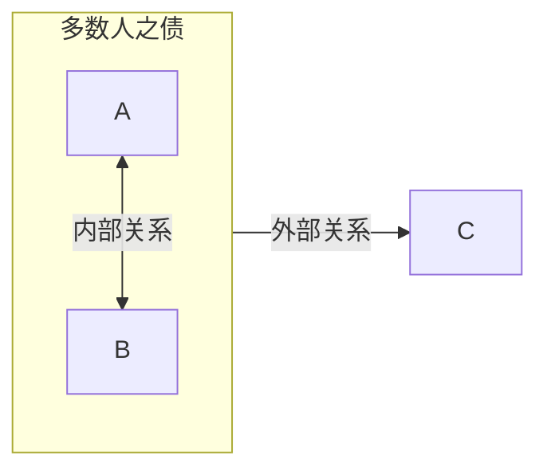
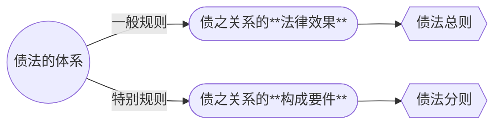

# I. 债法导论
## 一、债的概念（意义）

### （一）债的概念（给付）

>[!cite] 民法通则 84 对“债”的立法定义
>第八十四条　 ==债==是【按照合同的约定】或者【依照法律的规定】*（债的发生原因）*，在【当事人之间】*（债的效力是相对的）*产生的特定的权利和义务关系。享有权利的人是债权人，负有义务的人是债务人。  
　　债权人有权要求债务人按照合同的约定或者依照法律的规定履行义务。
　　
⬆️奠定债法体系化的基础

>[!cite] [[民法典#第一百一十八条-第2款|《民法典》第 118 条第二款]]的“债权”
>债权是因 **合同**、**侵权行为**、**无因管理**、**不当得利**以及**法律的其他规定**，权利人**请求**特定义务人**为或者不为一定行为**的权利。

- ==债==：特定人间一方得（dé）[[#（二）债权是请求权|请求]]他方为特定行为（**给付**）的法律关系
	- 这个定义是所谓「`狭义债之关系`」，是单向、个别的债权债务关系（[[民法典#第五百九十八条|598]]，[[民法典#第六百二十六条|526]]）
		- 通则 84、民法典 118-2 都是狭义
	- 广义的债：**特定人之间以给付义务为中心的法律关系**（多个狭义之债构成的总括性法律关系）
		- *eg.买卖行为属于广义债之关系（给付、对待给付）*

![[买卖之债属于广义债之关系.png]]

>[!tip] 概念认知
> - “债”是民法上一个高度抽象的术语，具有特定内涵
> - 债源自罗马法 *Obligatio* ，Ob-*ligatio*（v. *ligare*, 捆绑），属大陆法系特有的法律范畴

### （二）债的特征

- 债为特定人之间的法律关系（法锁：==特定结合关系==）

 **主体特定**
- 债权人、债务人
	- 债为特定人请求特定人为特定行为的法律关系
	- **债权人**：有权利请求对方当事人为一定给付
	- **债务人**：有义务向对方当事人为一定给付
- 单一之债、多数人之债
	- 多数人之债：债务人、债权人中一方为两人以上
		- 外部关系：全体与对方
		- 内部关系：本方的内部关系

**客体**/债的标的
- 债之关系上特定人之间得请求的**特定行为**
	- 给付
		- 行为：作为、不作为（竞业协议）

>[!note] 给付的要件
>- 合法
>- 确定/可得确定：给付的内容须于债权成立时确定，或至少与债务履行时可得确定

>[!faq] 债的标的 vs 债的标的物
>- 债的标的：给付本身，债之关系的构成要素
>- 债的标的物：给付的对象，指向债务人行为所及之物
>>[!example] 劳务之债
>>劳务之债中，劳务本身足以完成给付而无需给付给付标的物

 **内容**
- 债权与债务

>[!tip] 延伸
>债之关系是“法律关系”的原型

## 二、债权
>review: [[2. 权利的分类]]

### （一）债权是财产权
>[[2. 权利的分类#一、根据==权利内容== ：财产权/非财产权|根据权利的内容分类]]

 **给付** 具有财产价值，或可给予经济评价
- “损害赔偿”救济手段的普遍性（债权的一般救济手段）

 ==债权系债权人重要的财产==
- 与“物权”一样，债权也是“归属于”债权人的一项财产
- 其意义并不仅限于被动的“受领给付”，并因此增益自己的财产（“给付”之意）
- 债权人可以处分债权
	-  *eg.出卖债权、[[民法典#第十六章 保理合同|保理]]、[[民法典#第四百四十五条|债权出质]]
- 债权作为债权人“责任财产”的意义

- 债权在财产法上的优越地位（从归属到利用）
	- 债权系当代金融体系的一大支柱

债权与物权的对比

| 比较对象 |       债权       |       物权       |
| :--: | :------------: | :------------: |
| 权利性质 | 均为财产权（财产性法律关系） | 均为财产权（财产性法律关系） |
| 权利客体 |    特定人的给付行为    |    特定的物或权利     |
| 实现方式 |      请求性       |      支配性       |
| 效力范围 |  相对性（有例外）/对人性  |    绝对性/对世性     |
| 并存关系 |    平等性/共存性     |    排他性/优先性     |

### （二）债权是请求权
>[[2. 权利的分类#（二）请求权|根据权利的作用分类：请求权]]

- **债权的实现**需依赖于债务人履行债务的行为
- **债权的效力**主要就表现在可以请求债务人实施特定行为以满足债权
- **债权的非支配性**
	- 债权非为对债务人（人身）的支配
	- 债权非为债务人行为的支配
	- 债权非为对债的关系所涉之标的物的支配

>[!question] 债权是请求权，这一表达在严格意义上是否正确？
>实质上，是不准确的

>[!tip] 债权与请求权的关系
> - ”债权是财产权“意味着什么（处分等）
> - 债权的效力首先且主要的表现为请求权
> - 债权的效力不限于请求，还包括[[2. 权利的分类#（三）抗辩权|抗辩]]、[[2. 权利的分类#（四）形成权|形成]]、处分等
> - 请求权不限于债权请求权，还存在物权请求权
> >[!note] 结论： 
> >债权系「本权」（[[2. 权利的分类#（一）原权与救济权|原生性权利]]），请求权系债权的效力，是债权效力的主要方法；不能将债权等同于请求权，而应注意债权的财产属性

### （三）债权是对人权，具有相对性
>[[2. 权利的分类#（2）相对权|根据义务主体是否特定]]

原则上，债权人仅能向特定债务人请求给付，而不能向第三人提出权利主张或以其债权对抗第三人

>[!cite] [[民法典#第四百六十五条]]
>依法成立的合同，受法律保护。
>
>依法成立的合同，**仅对当事人具有法律约束力**，但是法律另有规定的除外。

- 债权具有相对性（物权具有绝对性）
	- 债权相对性的突破（例外）
		- 如租赁权物权化，买卖不破租赁→[[民法典#第七百二十五条]]
		- [[民法典#第二百二十一条|民法典第 221 条]]规定的预告登记制度
		- 其他：如涉他合同、债的保全等

### （四）债权的非排他性

- 债权可以同时对数个债权人负担内容完全相同的给付

>[!example] 以”一物多卖“为例
>甲将祖传瓷器先出售于乙，支付前，又出售于丙，两买卖合同效力如何？
> - 《合同法解释（二）》（已废止）第十五条表明，数个买卖合同有效。
> 	- 买卖合同解释，第 6 条，第 7 条
> - 「一物十卖，承认十个合同都有效才能保护其他九个合同当事人的期待」
> - 看似“反常识”的规则，理解债权合同的[[2. 法律行为的分类#六、负担行为与处分行为|负担行为]]（而非处分行为）性质，至关重要
> - 若认为第一买受人具有优越性，会增加市场的交易成本

### （五）债权的平等性

- 多个债权，无论其成立时间先后。原则上具有同等的效力
	- 债务人以其所有的财产（责任财产）作为承担一切债务清偿责任的基础，在债务清偿方面，并不存在“时间在先，效力优先”的规则
		- 破产法的基本原理建立在债权平等性上
	- 如果多个债权人的债权指向债务人的同一个给付，则多个债权人处于平等的地位，成立在先的债权原则上并不享有优先得到给付的效力
		- 我国司法实践中，有基于现实考量的不同处理的，依照民法典的有关规定处理。
			- 《买卖合同解释》第6、7条；《城镇房屋租赁解释》第5条

>[!cite] 《城镇房屋租赁解释》第五条
> 出租人就同一房屋订立数份租赁合同，在合同均有效的情况下，承租人均主张履行合同的，人民法院按照下列顺序确定履行合同的承租人：
（一）已经合法占有租赁房屋的；
（二）已经办理登记备案手续的；
（三）合同成立在先的。
不能取得租赁房屋的承租人请求解除合同、赔偿损失的，依照民法典的有关规定处理。

### （六）债权类型的任意性

- 合同、侵权、无因管理、不当得利等只是“典型”之债的发生原因
	- 非典型的债的发生原因举不胜举
	- 一个事例：[[民法典#第一百七十一条-第3款|第171条第3款]]
- 合同、侵权等均为抽象概念，其具体构成类型不胜枚举
- 《民法典》[[民法典#第二分编 典型合同|合同编第二分编]]规定的“典型合同”与[[民法典#第二编 物权|物权编]]规定的具体物权类型
	- 有何不同法律意义？

## 三、债务

### （一）债务的意义

- 债务：特定人（债务人）对他特定人（债权人）为特定行为的义务

- 债务的内容包括积极的作为与消极的不作为
	- 不作为义务的典型事例：*劳动合同中约定的劳动者一方的保密义务、竞业禁止义务等*
	- 债务以不作为义务表现时，原则上此种债务仅因当事人间的特别约定而发生
		- 绝对权（物权、人格权等）存在本身就意味着不特定人的不作为义务
		- 将法定不作为义务约定为合同义务的，往往存在效力瑕疵（[[3. 法律行为的生效与效力障碍#2. 违反公序良俗的法律行为：无效|违背公序良俗等]]）
			- eg.*开学了，给我100元，确保这学期我不揍你*

### （二）债务与责任（难点）

>[!question] 思考
> - “侵权行为之债”，还是“侵权责任”？
> - 《民法典》[[民法典#第八章 民事责任|总则编第八章]]规定的“民事责任”到底是什么？

>[!cite] 法条
>[[民法典#第一百七十六条|第176条]]  民事主体依照法律规定或者按照当事人约定，履行民事义务，承担民事责任。
>
>[[民法典#第一百七十九条|第179条]]  （承担民事责任的方式）

#### 责任

什么是「==责任==」：义务不履行（义务违反）的**法律强制**
- **概念**：主要指**不问责任人的意愿而课以法律后果**
	- 刑事责任、行政责任为其范例
- **实质**：强制实现此项义务的手段，履行此项义务的担保
- 民事主体之间一方“追究”另一方民事责任，这种说法意味着什么？

>[!note] 从总则时代的「责任思维」→民法典时代的「请求权思维」
>自请求权（权利）视角，而非民事责任的视角，构成民法思维的主要脉络
> - 违约责任、侵权责任皆可被**给付义务**所包容
> - 法定责任其实就是「**法定的债权债务关系**」

>[!tip] 「债」与「责任」之间的细红线
> - 考察「债」概念在法律史上的流变，可以发现，在孕育「债」这一术语的古代罗马法上，由于普遍存在对人身的强制执行，伦理上「当为」的「债务」观念与债务人之人身直接暴露在债权人的强制之下的「责任」观念可谓泾渭分明
> 	- 债的发生，并不直接涉及强制、支配的问题（债务）；仅在诉讼中被判罚后，才发生强制（责任）
> - 正是因为后世法律经历了对人执行向财产执行的转化，“债”与“责任”之间的界限才开始变得模糊不清
> 
> - 今日，总体而言，「债务」概念应强调「**特定人间的给付义务**」；而「责任」可更多从法院强制执行的视角观察

>[!tip] 「债务」与「责任」
> - 债务人一旦承担债务，即应**以其全部财产**作为其债务的总担保（对物执行）
> 	- 责任的标的是“**责任财产**”
> - 责任是实现债务的担保，常与债务相伴随（所谓“`债权的强制执行力`”）但也有例外
> 	- 有债务而无责任
> 		- 所谓“自然之债”
> 		- 时效期间届满之债权，债务人做出抗辩
> 	- 有责任而无债务
> 		- 物上担保人之责任（甲向乙借款，丙以自有房产A为乙设立抵押权）

>[!summary] 小结
> 债务：特定人间的给付义务
> 责任：强制实现此项义务的手段，实现债务的担保，其标的是责任财产

#### 有限责任&无限责任

- 无限责任：债务人对于其所负的债务，应以其所有的全部财产担保起其获得清偿
	- 无限责任是原则
	- 事实上，法人对其所负债务承担无限责任
- 有限责任，指仅以一定的财产或最高至一定数额为限，对于特定债务的履行负责
	- 有限责任是例外
		- 固定、有限合伙人职责人
		- [[民法典#第一千一百六十一条|继承人清偿债务职责人]]
		- 物上担保人之责任

---
# II. 债的发生

## 一、从债的发生角度看债的概念

>[!example] 引入：债的发生
>- 甲将经典款Labubu出卖于乙，乙应支付约定的价款1万元
> - 乙患病昏迷，甲将其送医，支付交通费、医疗费1万元，[[民法典#第九百七十九条|乙应偿付1万元]]
> - 甲误认为其饲养之犬咬伤乙（实际为丙饲养之犬肇事），并赔偿1万元，乙应返还
> - 乙在阳台上摆弄花盆，不慎掉落，致楼下路人甲受伤，花费医疗费1万元，乙应赔偿

- 上述各法律关系的**事实构成**、**社会功能**与价值基础均显著不同
	- **合同**：合意基础；合同法实践私法自治；保护当事人的交易预期
	- **无因管理**：缺乏合意；奖励互助，同时平衡不得随意干预他人事务之原则
	- **不当得利**：调整欠缺法律依据的财产变动
	- [[民法典#第一千一百六十五条|侵权行为]]：弥补因故意或过失造成的损害，并以过失责任原则兼顾加害人活动自由及被害人保护的需要

>[!question] 以上四种债的发生原因相互间差异非常大，为什么要将它们归结在一个“债”的概念之下？
> - 构成债的关系的内在统一性的基础：==法律效果在形式上的相同==
> 	- 当事人一方可以向他方当事人[[Chap1. 债法总论#（二）债权是请求权|请求]]为特定行为
> 	- **债为特定当事人间具有[[Chap1. 债法总论#（三）债权是对人权，具有相对性|相对性]]的[[Chap1. 债法总论#（二）债的特征|权利义务关系]]**
> 	- 无论基础事实为何，其结果都是在观念世界中将两个特定主体用“债之关系”（“给付关系”）相结合

>[!question] 我们需不需要一个抽象的「债」的概念？
> - [[民法典|民法典]]结构（共七编）
> 	- 总则、物权、**合同**、人格权、婚姻家庭、继承、侵权责任
> 		- 未设债编、未见债的一般规范

- 以[[民法典#第三编 合同|合同通则]]相关规范充当**债法通则（总则）**
>[!cite] [[民法典#第四百六十八条|第468条]]
非因合同产生的债权债务关系，适用有关该债权债务关系的法律规定；没有规定的，**适用**（不是“可以适用”）本编通则的有关规定，但是根据其性质不能适用的除外。

>[!tip] 合同编与“债权编”
> - 相对于《合同法》总则编的表述， 合同编通则改“合同权利义务”为“债权、债务”，弱化“合同”，强化“债权”
> 	- 认真观察[[民法典#第四章 合同的履行|合同编第四章（履行）]]、[[民法典#第五章 合同的保全|第五章（保全）]]、[[民法典#第六章 合同的变更和转让|第六章（转让）]]、[[民法典#第七章 合同的权利义务终止|第七章（终止）]]相关条文用语

## 二、合同（契约）

1. **什么是合同**？
	1. **定义**
		- 当事人设立、变更、终止民事权利义务的[[2. 法律行为的分类#（1）**双方行为**|双方法律行为]]（“协议”）
			- 合同由两个意思表示构成，且此两个意思表示必须形成合致（意思表示一致）
			- 合同成立的判断：[[Chap4. 合同的订立#II. 要约|要约]]、[[Chap4. 合同的订立#III. 承诺|承诺]]等
	2.  **合同有广狭两义**
		- 广义的合同（[[2. 法律行为的分类#（1）**双方行为**|双方法律行为]]）
			- 除产生 *债权效果* 的合同外，还包括产生*物权、身份* 等方面法律效果的合同
		- 狭义合同
			- 仅指产生债权债务关系的双方法律行为
	3. **合同之债**
		- 合同之债属于典型的意定之债
			- 契约自由
		- 合同所产生的债属于[[Chap1. 债法总论#（一）债的概念（给付）|“广义”之债]]的关系

>[!question] 单方允诺是否为我国法上债的发生原因？
> - 因债务人单方允诺对他人负担债务而导致债的发生，属于意定之债
> - 意思自治的精神尤其体现在以下方面：未经其同意，不得将法定义务以外的义务强加于某人
> 	- 对因他人的单方允诺而取得债权的当事人而言，在特定情形下，其意志是否介入并不重要，毕竟其不因此而负担任何义务；
> 	- 依此种债权发生机制取得债权者，当然可以抛弃此项债权

- 我国法上的[[民法典#第四百九十九条|“悬赏广告”]]
	- link.[[1. 法律行为的成立#3. 有相对人的意思表示之解释]]
	- 契约说与单独行为说 

【观察结论】若对悬赏广告采契约说，则在我国法上基本没有单方允诺产生债的情形（可以讨论遗赠表示是否属于）

#### （?）单方允诺
- 单方允诺指的是表意人单独为自己设定义务的行为。此处的「单方」着眼于债务人。

## 三、无因管理

1. **定义**
	- 没有（约定或法定的）义务而【为他人利益】管理事务，从而（【依法律规定】【在管理人与被管理人之间】所产生的）**债权债务关系**
		- 《民法典》合同编第三分编“准合同”，尤其是[[民法典#第九百七十九条|第979]]、[[民法典#第九百八十条|980条]]
2. 制度价值
	- 在奖励互助与保障私生活的自主性之间寻求平衡
		- 区分“适法无因管理”与“不适法无因管理”

>[!cite] [[民法典#第一百二十一条]] 无因管理
>没有约定或法定的义务而为他人利益管理事务，从而依法律规定在管理人与被管理人之间所产生的债权债务关系

## 四、不当得利

1. **定义**
	- 【欠缺法律上的原因】，一方得利，致另一方受损，从而（在得利人与受损人之间产生的）（以利益返还为内容的）**债权债务关系**
		- 《民法典》[[民法典#第二十九章 不当得利|合同编第三分编第二十九章]]

 2. **制度价值**
	- 在私法主体之间发生利益的变动，必须基于正当的原因
		- eg.*买受人基于有效的买卖合同以支付价金为对价取得标的物所有权*
	- 如果实际发生的财产变动缺乏正当原因的支持，那么，面对受损人的损失，得利人的所得就失去了正当的基础
	- 不当得利之债的制度功能在于**矫正缺乏合理基础的财产变动**

>[!cite] [[民法典#第一百二十二条]] 不当得利
> 因他人没有法律根据，取得不当利益，受损失的人有权请求其返还不当利益。

## 五、侵权行为

1. **定义**
	- 【因（可归责于行为人的）原因】（因过错），导致他人权利或法益受损的，行为人对受害人应负损害赔偿之债，此种损害赔偿之债即为**侵权行为之债**

 2. 侵权行为与债法
	- 《民法典》[[民法典#第七编 侵权责任|第七编“侵权责任编”]]
		- 侵权责任编是否可全然归入“债法”，存在理论争议
		- 侵权行为之债不仅注重对受害人损害的填补，而且还要兼顾行为人行为的自由

>[!cite] [[民法典#第一千一百六十五条]] 侵权行为
> 行为人因过错侵害他人民事权益造成损害的，应当承担侵权责任。
> 
> 依照法律规定推定行为人有过错，其不能证明自己没有过错的，应当承担侵权责任。

## 六、缔约过失责任

1. **定义**
	- 在缔约过程中具有过失，使他方当事人受有信赖利益损失的行为。
		- 如：*不得假借订立合同恶意进行磋商；应及时将与缔约有关情形通知对方；采取必要措施保护对方的人身安全等*
			- 这种义务在学理上被称为“前合同义务”

2. **构成要件与规范基础**
	- 缔约过失责任以违反前合同义务为其法定构成要件
	- 规范基础在于《民法典》[[民法典#第五百条|第500]]、[[民法典#第五百零一条|501条]]
		- 属于广义的“契约责任”（相对于“契约外责任”而言）

## 七、其他法律原因

- 除上述各种典型而且往往是要件化了的债的类型外，还存在大量基于法律的特别规定而产生债之关系的情形
	- 民法总则、物权、婚姻家庭、继承等部分都可能有类法律规范存在
	- **商法**规范中存在大量的债法规范
	- 规定产生债之效果的规范甚至可以是**公法**性规范
		- 例如，*基于税法，税收征管部门对纳税人产生税收债权*

>[!summary] 小结：债的发生原因
> - 核心：给付
> 	- [[Chap1. 债法总论#二、合同（契约）|合同]]：当事人设立、变更、终止民事权利义务的双方法律行为
> 	- [[Chap1. 债法总论#三、无因管理|无因管理]]：没有约定或法定的义务而为他人利益管理事务，从而依法律规定在管理人与被管理人之间所产生的债权债务关系
> 	- [[Chap1. 债法总论#四、不当得利|不当得利]]：欠缺法律上的原因，一方得利，致另一方受损，从而在得利人与受损人之间产生的以利益返还为内容的债权债务关系
> 	- [[Chap1. 债法总论#五、侵权行为|侵权行为]]：因过错，导致他人权利或法益受损的，行为人对受害人应负损害赔偿之责。
> 	- [[Chap1. 债法总论#六、缔约过失责任|缔约过失责任]]：因缔约接触，在缔约当事人间即应产生基于诚信原则的注意与保护义务

---
# III. 债法

## 一、债法的外延

- 债法，有形式上债法与实质意义上债法的区分
	- 形式意义：指关于债权债务关系的专门立法或民法典中的“债编”
	- 实质意义：指以债之关系为规范对象的所有法律规范的总称
		- 《民法典》第三编、第七编
		- 《公司法》《保险法》《票据法》《破产法》等商事单行立法
		- 行政法规中包含的债法规范
		- 具有实际法律效力的最高人民法院的司法解释
		- 习惯法
			- “交易惯例”在合同法上具有特别重要的意义（如[[民法典#第五百零九条|第509]]、[[民法典#第五百一十条|510]]）

## 二、债法的特点
	狭义的债法：合同法

### （一）债法是财产法

1. 债之关系制造**张力**
	- 债之关系，在当事人间制造了一种**指向将来之财产变动**的==紧张关系==（张力）

2. **张力**消除借助**履行**
	- 这一紧张关系的消除正需借助债务的履行：随着债务的履行，债之关系归于消灭，同时其所负担的财产变动功能也随之实现

3. 债法所规范调整的正是**这一动态的财产关系**

### （二）债法是典型的任意法

>[!info] 任意法
> 任意法（德语：dispositives Recht，英语：optional law），又称为“任意性规范”或“补充性规范”，是法学中的一个重要概念。它指的是**允许当事人在不违反法律基本原则和公共利益的前提下，通过他们自己的协议或约定来改变、补充甚至排除适用的法律规范**。
> by Gemini

1. 债的[[Chap1. 债法总论#（三）债权是对人权，具有相对性|相对性]]
	- 债的效力仅局限于特定当事人之间，其对他人利益及公共利益的影响相当有限

2. 债法承认契约自由
	- 债法对于债的发生及其内容采自由主义，承认契约自由的原则，允许当事人通过契约任意设置债的类型与内容
3. 结论
	- 债法，是典型的任意性规范，其意义在于对当事人的意思加以解释与补充

### （三）债法具有一定国际化（趋同）趋向

1. 原因
	- 债法调整动态的交易关系，而自古以来交易关系就不限于在一国之内进行
	- 随着经济一体化程度的不断加强，人们对债法（尤其是其中的合同法）的国际化、一体化的要求也与日俱增

2. 例子
	- 1980年《联合国国际货物销售合同公约》（CISG）
		- 对我国合同法产生了十分重要的影响
	- 示范法
		- 国际统一私法协会《国际商事合同通则》（PICC）
		- 《欧洲合同法原则》（PECL）
		- 欧洲私法《共同参考框架草案》（DCFR）

## 三、 债法的体系构成

1. 债法总则有必要
	- 通过[[民法典#第四百六十八条|第468条]]，**民法典其实有实质意义上的债法总则**

>[!cite] [[民法典#第一百一十八条-第2款]]
>债权是因合同、侵权行为、无因管理、不当得利以及法律的其他规定，权利人请求特定义务人为或者不为一定行为的权利。
- 该条为我国债法体系的建立奠定基础

>[!cite] [[民法典#第四百六十八条]]
> 非因合同产生的债权债务关系，==适用==有关该债权债务关系的法律规定；没有规定的，适用本编通则的有关规定，但是根据其性质不能适用的除外。
- 该条是我国实质债法总则的构造枢纽，其中「适用」二字是题眼
	- 法官在将合同编通则中的债法总则规范适用于债之全体领域时，方法论上是直接「适用」而非「参照适用」

>[!tldr] 小结
>民法典合同编是一个欠缺侵权之债特殊规则的民法典债编
![[债法总则规范.png]]
>©️图源《中国民法学·债法》李永军等

2. 各种原因发生之债适用相同规则
	- 无论是合同之债，侵权行为之债，还是无因管理之债等典型或非典型的债之关系，它们在债务的履行规则、债的担保与保全、债的移转、债的消灭等许多方面都适用相同的规则

3. 不用债法总则是不经济的
	- 如果舍弃“提取公因式”的总则技术不用，那么只能有两种解决方案
		- 就所有债的类型分别就上述问题做出规定
		- 只选择一种典型的债之类型就上述问题做出规定，为避免法律漏洞，法官就只能运用类推适用等法律续造的方法解决问题，这会加重法官的论证负担