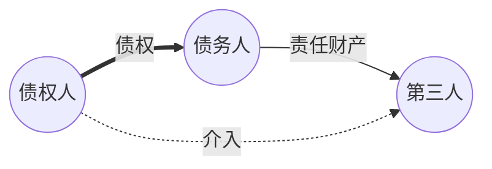
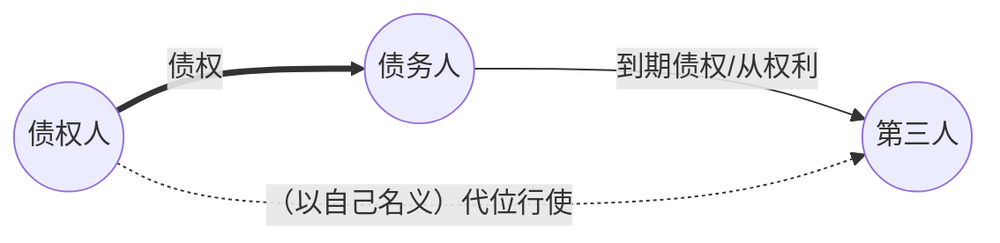
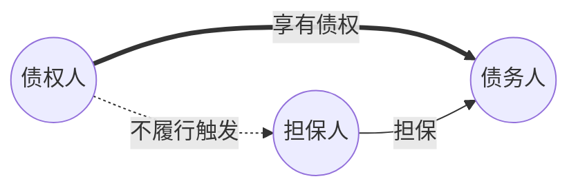

# 引论：债权实现的保障制度 

- **债权实现的基础**: 依赖于债务人的清偿能力，以债务人责任财产为基础 。
    
- **保障手段**: 担保与保全 。
    
- **保全**: 维持债务人责任财产的现有状态 。
    
    - 债权人代位权 
        
    - 债权人撤销权 
        
- **担保**: 强化债权实现的机会 。
    
    - **人保 (保证)**: 引入第三人责任，扩大责任财产范围 。
        
    - **物保 (担保物权)**: 在特定财产上取得优先受偿权 。
        
- **体系图示**：
    
  ```mermaid
    graph LR
        A[债的实现] --> B(债的担保);
        A --> C(保全);
        B --> D(人的担保);
        B --> E(物的担保);
        C --> F(债权人代位权);
        C --> G(债权人撤销权);
        D --> H(保证);
        E --> I(抵押权);
        E --> J(质权);
        E --> K(留置权);
    
        style A fill:#f9f,stroke:#333,stroke-width:2px
        style B fill:#ccf,stroke:#333,stroke-width:1px
        style C fill:#ccf,stroke:#333,stroke-width:1px
        style D fill:#9cf,stroke:#333,stroke-width:1px
        style E fill:#9cf,stroke:#333,stroke-width:1px
        style F fill:#9cf,stroke:#333,stroke-width:1px
        style G fill:#9cf,stroke:#333,stroke-width:1px
        style H fill:#69c,stroke:#333,stroke-width:1px
        style I fill:#69c,stroke:#333,stroke-width:1px
        style J fill:#69c,stroke:#333,stroke-width:1px
        style K fill:#69c,stroke:#333,stroke-width:1px
    
    ```

# 第一节 债的保全 

- 规范依据：《民法典》第三编第五章“合同的保全” 。

## 一、 债的保全概说 




- **定义**: 债权人为保障债权清偿，防止债务人责任财产减少的手段 。
    
- **性质**:
    
    - 债的**对外效力**，突破合同相对性，允许债权人干预债务人与第三人的关系 。
        
    - 债权的**固有效力** （不通过从属性法律发生效力，是债权自身产生的效力）。
        
- **立法演变**: 《合同法》规定于“合同履行”章；《民法典》单列“合同的保全”章 。实质是“**债权的保全**” 。
    
- **类型**:
    
    - **代位权**: 针对债务人**怠于行使**到期债权 。
        
    - **撤销权**: 针对债务人**积极减少**责任财产或实施其他损害债权行为 。
        

## 二、 债权人代位权 

### （一）意义 



- **定义**: 债权人为保全其债权，以**自己名义**代位行使**债务人对相对人**权利的权利 。
    
- **法条依据**: [[民法典#第五百三十五条]] 。
    
    - **要件**:  $$债务人怠于行使其对相对人的到期债权或从权利 + 影响债权人到期债权实现 $$
        
    - **行使方式**: 向法院请求以自己名义代位行使。
        
    - **范围限制**: 以债权人的到期债权为限
	    - （eg.*债权人对债务人享有 100 万金钱之债，债务人自身享有对第三人的 300 万金钱之债，债权人仅可对第三人主张 100 万*） 。
        
    - **费用**: 必要费用由债务人负担 。
        
    - **抗辩**: 相对人对债务人的抗辩，可向债权人主张 。
	    - 相对人的法律地位不会劣于本诉

### （二）简史与比较 

- **罗马法**：有撤销权起源，无代位权制度 。
    
- **法国法**：起源于习惯法，《法国民法典》规定为“间接诉权” 。
    
- **德、瑞法**：民法典未规定，通过强制执行法实现功能 。
    
- **日、台**：民事程序法有执行规定，民法典亦规定代位权 。
    
- **中国**：兼由程序法（民诉法解释）和实体法（民法典）规范 。
    
    - **程序法执行**: [[民诉法解释#第四百九十九条]] 规定法院可冻结被执行人对他人的到期债权，并通知该他人向申请执行人履行 。但前提是需有执行名义，且该他人无异议；若有异议且债权未经司法确认，则无法强制执行 。
        
    - **实体法代位权**: 在程序法执行遇阻时，实体法代位权（代位诉讼）提供救济途径 。
        

### （三）性质 

- 债权的对外效力（突破相对性）
	- 穿透相对关系而及于第三人
    
- 债权人的固有权利 。
    
- 实体法上的权利 。
    

### （四）构成要件 

1. **债务人==怠于行使==其到期债权或者与该债权有关的从权利** 
    
    - **客体**: 仅限于**债权**及**从权利** (如担保物权、解除权) 。不包括物权请求权等其他财产权 。
        - 《合同法解释一》曾限制为金钱债权，现《民法典》未作此限制 。
        
    - **「怠于行使」**: 指不==以诉讼或仲裁方式==主张（[[合同编通则解释#第三十三条]]）
        
2. **影响债权人的到期债权实现** (有保全必要) 
    
    - 结果：债务人怠于行使可能导致债权人不获清偿 。
        
3. **债权人的债权已届履行期** 
    
    - **例外**: 清偿期届满前的保全（[[民法典#第五百三十六条]]）：债务人债权或从权利==时效将届满、未及时申报破产债权等紧急情况==，影响债权实现的，债权人可**代位**向相对人请求其**向债务人**履行、申报等 。
        
4. **债务人的债权不是专属于债务人自身的债权** 
    
    - [[合同编通则解释#第三十四条]] 列举专属性权利：
        
        - 人身损害赔偿请求权
            
        - 抚养费、赡养费、扶养费请求权
            
        - 劳动报酬（超出生活必需部分除外）
            
        - 基本养老金、失业金、低保金等
            
        - 人寿保险金请求权
            
        - 其他人身相关的专属性权利
            

### （五）代位权的行使 

1. **行使方式**:
    
    - 以**债权人自己名义** 。
        
    - 须以**诉讼方式**行使 (“代位之诉”) 。
        
        - 原因：判决结果为次债务人向债权人直接清偿，需司法程序确保确定性 。
            
    - **被告**: 债务人的相对人（次债务人） 。
        
    - **第三人**: 法院应追加债务人为诉讼第三人 ([[合同编通则解释#第三十七条]]) 。
        
2. **行使范围**:
    
    - 以**债权人的到期债权**为限 ([[民法典#第五百三十五条-第2款]]) 。
        
3. **次债务人的抗辩**:
    
    - 相对人对债务人的抗辩，可以向债权人主张 ([[民法典#第五百三十五条]] 第3款) 79。
        
    - 抗辩成立，则阻却代位权效力，法院驳回诉请 80。
        
4. **《合同编通则解释》相关规定**:
	- [[合同编通则解释#第三十六条]]：债务人不能以其与相对人有仲裁协议为由对法院主管提出异议，但是可以在与债权人的首次开庭前申请仲裁，从而中止代位权诉讼。
    
    - [[合同编通则解释#第三十七条]]: 债务人在代位权诉讼中对相对人的诉讼不影响代位权诉讼，但恶意串通除外。
        
    - [[合同编通则解释#第三十八条]]: 代位权诉讼中，债务人处分其对相对人的债权，需法院审查是否损害债权人利益。
        
    - [[合同编通则解释#第三十九条]]: 代位权诉讼中，债务人未经法院许可（3/5规则？）与相对人和解可能无效。相对人不得以与债务人新达成的协议对抗债权人。
        
    - [[合同编通则解释#第四十条]]: 代位权成立，判决相对人向债权人履行；履行后，相关债权债务关系消灭。
        
5. **代位权的效果: 直接清偿 vs. 入库规则** 
    
    - **直接清偿** (我国采纳)：相对人直接向债权人履行 。
        
        - **支持**: 节约成本，鼓励行权，解决执行难 。
            
        - **反对**: 使行权债权人获优先受偿权，违背债权平等，损害其他债权人利益 。直接清偿使代位权超越“保全”功能，具有“收取”功能

>[!tip] 入库规则
> 债权人通过代位权所取得的履行利益，不直接归债权人所有，而应先进入债务人的财产中（即“入库”），再由债权人依据其债权受偿。
>by GPT-5

>[!cite] [[民法典#第五百三十七条]]
>人民法院认定代位权成立的，由债务人的相对人向债权人履行义务，债权人接受履行后，债权人与债务人、债务人与相对人之间相应的权利义务终止。债务人对相对人的债权或者与该债权有关的从权利被采取保全、执行措施，或者债务人破产的，依照相关法律的规定处理。

## 三、 债权人撤销权 

### （一）意义 

- **定义**: 债权人对于债务人**损害债权**的行为，有请求法院**撤销**该行为的权利 。
    
- **起源**: 罗马法上的“保罗诉权”（Action Pauliana） 。
    
- **普遍性**: 大陆法系各国民法普遍设有规定 。
	
- **中国法中的性质**：既有形成权的后果，又有请求权的后续效力
    

### （二）构成要件 

- **法条依据**: [[民法典#第五百三十八条]] (无偿行为)、[[民法典#第五百三十九条]] (有偿行为/非对称减值行为) 。
	- 区别：第三人是否知情

>[!cite] [[民法典#第五百三十八条]] 
>债务人以放弃其债权、放弃债权担保、无偿转让财产**等方式**无偿处分财产权益，或者恶意延长其到期债权的履行期限，影响债权人的债权实现的，债权人可以请求人民法院撤销债务人的行为。

>[!cite] [[民法典#第五百三十九条]] 
>债务人以明显不合理的低价转让财产、以明显不合理的高价受让他人财产或者为他人的债务提供担保，影响债权人的债权实现，**债务人的相对人知道或者应当知道该情形的**，债权人可以请求人民法院撤销债务人的行为。

1. **客观要件** 
    
    - **债务人有减少责任财产，或其他削减债权的行为**
        
        - [[民法典#第五百三十八条|无偿行为]]
	        - 放弃到期债权、无偿转让财产、恶意延长到期债权履行期等 。
            
        -  [[民法典#第五百三十九条|有偿行为/非对称减值行为]]
	        - 以明显不合理低价转让财产、以明显不合理高价受让他人财产、为他人债务提供担保 。
            
            -  [[合同编通则解释#第四十二条|“明显不合理”价格标准]]
	            - 低价 < 市场价70%
	            - 高价 > 市场价130% 
	            - 关联方交易不适用此比例限制 。
                
    - **债务人的行为影响债权人的债权实现** (“有害债权”) 
        
        - 须危及债权实现，才有保全必要 。
            
2. **主观要件** 
    
    - **无偿行为** 
	    - **不要求**受益人（相对人）主观状态（是否知情） 。
        
    - **有偿行为/非对称减值行为**
	    - 要求**相对人**（受益人或受让人）在行为时**知道或应当知道**该情形（即债务人的行为影响债权实现） 。
        
        - 为他人提供担保，须相对人（被担保的债权人）具有恶意 104。
            
3. **与破产撤销权的衔接**:

>[!cite] 破产法 31 条
>人民法院受理破产申请前一年内，涉及债务人财产的下列行为，管理人有权请求人民法院予以撤销：
> - （一）无偿转让财产的；
> - （二）以明显不合理的价格进行交易的；
> - （三）对没有财产担保的债务提供财产担保的；
> - （四）对未到期的债务提前清偿的；
> - （五）放弃债权的。

### （三）撤销权的行使 

1. **行使方式**: 须以**诉讼方式**行使 。
    
2. **行使对象 (被告)**: 以**债务人**和**债务人的相对人** (受益人/受让人) 为共同被告 ([[合同编通则解释#第四十四条]]) 。
    
3. **行使范围**: 以**债权人的债权**为限 。
    
    - 前提：行为标的须可分 。
        
4. **行使期间 (除斥期间)**:
	
    - 自债权人**知道或应当知道**撤销事由之日起**1年**内行使 。
        
    - 自债务人行为发生之日起**5年**内未行使的，撤销权消灭 。

### （四）撤销权的效力 

1. **对债务人的效力**: 债务人的行为被视为**自始无效** ([[民法典#第五百四十二条]]) 。
    
2. **对第三人（相对人）的效力**:
    
    - 法律行为被撤销，第三人取得的财产**应返还给债务人** 。
        
3. **对债权人的效力**:
    
    - 债权人可在撤销诉讼中同时请求相对人向债务人返还财产等 ([[合同编通则解释#第四十六条]] 第1款) 。
        
    - 法院可依债权人申请，强制执行相对人对债务人的返还义务，以实现债权人的债权 ([[合同编通则解释#第四十六条]] 第3款) 。

> [!tip] 间接收取
> 撤销权的行使效果是将财产**恢复至债务人名下**，而非直接归债权人。但通过[[民诉法解释#第四百九十九条]]，可实现强制执行的衔接，达到类似代位权直接受偿的效果。


# 第二节 债的担保（保证） 

- **范围说明**: 本节仅讨论**保证**，不包括担保物权、非典型担保、定金 。
    
- **规范基础**:
    
    - **旧法**: 《担保法》(1995)、《担保法解释》(2000)。
        
    - **现行法**:
        
        - 《民法典》合同编 第十三章 “保证合同” 。
            
        - 《民法典担保制度解释》 。

## 一、保证的意义 



- **定义**: 保证人向债权人承诺，在债务人不履行到期债务或发生约定情形时，由其履行债务或承担责任 （[[民法典#第六百八十一条]]）。
    
- **特征**:
    
    - **人的担保**: 以保证人全部责任财产担保，不涉优先受偿 。
        
    - **第三人担保**: 保证人是债务人以外的第三人，不存在债务人自我保证 。 (物保可由债务人提供、也可由第三人提供)
        
    - **从属性**: [[民法典#第六百八十二条-第1款|保证债务依附于主债务（权利）]] 。主债无效则保证无效 (法律另有规定除外)；主债消灭则保证消灭 。
	    - 所有意定之债/法定之债都可以担保，例如交通事故中的侵权损害之债也可进行担保（质押财产）。此时，没有主合同。
        
    - **无效后果**: 保证合同无效后，[[民法典#第六百八十二条-第2款|各方按过错承担相应责任]] 。

## 二、保证合同的成立 

### （一）保证人 

- [[民法典#第六百八十三条|资格限制]]:
    
    - **机关法人**不得为保证人 (国务院批准的为外贷转贷除外)。
        
    - 以**公益为目的**的[[法人#（三）营利法人与非营利法人（我国立法分类）|非营利法人]]、[[非法人组织|非法人组织]]不得为保证人。
        
- **后果**: 不具资格者订立的保证合同无效 。
    
- **担保制度解释**:
    
    - 担保制度解释第五条: 法人分支机构提供保证，一般无效，除非有法人书面授权或构成表见代表。
        
    - 担保制度解释第六条: 学校、幼儿园、医疗机构、养老机构等公益非营利法人、非法人组织提供保证，一般无效，但有例外情形（如涉及留学贷款反担保）。

>[!tip] 一人有限责任公司的担保
> 一般的，法人作为债务人，公司实控人（自然人）可以作为担保人

### （二）保证合同的订立 

- **方式**: 意定担保，需达成合意 。
    
- **形式**: **要式合同**，应采用[[民法典#第六百八十五条|书面形式]] 。
    
    - 可以是**单独合同** 。
        
    - 也可以是主合同中的**保证条款** 。
        
    - **特殊形态**: 第三人单方以书面形式向债权人作出保证，债权人接收且未提异议的，合同成立 [[民法典#第六百八十五条-第2款]] 。
        
- **当事人**: **债权人** 与 **保证人** 。

## 三、保证范围 

- **约定优先**: 由当事人约定 。
    
- **未约定或不明**（[[民法典#第六百九十一条]]）
	- 保证范围及于**全部主债务**（不超过被担保之债务）
		- 包括：主债权及利息、违约金、损害赔偿金、实现债权的费用

## 四、保证类型 

- **立法演变**
    
    - 《民法通则》: 均为连带责任保证 。
        
    - 《担保法》: 区分一般保证与连带责任保证，**连带为默认** 。
        
    - 《民法典》: 继续区分，**一般保证为默认**，连带为例外 。
        
- **类型的确定** [[民法典#第六百八十六条]]:
    
    - **约定不明**: 按照**一般保证**承担责任 。
        
    - **推定**: 《担保制度解释》第25条 规定了根据合同具体措辞判断保证方式的规则 。
        
        - 约定在债务人**不能/无法**履行时承担责任 $\to$ 一般保证。
            
        - 约定在债务人**不履行**时承担责任，且无“须先向债务人主张”之意 $\to$ 连带责任保证。
            

### （一）一般保证及“先诉抗辩权” 

- **定义**: 约定债务人不能履行债务时，由保证人承担责任 [[民法典#第六百八十七条-第1款]] 。
    
- **先诉抗辩权**:
    
    - **内容**: 在主合同纠纷未经审判或仲裁，并就债务人财产依法强制执行仍不能履行债务前，保证人有权拒绝承担保证责任 （[[民法典#第六百八十七条-第2款]]） 。
        
    - **理解**: 实质为“先**执行**抗辩权” 。
        
    - **意义**: 保护保证人，使保证责任具补充性 。[[民法典#第一千一百九十八条-第2款|补充责任]]也是如此执行。
        
    - **例外情形 (不得行使)** [[民法典#第六百八十七条-第2款]]但书:
        
        1. 债务人下落不明，且无财产可供执行。
            
        2. 法院已受理债务人破产案件。
            
        3. 债权人有证据证明债务人财产不足以清偿全部债务或丧失履行能力。
            
        4. 保证人书面放弃该权利。
            
    - **诚实信用**: 债权人对主债务人行使诉权困难或无实益时，保证人不得行使 。
        
- **诉讼表现** 

>[!cite] 《担保制度解释》第二十六条 
>一般保证中，债权人以债务人为被告提起诉讼的，人民法院应予受理。债权人未就主合同纠纷提起诉讼或者申请仲裁，仅起诉一般保证人的，人民法院应当驳回起诉。
> 
> 一般保证中，债权人一并起诉债务人和保证人的，人民法院可以受理，但是在作出判决时，除有民法典第六百八十七条第二款但书规定的情形外，应当在判决书主文中明确，保证人仅对债务人财产依法强制执行后仍不能履行的部分承担保证责任。
> 
> 债权人未对债务人的财产申请保全，或者保全的债务人的财产足以清偿债务，债权人申请对一般保证人的财产进行保全的，人民法院不予准许。        

### （二）连带责任保证 
	不是连带之债，是不真正连带

- **定义**: 约定保证人与债务人对债务承担连带责任 （[[民法典#第六百八十八条-第1款]]） 。
    
- **特征**: 保证人**不享有先诉抗辩权** 。
    
- **行权**: 债务人不履行到期债务或发生约定情形时，债权人**可以**请求债务人履行，也**可以**请求保证人在保证范围内承担责任 [[民法典#第六百八十八条-第2款]] 。
    
- **与“连带之债”的区别**:
    
    - 非真正意义上的连带之债，保证人与债务人间不存在分担问题 。
        
    - 对债务人之一发生事项的效力不同（如债权人免除保证人责任，不影响对主债务人债权） 。对比 [[民法典#第五百二十条]]。
        

## 五、共同保证 

- **定义**: 同一债务有两个以上保证人 。
    
- [[民法典#第六百九十九条|责任承担]]
    
    - **有约定**：按约定份额承担。
        
    - **无约定**：视为份额相同？（旧法规定连带，新法未明示，解释倾向于按份）。但债权人**可以请求任一保证人**在其保证范围内承担保证责任 。
        
- **内部追偿**: [[担保制度解释#第十三条]] 规定，除另有约定外，承担了担保责任的保证人**不能**向其他保证人追偿（即内部一般不分担） 。
    

## 六、保证期间 

### （一）概念及期间确定 

- **概念**: 债权人可以要求保证人承担保证责任的**有效期间** 。
    
- **性质**: **除斥期间**，不发生中止、中断和延长 [[民法典#第六百九十二条]] 第1款 。
    
- **确定方式** [[民法典#第六百九十二条]] 第2、3款:
    
    - **约定优先**: 债权人与保证人可约定。
        
        - > [!warning] 无效约定
            
        
        > 约定早于主债务履行期或同时届满的，视为未约定。
        
    - **未约定或约定不明**: 保证期间为**主债务履行期限届满之日起六个月** 。
        
    - **主债务履行期不明**: 保证期间自债权人要求债务人履行债务的**宽限期届满之日起**计算 。（注意：这里的宽限期届满起算点与旧法解释不同）
        

### （二）保证期间届满，保证人免责 

- **一般保证**: 债权人未在保证期间内对**债务人**提起诉讼或申请仲裁的，保证人免责 [[民法典#第六百九十三条]] 第1款 182。
    
    - 原因：需克服先诉抗辩权 183。
        
- **连带责任保证**: 债权人未在保证期间内**要求保证人**承担保证责任的，保证人免责 [[民法典#第六百九十三条]] 第2款 184。
    

### （三）保证期间与保证债权诉讼时效期间的衔接 

- **双重保护**: 保证人受保证期间和诉讼时效双重期间保护 。
    
- **诉讼时效起算点** [[民法典#第六百九十四条]]:
    
    - **一般保证**: 债权人在保证期间内对债务人提起诉讼/仲裁后，从**保证人先诉抗辩权消灭之日**起，开始计算保证债务的诉讼时效 。
        
    - **连带责任保证**: 债权人在保证期间内要求保证人承担责任的，从**债权人提出该要求之日**起，开始计算保证债务的诉讼时效 。
        

## 七、保证的效力 

### （一）保证人与债权人之间 

1. **债权人的请求权**: 请求保证人履行保证债务 。
    
2. **保证人的抗辩权**:
    
    - **主张债务人的抗辩**: 保证人可以主张债务人对债权人的抗辩 [[民法典#第七百零一条]]。即使债务人放弃抗辩，保证人仍可主张 。
        
    - **主张债务人的抵销权、撤销权**: 债务人对债权人享有抵销权或撤销权的，保证人可在相应范围内拒绝承担保证责任 [[民法典#第七百零二条]] 。
        

### （二）保证人与主债务人之间 

1. **保证人的追偿权 (代位求偿权)**:
    
    - 保证人承担保证责任后，有权在其承担责任范围内向债务人追偿 [[民法典#第七百条]] 196。
        
    - 例外：当事人另有约定。
        
2. **权利代位**:
    
    - 保证人追偿时，享有债权人对债务人的权利（如担保物权等），但不损害债权人利益 [[民法典#第七百条]] 197。
        

## 引用的法律条文

- **《中华人民共和国民法典》**
    
    - `142` (意思表示解释), `153` (违反强制规定、公序良俗无效), `157` (无效、被撤销后果), `172` (表见代理), `185`(侵害英烈权益), `243` (征收补偿), `245` (征用补偿)
        
    - `466` (合同解释), `468` (准合同参照), `502` (合同生效时间、批准手续), `504` (法定代表人越权), `510` (约定不明补充), `511` (约定不明的法定补充规则), `520` (连带债务效力), `522` (向第三人履行), `524` (第三人代为履行), `525` (同时履行抗辩), `526` (先履行抗辩), `533` (情势变更), `535` (债权人代位权), `536` (代位权例外), `537` (代位权效果), `538` (撤销无偿行为), `539` (撤销有偿行为), `540` (撤销权范围), `541` (撤销权行使期间), `542` (撤销效果)
        
    - `681` (保证合同定义), `682` (保证合同从属性、无效后果), `683` (保证人资格限制), `685` (保证合同形式), `686`(保证方式及默认规则), `687` (一般保证、先诉抗辩权), `688` (连带责任保证), `691` (保证范围), `692` (保证期间), `693` (保证期间届满后果), `694` (保证期间与诉讼时效衔接), `695` (主合同变更对保证责任影响), `696` (债权转让对保证责任影响), `697` (债务转移对保证责任影响), `699` (共同保证), `700` (保证人追偿权), `701` (保证人抗辩权), `702` (保证人抵销权、撤销权)
        
- **《最高人民法院关于适用〈中华人民共和国民事诉讼法〉的解释》** (民诉法解释)
    
    - `499` (执行他人到期债权) 198
        
- **《最高人民法院关于适用〈中华人民共和国民法典〉合同编通则若干问题的解释》** (合同编通则解释)
    
    - `5` (专属于债务人自身的权利) 199
        
    - `25` (保证方式推定) 200
        
    - `26` (一般保证诉讼规则) 201
        
    - `37` (代位权诉讼中追加债务人、合并审理) 202
        
    - `38` (代位权诉讼中债务人处分债权) 203
        
    - `39` (代位权诉讼中和解限制、相对人抗辩限制) 204
        
    - `40` (代位权诉讼判决效果) 205
        
    - `42` (明显不合理低价高价认定) 206
        
    - `44` (撤销权诉讼被告及管辖) 207
        
    - `46` (撤销权诉讼效果及执行) 208
        
- **《中华人民共和国企业破产法》**
    
    - `31` (破产撤销权) 209
        
- **(旧)《最高人民法院关于适用<中华人民共和国担保法>若干问题的解释》**
    
    - 相关条款在现有解释中有对应或被替代 210
        
- **(旧)《最高人民法院关于适用<中华人民共和国合同法>若干问题的解释（一）》**
    
    - 关于代位权客体曾限制为金钱债权 211
        

## Mermaid 可视化

### 债权人代位权构成要件

代码段

```
graph TD
    A[债权人代位权构成要件] --> B{1. 债务人怠于行使<br>其到期债权/从权利?};
    B -- 是 --> C{2. 影响债权人<br>到期债权实现?};
    C -- 是 --> D{3. 债权人的债权<br>已到期?};
    D -- 是 --> E{4. 债务人的债权<br>非专属于自身?};
    E -- 是 --> F([✅ 代位权成立]);
    B -- 否 --> G([❌ 不成立]);
    C -- 否 --> G;
    D -- 否/例外:民536条 --> H{紧急情况?<br>(时效将届满等)};
    H -- 是 --> E;
    H -- 否 --> G;
    E -- 否 --> G;

    style F fill:#9f9,stroke:#333,stroke-width:2px
    style G fill:#f99,stroke:#333,stroke-width:2px
```

## 假设与备注

1. **文件来源**: 假设 `债法2025第六章.pdf` 是某一法律课程的讲义或PPT材料，内容主要基于中国《民法典》及相关司法解释。
    
2. **解释版本**: 假设笔记中提及的《合同编通则解释》和《民法典担保制度解释》以及《民诉法解释》均为当前最新有效版本。PDF中直接引用的条文号与提供的MD文件中的条文号进行了匹配。
    
3. **引用方式**: 笔记中的 `` 均指向 `债法2025第六章.pdf` 文件中的源页面编号（source: x）。对于直接引用的法条，使用了 Obsidian 链接语法 `[[法律文件名#条文号]]` 指向提供的对应法律文件。
    
4. **内容完整性**: 笔记主要依据核心PDF文件整理，参考了相关法律文件以补充和确认法条依据。对于PDF中提及但未展开的内容（如担保物权），本笔记未作深入。对于刑法、行政处罚法等关联性不强的文件，未纳入笔记内容。
    
5. **图表**: 按照要求创建了体系图和代位权构成要件的 Mermaid 图表。