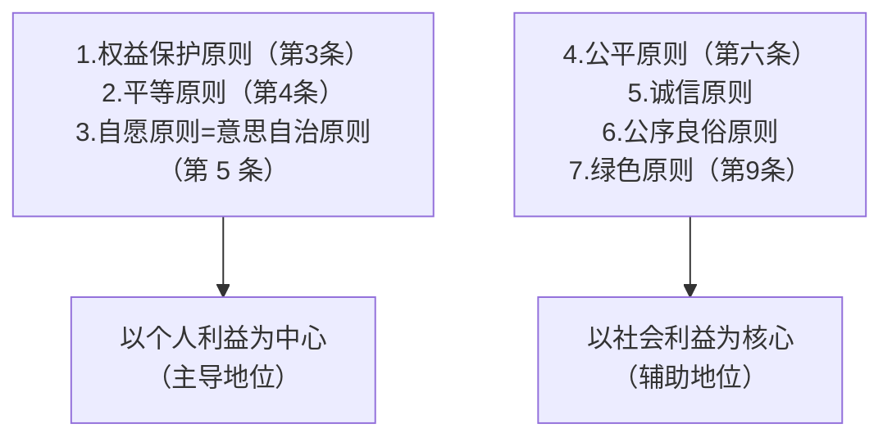

#  一、民法基本原则的概念/功能

## （一）概念

* **民法基本原则**，是指整体蕴含在【民事法律制度】与【民事法律规范】中，指导「民事立法」、「民事司法」、「民事活动」的==民法根本准则和价值判断标准==。

## （二）功能

### 1. 共同功能
	所有基本原则具有的共性

#### （1）立法准则功能
#### （2）法律解释功能

### 2.特别功能
	只有某些基本原则所具有的功能

#### （1）行为控制功能
* eg.[[民法典#第五百零二条-第2款|合同履行遵循诚信原则（502.2）]]、[[民法典#第五百条|违反诚信原则的责任（500）]]

#### （2）漏洞填补功能
* eg.早期从诚信原则中导出**情势变更规则**

---

# 二、具体原则

>[!Tip] Briefing
> 一守二公，自愿等诚色

## （一）权益保护原则
>民事主体的人身权利、财产权利以及其他合法权益受法律保护，任何组织或者个人不得侵犯。
>*民 3*

* **功能**：有利于突出**权利本位思想**，保障民事主体的......

## （二）平等原则
>民事主体在民事活动中的法律地位一律平等。
>*民 4*

* **内容**：在**民事法律关系**中，当事人的**法律人格**相互平等 	
	* **限定**：限定于「**民事领域**」，不适用于「公共领域」。*eg.政府在履职时与行政相对人不平等*

>[!Info] 法律人格
>法律人格（legal personality）是指法律认可主体拥有权利和义务的资格。 它是指一个主体在法律上被承认具有享受权利、承担义务的能力。 法律人格的概念强调平等，所有自然人均自出生起即具有法律人格，并在私法领域通过权利能力制度体现。

* **性质**：**形式平等/抽象平等/机会平等**，而非实质平等/具体平等/结果平等

* **违反**
	* 特权/歧视：区别对待

>[!caution] 不违反平等原则的区别对待
>出于**公共利益、公序良俗需要**
>*eg.军人优待*

---

## （三）自愿原则
>**意思自治原则、私法自治原则**
>民事主体从事民事活动，应当遵循自愿原则，按照自己的意思设立、变更、终止民事法律关系。
>*民 5*

* **内容**：在民事法律关系中，当事人做出的意思表示出于自愿，且当事人依法接受自己选择的结果。
	* 不自愿的意思表示不能产生相应效果
* 自愿原则是[[#（二）平等原则|平等原则]]的延伸。

* **违反**
	* 因欺诈、胁迫、趁人之危、显失公平，做出**与内心意愿不相符的意思表示**

>[!caution] 不违反自愿原则的情况
>“未经同意的一方”**未作出意思表示**，故不违反自愿原则。

---

## （四）公平原则
>民事主体从事民事活动，应当遵循公平原则，合理确定各方的权利和义务。
>*民 6*

* **内容**：在民事法律关系中，当事人在交易结果中「民事权力、义务」的配置，在「利益上」应当**均衡**
	* 原则上，**[[#（三）自愿原则|自愿]]即公平**

* **性质与功能**：纠正[[#（二）平等原则|形式平等]]带来的不公平。民法中的公平原则以追求形式公平为原则，以追求实质公平为例外

* **违反**
	* 在一方当事人「别无选择、只能就范」的情况下，双方达成的交易在「**利益上失衡的**」，违反公平原则

---

## （五）诚信原则
>**“帝王条款”**
>民事主体从事民事活动，应当遵循诚信原则，秉持诚实，恪守承诺。
>*民 7*

* **内容**：在民事法律关系中，当事人应当秉持「**遵约守信**」、「**与人为善**」的**主观心态**与对方进行交往。

>[!caution] 诚信原则
>诚信原则全称诚实信用原则，不只是遵约守信，还要求**「与人为善」**。故意恶心别人也算违反诚信原则。
>

* **违反**
	* 遵约守信：当事人一方**违反约定**，未向对方当事人履行自己的**义务**
	* 与人为善：当事人一方**恶意加害对方**，损人不利己

---

## （六）公序良俗原则
>**公共秩序与善良风俗原则**
>“民事主体从事民事活动，不得违反法律，不得违背公序良俗。”
>*民 8*

* **含义**：民事法律关系的内容，需要符合「社会公共秩序」与「良好的道德风尚」
	* 它是民法对民事活动内容的**道德要求**：表明当事人从事民事活动，不仅需要向法律负责，还需要**向道德负责**

* **公共秩序**：是指政治、经济、文化等社会生活领域的基本秩序，体现了社会公共利益
* **善良风俗**：是指在社会生活中占主导的、被社会成员**普遍认可的道德准则和信念**，是**最低的伦理标准**

* **功能**：
	* 行为控制功能
	* 习惯成为法源的前提
	* 阻却不正当无因管理的成立

* **违反**
	* 损害公共秩序
		* 公共秩序包括：政治安全、经济安全、军事安全、市场秩序、公共利益
		* 违反法律强制性规定的交易，可认定为损害公共秩序
			* 这是因为法律的强制性规定旨在维护公共秩序
	* 违背善良风俗
		* 包括：背离社会功德、家庭伦理、有损人格尊严,etc.

---

## （七）绿色原则
>**节约资源、保护生态环境原则**
>民事主体从事民事活动，应当有利于节约资源、保护生态环境。
>*民 9*

* **内容**：民事法律关系的内容，需遵循人与自然和谐共处的方针，不得以浪费资源，破坏生态环境为代价，获取民事利益

---

# Q/A

### **一、平等原则**

1. **简述民事活动中“法律人格相互平等”的含义。该原则是否适用于政府与自然人之间的法律关系？请说明理由。**

---

### **二、自愿原则**

2. **在民事法律关系中，如何理解“意思表示自愿”？请结合可能违反该原则的情形说明。**
3. **为什么说自愿原则是平等原则的延伸？请结合你的理解作答。**

---

### **三、公平原则**

4. **公平原则主要体现在民事交易的哪一方面？请解释当交易“利益严重失衡”时，如何体现对公平原则的违反。**

---

### **四、诚信原则**

5. **“诚信原则”除了要求当事人遵约守信外，还包含什么道德要求？请结合违反诚信原则的典型行为说明。**
6. **举例说明在民事活动中如何违反“与人为善”的诚信要求。**

---

### **五、公序良俗原则**

7. **什么是“公序良俗”？请简述其在判断民事行为效力中的意义。**
8. **某公司与他人签订合同约定：以隐瞒政府监管为代价获取经济利益。试分析该合同是否有效，并说明理由。**

---

### **六、绿色原则**

9. **简述绿色原则的基本内涵。为什么绿色原则被纳入民法基本原则之列？**
10. **结合实际生活举例说明一项违反绿色原则的民事行为。**