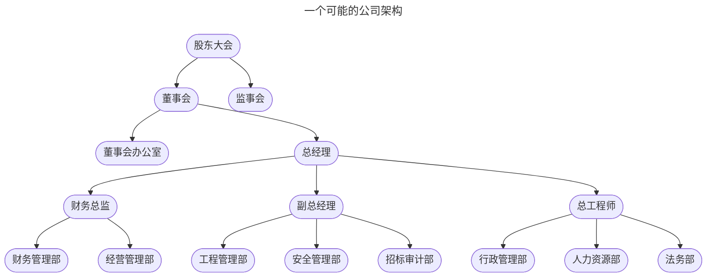
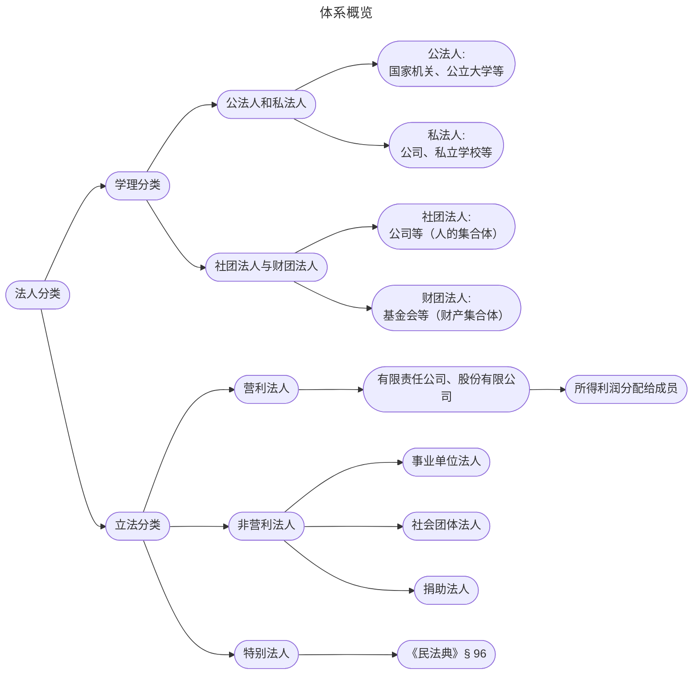
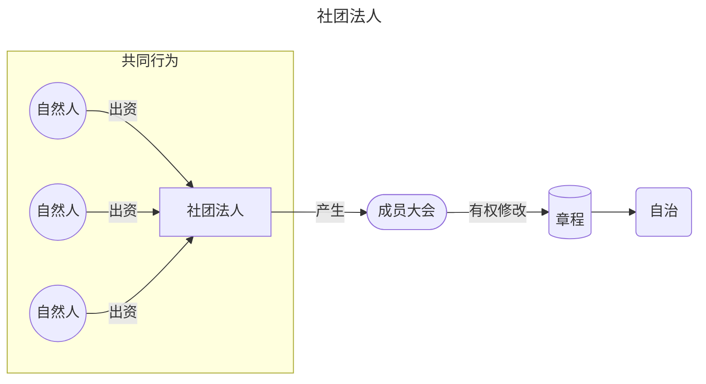
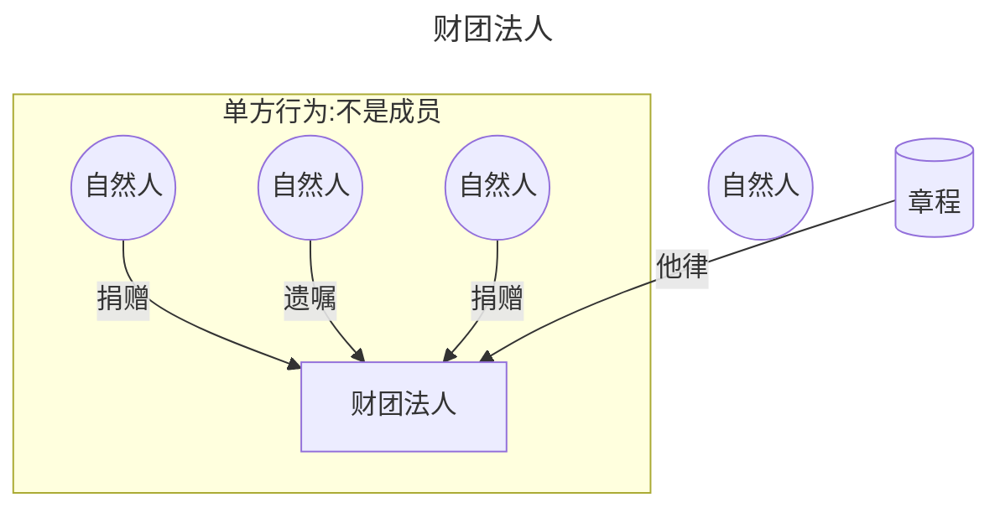
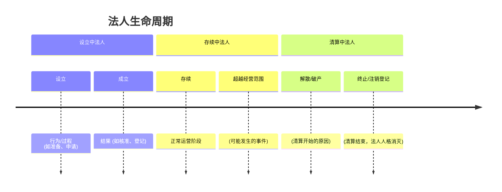
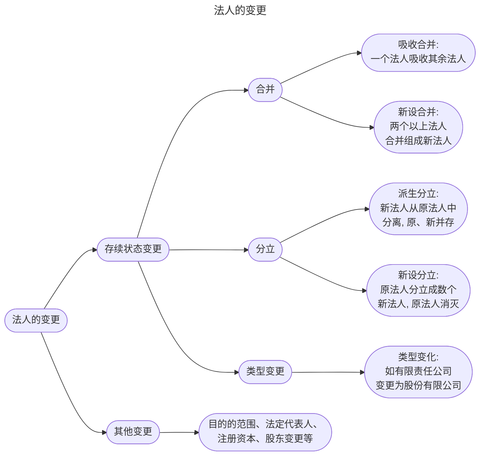
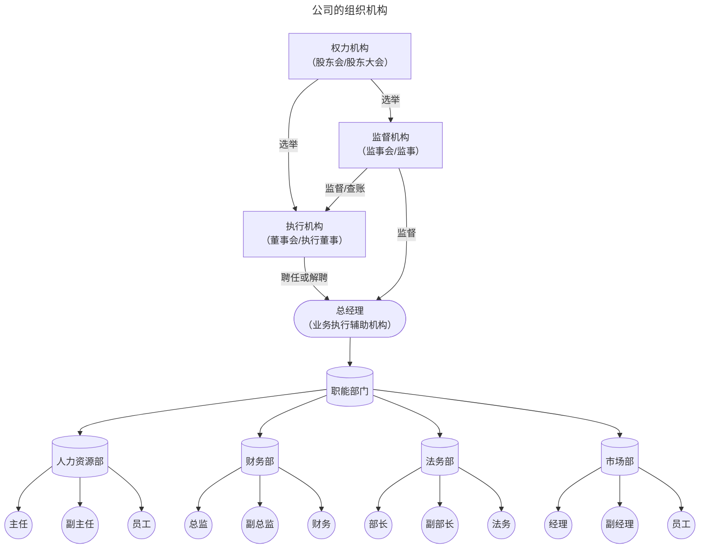
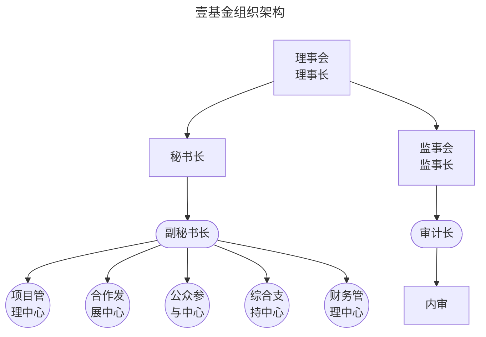

# 一、概述

## （一）法人的概念
具有民事权利能力和民事行为能力，依法独立享有民事权利和承担民事义务的组织
>[[民法典#第五十七条]]

## （二）法人的特征：独立性
* **独立的人格**
	* 以**自己的名义**享有权利、履行义务、参与诉讼
* **独立的财产**
	* **法人财产**独立于出资人和成员的财产
* **独立的责任**
	* 法人以自己的**全部财产**承担[[民法典#第六十条|无限责任]]
* **独立、健全的组织架构**
	* 对内**管理**法人事务
	* 对外**代表**法人活动




>[!note] 法人独立地位与成员有限责任
>图源：张焕然
>![[法人的独立地位与成员的有限责任图解.png]]


>[!tip] 刺破公司面纱/法人人格否认（[[民法典#第八十三条]]）
>```mermaid
>---
>title: 出资人有限责任的例外
>---
>graph LR
>A((甲))
>B((乙))
>C((丙))
>D[法人<br>例如某公司]
>E([债权人])
>D-->A
>D-->B
>D--滥用-->C
>E--追债-->D
>E-.-x A
>E==刺破法人面纱-==>C
>```
>1.  债权人C只能向“法人公司”追债。
>  - 甲、乙、丙作为出资人，有限责任，不对公司债务负责。
>1. **特殊情况下——适用[[民法典#第八十三条|第83条]]（加粗箭头+“刺破公司面纱”）：**    
>  - 如果公司被用来逃避责任、损害债权人利益，比如甲乙丙滥用公司控制权、混同财产、抽逃出资等。
 >   - 此时，法院可以认定公司法人独立人格被滥用，**否认其人格**。
 >   - 结果是：出资人（例如图中丙）对公司债务**承担连带责任**。
 >       - 图中丙的钱被拉出公司还债（加粗曲线）；
 >       - 法律依据为[[民法典#第八十三条-第2款|《民法典》第83条第2款]] + [[公司法#第二十三条-第3款|《公司法》第20条第3款]]。
>3. **对比法系：**
 >   - 英美法系称为：**Piercing the Corporate Veil**
 >   - 大陆法系称为：**法人独立人格否认**

---

# 二、法人的住所

## （一）法人住所的意义
[[自然人#2.住所的法律意义]]

## （二）法人住所的确定
>[[民法典#第六十三条]]
法人以主要办事机构所在地为住所

---

# 三、法人的分类



## （一）公法人与私法人（学理分类）
* 分类标准
	* 设立**依据**不同
* 概念：公法与私法的区分
	* **公法人**
		* 是指依据**公法**，通过**公法**行为设立，以处理**公共事务**为主要目的，行使**公权力**的法人。
			* *eg.国家机构（比如北京市政府、海淀区人民法院、司法部、教育局）、公立大学（比如法大、北大）、妇联等。*
	* **私法人**
		* 是指依据**私法**，通过**私法**上的法律行为设立，以处理**私法**事务为主要目的法人。
			* *eg.各种公司（比如好利来食品有限公司、博纳影业集团股份有限公司等）、私立学校等。*

## （二）社团法人与财团法人
* 分类标准
	* 设立**基础**不同
* 概念：
	* **社团法人**
		* 以**社员为基础**成立的法人
			* **营利性**的社团法人
				* *eg.各种公司*
			* **非营利性**的社团法人
				* *eg.中国法学会、律师协会，etc.*
	* **财团法人**
		* 以**财产为基础**成立的法人（只能是==公益性==的）
			* *eg.基金会、福利院、宗教场所（寺庙、教堂）、博物馆等*





| 项目           | 社团法人（自律法人）                        | 财团法人（他律法人）                                             |
| ------------ | --------------------------------- | ------------------------------------------------------ |
| 成立<br>基础     | 人+财产（成员的集合）<br>                   | 财产（一定目的财产的集合体）                                         |
| 财产<br>来源     | **共同行为**：出资人共同出资                  | **单方行为**：捐助或遗嘱                                         |
| 成员<br>有无     | 有（如出资人）                           | 无                                                      |
| 营利<br>与否     | 营利性、公益性                           | 公益性                                                    |
| **内部<br>机关** | **意思机关（成员大会），执行机关，监督机关，业务执行辅助机关** | **因为没有成员，故没有自己的意思机关（成员大会），只有管理机关（理事会/决策机构）**           |
| **章程**       | 由**成员**制定，**成员大会**有权修改            | 由**捐助人**制定，理事会无权单独修改，**目的条款的变更需经国家权力的干预（在我国须经民政部门批准）** |

## （三）营利法人与非营利法人（我国立法分类）
* 分类标准
	* 设立**目的**
* 概念
	* **营利法人**
		* 以**取得利润**并**分配给股东等出资人**为目的成立的法人
	* **非营利法人**
		* 为**公益目的**或者其他**非营利目**的成立，**不向出资人、设立人或者会员分配所取得利润**的法人

| 法人类型  | 是否可以从事<br>经营（营利）活动 | 利润分配<br>请求权 |                 剩余财产分配请求权                 |
| :---: | :----------------: | :---------: | :---------------------------------------: |
| 营利法人  |         ✅          |      ✅      |                     ✅                     |
| 非菅利法人 |         ✅          |      ❌      | ❌（以公益目的成立的非营利法人①）<br>✅（其他以非营利目的成立的非营利法人②） |
* 类型细分
	* 营利法人（$\approx$[[民法典#第七十六条-第2款|营利性社团法人]]）
		* **公司制**：有限责任公司、股份有限公司
			* *eg.中国平安保险、美的集团、瑞幸咖啡,etc*
		* 非公司制的**其他企业法人**
			* *eg.全民所有制企业、集体所有制企业、联营企业、外商投资企业,etc.*
	* 非营利法人
		* 事业单位法人
			* 利用**国有资产**设立的，从事教育、科技、文化、卫生等活动的社会服务组织
				* *eg.公立学校（比如北大、法大）、公立医院（比如北医三院）、社科院、国图、国博、证监会等*
		* 社会团体法人（$\neq$社团法人）
			* 中国公民自愿组成，为实现会员共同意愿，按照其章程展开活动的非营利性社会组织
				* *eg.商会、妇联、残联、共青团、中国作家协会、北京市律师协会*
		* 捐助法人（$\approx$财团法人）
			* 基金会
				* 利用捐赠的财产，以从事公益事业为目的的非盈利法人
					* *eg.诺贝尔基金会、李连杰壹基金、中国青少年发展基金会（希望工程）等*
			* 宗教活动场所
				* 展开宗教活动的寺院、清真寺、教堂及其他固定处所
					* *eg.少林寺、徐家汇天主堂等*
			* 社会服务机构
				* 利用非国有资产举办的从事非营利性社会服务活动的社会组织
					* *eg.非营利性的民办医院、民办学校、民办养老院、民办博物馆等*

## （四）一般法人与特别法人（民法典特色）

### 1. 划分标准
设立、变更、终止、财产等方面是否具有特殊性

### 2. 特别法人的类型
>[[民法典#第九十六条]]
* 机关法人
	* 依照法律和行政命令组建的，享有公权力的、以从事国家管理活动为主的各级国家机关
		* *eg.立法机关、行政机关、司法机关等（$\approx$公法人）*
* 农村集体经济组织
	* 利用农村集体的土地或其他财产从事农业经营活动的组织
		* *eg.农村合作社、乡村经济联合社，etc.*
* 城镇农村的合作经济组织
	* 劳动者在互助基础上自筹资金、共同经营、共同劳动并分享收益的经济组织
		* *县、市、省级供销合作社、中华全国供销合作总社*
* 居民委员会、村民委员会
	* 居民或村民自我管理、自我教育、自我服务的基层群众性自治组织

---

# 四、法人的权利能力

## （一）法人权利能力的取得

### 1. 取得的时点：法人的成立

#### （1）法人的成立条件
>[[民法典#第五十八条]]
* [[民法典#第五十八条-第1款|具体原则]]：应当依法成立
* [[民法典#第五十八条-第2款|具体规定]]
	* 名称
	* [[法人#法人的组织机构|组织机构]]
	* 住所
	* 财产经费

#### （2）法人的成立时间
* 原则：登记时成立
	* [[民法典#第七十七条|营利法人]]
	* [[民法典#第九十二条|捐助法人]]
	* 一部分事业单位或者社会团体
		* [[民法典#第八十八条]]、[[民法典#第九十条]]
* 例外：无需登记即可成立
	* 一部分事业单位或社会团体
	* [[民法典#第八十八条]]、[[民法典#第九十条]]
	* 有独立经费的[[民法典#第九十七条|机关法人]]

#### （3）”设立中的法人“问题
* 设立与成立的关系
	* 设立是成立这个结果以前一系列行为的过程
* 设立中法人的权利能力
	* 无=不是独立的民事主体
* 设立中法人的[[民法典#第七十五条|责任承担问题]]
	* 法人最终不成立（不区分谁的名义）：设立人承担（连带）责任
	* 法人最终成立
		* 以个人名义：第三人有权选择由法人还是个人承担
		* 以法人名义：由法人承担

## （二）法人权利能力的消灭
* 法人的终止事由（[[民法典#第六十八条-第1款]]）
	* [[民法典#第六十九条|法人解散]]
	* 法人被宣告**破产**
		* [[企业破产法]]
	* 法律规定的其他原因
		* *eg.国家经济政策调整、战争，etc.*
	
* 完成**清算**和**注销**登记
	* 法人的清算程序
		* 概念
			* 是指清理被解散法人的财产，了结其作为当事人的法律关系，从而使法人最终消灭的程序。
		* [[民法典#第七十条-第2款|清算义务人]]（=有义务启动清算的人）
			* 董事、理事等执行机构或决策机构的成员
			* 具体程序和清算组职权：[[公司法]]，[[企业破产法]]→商法课程
	
* 清算中法人的权利能力
	* 仍然存在
	
* 清算中法人的活动范围
	* 只能从事与[[民法典#第七十二条-第1款|清算有关的活动]]
	
* 清算后的剩余财产分配
	* 按法人章程或法人权力机构的决议处理



## （三）法人的变更
* 变更的类型
	* 存续状态变更
	* 其他事项变更
* 存续状态变更后的责任承担
	* [[民法典#第六十七条-第1款|合并]]
		* 由合并后的法人承担
	* [[民法典#第六十七条-第2款|分立]]
		* 由分立后的法人承担
* 法人事项变更的变更登记义务
	* [[民法典#第六十四条|应当申请变更登记]]
	* [[民法典#第六十五条|与实际不一致]]：不得对抗善意第三人



>[!note] 合并
>```mermaid
>---
>title: "A+B→A 吸收合并"
>---
>graph LR
 >   subgraph 合并前
 >       甲的股东_orig((甲的股东)) --> 甲公司_orig[甲公司]
 >       甲公司_orig -- 拥有 --> 甲财产_orig([甲财产])
>
>        乙的股东_orig((乙的股东)) --> 乙公司_orig[乙公司]
 >       乙公司_orig -- 拥有 --> 乙财产_orig([乙财产])
 >   end
>
 >   subgraph 合并后
 >       甲的股东_merged((甲的股东)) --> 甲公司_merged[甲公司]
 >       乙的股东_merged((乙的股东)) --> 甲公司_merged
>
 >       甲公司_merged -- 拥有 --> 甲财产_merged([甲财产])
 >       甲公司_merged -- 拥有 --> 乙财产_merged([乙财产])
 >   end
>
 >   甲公司_orig -.-> 甲公司_merged
 >   乙公司_orig -.-> 甲公司_merged
>
>```
>
>```mermaid
>---
>title: "A+B→C 新设合并"
>---
>graph LR
 >   subgraph 合并前
 >       甲的股东_orig2((甲的股东)) --> 甲公司_orig2[甲公司]
 >       甲公司_orig2 -- 拥有 --> 甲财产_orig2([甲财产])
 >       乙的股东_orig2((乙的股东)) --> 乙公司_orig2[乙公司]
 >       乙公司_orig2 -- 拥有 --> 乙财产_orig2([乙财产])
 >   end
> 
>     subgraph 合并后
>         甲的股东_merged2((甲的股东)) --> 丙公司_merged2[甲乙公司]
>         乙的股东_merged2((乙的股东)) --> 丙公司_merged2
>         丙公司_merged2 -- 拥有 --> 甲财产_merged2([甲财产])
>         丙公司_merged2 -- 拥有 --> 乙财产_merged2([乙财产])
>     end
> 
>     甲公司_orig2 -.-> 丙公司_merged2
>     乙公司_orig2 -.-> 丙公司_merged2
> 


>[!note] 分立
> ```mermaid
> ---
> title: "A→A+B 派生分立"
> ---
> graph LR
>     subgraph 分割前
>         A_shareholder((甲股东))
>         A_company_before[甲公司]
>         A_asset_before([甲资产])
> 
>         A_shareholder --> A_company_before
>         A_company_before -- 拥有 --> A_asset_before
>     end
> 
>     subgraph 分割后
>         B_shareholder((股东))
>         A_company_after[甲公司]
>         B_company_after[乙公司]
>         A_asset_after([45% 甲资产])
>         B_asset_after([55% 甲资产])
> 
>         B_shareholder --> A_company_after
>         B_shareholder --> B_company_after
>         A_company_after -- 拥有 --> A_asset_after
>         B_company_after -- 拥有 --> B_asset_after
>     end
> 
>     A_company_before -- 分割形成 --> A_company_after
>     A_company_before -- 分割形成 --> B_company_after
> 
>     A_asset_before -. 资产部分流入(45%) .-> A_asset_after
>     A_asset_before -. 资产部分流入(55%) .-> B_asset_after
> 
> 
> 
> 	
> ```
> 
> ```mermaid
> ---
> title: "A→B+C 新设分立"
> ---
> graph LR
>     subgraph 分割前
>         A((甲股东))
>         B[甲公司]
>         C([甲资产])
> 
>         A --> B
>         B -- 拥有 --> C
>     end
> 
>     subgraph 分割后
>         D((股东))
>         E[乙公司]
>         F[丙公司]
>         G([45% 甲资产])
>         H([55% 甲资产])
> 
>         D --> E
>         D --> F
>         E -- 拥有 --> G
>         F -- 拥有 --> H
>     end
> 
>     B -- 分割形成 --> E
>     B -- 分割形成 --> F
> 
>     C -- 分割出(45%) --> G
>     C -- 分割出(55%) --> H
> 
> 
> 
> 
> 
> ```

## （四）法人的行为能力与过错能力

### 1. 法人的行为能力

#### （1） 法人行为能力的特殊之处
>vs.[[自然人#三、自然人的行为能力]]
* 与法人权利能力的关系
	* 高度一致（[[民法典#第五十九条|同时产生消灭]]）
* 是否受限制
	* 不受（法人只有完全民事行为能力）

对比：自然人的民事权利能力和民事行为能力 VS 法人的民事权利能力和民事行为能力

| 项目  | 民事权利能力 | 民事行为能力 | 二者关系 |                    人格权                    |
| :-: | :----: | :----: | :--: | :---------------------------------------: |
| 自然人 |   ✅    |  不一定   | 相互分离 |                     ✅                     |
| 法人  |   ✅    |   ✅    | 高度一致 | ❌ 基于法人本身的性质，<br>有一部分人格权法人是<br>不享有的→人格权人格权 |
#### （2）法人如何参与民事活动
1. 法定代表人以法人名义从事的民事活动（=职务行为）：[[民法典#第六十一条-第2款|由法人承受]]（61.2）
2. 法定代表人越权代表法人：[[民法典#第六十一条-第3款|不得对抗善意相对人]]（61.3）

### 2. 法人的过错能力
* 概念
	* 指法人因过错承担侵权损害赔偿责任的资格。
* 我国法人具有过错能力：
	* 法定代表人的过错=法人的过错
> 【法条链接】第62条
>法定代表人因执行职务造成他人损害的，由法人承担民事责任。
>法人承担民事责任后，依照法律或者法人章程的规定，可以向有过错的法定代表人追偿。

# 五、法人的组织机构

## （一）法人组织机构的类型

* **权力**机构/**权力**机关/意思**形成**机关
	* ==成员大会==
		* *eg.股东大会*
* **执行**机构/**执行**机关/**意思表达**机关
	* ==董事会==：营利法人
	* ==理事会==：非营利法人
* **代表**机构/**代表**机关
	* ==法定代表人==
		* 所有机构均必须设立
* **监督**机构/**监督**机关
	* ==监事会==

## （二）各类法人的组织机构
* 营利法人
	* [[民法典#第八十条]]，[[民法典#第八十一条]]，[[民法典#第八十二条]]
* 非营利法人
	* [[民法典#第八十九条]]，[[民法典#第九十一条]]，[[民法典#第九十三条]]，[[民法典#第九十四条]]
* 特别法人
	* 由其他特别法规定

### 法人机构设置对比表

|     法人类型     |       权力机构        |          执行机构          |       监督机构       |             决策机构             |
| :----------: | :---------------: | :--------------------: | :--------------: | :--------------------------: |
| **营利法人（社团）** |  ✅必设<br>*股东（大）会*  | ✅必设<br>*董事会*<br>*执行董事* | ❌非必设<br>*监事（会）*  |              —               |
|  **非营利法人**   |                   |                        |                  |                              |
|  社会团体法人（社团）  | ✅必设<br>*会员（代表）大会* |      ✅必设<br>*理事会*      |       ❓未规定       |              —               |
|  事业单位法人（财团）  |         —         |          ❓未规定          |       ❓未规定       |        ❌非必设<br>*理事会*         |
|   捐助法人（财团）   |         —         |    ✅**必设**<br>*秘书处*    | ✅**必设**<br>*监事会* | ✅**必设**<br>*理事会*<br>*民主管理组织* |
|   **特别法人**   |                   |                        |                  |                              |
| 农民专业合作社（社团）  |        ✅必设        |          ❌非必设          |       ❌非必设       |              —               |
|    其他特别法人    |       ❓未规定*       |         ❓未规定*          |      ❓未规定*       |            ❓未规定*             |

> 注：  
> “—” 表示依其性质，无此机构；  
> “*” 表示有此机构，法律未作规定，但与该法人性质并不排斥。可由法律（将来）或章程创设。





