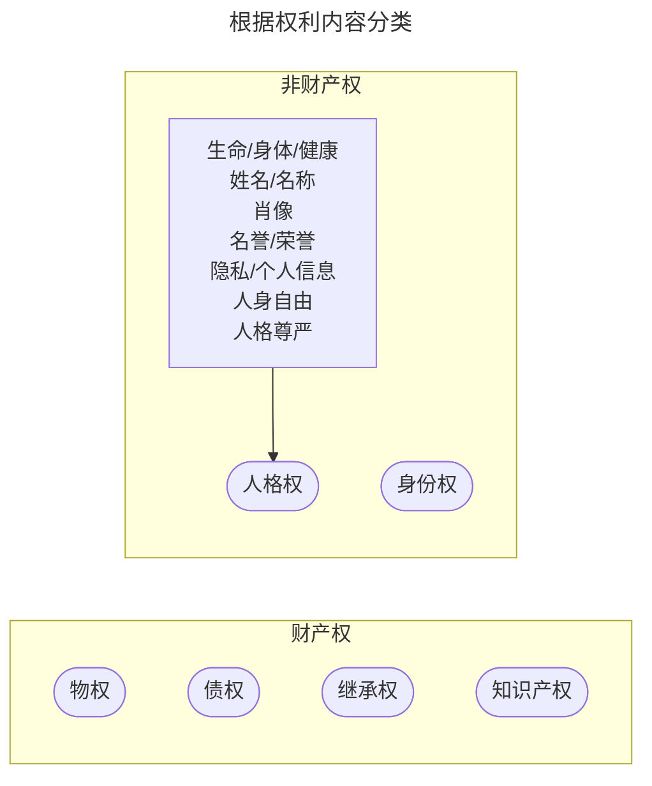
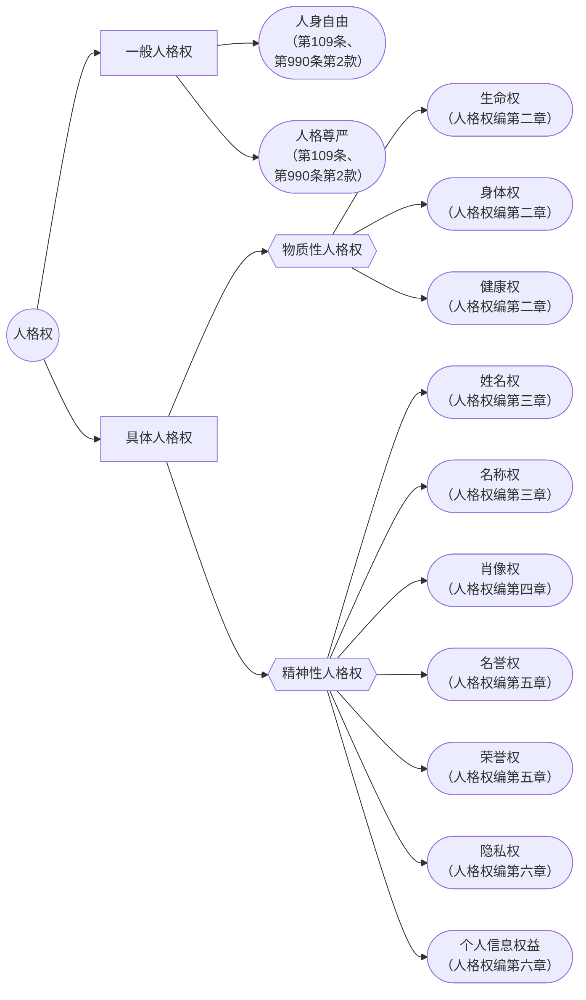
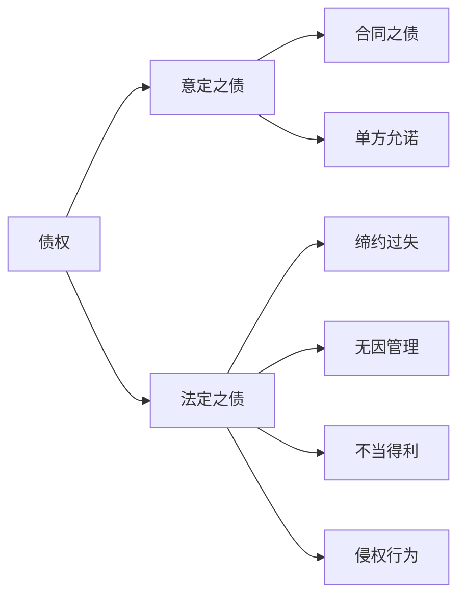
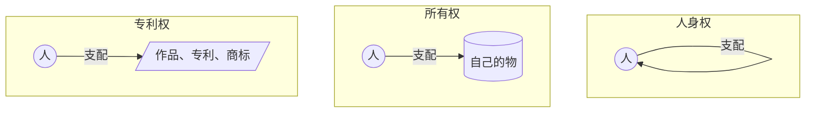
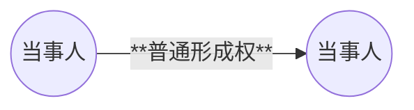
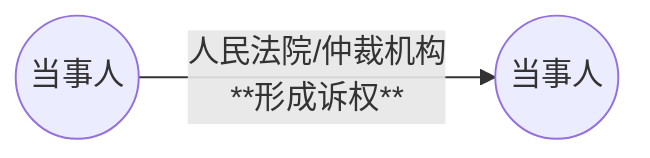
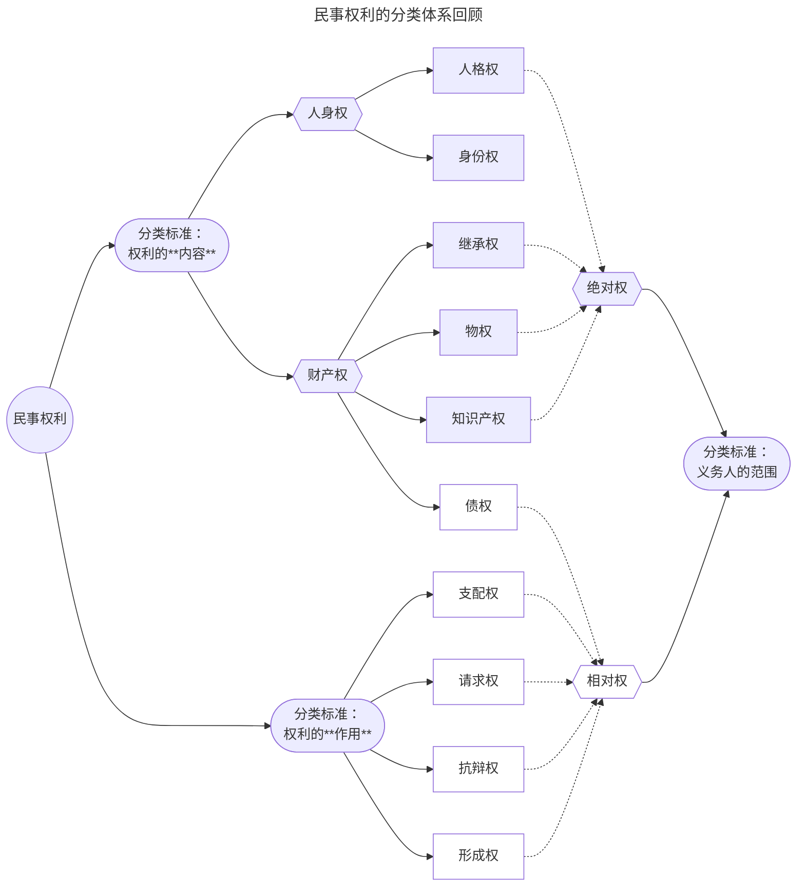

# 一、根据==权利内容==  ：财产权/非财产权

## （一）分类标准与分类意义

* **分类标准**：权利内容

* **分类意义**：规则不同

|   比较对象    |            财产权            |        非财产权         |
| :-------: | :-----------------------: | :-----------------: |
|  典型类型举例   | 物权、[[Chap1. 债法总论#（一）债权是财产权\|债权]] |         人格权         |
|   权利内容    |       以**财产利益**直接内容       |   以**人身**所体现的利益内容   |
|  能否以金钱衡量  |             能             |         不能          |
|  是否具有专属性  |        否（通常可转让、继承）        |    是（通常不可转让、继承）     |
| 被侵害后的责任形式 |    **无**恢复名誉、消除影响、赔礼道歉    | **有**恢复名誉、消除影响、赔礼道歉 |
| 能否有精神损害赔偿 |  原则上无 （例外：象征人格利益的财产）   |          有          |

## （二）人格权
>主要规定：[[民法典#第四编 人格权]]

### 1. 概念
* 民事主体基于其人格所享有的权利

### 2. 特征
* 非财产性
* 支配性
* 绝对性
* [[民法典#第九百九十二条|专属性]]

### 3. 体系

### 4. 具体人格权

#### （1）[[民法典#第一千零二条|生命权]]
* **享有主体**：自然人
* **权利内容**：**生命安全**与**生命尊严**
* **侵害形式**：实施加害行为致人死亡
	* *eg.杀害他人、协助他人自杀*

#### （2）[[民法典#第一千零三条|身体权]]
* **享有主体**：自然人
* **权利内容**：==身体完整==与==行动自由==
* **侵害形式**：使他人**身体的完整性遭到破坏**或**行动自由受到限制**
	* 侵犯身体完整：*eg.剪掉他人头发或指甲、误摘病人器官、擅自切除阑尾*
		* *Q：打坏别人假牙或助听器属于侵害身体权吗？打坏人工心脏瓣膜呢？*
		* 
	* [[民法典#第一千零一十一条|限制行动自由]]：*eg.非法拘禁、在商场强制搜身*

#### （3）[[民法典#第一千零四条|健康权]]
* **享有主体**：自然人
* **权利内容**：==身心健康==
* **侵害形式**：实施加害行为使他人的生理或心理功能无法正常运转
	* 侵犯身体健康：*eg.传播艾滋病、投毒、地沟油、三鹿奶粉事件*
	* 侵犯心理健康：*eg.领导长期 PUA导致员工患有抑郁症*

#### （4）[[民法典#第一千零一十二条|姓名权]]/[[民法典#第一千零一十三条|名称权]]
* **享有主体**：自然人（姓名权）/ 法人与非法人组织（名称权）
* **内容**：自我决定、使用、变更、许可他人使用自己的姓名/名称
* [[民法典#第一千零一十四条|侵害形式]]
	* 干涉：*例如强迫继子女改名、不允许成年子女自己改名*
	* 盗用：*例如把别人的名字用于工商登记、办理信用卡、商业广告等*
	* 冒用：*例如冒充“齐玉苓”上大学、冒充名人*
* 盗用(Unauthorized use) vs. 冒用(impersonation)
	* 冒用重点在使他人误以为冒用人就是冒用的名字所代表的那个人
>[!caution] 注意
>广义的“姓名”，还包括笔名、艺名、网名、译名、字号、简称等

#### （5）[[民法典#第一千零一十八条|肖像权]]
* **享有主体**：自然人
* **权利内容**：制作、使用、公开、许可他人使用自己的[[民法典#第一千零一十八条-第2款|肖像]]
>[!caution] 注意
>特定自然人可以被识别的外部形象，不一定是面部形象，参考[[民法典#第一千零一十八条-第2款]]
* [[民法典#第一千零一十九条|侵害形式]]
	* **丑化、污损**：
		* *例如画胡子*
	* **伪造**：
		* *例如换脸（移花接木）*
	* **未经同意制作、使用、公开他人肖像**：
		* *例如擅自用到广告中等*
	* 未经肖像权人同意**发表、复制、发行、出租、展览等方式使用或公开**其肖像
		* *举例：摄影师甲给女明星乙拍了一套艺术照，甲将这套照片投到杂志上。*
* [[民法典#第一千零二十条|合理使用]]
	* 为个人学习、艺术欣赏、课堂教学或者科学研究，在必要范围内使用肖像权人**已经公开的肖像**；
	* 为实施新闻报道，不可避免地制作、使用、公开肖像权人的肖像
	* 为依法履行职责，国家机关在必要范围内制作、使用、公开肖像权人的肖像
	* 为展示特定公共环境，不可避免地制作、使用、公开肖像权人的肖像
	* 为维护公共利益或t者肖像权人合法权益，制作、使用、公开肖像权人的肖像
* [[民法典#第一千零二十三条-第2款|声音权]]参照肖像权保护

#### （6）[[民法典#第一千零二十四条|名誉权]]
* **主体**：自然人、法人、非法人组织
* [[民法典#第一千零二十四条-第2款|客体]]：民事主体品德、声望、才能、信用等的社会评价
* 侵害名誉权的**构成要件**（需同时满足）
	* 须加害人实施了**侮辱、诽谤**或其他损害他人名誉的加害行为
	* 须针对**特定人**实施（指名道姓/含沙射影）
	* 须造成他人**社会评价降低**的损害后果（第三人知道即推定为社会评价降低）
* 对名誉权的限制：个人利益与公共利益的平衡
>[[民法典#第一千零二十五条]]
* 对名誉权的限制（*个人利益 vs.公共利益*）
>第1025条 行为人为公共利益实施新闻报道、舆论监督等行为，影响他人名誉的，不承担民事责任，但是有下列情形之一的除外：
>	（一）捏造、歪曲事实；
>	（二）对他人提供的严重失实内容未尽到合理核实义务；
>	（三）使用侮辱性言辞等贬损他人名誉。

#### （7）荣誉权
* **概念**：民事主体对其所获得的**荣誉及其相关的利益**所享有的保有、支配以及排除他人侵害的权利。
* [[民法典#第一千零三十一条||侵害形式]]
	1. 非法**剥夺、诋毁、贬损**他人荣誉
		*eg.当众撕毁他人荣誉证书、公开诋毁他人的荣誉称号是造假得来等*
	2. **未记载或错误记载**荣誉
		*eg.贾某系市级“优秀学生干部”，在高考报名时被错误登记为“三好学生”*

#### （8）[[民法典#第一千零三十二条|隐私权]]
* **概念**：自然人对私人生活安宁和不愿为他人知晓的私密空间、私密活动、私密信息享有的人格权。
* 享有主体：自然人
* [[民法典#第一千零三十三条|侵害形式]]
	1. 侵扰他人的**私人生活安宁**
		*eg.非法跟踪、上门频繁发传单、发送垃圾邮件、电话或短信骚扰*

	2. 进入、拍摄、窥视他人的**私密空间**
		*eg.在他人住宅或酒店宾馆里装摄像头、待在某人家里不走*
	
	3. 拍摄、窥视、窃听、公开他人的**私密活动**
		*eg.社会交往活动、男女朋友的日常生活*
	
	4. 拍摄、窥视他人身体的**私密部位**
		*eg.偷窥女生洗澡、偷看别人上厕所、传播裸体视频*
	
	5. 处理他人的**私密信息**
		*eg.公开他人病历、发布他人去的恋爱史、展览某名人的书信*

#### （9）个人信息权益
>[[民法典#第一百一十一条]]，[[民法典#第一千零三十四条]]
* **概念**：以电子或其他方式记录的能够单独或者与其他信息结合识别特定自然人的各种信息。
* 主体：自然人
* 典型：
	* 姓名、出生日期、身份证件号码、生物识别信息（例如DNA、指纹、声纹、面部识别等）、住址、电话号码、电子邮箱、健康信息、行踪信息（例如出游记录、网购记录）等。
* 侵害形式
	* 非法**收集、使用、加工、传输、买卖、提供、公开**他人个人信息
* 与隐私权的关系
	* 可能重合，也可能不重合
		* （重合部分适用关于[[2. 权利的分类#（8） 民法典 第一千零三十二条 隐私权|隐私权]]的规定，[[民法典#第一千零三十四条-第3款|第1034条第3款]]）
	* 隐私权更消极被动，个人信息权益更积极主动
		* （更正权与删除权，[[民法典#第一千零三十七条|第1037条]]）

#### （10）[[民法典#第一千零一十条|性骚扰及其所侵害的具体人格权]]
* **概念**：性骚扰，是指违背他人意愿，以言语、文字、图像、肢体行为等方式实施的以性为取向的有辱他人尊严的性暗示、性挑逗和性暴力等行为。
* 性骚扰的形式：
	* *eg.猥亵他人身体；以文字、图像、视频等实施性骚扰……*

### 5. 一般人格权

##### （1）[[民法典#第九百九十条-第2款|概念]]
**自然人**基于**人身自由、人格尊严**所产生的**除了具体人格权以外**的其他应受法律保护的**人格权益**

##### （2）功能
避免具体列举人格权所产生的封闭性，适应社会的不断发展，对人格权益进行兜底性保护。

##### （3）侵害一般人格权的表现形式
* 妨碍他人祭奠
* 妨碍他人的婚嫁或丧葬仪式
* 往他人身上泼尿、泼粪

### 人格权考点汇总表

| 具体人格权    | 生命权 | 身体权                                | 健康权             | 姓名权            | 肖像权                              | 名誉权          | 荣誉权                      | 隐私权                              |
| -------- | --- | ---------------------------------- | --------------- | -------------- | -------------------------------- | ------------ | ------------------------ | -------------------------------- |
| 主体       | 自然人 | 自然人                                | 自然人             | 自然人            | 自然人                              | 均有           | 均有                       | 自然人                              |
| 侵权 形态 | 死亡  | 1. 肢体、器官或其他人体组织的完整性；  2.行动自由 | 生理、心理机能的正常运转和发挥 | 干涉 盗用 假冒 | 丑化 污损 伪造 制作 使用 公开 | 侮辱  诽谤 | 非法剥夺  诋毁  贬损 | 刺探  侵拢  泄露  公开 |

### 6. 人格权的保护 

#### （1）事前保护
	预防性质
* 停止侵害、排除妨碍、消除危险
	* ==不适用诉讼时效的规定==
* [[民法典#第九百九十七条|人格权禁令]]
* 异议权、更正权、删除权
	* [[民法典#第一千零二十八条]]，[[民法典#第一千零二十九条]]、[[民法典#第一千零三十七条]]
#### （2）事后救济
	补救性质
* [[民法典#第一千一百七十九条|财产损害赔偿]]
	* 造成**人身**损害的
* [[民法典#第一千一百八十三条|精神损害赔偿]]
	* 造成严重**精神**损害的
* 消除影响、恢复名誉、赔礼道歉
	* ==不适用诉讼时效的规定==

---
## （三）身份权

### 1. [[民法典#第一百一十二条|概念]]
* 自然人因**婚姻家庭关系**等产生的人身权利

### 2. [[1. 自然人#（二）对行为能力欠缺者的监护|监护权]]/亲权
>基于亲子关系，[[民法典#第三十四条]]，[[民法典#第一千零六十八条]]
* 侵害形式
	* *eg.拐卖小孩、医院护士错抱婴儿、偷走别人孩子等*
* 法律效果
	* 可能产生[[民法典#第一千一百八十三条-第1款|精神损害赔偿]]

### 3. 配偶权
	基于夫妻关系

---
## （四）[[民法典#第一百一十四条-第2款|物权]]
>物权是权利人依法对特定的物享有直接支配和排他的权利

### 1. 典型的物权举例

#### （1）所有权
* [[民法典#第二百四十条|内涵]]：所有权人对自己的不动产或者动产，依法享有占有、使用、收益和处分的权利
	* *eg.你对自己的电脑、手机、水杯所享有的权利*

#### （2）用益物权
* [[民法典#第三百二十三条|内涵]]：用益物权人对**他人**所有的不动产或者动产，依法享有**占有、使用和收益**的权利
	* *eg1.甲和乙约定，乙不在自己的土地上建高层建筑（地役权）*
	* *eg2.企业造工厂前需取得建设用地许可证等（建设用地使用权）*

#### （3）担保物权
* [[民法典#第三百八十六条|内涵]]：**担保物权人**在**债务人**不履行到期债务 *或* 发生当事人约定的实现担保物权的情形，依法享有就**担保财产**优先受偿的权利
	* *eg1.张某为了买车，把自己的房子抵押给了银行*

![[我国的物权体系.png]]

---
## （五）[[民法典#第一百一十八条-第2款|债权]]
### 1. 典型债权举例
- 基于**合同**产生的债权：*例如买电脑、租房子、叫师傅修下水管道等*（→[[民法典#第三编 合同]]）
- 基于**单方允诺**产生的债权：*例如单纯的债务承认*（写下“我欠你5万”）
- 基于**缔约过失**产生的债权：*例如假借订立合同，恶意进行磋商*（→[[民法典#第五百条|500]]）
- 基于**无因管理**产生的债权：*例如台风天气帮邻居加固屋顶*（→[[民法典#第九百七十九条-第1款|979.1]]）
- 基于**不当得利**产生的债权：*例如转错了钱*（→[[民法典#第九百八十五条|985]]）
- 基于**侵权行为**产生的债权：*例如故意把人打伤*（→[[民法典#第一千一百六十五条-第1款|1165.1]]）

### 2. 债权的发生原因体系概览

* [[民法典#第一百一十八条-第2款|概念]]：债权是因合同、侵权行为、无因管理、不当得利以及法律的其他规定，权利人请求特定义务人为或者不为一定行为的权利。
* [[民法典#第一百一十八条-第2款|客体]]
	* **给付行为**
		* 包括：作为/不作为

---
## （六）其他财产权
	新近观点：综合性权利

1. 知识产权（[[民法典#第一百二十三条]]）→知识产权法课程
	1. 著作权（详见《[[著作权法]]》）
	2. 专利权（详见《专利法》）
	3. 商标权（详见《商标法》）

2. 继承权（第124条）→亲属法与继承法课程

3. 股权和其他投资性权利（第125条）→商法课程

4. 其他民事权益
	1. 例如数据、网络虚拟财产等（[[民法典#第一百二十七条]]）

---
---
# 二、根据==义务主体==是否特定：绝对权/相对权

## （一）分类标准
	权利的效力范围不同/义务主体是否特定

### 1. 典型的绝对权/相对权

#### （1）绝对权
	对世权
* **概念**：效力及于==社会上一切人==（不特定第三人）的权利
* **典型**：物权、人格权、知识产权

#### （2）相对权
	对人权
* **概念**：效力仅及于==特定人==的权利
* **典型**：债权

## （二）分类意义
	保护程度的不同

![[截屏2025-08-10 16.39.16.png]]

---
---

# 三、根据==权利作用==：支配权/请求权/抗辩权/形成权

## （一）支配权
### 1. 概念
民事主体对权利客体**直接支配、控制并享受其利益**的权利

### 3. 特征
* 支配性
* 排他性
* 对应义务的消极性

## （二）请求权
### 1. 概念
权利人请求他人为或者不为特定行为的权利

### 2. 典型的请求权

* ==债权请求权==
	* 基于债权的请求权
	* *eg.[[民法典#第六百二十六条|支付价款请求权]]（626）、[[民法典#第七百零八条|交付租赁物请求权]]（708）等*

* ==绝对权请求权==
	* 绝对权被侵害或受侵害之虞时所产生的请求权
	* *eg.[[民法典#第二百三十五条|返还原物]]（235）、[[民法典#第二百三十六条|排除妨碍]]（236）、[[民法典#第二百三十六条|消除危险]]（236）等*

### 3. 特征
* 请求性
* 非排他性
	* 同一标的物上可以存在相同或不同的请求权
* 平等性

### 4. 请求权基础
* **概念**：支持/规定了某项请求权的==法律规范==。
* 请求权基础的审查顺序
	* （1）基于合同的请求权；（2）类似合同的请求权；3）无因管理请求权；（4）物上请求权；（5）不当得利请求权；（6）侵权请求权。

## （三）抗辩权
![[截屏2025-08-10 18.27.48.png]]
### 1. 概念
是指对抗请求权人行使请求权的权利

### 2. 类型

#### （1）一时抗辩权
* **暂时**阻止对方行使请求权
	* eg.
		* *双务合同中的抗辩权（525-528）→债法课程*
		* *一般保证人的先诉抗辩权（687.2）→债法课程*

#### （2）永久抗辩权
* **永久**阻止对方行使请求权
	* eg.[[民法典#第一百八十八条|时效抗辩权]]→第五部分：民法上的时间

### 3. [[2. 权利的分类#（二）请求权|请求权]] vs. 抗辩权

* ==**产生抗辩**：请求权未产生的抗辩==
	* 「你说的那个权利，从一开始就**不存在**」
		* *eg.甲主张乙应支付买卖价金，但乙抗辩称：“我们根本没签过买卖契约啊！”契约不成立，请求支付价金的权利就从未“产生”过。*
* ==**消灭抗辩**：请求权已消灭的抗辩==
	* 「你说的那个权利，以前**可能有**，但现在已经**消失了**」
		* *eg.甲向乙请求还款10万元，乙抗辩说：“钱我上周就已经还清了！”。“清偿”这个行为，让甲的债权“消灭”了。*
* ==**行使抗辩**（狭义**抗辩权**）：请求权阻止的抗辩==
	* 「你说的那个权，以前**存在**，现在也**没有消失**，但是我有正当理由可以**暂时不执行**」
		* *eg.甲（卖方）要求乙（买方）付款，但甲尚未将货物交付给乙。乙可以抗辩：“你先把货给我，我才付钱！”（这就是同时履行抗辩权）。乙的付款义务并未消失，只是因甲未履行义务而被“阻止”了。*

---
## （四）形成权

### 1. 概念
* 权利人依**自己一方的意思表示**而使**法律关系发生变化**的权利。
![[法定代理人的追认权.png]]

![[受欺诈方的撤销权.png]]
### 2. 分类

#### （1）根据行使方式的不同
- **==单纯/普通形成权==**
	- 无需采取诉讼方式，**通知**特定相对人即可
		- 法定代理人的追认权（[[民法典#第一百四十五条-第2款|第145条第2款]]）
		- 善意相对人的撤销权（[[民法典#第一百四十五条-第2款|第145条第2款]]）
		- 选择权（[[民法典#第五百一十六条|第516条]]）
		- 解除权（[[民法典#第五百六十五条-第1款|第565条第1款]]）
		- 抵销权（[[民法典#第五百六十八条|第568条]]）

- **==形成诉权==**
	- 必须采取**诉讼**或**仲裁**方式
		- 表意人的撤销权（第147-151条）→第四部分：法律行为
		- 债权人的撤销权（[[民法典#第五百三十八条|第538条]]）→债法课程

#### （2）根据形成权的不同效力
* ==使法律关系**产生**的形成权/**创设**法律关系的形成权==
	* 法定代理人的追认权（[[民法典#第一百四十五条-第1款|第145条第1款]]）
	* 房屋承租人的优先购买权（[[民法典#第七百二十六条|第726条]]）→债法课程
* ==使法律关系**内容确定**的形成权==
	* 选择之债中的**选择权**（[[民法典#第五百一十六条-第1款|第516条第1款]]）→债法课程
	* etc.
* ==使法律关系**变动**的形成权==
	* 作为违约救济手段之一的减价权（[[民法典#第五百八十二条|第582条]]）
	* 违约金酌减或酌增权（[[民法典#第五百八十五条-第2款|第585条第2款]]）
	* etc.
* ==使法律关系**消灭**的形成权==
	* 表意人的撤销权→第四部分：法律行为的效力障碍
	* 合同中的单方解除权（[[民法典#第五百六十三条|第563条第1款]]、[[民法典#第五百六十五条-第1款|第565条第1款]]）
	* 抵销权（[[民法典#第五百六十八条-第1款|第568条第1款]]）
	* etc.

### 3. 形成权的限制
- 原则上==不可以附条件或附期限==→第四部分：法律行为
	- *eg.“我同意小孩买这台电脑，但如果他用完一个月不喜欢就不同意。”*
	- 例外：**不增加不确定性时可以附**（例如双方约定十天内不交货可解除合同）
- ==除斥期间==经过后形成权消灭→第五部分：民法上的时间
	- *eg1.法定代理人的追认权：30日（[[民法典#第一百四十五条-第2款|第145条第2款]]）*
	- *eg2.表意人的撤销权：1年、90日或5年（[[民法典#第一百五十二条|第152条]]）*

---
---
# 四、其他分类
## （一）原权与救济权

### 1. 分类标准：权利是原生还是派生的？

1. **原权**：被救济权所援助的基础权利。
2. **救济权**：基础权利受到侵害或有受侵害危险时而产生的援助基础权利的权利。

### 2. 举例

*eg1.买了某物：原权为要求对方交付标的物的债权，救济权为违约后的违约金请求权、合同解除权等*
*eg2.拥有某物：所有权是原权，救济权是返还原物、侵权损害赔偿请求权等*

## （二）完整权与期待权
### 1. 分类标准：取得权利的条件是否完全具备

1. **完整权**：具备权利取得的全部条件，已经被当事人完全取得的权利。
2. **期待权**：尚未具备取得权利的全部条件，但是当事人未来取得该权利有极大的可能性。

### 2. 期待权举例

1. 附条件的法律行为→第四部分：法律行为
2. 所有权保留买卖中买受人的权利→物权法课程
3. 保险合同中受益人的权利→保险法课程

## （三）主权利与从权利

### 1.分类标准：权利之间的相互依赖关系

- **主权利**：可以独立存在，无需依赖其他权利存在而存在的权利。
- **从权利**：不能独立存在，必须依赖其他权利而存在的权利。

### 2. 举例

1. 债权（主权利）与担保物权（从权利）→物权法课程
2. 需役地所有权（主权利）与地役权（从权利）→物权法课程

---
---

# 总结

![[截屏2025-08-18 15.44.12.png]]