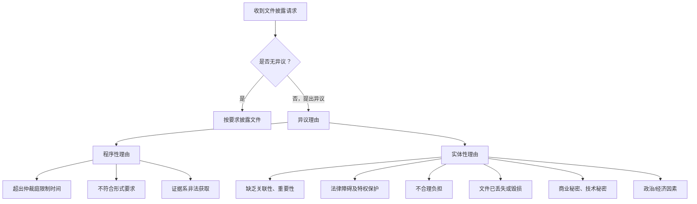

# 一、仲裁中的证据

## （一）证人证言

### 1. 事实证人

《IBA取证规则》第4条规定的事实证人功能：

- 缺乏书证时填补空缺
- 澄清书证中模糊、歧义、冲突内容
- 说明当事人之间往来的来龙去脉
- 对不利证据作出解释

| | 国际仲裁 | 国内仲裁 |
|---|---|---|
| 证人使用 | 提交事实/专家证人证言非常常见 | 过去较少使用，侧重书面证据审查 |
| 庭审重点 | 对证人的盘问是庭审最重要的环节 | 近年来越来越多地出现事实/专家证人做证 |

证人出庭：境内与境外均要求证人出庭。

### 2. 专家证人

《IBA取证规则》第5条、第6条。在复杂的境外仲裁案件中较为常见，主要用于：

- 外国法查明
- 财务/损害赔偿
- 技术

选聘专家证人时的考量因素：**独立性**、**专业性**、**语言表达**。

---

### 3. 专家证人：外国法查明

> [!tip] 境外 vs 国内 区分抓手
> 境外仲裁走"当事人查明 + 专家证人出庭接受询问"路径；国内仲裁走"当事人提供 / 仲裁机构或法院查明"的法定路径。

#### （1）境外仲裁

- 为了解决纠纷，一般需要应用多种法律规则
- 承担举证责任的当事人承担查明外国法的义务
- 当事人聘请外国法律专家出具外国法专家报告
- 外国法专家（专家证人）在开庭时接受当事人代理人、仲裁庭的询问

#### （2）国内仲裁

**法规依据：**

- 《涉外民事关系法律适用法》第10条：涉外民事关系适用的外国法律，由人民法院、仲裁机构或者行政机关查明。**当事人选择**适用外国法律的，应当**提供**该国法律。不能查明外国法律或者该国法律没有规定的，适用**中华人民共和国法律**。
- 《第二次全国涉外商事海事审判工作会议纪要》第51条：涉外商事纠纷案件应当适用的法律为外国法律时，由当事人提供或者证明该外国法律的相关内容。当事人可以通过法律专家、法律服务机构、行业自律性组织、国际组织、互联网等途径提供相关外国法律的成文法或者判例，亦可同时提供相关的法律著述、法律介绍资料、专家意见书等。当事人对提供外国法律确有困难的，可以申请人民法院依职权查明。

**外国法主要查明方式**（《最高人民法院关于适用〈中华人民共和国涉外民事关系法律适用法〉若干问题的解释（二）》）：

1. 由当事人提供
2. 通过司法协助渠道由对方的中央机关或者主管机关提供
3. 通过最高人民法院请求我国驻该国使领馆或者该国驻我国使领馆提供
4. 由最高人民法院建立或者参与的法律查明合作机制参与方提供
5. 由最高人民法院国际商事专家委员会专家提供
6. 由法律查明服务机构或者中外法律专家提供
7. 其他适当途径

---

## （二）文件披露

### 1. 概念

**文件披露 / 开示**（Disclosure / Document Production）：国际仲裁中一个重要的程序环节。

不掌握某份证据的当事人，在满足一定条件的情况下可申请仲裁庭命令其他当事人披露特定的证据。仲裁庭审查同意并命令披露的，即便该证据对披露方不利，当事人也应予以披露，否则将承担相应的不利后果。

背景：普通法背景下对抗制（adversarial）的庭审模式中证据发现（discovery）基础上演变而来；当事人的全面披露帮助仲裁员客观认识事实真相。

### 2. 国内仲裁中的文件披露

原本没有文件披露制度，属于英美法系的"舶来品"。现行规范依据：

| 规范 | 核心内容 |
|---|---|
| 《民诉法司法解释》第112条 | 书证在对方当事人控制之下的，承担举证证明责任的当事人可在举证期限届满前书面申请人民法院责令对方提交；无正当理由拒不提交的，可认定申请人所主张的书证内容为真实 |
| 《民事诉讼证据的若干规定》第95条 | 一方控制证据无正当理由拒不提交，对待证事实负有举证责任的当事人主张该证据的内容不利于控制人的，人民法院可认定该主张成立 |
| 贸仲《证据指引》（2024）第7条 | 一方当事人可请求仲裁庭指令对方出示某一特定书证或某一类范围有限且具体的书证；请求方需阐明请求理由，详细界定该有关书证，说明关联性和重要性 |

### 3. 适用规则：《IBA取证规则》

**IBA Rules on Taking of Evidence in International Arbitration**

- 1999年制定，2010年第一次修订，2020年第二次修订
- 整合不同法律传统下当事人和律师关于取证的不同做法
- 在国际仲裁程序中普遍适用
- 定位：指导性规范，当事人或仲裁庭可全部或部分适用，也可以修改或作为参考

> [!quote] 规则定位
> Parties and Arbitral Tribunals may adopt the IBA Rules of Evidence, in whole or in part, to govern arbitration proceedings, or they may vary them or use them as guidelines in developing their own procedures.

> [!example] 实例：《第一号程序令》（PO1）
> 国际仲裁程序中，《第一号程序令》通常会引用《IBA取证规则》作为程序框架。

---

### 4. 程序时间表

文件披露通常在双方进行**第一轮基本事实及法律意见陈述和证据交换后**启动。典型程序节点：

提交特定披露请求 → 对方异议 → 申请人反驳 → 仲裁庭决定 → 披露执行（或拒绝）

---

### 5. 请求的提出

在仲裁庭要求的时间内提交特定披露请求（《IBA取证规则》第3.2条）。

文件披露请求须同时满足三项要求：

| 要求 | 条文依据 | 内容 |
|---|---|---|
| **特定性** | 第3.3(a)条 | 特定的文件或文件范围，具有充分的可识别性；请求披露的文件应是特定、有限（narrow and specific）的，有理由相信该文件合理存在；如是电子文件，应能够以高效经济的方式搜索到 |
| **关联性与重要性** | 第3.3(b)条 | 要求披露的文件与本案相关且对案件结果有实质影响 |
| **文件不处于己方控制** | 第3.3(c)条 | 文件未被申请方占有、保管或控制；对申请方来说获取该文件是不合理的负担；阐述申请方认为文件被对方占有、保管或控制的理由 |

> [!example] O v. M (1996) 2 Lloyd's Rep. 347
> 一艘游轮在意大利热内亚锚地发生火灾与爆炸后沉没，船载14万多吨原油全部损毁。货主向船东索赔，提出83项文件披露请求，包括大量与本次火灾无关的船舶构造信息。
> Colman大法官认为：如果申请人要求披露的文件与其已经提出的诉讼请求没有明确的关联（*clearly connected to which have already been raised on the pleadings*），则该文件披露申请应当被拒绝（*should be dismissed*）。

**限制披露请求的政策原因：**

- 防止摸底调查或证据"钓鱼"（Fishing-Expedition）
- 防止纯投机性调查/收集证据（purely speculative investigation）
- 避免过度披露而妨碍争议解决效率
- 降低文件披露成本

---

### 6. 披露方的应对

---

#### ① 程序性异议理由

| 理由 | 条文 |
|---|---|
| 文件披露请求的提出时间超出仲裁庭限制时间 | 《IBA取证规则》第3.2条 |
| 文件披露请求不符合披露的形式要求 | 《IBA取证规则》第3.3条 |
| 证据系非法获取 | 《IBA取证规则》第9.3条 |

#### ② 排除非法获取的证据

仲裁庭可应一方当事人请求或自行决定排除非法获取的证据（《IBA取证规则》第9.3条）。

> [!example] Methanex Corporation v. United States (Final Award of 3 August 2005)
> 美国请求仲裁庭排除Methanex公司引用的文件证据，因为该公司在仲裁开始前后，通过"故意闯入私人财产并在办公大楼内的垃圾箱中翻找"获取文件并进行非法复制。
> 仲裁庭排除了相关证据，指出允许提交通过非法手段获取的证据材料将构成程序错误，该类行为违背了各方在国际仲裁中均需遵循的公平公正原则。

---

#### ③ 实体性异议理由

**(a) 缺乏关联性、重要性**（《IBA取证规则》第9.2(a)条）

与案件缺乏足够的关联性或对案件结果无重要作用。与第3.3(a)条相呼应。

**(b) 法律障碍或法律特权保护**（《IBA取证规则》第9.2(b)条）

基于法律或道德规则下的法律障碍或特权而拒绝披露。特权认定的一般标准（第9.4条）：

- 文件目的是提供或者获得法律建议
- 文件目的是为了达成协商和解
- 符合当事人及为当事人提供意见的人在出具意见时的预期

> [!example] Anderson v. Bank of British Columbia (1876) 2 Ch. D. 644
> 原告的内部文件在未决诉讼中落到了代表被告的律师手中，包含了原告对律师的指示、意见、笔记、建议、信件和证人陈述等。
> Browne法官认为：上述所有文件都受到法律特权的保护。任何人都不应当担心其与专业法律人士的沟通内容会被作为后续诉讼的证据。

实务做法：将受到法律特权保护的内容**遮盖后进行部分披露**（redaction）。

**(c) 不合理负担**（《IBA取证规则》第9.2(c)条）

> [!question] 实务争点：数据跨境合规
> 我国《数据安全法》第36条和《个人信息保护法》第41条所涉及的对象均是外国司法机构或执法机构。
> **争点一**：仲裁机构是否属于"外国司法机构或执法机构"？实践情况：在部分国际仲裁案件中，向国际仲裁机构/仲裁庭跨境提供数据需要司法部的审核。
> **争点二**：数据跨境合规的限制究竟属于"法律障碍（legal impediment）"还是"不合理负担（unreasonable burden）"？

**(d) 文件已丢失或毁损**（《IBA取证规则》第9.2(d)条）

文件已丢失或毁损，客观上无法提供。

**(e) 商业秘密、技术秘密**（《IBA取证规则》第9.2(e)条）

涉及商业及技术秘密的内容可免于披露。实务处理方式：在特定范围内进行披露——仲裁庭可将披露范围限定在仲裁庭、当事人的代理律师及仲裁庭指定的中立专家证人之间，将当事人排除出披露范围，例如 **Attorneys' Eyes Only** 指令。

**(f) 政治因素及经济因素**（《IBA取证规则》第9.2(f)(g)条）

- 政治敏感性及政治秘密
- 程序经济、比例性、公平或当事人平等的考虑

---

### 7. Redfern Schedule

一方申请/拒绝披露文件时，一般使用 **Redfern Schedule**（雷德芬表格）：

| 序号 | ① 申请人请求的文件或文件类别 | 文件对案件审理具有关联性和重要性的原因 | ② 被申请人对请求的异议 | ③ 申请人对异议的反驳意见 | ④ 仲裁庭的决定 |
|---|---|---|---|---|---|
| 1 | | | | | |

---

### 8. 仲裁庭的决定

仲裁庭决定要求披露的条件（《IBA取证规则》第3.7条）：

- 请求方试图证明的问题对于案件结果具有**关联性和重要性**
- 不存在第9.2条及第9.3条规定的异议理由
- 满足第3.3条对披露申请的要求

仲裁庭也可以拒绝申请方的披露请求（不满足上述条件时）。

**未按要求进行文件披露的后果——不利推定**（《IBA取证规则》第9.6条）：

- 一方当事人未在规定时间内对文件披露请求提出异议，同时未进行披露且未提出合理解释
- 没有按照仲裁庭的要求进行文件披露

---

### 9. 《布拉格规则》

**Rules on the Efficient Conduct of Proceedings in International Arbitration**

- 2018年12月24日于布拉格制定
- 起草背景：仲裁参与者对程序所花费的时间和费用感到不满；主要由**大陆法系代表**组成工作组起草
- Soft Law定位：当事人和仲裁庭可决定作为仲裁程序的指引性文件，也可排除适用
- 适用范围：非常有限，仍在发展中

**核心特征**：具有明显的大陆法**纠问制**（inquisitorial）特征

- 仲裁庭发挥主导作用
- 有权且被鼓励主动查明案件事实
- 有权不传唤证人
- 有权指定一位或多位独立的专家证人就争议事项出具报告
- 充分体现对仲裁程序效率的重视

> [!tip] 《IBA取证规则》vs《布拉格规则》
> | | 《IBA取证规则》 | 《布拉格规则》 |
> |---|---|---|
> | 法系背景 | 整合两大法系，偏对抗制 | 大陆法系纠问制 |
> | 仲裁庭角色 | 居中裁判 | 主导查明 |
> | 文件披露 | 详细披露机制 | 较少强调 |
> | 证人处理 | 盘问为核心 | 仲裁庭可不传唤证人 |
> | 适用范围 | 国际仲裁普遍适用 | 有限，仍在发展中 |
> | 定位 | 适用于小型至大型案件 | 主要适用于小型商事仲裁案件 |

---

# 二、开庭审理

## （一）证人出庭

一般情况下，每位证人应亲自出席庭审。

- 《IBA取证规则》第8.1条：每位证人应亲自出席开庭，除非仲裁庭允许某个证人以视频会议或其他类似方式参加开庭。
- 无正当理由不出席庭审的，证言不予考虑（第4.7条）：仲裁庭对该证人做出的与该次听证会有关的证人陈述均不予考虑，除非仲裁庭在特殊情况下另有决定。

---

## （二）庭审流程

国际仲裁庭审一般包括四个部分：

| 阶段 | 内容 |
|---|---|
| **开庭陈述** | 双方代理人就书面陈述所载明的仲裁请求和/或反请求、法律论点和事实主张向仲裁庭发表口头陈述 |
| **盘问证人** | 受普通法系对抗制影响：己方主问（Examination-In-Chief/Direct Examination）→ 对方盘问（Cross-Examination）→ 己方复问（Re-Direct Examination） |
| **仲裁庭询问** | 尽管受普通法系影响较大，但相当一部分仲裁员（尤其是具有大陆法系背景的仲裁员）仍可能就事实、技术或法律问题进行针对性询问；**仲裁庭提出的问题不受双方代理人提问范围之限** |
| **总结陈述** | |

---

## （三）提问类型

| 类型 | 特征 | 适用阶段 |
|---|---|---|
| **Open question** | 提问者将问题完全敞开，难以预料回答；5W1H法（Who? What? When? Where? Why? How?）；部分为"完全开放"的 wide-open question，如"Explain……" | 主问、复问 |
| **Closed question** | 提问者设计问题，将回答限定在是/否、有/无的范围内；通常是**诱导性问题**（leading question） | 盘问 |

---

## （四）庭前证人准备

己方代理人的目的是协助证人熟悉庭审流程，了解盘问开展方式。

**原则与底线：**

- 代理人**不得改变证人的真实意思**（《IBA国际仲裁当事人代理指引》第21条）
- **"不得引诱或鼓励证人作伪证"**（《IBA国际仲裁当事人代理指引》第23条）
- 模拟开庭程序（包括证人环节）

**庭审纪律：**

- **誓词**：证人在作证前需根据仲裁庭要求进行宣誓
- **隔离原则**（Sequestration）：接受盘问前不得旁听庭审，不得与其他证人交流案件相关信息；接受盘问期间需保证单独作证，不得接受己方代理人或法务人员指导
- 证人一般**不能拒绝回答问题**

---

## （五）主问（Examination-In-Chief / Direct Examination）

己方代理人以**开放式提问**引导证人陈述。

在多数仲裁程序中，证人一般已提前提交书面证人证言，因此主问通常非常简短：

- 确认证人职位、在案件相关交易中的角色
- 确认证言系由本人签字并出具
- 确认证言是否有需要修改或更正的地方

在特定情况下主问可能相对较长，如临时需要增加证人作证的内容。

原则上，主问阶段**不应有诱导式提问**（leading question）。

> [!tip] 证人应对要点
> 若发现证言存在需更正之处，应主动提出："本人签章后发现第X页第X行有误，应为……"

---

## （六）盘问（Cross-Examination）

对方代理人使用**封闭性/诱导性问题**（closed/leading question）进行询问。问题通常预设答案，本质上是陈述而非提问，证人仅需回答"是/否""有/无"。

**对方盘问的目的：**

- 使仲裁庭不采信我方证人证词中的内容
- 尝试从证人处获得额外信息
- 引导仲裁庭关注关键证据，借盘问就部分争议事项向仲裁庭作出进一步说明
- 询问已知答案之问题，测试证人诚实与否
- 诱导证人确认不利事实，或故意打断，制造不确定性

> [!caution] 证人应对要点
> - 仅回答问题本身，问题前提存在偏差时，应**先否定前提**
> - 记忆不清时，应如实陈述"不确定"或"记不清"，**切忌推测**
> - 未听清问题时可要求重复
> - 不同意时应明确表态，坚持自身确认之事实，**避免被引导**

---

## （七）复问（Re-Direct Examination）

针对对方代理人盘问的内容，己方代理人以**开放式提问**进行复问。

**复问的目的：**

- 恢复我方证人的可信度
- 为己方证人提供纠错和澄清的机会
- 驳斥盘问中的误导性推论
- 对被对方代理人打断的回答作出补救或补充

**复问的前提：**

- 盘问导致仲裁庭可能持有对己方不利的观点；**且**
- 证人应能够通过解释来明确己方观点，扭转局势

复问范围**限于盘问内容**。

> [!tip] 庭审提问阶段总结
> | | 主问 | 盘问 | 复问 |
> |---|---|---|---|
> | 提问方 | 己方代理人 | 对方代理人 | 己方代理人 |
> | 问题类型 | 开放式 | 封闭式/诱导式 | 开放式 |
> | 目的 | 引导证人完整陈述 | 质疑可信度、获取信息 | 恢复可信度、澄清 |
> | 范围 | 不含诱导式提问 | 无严格限制 | 限于盘问内容 |

---

# 三、裁决与执行

## （一）执行依据

| 裁决类型 | 执行依据 |
|---|---|
| 境外仲裁裁决 | 《纽约公约》 |
| 内地仲裁裁决 | 《民事诉讼法》《仲裁法》 |
| 香港/澳门/台湾 | 各有专门安排^[《内地与香港特别行政区相互执行仲裁裁决的安排》及其补充安排、《内地与澳门特别行政区相互认可和执行仲裁裁决的安排》、《关于认可和执行台湾地区仲裁裁决的规定》等] |

---

## （二）裁决的撤销

《纽约公约》第五条第1款第5项规定，有权撤销裁决的为"作出裁决的国家或据其法律作出裁决的国家的管辖当局"（*a competent authority of the country in which, or under the law of which, that award was made*）。

### 1. 《UNCITRAL示范法》第34条

申请撤销作为不服仲裁裁决的**唯一追诉**：

**(a) 由当事人证明：**

- (i) 仲裁协议当事人无行为能力，或协议无效
- (ii) 未向当事人发出指定仲裁员或仲裁程序的适当通知，或因他故致使其不能陈述案情
- (iii) 裁决处理的争议不是提交仲裁意图裁定的事项或不在提交仲裁的范围之列（超裁部分可分割）
- (iv) 仲裁庭的组成或仲裁程序与当事人约定不一致（无约定时与本法不符）

**(b) 法院认定：**

- (i) 争议事项不能通过仲裁解决
- (ii) 裁决与本国的公共政策相抵触

### 2. 新《仲裁法》

#### 国内仲裁（第71条）

当事人提出证据证明裁决有下列情形之一的，可向仲裁机构所在地的中级人民法院申请撤销：

1. 没有仲裁协议
2. 裁决事项不属于仲裁协议范围或仲裁机构无权仲裁
3. 仲裁庭的组成或仲裁的程序违反法定程序
4. 裁决所根据的证据是伪造的
5. 对方当事人隐瞒了足以影响公正裁决的证据
6. 仲裁员有索贿受贿、徇私舞弊、枉法裁决行为

法院认定裁决违背公共利益的，应当裁定撤销。

#### 涉外仲裁（第83条）

1. 没有仲裁协议
2. 被申请人没有得到指定仲裁员或进行仲裁程序的通知，或由于其他不属于被申请人负责的原因未能陈述意见
3. 仲裁庭的组成或仲裁的程序与仲裁规则不符
4. 裁决事项不属于仲裁协议范围或仲裁机构无权仲裁

法院认定裁决违背公共利益的，应当裁定撤销。

> [!caution] 国内 vs 涉外 撤销事由对比
> | | 国内仲裁（第71条） | 涉外仲裁（第83条） |
> |---|---|---|
> | 实体审查事由 | ✅ 证据伪造、隐瞒证据 | ❌ 无 |
> | 仲裁员行为事由 | ✅ 索贿受贿等 | ❌ 无 |
> | 程序事由 | ✅ | ✅ |
> | 超裁/无仲裁协议 | ✅ | ✅ |
> | 公共利益 | ✅ | ✅ |
>
> 涉外仲裁撤销事由**严格限于程序性事由**，与《纽约公约》第5条第1款的拒绝承认与执行事由高度一致。

---

## （三）裁决的执行

### 1. 《纽约公约》

**第五条第1款**（由被执行人证明的情形）：

1. 仲裁协议无效
2. 裁决违反正当程序
3. 仲裁庭超越权限
4. 仲裁庭组成或仲裁程序不当
5. 仲裁裁决不具有约束力、已经被撤销或停止执行

**第五条第2款**（法院主动审查的情形）：

1. 争议事项不具有可仲裁性
2. 违反法院地的公共秩序

### 2. 新《仲裁法》

**一般规定：**

- **第75条**：当事人应当履行裁决；一方不履行的，另一方可依照《民事诉讼法》向人民法院申请执行，受申请的人民法院**应当执行**
- **第76条**：被申请人提出证据证明裁决有第71条第1款规定的情形之一的，经法院合议庭审查核实，裁定**不予执行**；法院认定执行该裁决违背公共利益的，裁定不予执行
- **第77条**：一方申请执行、另一方申请撤销的，法院应**裁定中止执行**；撤销的→终结执行；撤销申请被驳回的→恢复执行

**涉外仲裁的特别规定：**

- **第84条**：被申请人提出证据证明涉外仲裁裁决有第83条第1款规定的情形之一的，经法院合议庭审查核实，裁定不予执行
- **第85条**：在中国领域内作出的发生法律效力的仲裁裁决，被执行人或其财产不在中国领域内的，当事人可**直接向有管辖权的外国法院申请承认和执行**

---

## （四）重新仲裁

### 1. 规范依据

| 规范 | 核心内容 |
|---|---|
| 新《仲裁法》第74条 | 法院受理撤销裁决的申请后，认为可以由仲裁庭重新仲裁的，通知仲裁庭在一定期限内重新仲裁，并裁定中止撤销程序；仲裁庭开始重新仲裁的→终结撤销程序；仲裁庭拒绝重新仲裁的→恢复撤销程序 |
| 《仲裁法》司法解释第21条 | 适用情形：(一)仲裁裁决所根据的证据是伪造的；(二)对方当事人隐瞒了足以影响公正裁决的证据的。法院应当在通知中说明要求重新仲裁的具体理由 |
| 《UNCITRAL示范法》第34条(4) | 法院可在确定的一段时间内暂时停止撤销程序，以便仲裁庭有机会重新进行仲裁程序或采取能够消除撤销裁决理由的其他行动 |

> [!caution] 历史变迁：适用法律错误
> 2017年《仲裁法》修订前，"适用法律确有错误"属于不予执行的事由（1991年《民诉法》第217条第5款、2007年《民诉法》第213条第5款）。2017年民诉法修改后，**不再**属于不予执行的事由。

### 2. 案例

> [!example] 中国太平洋财产保险有限公司济宁支公司与白广河申请仲裁纠纷案（济南市中级人民法院 [2007]济民二撤仲字第8号）
> 仲裁申请人白广河依据其与太平洋保险订立的《交强险合同》提起仲裁，要求保险公司理赔。法院审查后认为仲裁程序虽然合法，但仲裁认定事实、适用法律均存在错误，属于可以重新仲裁的情形，裁定中止撤销程序，由仲裁委重新仲裁。

> [!example] 某某投资管理有限公司申请撤销仲裁裁决案
> 法院立案审查后认为可以由仲裁庭重新仲裁，通知仲裁庭后，仲裁庭同意开始重新仲裁。
