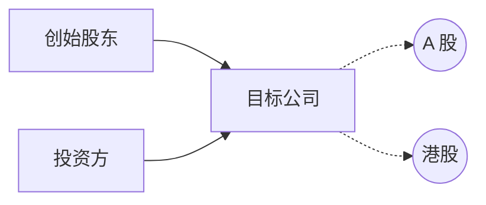
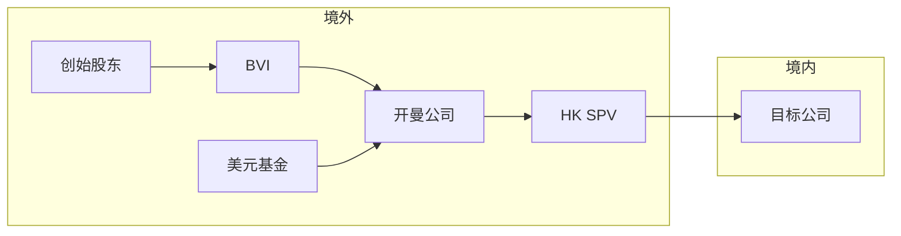
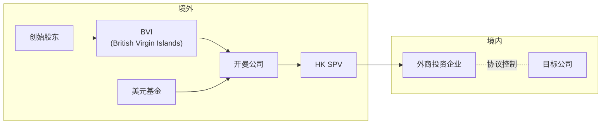

# 一、融资结构

### 境内融资结构

- 适用：业务在境内，投资人主要是境内机构/个人
- 优点：
	- 结构简单，设立/维护成本低
	- 政策限制少，合规风险低
	- 保留港股上市可能性
- 缺点：
	- （外汇管制）资金出海受限
	- 股权激励灵活性相对较低

---
### 境外红筹

---
### 境外VIE
Variable Interest Entity

---

# 二、DUE DILIGENCE

