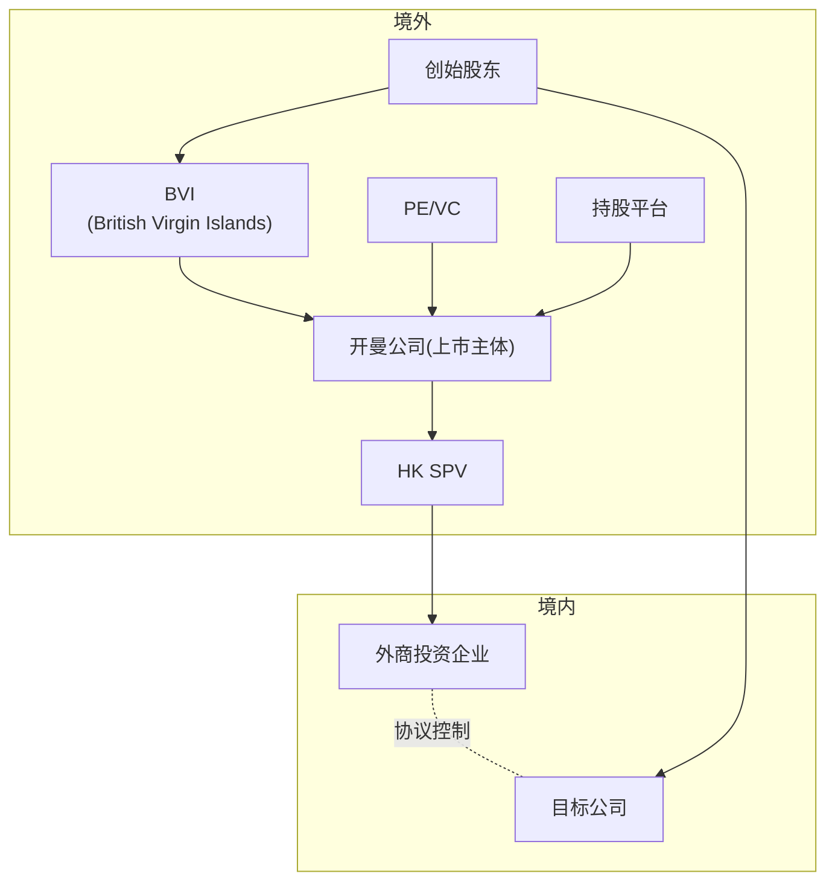
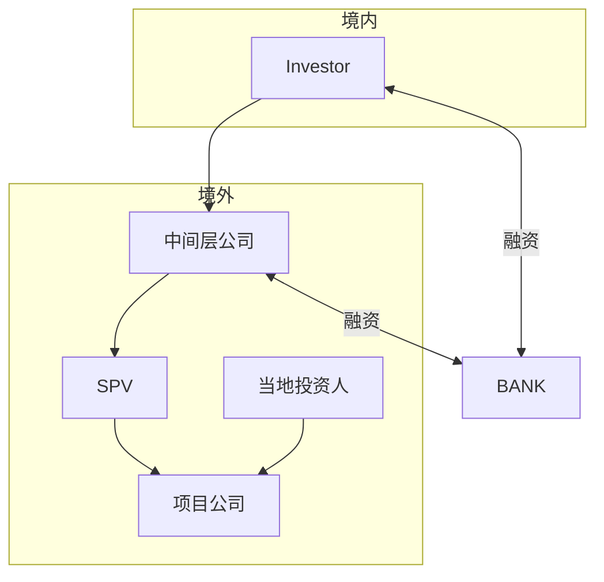

## 一、FDI&ODI


> [!note] 
>FDI: Foreign Direct Investment
>ODI: Outbound Direct Investment

外商：
- 企业、组织、个人、政府

直接：
- Equity goes directly into business

投资：
- 股权（物权）、债权为主要表现形式

## 二、监管

> [!tip] FDI 的监管历史
>- 《中外合资经营企业法》
>- 《外资企业法》：所有资本都是外资，但可以是不同主体的外资
>- 《中外合作经营企业法》：节省外汇，用市场撬动资本，中方提供非资本形式的可经济评价的条件（三通一平）
>- 在后期，三资企业法作出修改，从「全面审批制」转向「负面清单+备案制

外资准入的负面清单
- 限制方式
	- 完全禁入
	- 外资股比限制
- 鼓励外商投资产业目录
 
### 合资企业架构的改变

1. 调整前：在旧的法律框架（如《中外合资经营企业法》）下，治理结构呈现以下特点：
	 * 最高权力机构：董事会 (Board of Directors)。这是过去外资企业最显著的特征——权力核心是董事会，而非股东会。
	 * 权力来源： 中国合营者和外国合营者通过“委派”产生董事。
	 * 法定代表人： 通常由董事长担任。
	 * 管理层： 总经理和副总经理由合营各方分别担任，带有明显的“派系”管理色彩。
	 * 监事会： 法律规定不明确，多按工商局要求参照适用。
2. 调整后：根据现行《公司法》和《外商投资法》，外资企业必须完成结构转型：
	 * 最高权力机构：股东会 (Shareholders' Meeting)。这实现了与国内公司的统一，强调资本多数决原则。
	 * 权力架构：
	   * 股东会下设董事会（或执行董事）和监事会/监事。
	   * 股东会负责“组成”董事会和监事会，不再是简单的委派。
	 * 聘任制： 董事会负责聘任管理人员，监事会负责监督，职权划分更符合现代企业制度。
	 * 法定代表人： 范围扩大，可由董事长、执行董事或总经理担任。

> [!IMPORTANT] 治理结构转型的核心变化
>  * 权力重心转移：最高权力机构从 董事会 转向 股东会。
>  * 法律统一性：废除外资三法时期的特殊规定，全面适用《公司法》。
>  * 管理市场化：从早期的“各方委派/分别担任”转向基于公司章程的“聘任制”管理。

---

## 三、外商投资的其他方式

### VIE




> [!note] 
>- **PE**: Private Equity
>- **VC**: Venture Capital
>- **WFOE**: Wholly Foreign-Owned Enterprise
>- **SPV**: Special Purpose Vehicle

- 自然人（创始人）通过平台代持成为境外投资的事实主体
- 开曼公司是为了 IPO
- 香港 SPV 除了考虑税收优惠，更是为了将开曼公司与境内公司关联
- WFOE 基本不参与实体业务，但可能会参与幕后业务

> [!note] 控制协议
>VIE 的控制协议并非单一合同，而是一个“协议组合”（contractual package），通常包括以下几类核心协议：
> 1. 独家业务合作协议
> 2. 股权质押协议
> 3. 独家购买权协议（或期权协议）
> 4. 投票权委托协议（或一致行动协议）
> 5. 借款协议（或资金支持协议）
> 6. 配偶承诺函
> 	- 企业高管为了服务于 VIE 架构，作为夫妻共同财产的股权如果不纳入控制内则 VIE 的控制有失效风险
>
>不具有股权的前提下，通过协议（债）来控制公司

> [!example] 欧洲民航制造商在华飞机全生命周期项目
> ```mermaid
> graph LR
> 	subgraph 境外
> 	direction TB
> 		A[空客]
> 		S[Satair]
> 	end
> 	subgraph 境内
> 	direction TB
> 		E[境内企业]
> 		H[合资公司]
> 	end
> 	A & S & E-->H
> ```
> - Related Agreement
> 	- Investment Framework Agreement
> 	- Asset Purchase Agreement
> 	- Escrow Agreement
> 	- Joint Venture Contract
> 	- Article Association
> 	- Patent and Know-how License Agreement
> 	- Patent Sub-license Agreement(I,II) 
> 	- Technical Support and Service Agreement
> 	- Tripartite Agreement

---

## 四、ODI

> [!Greenland Investment] 
>**绿地投资**（Greenfield Investment）是一种外商直接投资形式，指的是外国投资者**在东道国建立新的生产设施或业务**，而非通过并购或收购现有公司来进入市场。简而言之，绿地投资涉及在目标市场建立全新的运营实体或生产基地。



- **中间层公司**：中间层公司往往是资本的集散地，作为某一地理大区的中心公司而关联上该地区具体项目所对应的的 SPV 公司
	- 一是为了规避境内外严格的资本管制；
	- 二是便于资源的调动，允许一定的灵活度；
	- 三是为了灵活与项目挂钩或脱钩；
	- 同时，为了减少与境内的关系，当投资人想银行贷款时，可以将平台公司作为担保方提供抵押质押
- **境内外银行**：提供融资借款
	- 由于外汇管制和离岸/在岸人民币的区别，境内公司无法实现资金（人民币）直接出海，必须依托境内外银行，尤其是境内银行（工行、中国银行为主）

> [!tip] 自然人成为股东的例外：在 ODI 中
>通过 37 号文备案，当原公司是自然人时，若外资有意收购